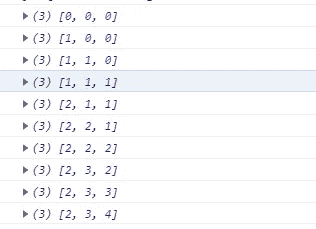
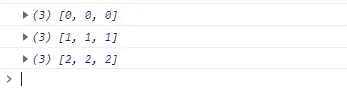
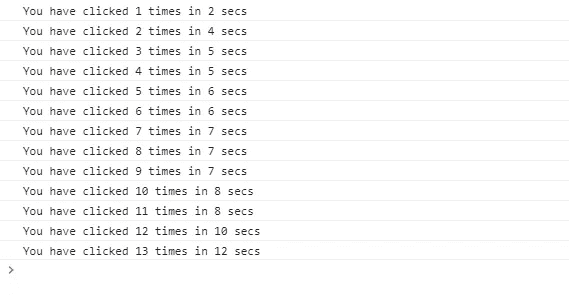

# 解释 forkJoin、zip、withLatestFrom 和 combineLatest 运算符的实际示例

> 原文：<https://javascript.plainenglish.io/practical-examples-to-explain-forkjoin-zip-withlatestfrom-and-combinelatest-operators-2a1a9cd862cf?source=collection_archive---------2----------------------->

## 用实例解释四种 RXJS 组合运算符。

我一直觉得这 4 个 RXJS 组合运算符非常令人困惑。如果理解清楚，它们是非常有用的。

1.  为了理解这一点，让我们举一个长度转换应用程序的例子。

这是一个有 3 个窗体控件的简单窗体。用户输入一个数字，可以将它从米转换成厘米，反之亦然。我想注意两点:

= >当用户第一次输入时，我们不需要答案，直到输入和转换字段都已填写完毕。

= >下次用户更改数字或转换时，答案应该会更新。要更新答案，两个字段都不需要填写。

让我们看看 combineLatest 如何帮助我们。

我们有两个使用 **valueChanges 属性**创建的可观察对象，可用于反应式表单中的每个表单控件。每当控件的值改变时，操作符返回一个发出控件的更新值的可观察值。该 valueChanges 属性已被添加到**动作**和**输入数量**表单控件中。

我们将这两个可观测量作为参数传递给 combineLatest 操作符。现在让我们理解这个操作符在这个场景中的行为。

= >用户在输入字段中输入数字 1200。触发一个变化，1200 是第二个可观测值发出的值。没有观察到输出场的变化。

= >用户选择转换为“厘米到米”。触发变化，并且“m”是由第一个可观测值发出的值。**当两个观察值都发出至少 1 个值时，combineLatest 操作符将发出一个数组，该数组包含观察值发出的值**，格式如下: **["m "，" 1200"]**

订阅触发，我们正在执行计算以确定输出。请注意，我们已经编写了[action，number],而不是简单地编写 x 或 y 或数据，以便我们能够将“m”映射到 action，将“1200”映射到 number。

```
subscribe(([action, number]) => {
action === 'cm'
? this.lengthConvForm.get('answer').setValue(number * 100)
: this.lengthConvForm.get('answer').setValue(number / 100);
});
```

= >下一次，用户将输入更改为 12，combineLatest 操作符将发出输出["m "，" 12"]。它不会等待两个可观测量都发出值。**发出一个值的一个或两个观察值足以让操作员触发一个值。**

你可以看看下面的例子。

[](https://stackblitz.com/edit/angular-rixeug?file=src/app/app.component.ts) [## 角形(叉形)堆叠

### 一个基于 rxjs，tslib，core-js，zone.js，@angular/core，@angular/forms，@angular/common 的 angular-cli 项目…

stackblitz.com](https://stackblitz.com/edit/angular-rixeug?file=src/app/app.component.ts) 

让我总结一下。

= >第一次尝试时，combineLatest 运算符将等待所有可观测值发出至少 1 个值后再触发。所有的观察者都像团队一样工作。

= >在随后的尝试中，当任何可观测量发出一个值时，操作符将触发。没有必要让所有的观测值都发出一个值。combineLatest 操作员第一次开火后，观察对象之间没有协同工作。

=> **当操作符触发时，它会发出一个数组，该数组包含所有观察对象在发出时发出的值。**

= >如果其中一个观察完成，操作员不会停止，而是继续发射，直到所有观察都完成。

```
**combineLatest**(
interval(1000).pipe(take(3)),
interval(1000).pipe(take(4)),
interval(1000).pipe(take(5)).subscribe(x=>console.log(x))
```

这里我们有 3 个将在不同时间完成的可观测量。发出 0，1，2 后，第一个可观测值完成。第二个可观察值在发出 0，1，2，3 后完成，第三个可观察值在发出 0，1，2，3，4 后完成。

第一个可观察到的首先完成。但是当其他两个观察值发出值时，操作符继续触发，如下图所示。

每个数组由 3 个可观测量发出的 3 个值组成。还要注意，当第一个可观察对象完成时，数组的第一个值仍然是 2，即操作符考虑第一个可观察对象完成后发出的最后一个值。



combineLatest

2. **zip** : zip 操作符类似于 combineLatest，略有不同。

**Zip 运算符仅在所有可观察对象在任何尝试中发出至少 1 个值时触发。你可以认为观察者总是像一个团队一样工作。**

如果一个可观测量完成，那么即使其它可观测量没有完成，操作者也停止输出任何值。

```
**zip**(
interval(1000).pipe(take(3)),
interval(1000).pipe(take(4)),
interval(1000).pipe(take(5))).subscribe(x=>console.log(x));
```

如你所见，第一个可观测值将在发射 0、1 和 2 后首先完成。zip 操作符将在此之后停止触发，即使其他 2 个观察点发出值，如下所示。



zip

让我们看一个例子，当你想计算点击一个按钮的时间。这是一个非常不寻常的用例，但是为了简单起见，我已经考虑过了。

```
<button id=”button”>Click Me!</button>
```

我只需要一个按钮:)

```
**ngOnInit(){**
**zip**(
**fromEvent**(document.querySelector(‘button#button’),’**mousedown**’).pipe(map(x=>x.timeStamp)),**fromEvent**(document.querySelector(‘button#button’),’**mouseup**’).pipe(
map(x=>x.timeStamp)))
.subscribe(([down,up])=>console.log((up-down)/1000 +”sec”))
}
```

这是一个简单的逻辑。我们正在考虑两个显著的问题。第一个可观察对象是在我点击按钮时创建的，我还没有释放它。触发了一个**鼠标按下**事件。

当我释放按钮点击时，一个 **mouseup** 事件将被触发，第二个可观察到的事件将被创建。

我将两个观察对象发出的事件对象映射到事件的时间戳。因此，两个可观察对象现在都将发出它们各自事件的时间戳。

**只有在两个 observables 发出时间戳值后，zip 操作符才会触发。**计算花费的时间依赖于两个可观测量发出的值，因此 zip 运算符在这种情况下非常有用。

3. **forkJoin:** 该操作符仅在所有可观察对象完成时触发，它发出一个对象，该对象由每个可观察对象发出的所有**最后一个值组成。**

当您希望多个 HTTP 请求并行执行时，这非常有用。

```
**//Example 1
forkJoin**({
users:this.http.get(‘[https://jsonplaceholder.typicode.com/users'](https://jsonplaceholder.typicode.com/users')),
comments:this.http.get(‘[https://jsonplaceholder.typicode.com/comments'](https://jsonplaceholder.typicode.com/comments')),
todos:this.http.get(‘[https://jsonplaceholder.typicode.com/todos'](https://jsonplaceholder.typicode.com/todos'))
 }).subscribe(x=>console.log(x));
```

这将返回一个由 3 个名为 users、comments 和 todos 的数组组成的对象。

```
**//Example 2****forkJoin**({ 
int1:interval(1000).pipe(take(5)),
 int2:interval(1000).pipe(take(4)),
 int3:interval(1000).pipe(take(2)),
 }).subscribe(x=>console.log(x));
```

上述代码的输出将是 **{int1: 4，int2: 3，int3: 1}**

4. **withLatestFrom** :让我们来看一个场景，我想计算每两秒钟我点击一个按钮的次数。

```
<button id=”button”>Click Me!</button>
```

我们只需要一个简单的按钮。

```
**ngOnInit()**{
const clickEvent=**fromEvent**(document.querySelector(‘button#button’),’click’).pipe(
**mapTo**(1),
**scan**((acc,curr)=>acc+curr,0));clickEvent.pipe(**withLatestFrom**(interval(2000))).subscribe(([click,time])=>{
console.log(“You have clicked”+click+” times in”+time+ “ secs”);
});
}
```

我们在这里有两个观察点。每当单击按钮时，第一个 observable 就会发出一个事件对象。我们正在映射事件对象，每次点击按钮都映射到一个常量 1。这对于计算点击量是很重要的。

扫描运算符用于执行此操作。acc 的初始值为 0，curr 的初始值为 1。随着每一次点击，货币被添加到 acc 中以给出新的累积值。

第二个可观察值是由间隔运算符创建的，它每 2 秒钟发出一个从 0 开始的数字。

每次单击按钮时，我们都会检查由 interval 运算符创建的 observable 发出的最新秒数，以打印在此期间按钮被单击的次数，如下所示:



withLatestFrom

LatestFrom 函数的用法如下:

= >第一次单击按钮时，withLatestFrom 运算符仅在 interval 运算符创建的 observable 发出值后触发。

= >在随后的时间里，操作者不会等待可观测区间发出新值。每当单击按钮时，它就会触发，并考虑可观察间隔发出的最新值。

*更多内容看* [***说白了就是***](https://plainenglish.io/) *。报名参加我们的* [***免费周报***](http://newsletter.plainenglish.io/) *。关注我们关于*[***Twitter***](https://twitter.com/inPlainEngHQ)*和*[***LinkedIn***](https://www.linkedin.com/company/inplainenglish/)*。加入我们的* [***社区***](https://discord.gg/GtDtUAvyhW) *。*