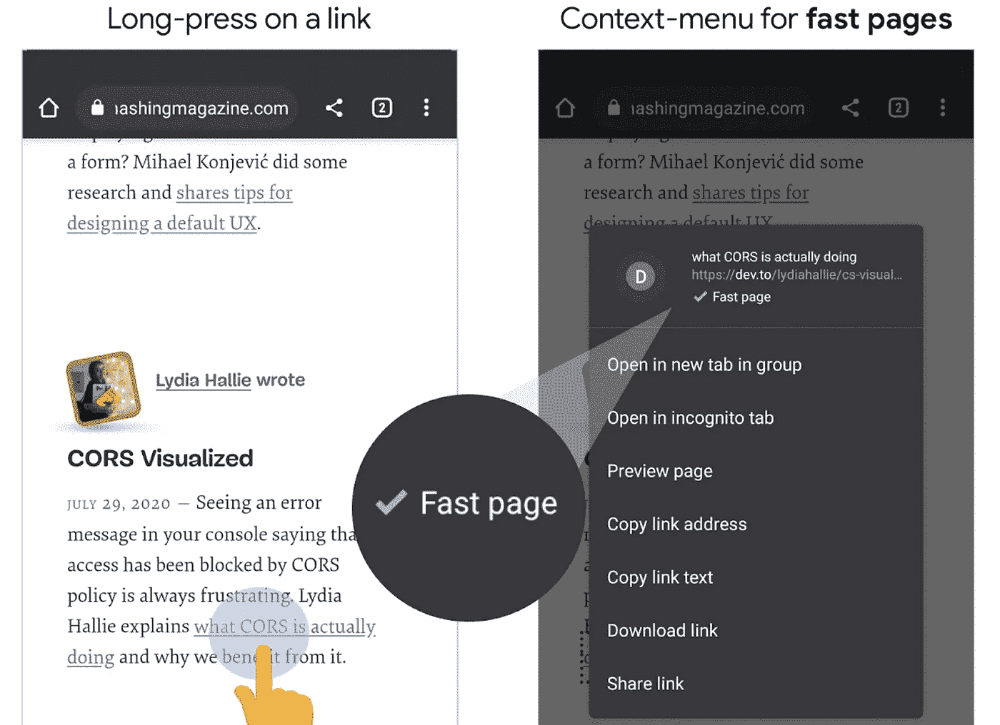
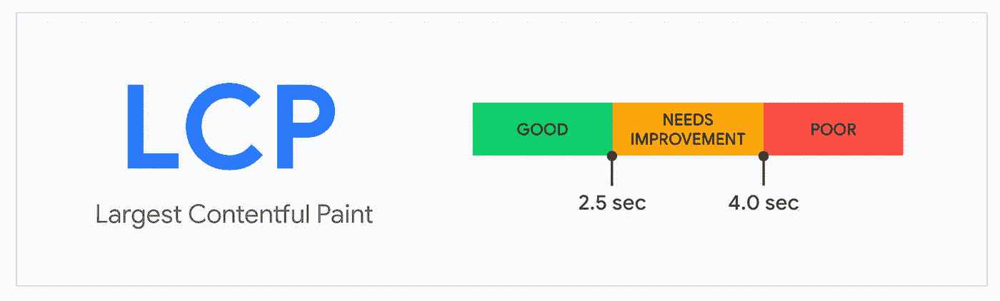
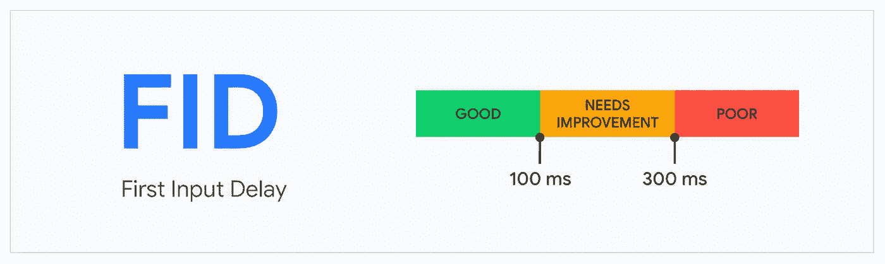
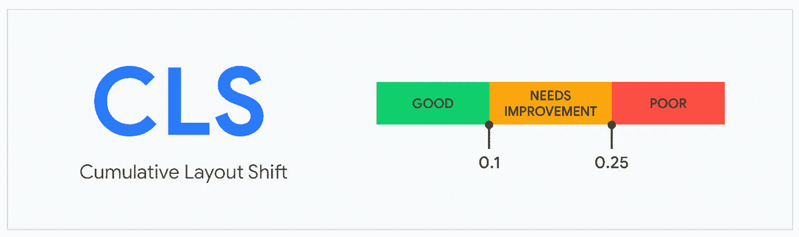

# 为 Chrome 即将推出的“快速页面”标签准备您的网页🚀

> 原文：<https://javascript.plainenglish.io/prepare-your-webpage-for-chromes-upcoming-fast-page-label-f89e95ed7c77?source=collection_archive---------0----------------------->

Photo by [Pierre Bamin](https://unsplash.com/@bamin?utm_source=medium&utm_medium=referral) on [Unsplash](https://unsplash.com?utm_source=medium&utm_medium=referral)

最近，Chrome [的开发者发布了一篇文章](https://blog.chromium.org/2020/08/highlighting-great-user-experiences-on.html)关于为*高性能*网站引入一个全新的标签，旨在帮助用户找到在网络上提供**高质量用户体验的页面**:

*“为了帮助用户在浏览时体验到更好的体验，我们很高兴地宣布，Chrome 将开始在网络上强调高质量的用户体验，从快速链接的标签开始……”*——Chrome 博客

Chrome 将开始在 v85 中为安卓系统推出这一功能，不过，它应该很快就会出现在桌面浏览器中。

Long pressing on an URL would bring up this information (picture taken from the [Chromium blog](https://blog.chromium.org/2020/08/highlighting-great-user-experiences-on.html))

# 这对我们——开发者——意味着什么？

快速页面的标签自然会带来一个合理的结果:如果人们有选择的话，他们会选择访问更快的页面，而不是不太快的页面。

从长远来看，如果我们不主动适应“快速页面”标签，这可能会影响页面访问量。

因此，让我们的应用程序加载更快比以往任何时候都更重要！我们可能都需要了解更多关于**度量标准**的信息，在对网页进行分类时将会考虑到这一点。

# 核心网络活力

如果 Chrome 在[核心网络生命体征](https://blog.chromium.org/2020/05/introducing-web-vitals-essential-metrics.html)方面表现出色，它将在网站上贴上(或不贴上)快速页面标签。

目前，**核心网络生命周期**由三个重要指标组成:

1.  最大的满足感涂料
2.  第一输入延迟
3.  累积布局偏移

这些听起来可能很熟悉，因为网络开发人员到目前为止也一直在寻找和测量类似的度量标准(例如，借助[灯塔](https://developers.google.com/web/tools/lighthouse))。

然而，随着谷歌开始根据这些指标将网站分为不同的类别，它们变得对每个人来说都很重要。

## 最大含量涂料(LCP)

该指标衡量网页的感知加载速度，并标记页面主要内容可能加载的时间点。

The good, the bad-*ish* and the really bad (image courtesy of web.dev)

正如您在上面看到的，最长 2.5 秒钟，直到 LCP 正常，超过这个时间就认为是坏的。

改善 LCP 的几点想法:

1.  使用服务器端呈现
2.  缩小 JavaScript 捆绑包的大小(通过删除不需要的依赖项，使用代码拆分，缩小代码等)。)
3.  优化您的资产:图像、字体、CSS
4.  使用 CDN
5.  确保没有用 Javascript 阻止渲染

点击这里阅读更多关于最有内容的绘画和谷歌的推荐。

## 第一输入延迟(FID)

***"FID*** *测量从用户第一次与页面交互(即，当他们点击链接、点击按钮或使用自定义的 JavaScript 支持的控件)到浏览器实际能够开始处理事件处理程序以响应该交互的时间。"* —网页开发

关于这个有趣的指标，需要注意的是，它实际上并不是查看 ***处理*** 事件(即事件处理背后的逻辑)所需的时间，而是查看该事件 ***开始被处理*** 所需的时间。

由于浏览器使用单个 JavaScript 线程(主线程)来对 DOM 进行更改、解析和处理网络请求**以及**处理事件，因此在用户输入**开始**被处理之前(即主线程被阻塞时)可能会有延迟。

哎哟！这当然是不可取的，而这正是 FID 所衡量的。

The good, the bad-*ish* and the really bad (image courtesy of web.dev)

提高 FID 主要是通过减少 JavaScript 在主线程上的执行时间来实现的。

使用一个 **web worker** (在不同的线程上运行 JavaScript)和分解**长时间运行的任务**仅仅是可以改进这个指标的两个潜在想法。谷歌，再一次，[有一些很棒的推荐](https://web.dev/optimize-fid/)。

## 累积布局偏移(CLS)

实话实说吧。没有人喜欢元素在屏幕上跳跃。**累积布局移动**指标就是这样衡量的。

布局偏移通常是由于资源的异步加载而发生的。

假设你有两段文字，中间有一张图片。现在，如果图片是在段落加载之后加载的，那么第二个段落将*向下跳转*为图片腾出空间。从用户的角度来看，这不太好。

The good, the bad-*ish* and the really bad (image courtesy of web.dev)

谷歌如何计算 CLS 在这里描述得很好[。](https://web.dev/cls/)

当试图保持 **CLS** 真正接近 0(这是好的)时，你应该注意以下几点:

1.  总是给图像、视频或任何内容块固定的尺寸(因此，即使内部的内容还没有加载，尺寸也保持不变)
2.  有一些库可以帮助你模仿实际内容并占据空间(想想 Youtube/脸书的占位符——它们占据了大小，但显示了基于实际内容形状的加载指示器)。整洁！)

# 最后

加载时间和一般的 web 性能一直都很重要，但不幸的是它经常被忽略。

谷歌显然试图通过给应用贴上速度标签来鼓励网站所有者改善应用的加载时间和总体性能。

从历史上看，谷歌以前也这样做过。只要想想从 HTTP 而不是 HTTPS 提供服务的网站。如果我们试图访问这些不安全的域，我们会得到很多警告。

现在是我们开始改进上述指标的时候了。祝你好运！

## 简单英语的 JavaScript

你知道我们有三份出版物和一个 YouTube 频道吗？在 [**寻找一切的链接 plainenglish.io**](https://plainenglish.io/) ！