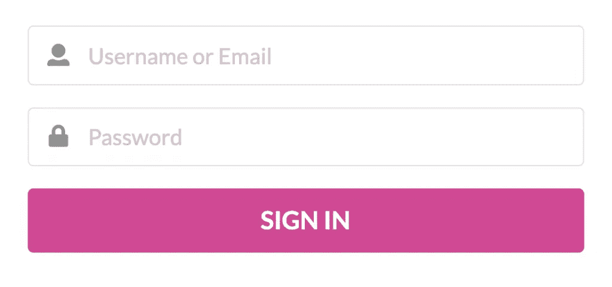
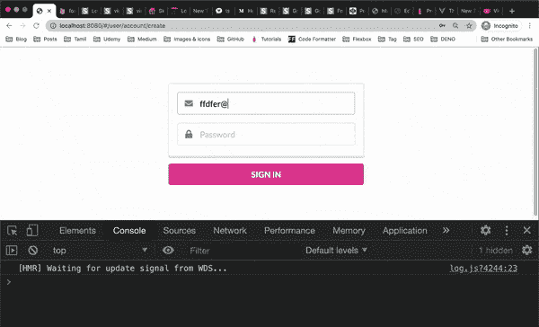

# 如何防止 Vue.js 中的表单提交

> 原文：<https://javascript.plainenglish.io/prevent-form-submission-in-vue-js-c8410cdb4967?source=collection_archive---------6----------------------->

## 使用 Vue.js 防止默认表单提交行为的两种不同方法

假设您有一个不想直接提交给服务器的注册表单。

如您所知，表单元素的默认行为是当 submit 按钮被按下时，通过 GET 请求发送表单输入数据。

```
<form class="ui large form">
  <div class="field">
    <div class="ui left icon input">
      <i class="user icon"></i>
      <input type="text" placeholder="Username or Email"/>
    </div>
  </div>
  <div class="field">
    <div class="ui left icon input">
      <i class="lock icon"></i>
      <input type="password" placeholder="Password"/>
    </div>
  </div>
  <button class="ui fluid pink button big" >SIGN IN</button>
</form>form {
  width:400px;
  margin:20px auto;
}
```



为了防止这种情况，我们需要通过某种 AJAX 调用来处理表单提交。

在 vue.js 中有两种主要的方法可以阻止表单提交。

# 调用 preventDefault 方法

将带有回调函数 sign in button 的 click 事件附加到提交按钮。

```
<button class="ui fluid pink button big" @click="signInButtonPressed">SIGN IN</button>
```

然后，在 methods 对象中声明 signInButtonPressed 函数。

```
methods: {
 signInButtonPressed() {
  console.log("sign in button is pressed");
 }
}
```

当您在这个阶段点击 sign in 按钮时，您可以在浏览器控制台中快速看到该消息，然后它会随着页面的重新加载而消失。

还有，注意问题(？)添加到 URL 的标记，表示表单正试图通过 GET 请求发送数据。

> 如果希望在 URL 中看到输入值，可以在表单元素中的每个输入字段中添加一个 name 属性。



为了阻止这种行为，我们所要做的就是对 click 事件对象调用 preventDefault()方法。

```
methods: {
  signInButtonPressed(e) {
    console.log("Sign In Button Pressed");
    e.preventDefault();
  }
}
```

# 使用阻止修改器提交事件

防止默认表单提交行为的另一种方法是在模板的起始表单标签上附加一个带有防止修饰符的提交事件。

这将防止页面在提交按钮被按下时重新加载。

另外，为它设置一个名为 signInButtonPressed 的回调函数。

```
<form class="ui large form" @submit.prevent="signInButtonPressed">
....
</form>
```

这样，我们就不必在登录按钮上附加一个点击事件。

```
<button class="ui fluid pink button big">SIGN IN</button>
```

当登录按钮被按下时，附加到提交事件的回调函数将被触发，我们也不必调用 preventDefault()方法。

```
methods: {
  signUpButtonPressed() {
    console.log("Sign In Button Pressed");
  }
}
```

你有它！