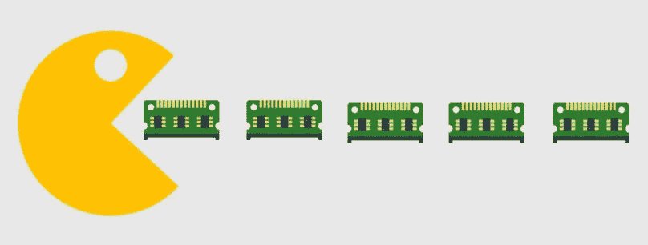
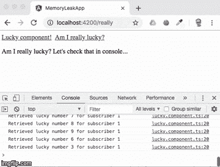
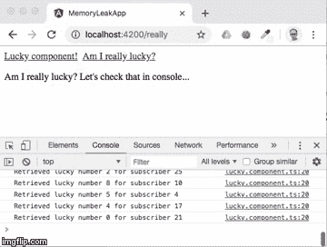
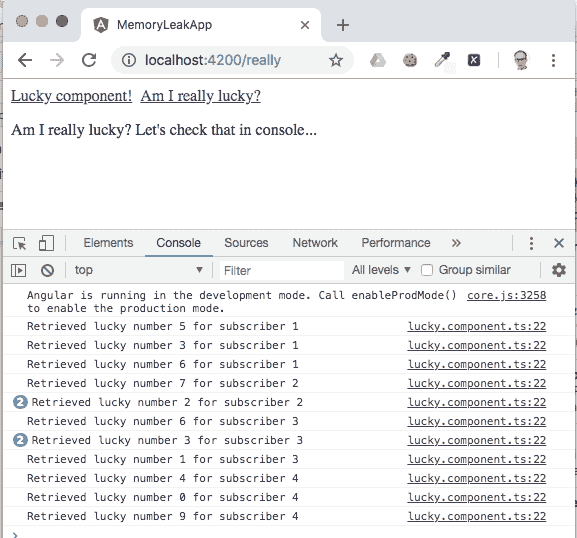

# 用 ngOnDestroy 防止角度可观测量中的内存泄漏

> 原文：<https://javascript.plainenglish.io/preventing-memory-leaks-in-angular-observables-with-ngondestroy-b41b8f293714?source=collection_archive---------2----------------------->



内存泄漏是最糟糕的问题之一。很难发现，很难调试，往往也很难解决。不幸的是，这个问题出现在每一种编程语言或框架中，包括 Angular。可观性是令人敬畏的，因为数据流源源不断，但这种好处会导致严重的内存泄漏问题。今天我们将仔细看看`ngOnDestroy` Angular hook，并回答这个问题:“我应该什么时候取消订阅一个可观测的？用什么样的模式最好？”

在本帖中，我们将:

*   创建一个产生随机数的应用程序。
*   在其中重现内存泄漏。
*   用`takeUntil` + `ngOnDestroy`模式修复内存泄漏。

要完成这些任务，请确保您:

*   安装 Node.js 和 npm(在撰写本文时，我使用的是 Node.js v8.11.1 和 npm 5.8.0)。
*   安装@angular/cli(在这个帖子里我用的是 6.0.0 版)。
*   对棱角有中级知识。

# 让我们创建应用程序

我们需要从初始化一个新的角度项目开始。为此，请在终端中输入以下命令:

```
ng new memoryLeakApp
cd memoryLeakApp
```

`ng new`命令将初始化一个新的 Git 存储库，并为您提交项目。

现在在 **memoryLeakApp** 目录下创建以下目录和文件。我们稍后会编辑它们:

```
mkdir src/app/lucky
touch src/app/lucky/lucky.component.ts
touch src/app/lucky/lucky.service.ts
mkdir src/app/really
touch src/app/really/really.component.ts
```

好了，是时候开始编码了。从创建`LuckyService`开始，它将生成随机数并将它们推送到由`getLuckyNumber`方法返回的可观察值。出于调试目的，我们还将实现`getSubscribersCount`方法，该方法将返回订阅可观察对象的客户端数量。将该代码放入`src/app/lucky/lucky.service.ts`:

现在我们有了可以在组件中消费的东西。将以下代码放入`src/app/lucky/lucky.component.ts`:

现在，我们将创建另一个组件。这是在我们的应用程序中重现内存泄漏所必需的。将该代码放入`src/app/really/really.component.ts`:

更新`src/app/app.module.ts`中的`NgModule`声明:

作为最后一步，我们需要修改`src/app/app.component.html`并用我们的路由替换 CLI 生成的代码:

您将在 GitHub 存储库中找到到目前为止的所有代码，您可以克隆它:

```
git clone -b angular_memory_leak_step1 https://github.com/maciejtreder/angular-memory-leak.git memoryLeakApp
cd memoryLeakApp/
npm install
```

# 内存泄漏的时间到了

让我们运行应用程序，看看它是如何工作的:

```
ng serve
```

使用浏览器导航到 [http://localhost:4200](http://localhost:4200) ，您应该会看到:


太好了，这个应用程序起作用了。每秒钟后显示随机数。但是……当您导航到第二个组件时，看看那里发生了什么:



正如您在控制台中看到的，在`LuckyComponent`中进行的订阅仍然有效，并且仍在执行代码。如果我们再次导航到`LuckyComponent`会发生什么？或者如果我们来回导航多次呢？我们将面临一个严重的问题:



# [使用 ngOnDestroy 取消订阅](https://www.twilio.com/blog/prevent-memory-leaks-angular-observable-ngondestroy#unsubscribe-using-ngondestroy)

我们能做什么？`ngOnDestroy`生命周期挂钩看起来像是解决我们问题的自然选择。来实现吧，退订里面看得见的。相应地改变`src/app/lucky/lucky.component.ts`:

好吧，这看起来是合法的。我们在这里做的是取消订阅我们在`ngOnDestroy`生命周期钩子中的可观察对象，每当组件被破坏时，就会被执行，当访问者离开页面时就会发生这种情况。让我们重新运行应用程序，检查内存泄漏是否已经消除:

```
ng serve
```

离开“LuckyComponent”后，您应该会看到订阅中的代码不再被执行。可观察对象已在“ngOnDestroy”挂钩内取消订阅。太好了！让我们在组件之间导航多次，确保一切都按预期运行，并且我们每次都取消订阅。



您将在这个 GitHub 库中找到到目前为止的所有代码，您可以克隆它:

```
git clone -b angular_memory_leak_step2 https://github.com/maciejtreder/angular-memory-leak.git memoryLeakApp
cd memoryLeakApp/
npm install
```

# 直到模式

这对于一个可观测量来说很好，但是如果我们有多个可观测量，我们需要手动取消订阅呢？我们需要添加多个`Subscription`变量，只是为了在`ngOnDestroy`中取消订阅吗？我们的代码需要看起来像这样吗:

当然不是。我们可以用更干净的方式来做。这就是`takeUntil`发挥作用的地方。以下是文档中关于`takeUntil`方法的描述:

> 从源可观察序列返回值，直到另一个可观察序列或承诺产生值。

这个定义最重要的部分是:**直到另一个可观察的…产生一个值**。

好，所以我们需要“其他可观察的”。将这段代码复制到`src/app/lucky/lucky.component.ts`:

我们实际上所做的是宣布一个新的可观测性:

```
private onDestroy$: Subject<void> = new Subject<void>();
```

然后，通过使用带有`takeUntil`的`pipe`方法，我们通知编译器，当`onDestroy$`中出现任何值时，我们想要取消订阅可观察值:

```
this.luckyService.getLuckyNumber()
   .pipe(takeUntil(this.onDestroy$))
   .subscribe((luckyNumber: number) => {
      this.number1 = luckyNumber;
      console.log('Retrieved lucky number ${this.number1}, for subscriber ${subscriberCount1}');
});
```

最后，我们将 value 推送到`ngOnDestroy`钩子内的`onDestroy$`:

```
public ngOnDestroy(): void {
   this.onDestroy$.next();
}
```

让我们再次运行应用程序，并在组件之间导航多次。

就是这样！可观测量被取消订阅，没有内存泄漏，我们只用了几行代码就完成了所有这些。

# 摘要

今天我们学习了如何在 Angular 中意外地遇到内存泄漏。然后我们应用了两种可能的解决方案。(我绝对推荐`takeUntil`。)

我希望这篇文章对你有所帮助，你将开始在你的百万分之一的应用程序中使用你的新知识。

看看第三步的 [GitHub 资源库，并查看](https://github.com/maciejtreder/angular-memory-leak/tree/angular_memory_leak_step3) [ng-toolkit](https://github.com/maciejtreder/ng-toolkit) 以了解更多 Angular 和 SPA 特性。

我是 Maciej Treder，你可以在 contact@maciejtreder.com、[https://www.maciejtreder.com](https://www.maciejtreder.com/)和@maciejtreder ( [GitHub](https://github.com/maciejtreder) 、 [Twitter](https://twitter.com/MaciejTreder) 、 [LinkedIn](https://www.linkedin.com/in/maciej-treder/) )联系到我。

*本帖原载于* [*朱婷博客*](https://www.twilio.com/blog/prevent-memory-leaks-angular-observable-ngondestroy) *。*