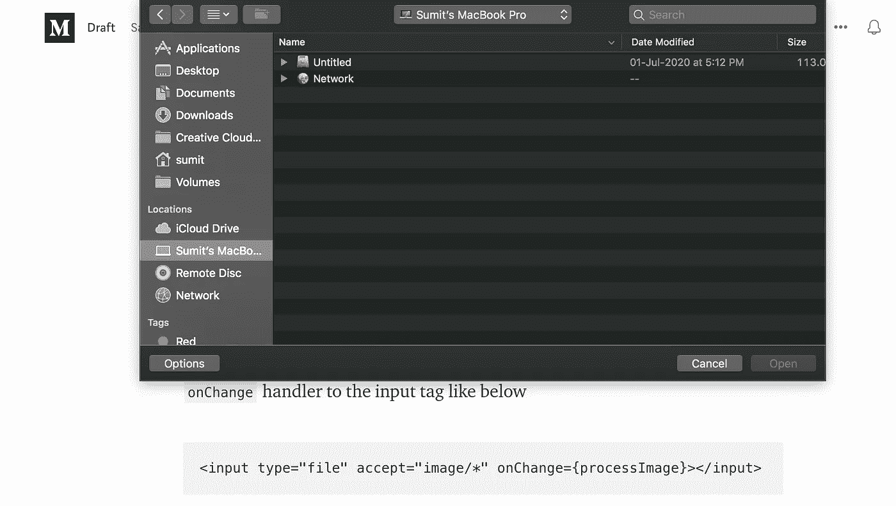

# 使用 React 预览上传的图像

> 原文：<https://javascript.plainenglish.io/preview-an-uploaded-image-with-react-21cc36bf46bd?source=collection_archive---------6----------------------->

很多时候，你会发现自己要求用户上传一张图片。呈现即将提交的图片的预览是一个好主意。这篇文章的很大一部分与 React 没有什么关系，更多的是与前端应用程序开发有关。唯一涉及 ReactJS 的部分是我们使用`useState`钩子临时存储图像引用的部分。


source: pexels

# 选择图像

直观地说，第一步是让用户选择一个图像。普通老式 HTML 中带有文件类型的输入标签帮助我们做到了这一点。下面的行将显示一个标题为“选择文件”的按钮。当我们点击这个按钮时，会出现一个文件选择对话框。

```
<input type="file"></input>
```

然而，上面的代码片段允许用户选择任何扩展名的文件。为了限制用户选择图片，我们添加了如下约束

```
<input type="file" **accept="image/*"**></input>
```

注意加粗的部分。这将对选择施加约束。它现在只允许那些图像类型的文件。我们可以进一步添加约束，这些约束只概述某些文件扩展名的使用，如下所示。

```
<input type="file" accept="image/png" />
```

点击选择文件按钮，我们将会看到一个文件选择器对话框，如下图所示。根据设备或设备运行的操作系统，外观会有所不同。



caption: Image picker

# 获取图像

可以从事件中提取所选的图像。首先向输入标签添加一个`onChange`处理程序，如下所示

```
<input type="file" accept="image/*" onChange={processImage}></input>
```

在上面的代码片段中，`processImage`是一个提取图像的函数。

```
function processImage(event){
   const imageFile = event.target.files[0];
   const imageUrl = URL.createObjectURL(imageFile);
}
```

上面函数中的第一个 like 将图像从事件中解包，下面一行为所选文件生成一个临时 url。这个临时 url 可以用来显示图像。接下来，我们使用 React 状态来保存这个 url。

从导入`useState`开始，使用钩子存储文件 url。

```
import React, {useState} from 'React';....const [fileUrl, setFileUrl] = useState(null);
```

注意，`fileUrl`的初始值是`null`。修改`onChange`处理程序来更新图像被选中时的状态。

```
function processImage(event){
   const imageFile = event.target.files[0];
   const imageUrl = URL.createObjectURL(imageFile);
 **setFileUrl(imageUrl)** }
```

回想一下，当状态被更新时，界面也被更新。最后，使用`img`标签和状态变量呈现图像。

```

```

当页面第一次加载时，`fileUrl`没有值，图像也不会显示。当图像被选中时，状态变量`fileUrl`被设置为临时 url。这种状态更新启动了用户界面更新。然而，这一次`fileUrl`将不是`null`，图像将被显示。

这将允许你在上传图片前给用户一个预览。如果您有任何疑问，请留下您的评论。