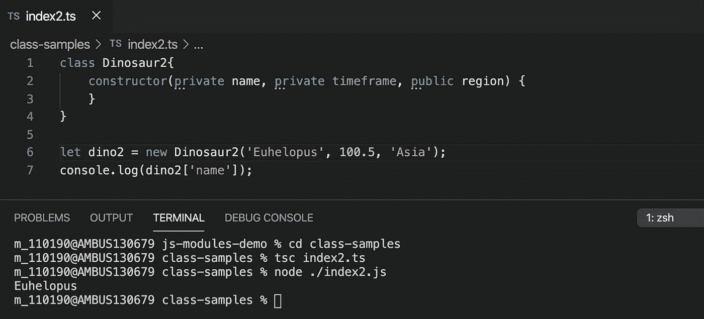
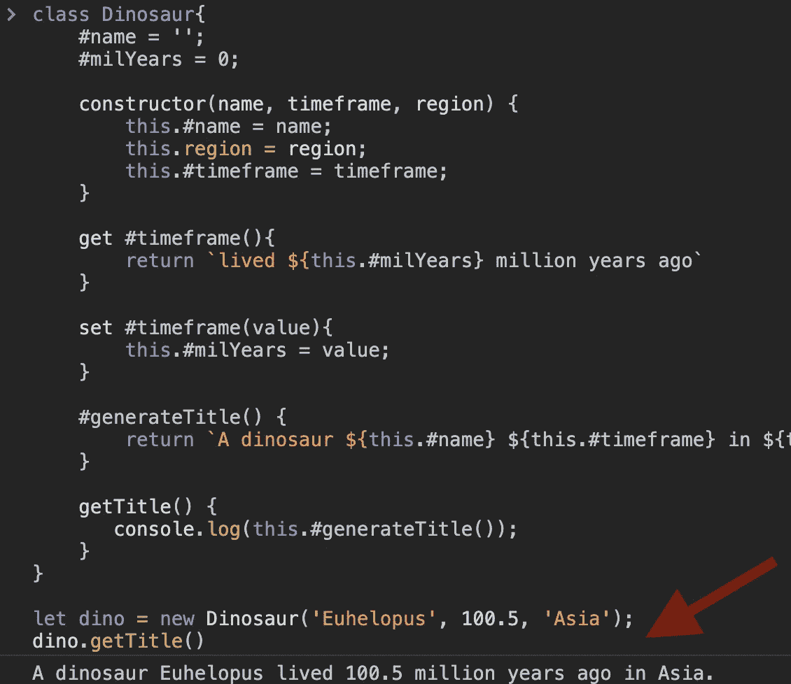
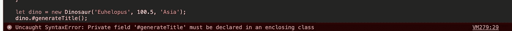
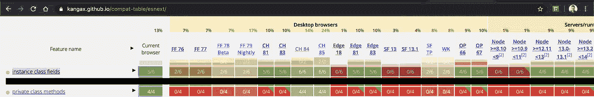

# 如何在 JavaScript 类中创建私有字段和函数

> 原文：<https://javascript.plainenglish.io/private-members-in-javascript-classes-cb04944f1ae2?source=collection_archive---------0----------------------->

## JavaScript 中的私有成员


本文首先介绍 JavaScript 中的第三阶段特性，该特性用于创建私有字段、getter、setter 和函数。它与 TypeScript 中的类似功能进行了比较。随后，它列出了浏览器兼容性。最后，描述了 TC39 流程，并对 0-4 阶段进行了说明。

像 Java、C#这样的传统语言使用访问修饰符来控制对字段或方法的访问。可以在类外部的类实例上访问公共字段；仅在类中的私有字段。

ES6 / ES2015 在 JavaScript 中引入了类。它是数据(字段)和行为(函数)的封装。对于目前处于阶段 3 的新提议，类可以有私有成员，这些成员在类的范围之外是不可访问的。

# 私有类字段

我们可以在 JavaScript 中创建私有字段、getters & setters 和函数，方法是在前面加上#。它们在课堂之外是不可访问的。

考虑下面的例子。我们创建了一个恐龙类。构造函数接受三个输入参数，名称、时间范围和地区。

该类使用这些信息创建友好的消息。当您阅读本文时，我们将构建这个示例。首先，我们创建一个类和几个字段。

```
1\. class Dinosaur{
2\.    #name = ''; // Private fields need to be declared
3\.    #milYears = 0;

4\.    constructor(name, milYears, region) {
5\.        this.#name = name;
6\.        this.region = region;
7\.        this.#milYears = milYears;
8\.    }
9\. }*Snippet-1: A class with private fields*
```

请注意，构造函数在类级别的字段上设置值。私有字段用# names(散列名)声明。它们需要显式声明，如上面代码片段中的第 2 行和第 3 行所示。但是，注意*地区*不是私有字段。它没有哈希名。因此它可以在没有声明的情况下被实例化(第 6 行)。

私有字段不能在类外访问。考虑下面的代码片段-2。第 2 行记录区域打印正确。但是，第 3 行和第 4 行返回一个错误，因为这些字段是私有的

```
1\. let dino = new Dinosaur('Euhelopus', 100.5, 'Asia');

2\. console.log(dino.region); // public- accessible outside the class
3\. console.log(dino.#milYears); //private- not accessible outside the class
4\. console.log(dino.#name); // private- not accessible outside class*Snippet-2: Instantiate a JavaScript class*
```

## TypeScript 中的私有字段

用 TypeScript 编码的开发人员习惯私有字段。然而，浏览器不解释 TypeScript。代码被编译成 JavaScript 以在浏览器上运行。没有 JavaScript 中的私有字段，我们总是可以访问 snippet-3 中指定的私有字段。参见第 7 行。JavaScript 中的私有字段提供了更好的抽象，因为该语言本身就支持它。

> TypeScript 允许通过指定访问修饰符在构造函数中创建字段，如第 2 行所示。这非常有用——代码片段 1 中的 6 行代码现在被写成了一行。

注意，我们运行 tsc (TypeScript 编译器)将代码编译成 JavaScript。使用 Node.js 运行 js 文件。



Snippet-3: Private fields in TypeScript

# 私有 Getters 和 Setters

与字段类似，我们可以创建私有的 getters 和 setters。考虑下面的代码片段-4。参见第 10–15 行，我们为字段 milYears 创建了一个 getter 和 setter。我们称之为#时间框架。构造函数使用第 8 行的私有字段来设置一个值。在后面的例子中，我们将使用时间框架获取恐龙时间框架上的友好消息。

```
1\. class Dinosaur{
2\.    #name = '';
3\.    #milYears = 0;
4\.    
5\.    constructor(name, timeframe, region) {
6\.        this.#name = name;
7\.        this.region = region;
8\.        this.#timeframe = timeframe;
9\.    }10\. get #timeframe(){
11\.        return `lived ${this.#milYears} million years ago`
12\.    }13\. set #timeframe(value){
14\.        this.#milYears = value;
15\.    }
16\. }Snippet-4: Private getters and setters
```

# 私人功能

现在让我们向示例中添加一个私有函数——以 hash (#)作为前缀。注意，我们使用 getter " *this。第 4 行中的#timeframe"* 。私有函数#generateTitle 返回一条关于恐龙的友好消息。不能在类外部访问此函数。

```
1\. class Dinosaur {2\. // Removed rest of the class for brevity. Same class as in Snippet-43\. #generateTitle() {
4\.   return `A dinosaur ${this.#name} ${this.#timeframe} in  ${this.region}.  `;
5\.  }6\. }Snippet-5: Private function
```

类中的私有项提供控制，哪些向消费者公开，哪些在内部使用。考虑下面的完整示例。我们添加了一个公共函数 printTitle()，它在控制台上记录友好的消息。请参见第 18–20 行。参见第 23 行中在恐龙对象的类外调用的公共函数。

```
1\. class Dinosaur{
2\.    #name = '';
3\.    #milYears = 0;

4\.    constructor(name, timeframe, region) {
5\.        this.#name = name;
6\.        this.region = region;
7\.        this.#timeframe = timeframe;
8\.    }9\. get #timeframe(){
10\.        return `lived ${this.#milYears} million years ago`
11\.    }12\. set #timeframe(value){
13\.        this.#milYears = value;
14\.    }15\. #generateTitle() {
16\.        return `A dinosaur ${this.#name} ${this.#timeframe} in ${this.region}.  `;
17\.    }18\. printTitle() {
19\.       console.log(this.#generateTitle());
20\.    }
21\. }22\. let dino = new Dinosaur('Euhelopus', 100.5, 'Asia');
23\. dino.printTitle();
```

看到下面的结果，



Figure-1: Dinosaur with private and public fields, getters/setters and functions

任何在类外部访问的私有项都会返回错误。请参见下面的图 2。



Figure-2: Error on accessing the Private Field (Chormium Browser)

> 请注意，散列名称不能在对象文字(JSON 对象)上创建，也不能通过在 prototype 上添加字段或函数来创建。它们不能像其他字段一样临时创建。它们需要在类中提前声明。

# 浏览器支持

如前所述，这些特征处于 TC-39 工艺的第三阶段。指的是候选人，也就是**快**完了。它允许用户/开发者试验该特性并提供反馈。(参见下一节了解 TC-39 过程)。

Google Chrome 支持 83.x 以上版本的私有字段。私有的 getter/setter 和函数是一个独立的 TC39 提案，从版本 84(撰写本文时是 beta 版)开始就受到支持。在 83.x 版本中，这些特性可以通过在 *chrome://flags/中启用实验性 JavaScript 来实现。*

有关其他浏览器支持信息，请参见下面的图 3。



Figure-3: Browser support. Link — [https://kangax.github.io/compat-table/esnext/](https://kangax.github.io/compat-table/esnext/)

# TC-39 关于私有字段、getter/setter 和函数的建议

请在下面找到这两个提案的链接。

*   [建议-类别-字段](https://github.com/tc39/proposal-class-fields)
*   [提案-私有-方法](https://github.com/tc39/proposal-private-methods)

# TC39 流程——新特性是如何添加到 JavaScript 中的？

对于许多其他语言，随着新特性的增加，只需要升级一个运行时或一个编译器。JavaScript 是独一无二的；功能需要通过各种浏览器来实现。它们由不同组织拥有的不同团队构建和维护。每个人都必须走到一起，不断升级语言。

ECMA 脚本(简称 ES)是为标准化 JavaScript 而创建的语言规范。ES5 是 2009 年发布的流行 JavaScript 版本。ES 6 于 2015 年发布。也被称为 ES 2015。从 ES 6 开始，每年都会进行一次升级。如前所述，本文描述的动态导入特性是 ES 2020 或 ES 11 的一部分。

ECMA TC39 是一个委员会，负责演变 ECMA 脚本。TC 39 使用以下阶段定义将 JavaScript 特性移动到 ECMA 脚本版本之一。每一个新的 JavaScript 提案都要经历在所有浏览器上可用的阶段。

*   阶段 0— Strawperson 或新规范(以前称为 strawman，现在重新命名—正确的名称是:)
*   第 1 阶段—提案。使用正式的规范语言演示对添加、解决方案和挑战的需求。
*   第 2 阶段—草拟。描述语法和语义。
*   第 3 阶段—候选人。允许用户进行实验并提供反馈。可以根据反馈重新定义规范。大多数浏览器都在这个阶段开始调整特性。功能可能尚未为黄金时段做好准备。
*   阶段 4 —已完成。功能已准备就绪，可供所有用户使用。

按照[链接获取 TC 39 工艺文件](https://tc39.es/process-document/)

# 参考资料及进一步阅读

1.  [Mozilla 文档](https://developer.mozilla.org/en-US/docs/Web/JavaScript/Reference/Classes/Private_class_fields)

2.P [roposal 级油田](https://github.com/tc39/proposal-class-fields)

[3 .建议-私有-方法](https://github.com/tc39/proposal-private-methods)

[4 .ECMA 脚本兼容性表](https://kangax.github.io/compat-table/esnext/)

[5 .我的一篇关于动态导入的 JavaScript 文章，附带一个关于 TC-39 进程](https://medium.com/javascript-in-plain-english/discuss-native-support-for-on-the-fly-import-of-modules-in-es-2020-also-called-es-11-ad4f899e0c2)的解释

# 关于我

*Twitter-*[*@ keertkotaru*](http://twitter.com/keertikotaru)*。*[web-*http://kvkirthy.github.io/showcase*](http://kvkirthy.github.io/showcase) *书籍，*[角材书](https://www.amazon.com/Angular-Material-Design-TypeScript-Interface/dp/1484254333/ref=sr_1_4?crid=IPQSCYP20TBM&keywords=angular+material&qid=1578619358&sprefix=angular+mater%2Caps%2C139&sr=8-4)*[*角材 v1.x*](https://www.amazon.com/Material-Design-Implementation-AngularJS-Component/dp/1484221893/ref=sr_1_10?crid=IPQSCYP20TBM&keywords=angular+material&qid=1578619358&sprefix=angular+mater%2Caps%2C139&sr=8-10)*