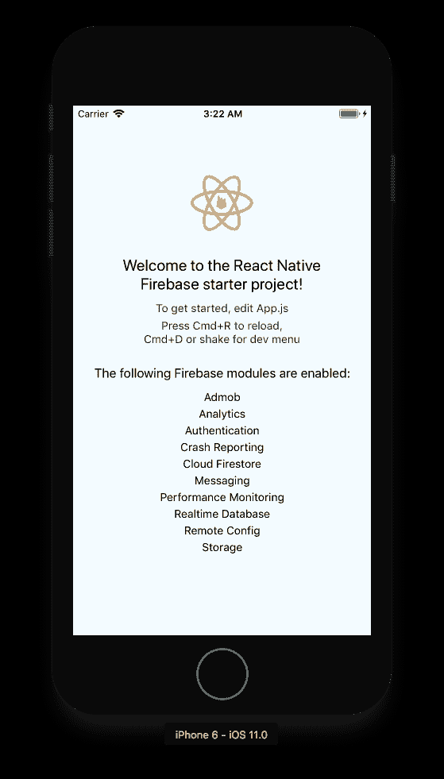

# 我在使用 React Native 构建移动应用时遇到的问题

> 原文：<https://javascript.plainenglish.io/problems-i-faced-whilst-using-react-native-a71b6de432fc?source=collection_archive---------1----------------------->

## 我所做的所有试验和错误的一个大列表，以及所有的修复——这样你就不必遭受我所经历的痛苦了！


***注意:*** *这篇文章并不打算成为一个完整的问题修复列表。它甚至不是一篇合适的文章。它实际上是一个记事本文档，里面满是我在使用 React-Native 时遇到的问题，我认为它可能对其他人有用。这些问题中的许多可能已经在 RN 的较新版本中得到解决。我当时用的是 0.56–0.58。*

## 如果你打算使用 Firebase，一个很好的起点是在[https://rnfirebase.io/](https://rnfirebase.io/)上的初学者工具包

[https://github.com/invertase/react-native-firebase-starter](https://github.com/invertase/react-native-firebase-starter)

这为 React Native 安装了一个定制版本的 Firebase，这是天赐之物。

要完成这一设置，需要完成许多工作，包括:

## 1)克隆和安装依赖关系

*   1.1) git 克隆[https://github . com/invertase/react-native-firebase-starter . git](https://github.com/invertase/react-native-firebase-starter.git)
*   1.2)将 react-native-firebase-starter 光盘放入新创建的项目目录中。
*   1.3)使用您选择的软件包管理器安装 npm 软件包，即运行 yarn 或 NPM 安装
*   1.4) [iOS] cd ios 并运行 pod install —如果您没有 CocoaPods，您可以按照这些说明[安装它。](https://guides.cocoapods.org/using/getting-started.html#getting-started)
*   1.5) [Android]此处没有针对 Android 的额外步骤。

## 2)重命名项目

您需要运行节点版本 7.6 或更高版本，重命名功能才能工作

*   2.0) [iOS]光盘..返回到项目的根目录
*   2.1) npm 运行重命名—系统会提示您输入项目名称和公司名称
*   2.2)记下包名的值——在设置 Firebase 项目时会用到它

## 3)添加谷歌服务文件(plist & JSON)

*   3.1) [iOS]按照将 firebase 添加到您的应用程序的说明[这里的](https://firebase.google.com/docs/ios/setup#add_firebase_to_your_app)来生成您的 GoogleService-Info.plist 文件(如果您还没有这样做的话)——使用之前生成的包名作为您的 iOS 捆绑包 ID。
*   3.2) [iOS]将此文件放在项目的 ios/目录中。
*   3.3) [Android]按照手动将 firebase 添加到您的应用程序的说明[此处](https://firebase.google.com/docs/android/setup#manually_add_firebase)生成您的 google-services.jsonfile(如果您还没有这样做的话)——使用之前生成的包名作为您的 Android 包名。
*   3.4) [Android]把这个文件放在你项目的 android/app/目录下。

## 4)启动你的应用程序

*   4.1)从项目的根目录启动 react native packager，运行 yarn run start 或 npm start。
*   4.2) [ios]构建并运行 iOS 应用，从你的项目根目录运行 npm 运行 iOS 或 yarn 运行 iOS。第一次构建需要一些时间。这将自动启动一个模拟器，如果还没有启动的话，它也会为你成功的构建一个模拟器。
*   4.3) [Android]如果你还没有安装 Android 设备/运行模拟器，那么你需要安装一个(确保模拟器安装了 Google Play/API)。当准备好运行 npm 运行 android 或 yarn 运行 android 从你的项目的根。

如果一切顺利，您将看到如下所示的初始屏幕。



然而，您会发现这并不完全可靠，需要进行一些调整才能正常工作。

也就是说，在 **build.gradle** 内部存在需要调整的问题，因为一些构建版本彼此不兼容。还有一些重复的条目必须删除。

有一个问题是，当应用程序最终安装到 android 设备上时，会出现 RNFirebase 的重复实例。不得不在**MainApplication.java**中对它们进行注释，如下所示:

```
package com.javascriptinplainenglish.plaingroup;import android.annotation.SuppressLint;import android.app.Application;import com.facebook.react.ReactApplication;import io.invertase.firebase.RNFirebasePackage;import com.facebook.react.ReactNativeHost;import com.facebook.react.ReactPackage;import com.facebook.react.shell.MainReactPackage;import com.facebook.soloader.SoLoader;// import io.invertase.firebase.RNFirebasePackage;// optional packages — add/remove as appropriateimport io.invertase.firebase.admob.RNFirebaseAdMobPackage;import io.invertase.firebase.analytics.RNFirebaseAnalyticsPackage;import io.invertase.firebase.auth.RNFirebaseAuthPackage;import io.invertase.firebase.config.RNFirebaseRemoteConfigPackage;import io.invertase.firebase.database.RNFirebaseDatabasePackage;import io.invertase.firebase.fabric.crashlytics.RNFirebaseCrashlyticsPackage;import io.invertase.firebase.firestore.RNFirebaseFirestorePackage;import io.invertase.firebase.functions.RNFirebaseFunctionsPackage;import io.invertase.firebase.instanceid.RNFirebaseInstanceIdPackage;import io.invertase.firebase.invites.RNFirebaseInvitesPackage;import io.invertase.firebase.links.RNFirebaseLinksPackage;import io.invertase.firebase.messaging.RNFirebaseMessagingPackage;import io.invertase.firebase.notifications.RNFirebaseNotificationsPackage;import io.invertase.firebase.perf.RNFirebasePerformancePackage;import io.invertase.firebase.storage.RNFirebaseStoragePackage;import java.util.Arrays;import java.util.List;public class MainApplication extends Application implements ReactApplication {private final ReactNativeHost mReactNativeHost = new ReactNativeHost(this) {@Overridepublic boolean getUseDeveloperSupport() {return BuildConfig.DEBUG;}@SuppressLint(“MissingPermission”)@Overrideprotected List<ReactPackage> getPackages() {return Arrays.asList(new MainReactPackage(),// new RNFirebasePackage(),new RNFirebasePackage(),// add/remove these packages as appropriatenew RNFirebaseAdMobPackage(),new RNFirebaseAnalyticsPackage(),new RNFirebaseAuthPackage(),new RNFirebaseRemoteConfigPackage(),new RNFirebaseCrashlyticsPackage(),new RNFirebaseDatabasePackage(),new RNFirebaseFirestorePackage(),new RNFirebaseFunctionsPackage(),new RNFirebaseInstanceIdPackage(),new RNFirebaseInvitesPackage(),new RNFirebaseLinksPackage(),new RNFirebaseMessagingPackage(),new RNFirebaseNotificationsPackage(),new RNFirebasePerformancePackage(),new RNFirebaseStoragePackage());}@Overrideprotected String getJSMainModuleName() {return “index”;}};@Overridepublic ReactNativeHost getReactNativeHost() {return mReactNativeHost;}@Overridepublic void onCreate() {super.onCreate();SoLoader.init(this, /* native exopackage */ false);}}
```

在 React Native 中编写需要处理一些细微差别:

想要使用字体等资产？将此添加到您的包中。json:

```
“rnpm”: {
   “assets”: [
   “./assets/fonts/”
   ]
 }
```

当你打包你的 iOS 应用时，你最好提交一个捆绑的 JS 文件，而不是让你的应用实时编译 JS。所以你应该运行这个函数:

`react-native bundle --entry-file index.js --platform ios --dev false --bundle-output ios/main.jsbundle --assets-dest ios`

然后引用这个而不是本地构建，方法是将 **AppDelegate.m** 中的`jsCodeLocation`行替换为

`jsCodeLocation = [[NSBundle mainBundle] URLForResource:@”main” withExtension:@”jsbundle”];`

作为参考，这一行最初是:

`jsCodeLocation = [[RCTBundleURLProvider shareSettings] jsBundleURLForBundleRoots:@”index” fallbackResrouce:nil];`

## npm 安装后库没有出现在你的代码中？

您可能需要手动添加它。要为 ios 执行此操作，请在 xcode 中打开您的项目，并检查/添加以下内容:

我检查了 Xcode 项目，我有:

*   `RNSVG.xcodeproj`在“图书馆”
*   `libRNSVG.a`在“将二进制文件与库链接”中
*   `$(SRCROOT)/../node_modules/react-native-svg/ios`在“标题搜索路径”中

尽管实际添加的内容会因您安装的内容而有所不同。在本例中，它是一个名为 REACT-NATIVE-SVG 的包

## 如何构建生产版本

**ios**

为 ios 创建 js 包文件—

```
react-native bundle --entry-file index.js --platform ios --dev false --bundle-output ios/main.jsbundle --assets-dest ios
```

然后进入 AppDelegate.m，查找如下所示的一行代码:

```
jsCodeLocation = [[RCTBundleURLProvider sharedSettings] jsBundleURLForBundleRoot:@"index" fallbackResource:nil];
```

然后，您会希望注释掉该行，并在它下面添加以下行:

```
jsCodeLocation = [[NSBundle mainBundle] URLForResource:@"main" withExtension:@"jsbundle"];
```

这基本上是告诉您的本机应用程序代码查找运行 react-native bundle 时创建的 jsbundle 文件。它告诉你的应用程序使用它，而不是试图在运行时运行和编译非捆绑代码。

一旦你这样做了，你的代码块应该看起来像这样:

```
jsCodeLocation = [[NSBundle mainBundle] URLForResource:@"main" withExtension:@"jsbundle"];
// jsCodeLocation = [[RCTBundleURLProvider sharedSettings] jsBundleURLForBundleRoot:@"index" fallbackResource:nil];
```

顺便说一下，我们保留原始代码并简单地将其注释掉的原因是，我们可以根据我们是在开发环境中运行还是想要使用我们的生产代码来快速注释和取消注释每一位。这样，如果我们想进一步修改我们的应用程序代码，我们可以切换回来，做更多的修改，重新绑定所有东西，然后再切换。

一旦你这样做了，你会想要打开 Xcode 并打开你的 ios 项目(这通常应该位于你的 ios 下的主 react-native 目录中——例如，它可能是 supersonic app/IOs)。打开后，确保将活动方案设置为通用 iOS 设备，然后在顶部导航菜单中单击产品，并单击存档。

xcode —包

**安卓**

你需要构建一个新版本的代码库

[https://proandroiddev . com/bundling-react-native-during-Android-release-builds-ec52c 24 e 200d](https://proandroiddev.com/bundling-react-native-during-android-release-builds-ec52c24e200d)

您需要首先更新您的版本的 versionCode 和 versionName。

在 app/build.gradle 中，您会看到以下几行:

```
versionCode 1
versionName "1.0"
```

更新这些。versionCode 必须是整数，因此即使您的更新很小，您也必须将其从 1 更新到 2。版本名称是人们将看到的名称，因此可以从 1.0 更新到 1.1 或 1.0.1 等。

然后通过运行以下命令构建新的 js 包:

```
react-native bundle --entry-file index.js --platform android --dev false --bundle-output android/app/src/main/assets/index.android.bundle --assets-dest android/app/src/main/res
```

然后由于某种原因，在 android/src/res 内部生成了五个不同的文件夹，名字分别是 drawable-hdpi，drawable-mdpi 等等。删除所有这些，但保留名为 drawable 的文件夹。

然后导航到 android 文件夹并运行

```
./gradlew assembleRelease
```

这将在 Android/app/build/outputs/apk/release 中构建一个发布 apk。

你可以把它上传到 google play 商店:

转到[https://play.google.com/apps/publish/](https://play.google.com/apps/publish/)

然后点击发布管理->应用发布

## 的问题。/grad Lew assembly release，它未能成功编译。

会不会是您的依赖项使用了不同的 targetSdkVersion？见下文:

**错误原因:**

您已经安装了*react-native-document-picker*作为依赖项，这个错误的原因是您的`android/app/build.gradle`和`node_modules/react-native-document-picker/android/build.gradle`的配置不匹配。

**解决方案**

1.  导航到`node_modules/react-native-document-picker/android/build.gradle`
2.  编辑并保持`compileSdkVersion` `buildToolsVersion` `minSdkVersion targetSdkVersion`和`android/app/build.gradle`中的一样
3.  再次同步项目。
4.  从终端运行`./gradlew assembleRelease`。

## npm 运行 apk 不生成签名版本的问题

[https://react nationalforyou . com/always-creating-unsigned-release-apk-react-native-error-fix/](https://reactnativeforyou.com/always-creating-unsigned-release-apk-react-native-error-fix/)