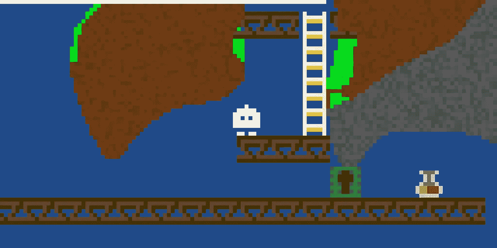
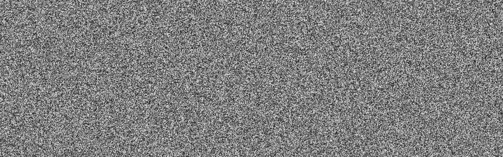
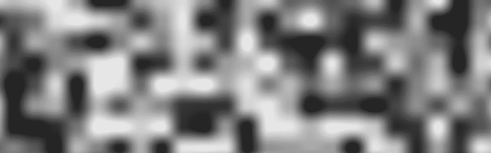
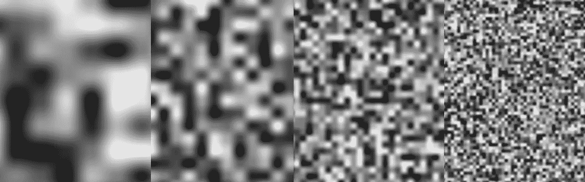
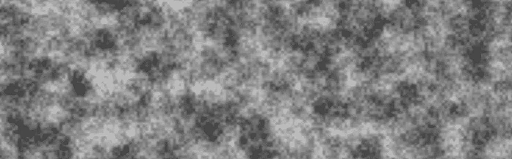
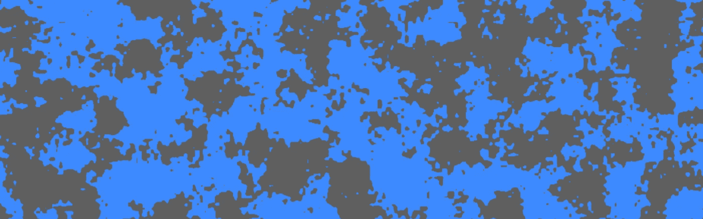
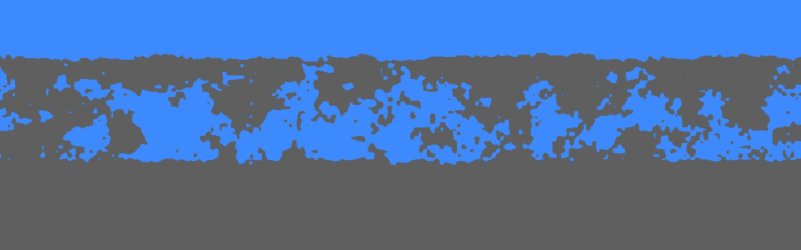
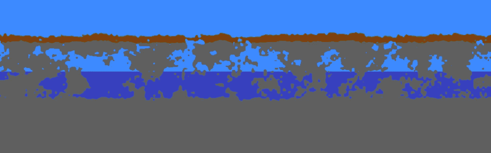
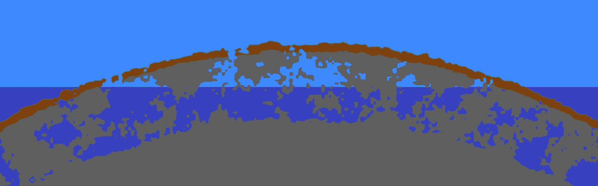

# 使用过程化生成为一个简单的 JavaScript 平台游戏创建地形

> 原文：<https://javascript.plainenglish.io/procedural-generation-of-an-infinite-world-aaea8e70ef4a?source=collection_archive---------6----------------------->

## 无限世界的程序生成

程序生成是一种可以在视频游戏中使用的技术，它可以为地图、纹理和声音创建无限量的数据，以创建永不结束的游戏世界。

正如[在我之前的帖子](https://medium.com/@alexc73/i-made-a-video-game-on-my-journey-to-work-8e1bf2dfd208)中描述的，我最近参加了 [JS13k 游戏](https://js13kgames.com/)比赛，我想制作一个感觉很大但符合比赛规定的 13kb 大小限制的游戏。我选择使用过程化生成，因为这意味着我可以在游戏代码中生成游戏世界，从而保持整个包的大小较小。

A screenshot from my JS13k game “Back from Kooky Island” showing the procedurally generated terrain

在这里，我讨论一下我是如何做到这一点的一些背景。虽然我使用程序生成来制作 2d 平台游戏的地形，但是这些技术也可以用来生成游戏结构、精灵、纹理和声音。

# 随机数

程序生成通常使用根据某些固定输入参数创建特征的程序。给定相同的输入，将输出相同的特征。为了给我的游戏创建一个无限的地形，我需要一个具有以下特征的输入源:

*   显然是随机的，从不重复，所以这个世界玩起来很有趣
*   每次游戏运行时都会产生相同的输入，所以每次我们玩游戏时，世界都是一样的
*   当前的输出不依赖于任何先前的输出，因此我们可以以任何顺序生成世界的任何部分

换句话说，一个以不可预测但可重复的方式将输入映射到输出的函数。

下面是一个这样的函数的例子，它返回 0 到 255 之间的不可预测的值。

该函数只有一个输入参数。为了生成一个 2D 地形，我需要一个函数为世界上的每一个`(x,y)`坐标提供一个可重复的输出。为了使用上面的函数，我需要将`x`和`y`的值映射成一个数字。

一种方法是将`(x,y)`对视为一个向量，并计算该向量与其他固定向量的点积。这是它的样子。这个函数和上面的一样，修改后有两个输入。

A pseudo-random noise function of two inputs

在平面上绘制输出如下:

The output of the pseudo-random noise function

尽管许多对数字具有相同的点积，但它们在 2D 平面上是倾斜的，所以重复不明显。

# 分形噪声

这里的噪音看起来足够随机，但相当刺耳，不太自然。通过组合不同尺度的几层噪声，可以获得更自然的效果。

每一层都是通过“放大”噪声、跳过像素并在像素之间插值而生成的。

这是当我们放大 128 倍时的样子，即每 128 个像素中只有一个像素来自伪随机函数，其余的是插值的。

Linearly interpolated pseudo-random noise, with a sample period of 128 pixels

我在这里使用了线性插值，这意味着亮度从点到点呈直线变化。这使得常规采样网格变得非常明显——您仍然可以在输出中看到“正方形”。

插值有更复杂的方法。(柏林噪声是一个众所周知的例子。)然而，这里显示的简单线性插值对于我想要生成的世界来说已经足够了。

这里有四个不同的样本间隔(或周期)，显示为单独的层，然后叠加。

2D noise with 128px, 64px, 32px and 16px sample periods. Notice how each layer looks similar but with different “zoom levels”

The four layers overlaid to give a slightly more natural effect

这产生了看起来稍微更自然的噪声，称为“分形噪声”,因为不同的层本质上是相同的，但比例不同。它经常在计算机图形中使用，以生成看起来自然的纹理，如铁锈或云。

*(在信号处理中，这相当于过滤噪声以去除高频。这里，通过将较低频率的噪声加在一起，可以达到同样的效果。)*

# 游戏世界

你也许能看到这种类型的噪音是如何被用来为游戏创造一个世界的。从上面看，它可以被解释为一张丘陵或崎岖地面的地图。

在我的游戏中，我用它创建了一个地下洞穴网络，从侧面观察。通过应用一个简单的阈值函数，其中阈值以上的每个像素值都被绘制出来，其余的保持为空，噪声看起来像这样:

The noise with a threshold of 50%

这是我游戏中洞穴网络的基础。这里的洞穴永远延续下去，但我希望洞穴在固定的高度开始和结束。通过调整阈值函数的截止值远离 50%,我可以在完全实心和完全空心之间改变囊的密度。这让我可以创建不同的天空、洞穴和岩床带:

Varying the threshold along the y-axis to create layers of rock, caves and sky

通过使用第二个阈值函数，我添加了一层泥土，并在固定的坐标下给背景加上不同的阴影，我创造了水的效果。

我在地面上加了一层薄薄的草。为了确保它只出现在顶部表面而不是下面，我修改了代码来测试下面噪声场的梯度。由于空白区域的噪波值比实心区域低，因此可以使用任意点的梯度的`y`-分量来判断表面是朝上还是朝下。

The caves with a layer of earth and grass on top

最后，为了在水平方向限制玩家，我通过改变`x`轴和`y`轴的阈值来创建一个孤岛的效果。我根据`x`坐标的平方来偏移`y`坐标。

Varying the threshold along the x axis creates an island effect

这形成了我游戏的基本地形。它创造了一个合理大小的游戏世界，不会在游戏包中占用太多空间。为了完善这个世界，并让它玩起来更有趣，我添加了一个城堡和一些其他的平台和梯子，你可以通过[玩完成的游戏](https://js13kgames.com/entries/back-from-kooky-island)自己发现。

# 关于亚历山大

我是一名驻伦敦的软件工程师。我帮助公司建立网络应用程序。