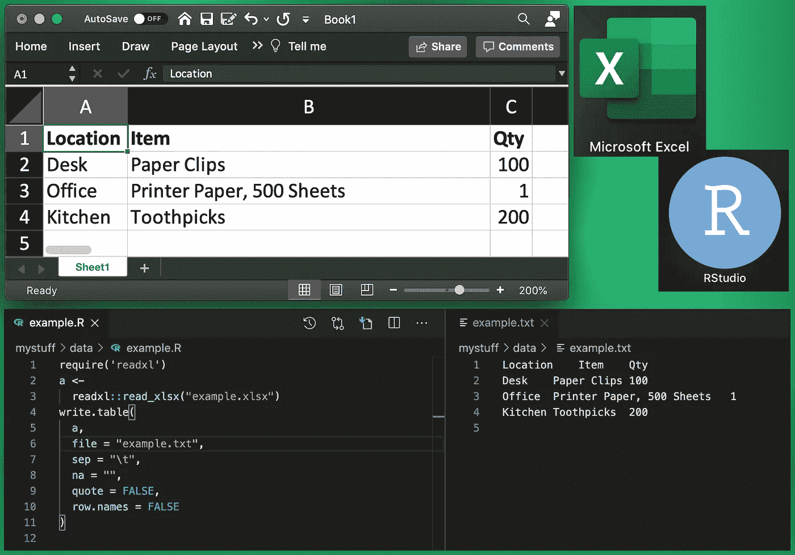

# 用 JavaScript 处理 Excel 文件

> 原文：<https://javascript.plainenglish.io/processing-excel-files-with-javascript-fb329da960f8?source=collection_archive---------10----------------------->



我用 NodeJS 做很多事情。当我想用 JavaScript 创建一个库存系统时，我考虑了其他选择。因为程序是供个人使用的，所以编写 UI 来编辑数据没有什么价值。我决定使用电子表格。起初我使用 Google Sheets，但我总是在保存文件后将其导出。事情会变得不同步。非常烦人而且容易出错。

尽管我更愿意使用开源软件，但 Excel 仍然是最简单的解决方案。不幸的是，Excel 电子表格是 XLSX 文件。XLSX 是一种相当复杂的 XML 格式，很难解析。我寻找一个 NPM 模块来读取 XLSX 文件，但没有找到一个我喜欢的。

在绞尽脑汁之后，我意识到 R([https://www.r-project.org/](https://www.r-project.org/))是专门为处理各种来源的表格数据而设计的。我决定写一个简单的 R 脚本来进行转换。

R 包可以将 XLSX 文件读入一个表中。假设数据不包含制表符，表格可以输出到制表符分隔值(TSV)文件。用 JavaScript 很容易解析 TSV 文件。

从命令行使用以下 R 程序将完成转换:

```
require('readxl')
a <- readxl::read_xlsx("inventory_data.xlsx")
write.table(a, file = "inventory_data.txt", sep = "\t", na = "", quote = FALSE, row.names = FALSE)
```

保存到`xltotsv.R`。使用以下命令从命令行执行该程序:

```
R -f xltotsv.R
```

此时，可以使用 NodeJS 将 TSV 文件读入一个数组，并将行拆分成字段。甚至可以使用第一行作为对象的属性。有 NPM 软件包可以做到这一点，但它相当简单。让我们创建一个`getDB()`函数来返回数据库和字段名:

```
// Location Container Box Item Qty Value
import fs from 'fs';// convert TSV to JSON using first line as field names
function getDB() {
  const invTSV = fs.readFileSync('inventory_data.txt', 'utf-8');
  const lines = invTSV.split('\n');
  const fields = lines[0].replace('\r', '').split('\t').slice(0, 6);
  const db = [];
  for (let i = 1; i < lines.length; i++) {
    const line = lines[i].replace('\r', '');
    const entry = {};
    for (let j = 0; j < fields.length; j++) {
      const values = line.split(/ *\t/g);
      entry[fields[j]] = values[j];
    }
    db.push(entry);
  }
  return {db, fields};
}
```

通过在每行末尾的换行符处“拆分”长字符串，可以很容易地将每行转换为数组中的行。

TSV 文件是 DOS 格式的，所以需要去掉`\r`字符。

在这个例子中，使用`{}`创建 JSON 对象，然后使用`[attribute]`符号添加属性，将每一行转换成一个对象。这就用熟悉的 JSON 符号创建了对象:

```
{attribute:"value"}
```

处理对象数组现在是使用数组方法的简单事情，比如`map`、`forEach`等。

此时，我将数组保存为一个 JSON 文件，并将其用于任何我想做的事情。对于我的库存程序，我使用 React Native 编写了一个移动应用程序，并使用 Expo 发布。数据是从 AWS 检索的，所以我可以从任何地方访问它。有必要保护对 JSON 文件的访问。我如何编写移动应用程序和使用 AWS 有些复杂，我将在以后的文章中公布我使用的方法。

*原载于 2020 年 11 月 26 日*[*【https://focusedforsuccess.com】*](https://focusedforsuccess.com/processing-excel-files-with-javascript/)*。*