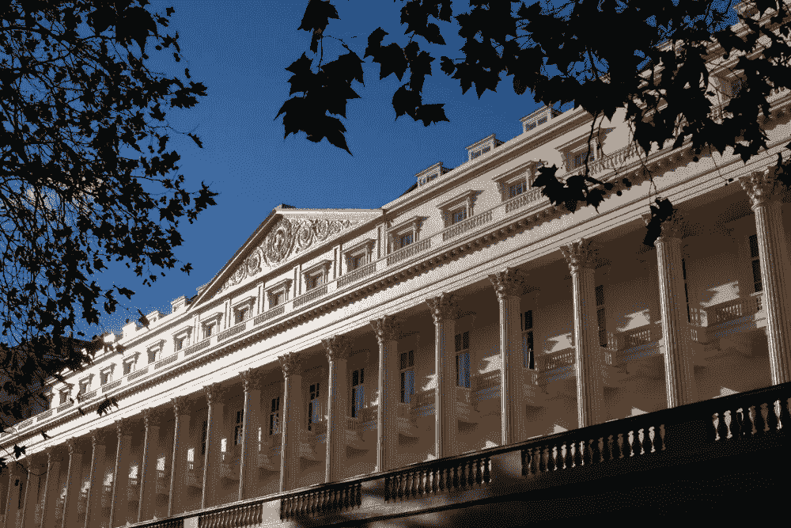
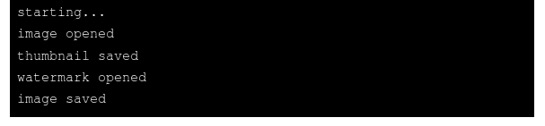
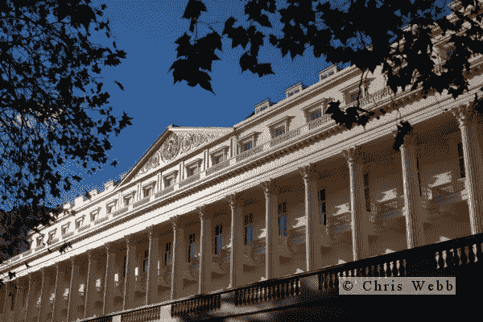

# 用 Node.js 和 JIMP 处理图像

> 原文：<https://javascript.plainenglish.io/processing-images-with-node-js-and-jimp-5e0519979484?source=collection_archive---------8----------------------->

Photo: Chris Webb

JavaScript 图像处理程序，被它的朋友称为 JIMP，是一个 NPM 软件包，提供了一系列编辑 JPEG、PNG 和其他一些格式的图像文件的方法。它最常见的用例可能是处理上传到基于节点的网站的图像，在本文中，我将演示如何使用它来调整图像大小、创建缩略图和添加水印。

在以后的文章中，我将进一步探索 JIMP 的能力。

## 背景

令人尴尬的是，我已经为我的照片在一个节点网站上工作了很长时间，每隔一段时间就添加一些小功能。它正接近这样一个阶段，我至少可以用基本的功能来启动它，本文描述了我编写的代码的一个压缩版本，用于在图像上传后对其进行处理。

这个项目的源代码在 [Github 库](https://github.com/CodeDrome/processing-uploaded-images-node-jimp)中。这里我只使用 JIMP 的一小部分功能，但是您可能会发现官方文档很有用:

[https://www.npmjs.com/package/jimp](https://www.npmjs.com/package/jimp)

正如您可能已经猜到的那样，可以使用以下命令安装 JIMP:

`npm install --save jimp`

## “空谈是廉价的，给我看代码”

(*莱纳斯·托沃兹*)

好了，莱纳斯，是这样的。

出于演示的目的，我写了这个从命令行运行，但是两个函数，`processImage`和`addWatermark`，可以在网站中使用。

哲学是建立一个单一的功能，执行所有这三项任务。因此，它只有一个参数，这个参数是一个对象，包含这样做所需的所有信息。该文件以对该函数的调用开始，尽管实际的实现会从外部调用该函数；在我的新网站中，这是在 REST 服务中完成的。

函数调用后是一个控制台日志。这将首先出现，尽管它是在调用`processImage`之后出现的，并且只是为了证明该过程是异步的。

在`processImage`函数中，我们首先需要`require` JIMP，然后使用 Promise then/catch 语法调用它的`read`方法。接下来发生的大部分事情都很简单明了，但是有几个特点值得指出:

1.  传递给`then`的λ是`async`(见 4)
2.  我们为缩略图创建一个图像的`clone`
3.  JIMP 提供了几个调整大小的函数，但`scaleToFit`可能是最有用的，因为我们只是给了它最大的尺寸，它为我们做了必要的计算，以保持高度:宽度的比例。
4.  我们`await` `addWatermark`否则代码将会在添加水印之前提前保存图像
5.  `quality`设定为 95。它可以是 0 到 100 之间的任何值，但低值是不好的(真的不好),通常认为超过 95 的值会显著增加文件大小，但视觉质量不会有太大的改善。
6.  由于这段代码是为我自己的网站编写的，我认为我永远不会上传比我指定的标准尺寸小的图片。如果你想让公众在网站上自由活动，你可以保留较小的图片，或者强制设置最小尺寸。
7.  出于演示的目的，我将文件用作源和目标。您还可以使用缓冲区，实际上您几乎肯定会对上传的图像使用缓冲区，如果您希望将处理过的图像作为 BLOB 而不是文件系统存储在数据库中，也可以使用缓冲区。
8.  在生产系统中，您可能希望将一个“onerror”回调传递给`processImage`，而不仅仅是将错误输出到控制台。

`addWatermark`函数读取水印文件，然后计算水印的位置；我把它硬编码为右下角左上 32 像素。然后，合成函数将两幅图像进行组合，在这种情况下，合成函数有效地将水印图像粘贴到主图像上。我使用了可选的`opacitySource`参数来使水印半透明。

现在让我们用这个命令运行代码。(我已经对存储库提供的图像文件的名称进行了硬编码。你可能想用你自己的照片和水印来代替。)

`node processuploadedimage.js`

这是输出。

输出非常枯燥，但至少它显示了正在发生的事情，特别是通过首先打印“starting…”来演示处理是异步的。

原始的 1000 x 667 图像位于页面顶部，这是调整后的 600 x 400 图像，带有水印。

最后是缩略图。

JIMP 是相当强大的，我只是触及了它的皮毛。正如我上面提到的，我还准备了一些文章来演示进一步的功能。