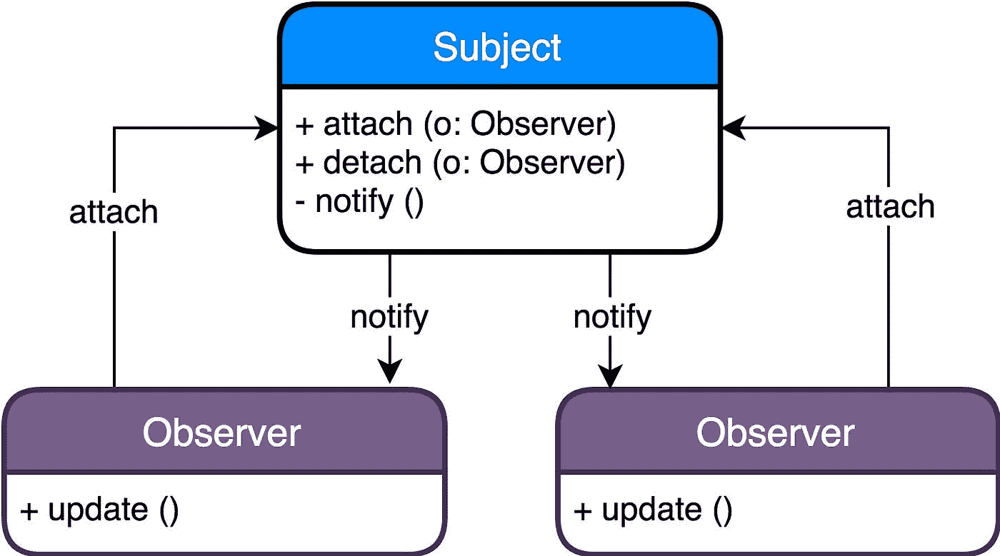
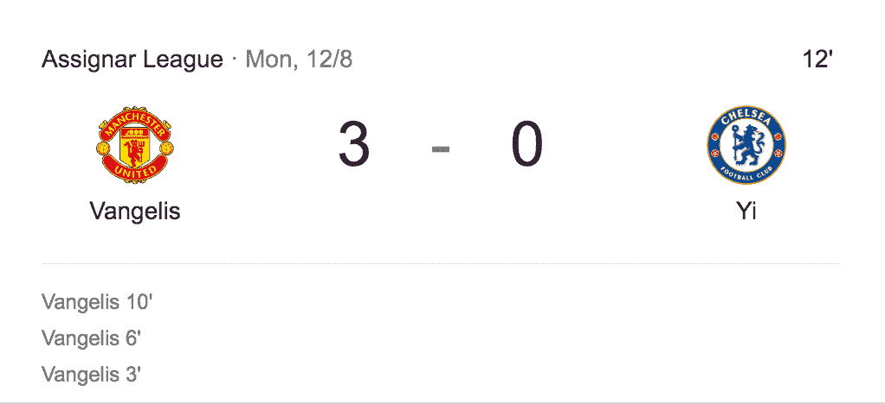
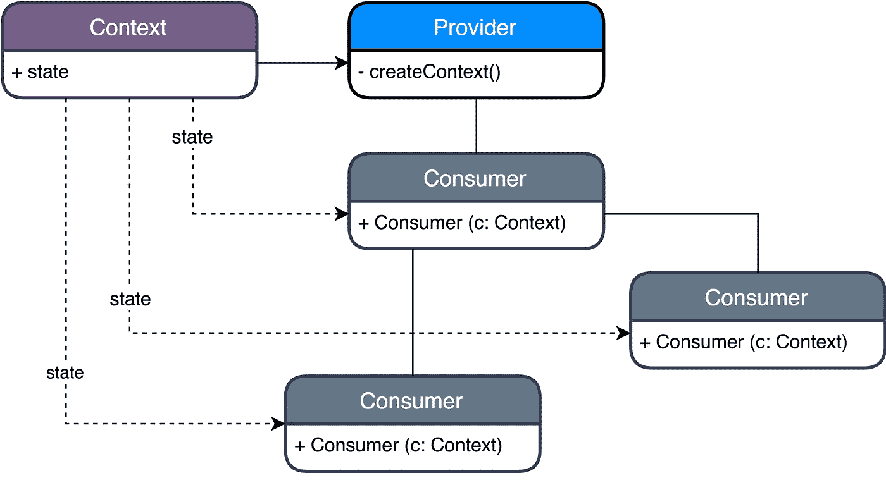
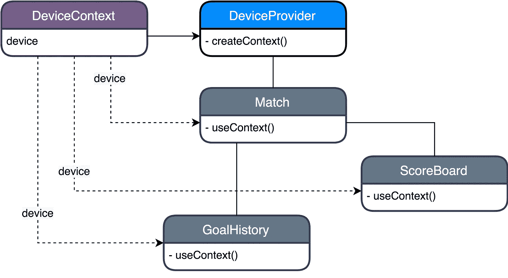

# 使用 React 挂钩的编程模式

> 原文：<https://javascript.plainenglish.io/programming-patterns-with-react-hooks-329c22b96461?source=collection_archive---------0----------------------->

React Hooks 的引入寻求了一种更具声明性的编程风格，并促进了功能组件的使用。

然而，随着我们应用程序的扩展，我们的代码变得更加难以理解和维护。重复的代码、不同步的数据和难以理解的树形结构很快困扰着我们精心设计的组件。

通过引入编程模式，我们可以改进应用程序的架构，并确保我们的组件不会因为无关的逻辑而变得臃肿。

# **概述**

1.  什么是编程模式？
2.  为什么要使用编程模式？
3.  带有反应钩子的观察者模式。
4.  带有 React 挂钩的提供者模式。
5.  免责声明！

# **什么是编程模式？**

> **软件设计模式是一种通用的、可重用的解决方案，用于解决软件设计中给定环境下的常见问题**——***维基百科***

**编程模式只是一个定义良好的解决方案，您可以将它应用到您的代码中，用于各种情况。**

**编程模式对任何语言都是不可知的——它们不包括您需要编写的代码，而是概述您可以使用什么类/对象以及它们如何相互影响。在前端开发中，有 3 种主要类型的模式。**

****创造**——给你创造对象的灵活性的模式**

****结构化**——帮助我们构建类和对象的模式——什么属于什么？一个对象如何访问另一个对象？**

****行为**——与对象之间的交流特别相关的模式**

**[设计模式:可重用面向对象软件的元素](https://www.amazon.com/Design-Patterns-Object-Oriented-Addison-Wesley-Professional-ebook/dp/B000SEIBB8)**

# **为什么要使用编程模式？**

**设计模式是已经使用了几十年的久经考验的方法。它们的用例被清晰地强调出来，它们可以帮助你非常快速地解决现存的问题。**

**模式本身也为开发人员的交流提供了坚实的基础。当您在代码中使用熟悉的模式名称时，代码就变成了**自文档化的**。一旦你认识到相关的编程模式术语和接口，阅读第三方包和你同事的代码就变得更容易理解了。**

**例如，以下术语分布在整个 [React 代码库](https://github.com/facebook/react)中。**

*   **提供上下文**
*   **事件发射器**
*   **听众**
*   **签署**
*   **处理**

**熟悉上述范例的开发人员可以快速识别功能的设计和使用，而不必深入代码的细节。**

# ****观察者模式****

> **“观察者模式在有多个对象(或模块，或组件)依赖于单个状态的情况下很有用”
> [*观察者模式—回答三个为什么*](https://medium.com/@NettaB/the-observer-pattern-answering-three-whys-205d2e469798)**

**当您有两个断开的组件想要保持彼此同步时，这在 React 中很有用。**

**观察者模式依赖于真实的来源。我们称之为**主题。****

**一个**观察者**会附着在对象身上，耐心等待。**

**当**主题**发生变化时，它会用最新的数据通知所有的观察者。**

****

****示例****

**对于这个例子，我们将创建一个跟踪足球比分的网站。**

**我们希望我们的应用程序在应用程序的一个部分显示实时目标，同时在另一个部分显示目标的历史。每当进球得分，我们希望应用程序的两个部分同时更新。**

****

***为了演示的目的，我们可以想象这些组件彼此相距很远。***

**这就是我们将如何使用观察者模式来构建代码。**

****

**下面的代码使用了 [**类型脚本**](https://www.typescriptlang.org/) 。然而，同样的概念可以很容易地应用于普通的 javascript。**

**在上面的例子中，我们给游戏主题附加了一个回调函数列表。每当我们`score`一个目标时，这些回调函数将使用最新的目标数据一次触发一个。**

**如果你不熟悉 React 钩子，可以去[介绍钩子](https://reactjs.org/docs/hooks-intro.html)**

**当我们的记分牌**消费者**最初被渲染时，我们将`onGoalScored`回调附加到游戏**主题**上。当进球得分时，回调函数由**主体**触发，该主体运行**消费者**上的`onGoalScored`并更新得分。**

**同样，在我们的 GoalHistory **消费者**中，我们将自己附在游戏主体**上，耐心地等待任何进球。当进球时，我们用进球的`Team`和进球发生的`time`更新`goals`列表。****

**通过使用观察器，我们确保了这两个组件彼此保持同步**

****优点****

***组件之间的低耦合*—组件不需要在同一个树中保持彼此同步。**

**促进*单向数据流* —在一个位置触发更改，易于跟踪。**

****缺点****

***内存泄漏* —当一个组件不再被使用时，我们需要确保从`Subject`中`detach`出来，以避免未使用的观察器。**

# ****供应商模式****

**提供者模式最初用于。NET 微软应用程序为一个类提供了一系列用于初始化的“调味品”(道具)。从那以后，它在 React 的上下文中被重新定义为一种有用的模式，使组件能够与一些“全局”状态保持同步。**

**当你想让一个公共对象对你的应用程序中的多个组件可用，并在对象改变时强制这些组件更新时，这很有用— [React Provider](https://reactjs.org/docs/context.html#contextprovider)**

**这种模式的主要好处是避免了必须通过 React 树中每个组件的属性传递值，也就是所谓的[“属性钻取】](https://kentcdodds.com/blog/prop-drilling/)。**

**其工作方式是**提供者**在**上下文**对象上设置一些值，该对象设置在组件树的父级上。**

**任何被称为**消费者**的子组件都可以直接从上下文中获取这些值，而不必通过每个子组件的道具传递这些值。**

****

****示例****

**对于这个例子，我们将在我们的足球网站中提供对上一个例子中的小屏幕设备的支持。当屏幕变得一定大的时候，我们会限制可以看到的内容量。**

****

**我们将创建一个`DeviceContext`对象，该对象包含我们希望与所有**消费者**共享的状态。接下来，我们设置`DeviceProvider`,它允许我们将状态注入到应用程序的给定区域。每当我们使用`DeviceProvider`，我们所有的孩子(**消费者** ) 都将获得`DeviceContext`的访问权**

**在实践中，你可以将上下文对象和提供者分离到它们各自的文件中。**

**我们使用 React `createContext`钩子来设置我们想要在整个网站上共享的对象。`DeviceContext`是具有屏幕尺寸的对象，可以是`small`或`large`。在屏幕大小调整事件中，如果宽度低于一定的像素数，我们就改变屏幕的大小。**

**接下来，我们创建`Provider`，它将上下文共享给其中呈现的所有子元素。使用 React 内置的`Provider` API，我们创建一个简单的[高阶组件](https://reactjs.org/docs/higher-order-components.html)，它设置我们的`DeviceContext`的`value`属性。该值可用于在`DeviceProvider`中渲染的所有子元素。**

**为了使用`DeviceContext`，我们必须将我们的应用程序包装在`Provider`组件中。现在记分板和目标历史都可以访问提供的设备对象。**

**在我们的 GoalHistory 组件中，我们现在可以使用 React 的`useContext`钩子来访问从 Provider 类导入的设备上下文对象。**

**`useContext` API 确保组件将与被提供的对象和`screenSize.`的值保持同步**

**我们不需要担心手动更新这些组件，因为“只要提供者的值属性发生变化，作为提供者后代的所有消费者都将重新呈现。”- [React Docs](https://reactjs.org/docs/context.html)**

****优点****

**防止*支柱钻孔* — *父子组件之间的耦合***

**促进*单向数据流***

****缺点****

***不可见的复合体* y —很难判断哪个组件是父组件，数据来自哪里**

**提倡使用全局变量— *降低整个应用程序的凝聚力*， [React docs](https://reactjs.org/docs/context.html) 建议谨慎使用`Context`**

# ****免责声明****

**虽然模式对于某些场景很有用，但它们也经常被开发人员滥用。模式的伸缩性不好，它们快速而优雅地解决了小的设计问题，但是随着应用程序的增长，它们变得难以维护。**

**不要让模式引导你，只在模式适合手边的问题时才使用它——不明智地使用，它们通常是多余的。**

**相反:**

1.  **将您的代码分成更小的组件**
2.  **保持数据单向流动**
3.  **关注“[单一责任](https://medium.com/@severinperez/writing-flexible-code-with-the-single-responsibility-principle-b71c4f3f883f)规则**
4.  ****保持简单****

# ****结论****

**正确使用的话，模式提供了一个直观的解决方案，可以被更大的开发人员社区快速理解。使用模式，尤其是在 React 中，可以增强组件之间的通信，确保单个状态在整个应用程序中传播，并帮助您避免任何混乱的树结构。**

**向前迈进，学习各种可用的模式。通过理解各种模式，您将增加可供您使用的解决方案的数量，并提高您在组件设计之外的架构能力。**