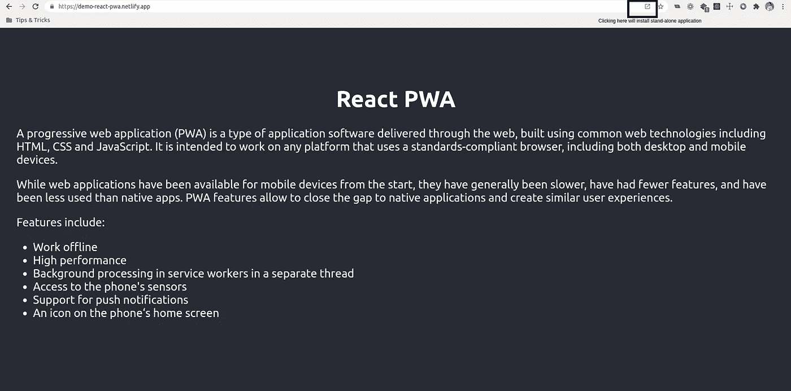
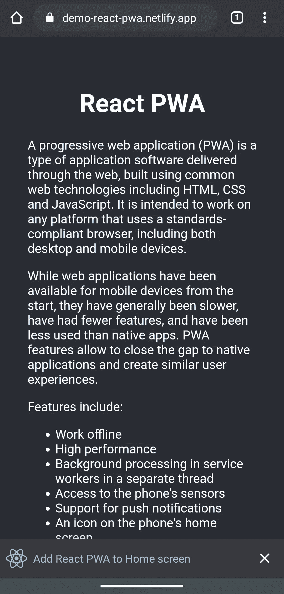

# 2020 年渐进式网络应用的状态

> 原文：<https://javascript.plainenglish.io/progressive-web-apps-in-2020-2691966ab7d9?source=collection_archive---------6----------------------->

## 了解有关“为什么”和“如何”构建渐进式 Web 应用程序的更多信息


Photo by [Balázs Kétyi](https://unsplash.com/@balazsketyi?utm_source=unsplash&utm_medium=referral&utm_content=creditCopyText) on [Unsplash](https://unsplash.com/s/photos/webp-application?utm_source=unsplash&utm_medium=referral&utm_content=creditCopyText)

Progressive Web Apps 简称为 *PWA* 是新一代的 Web 应用，它提供了类似原生应用的用户体验。PWA 是使用现代浏览器 API 构建的应用程序，通过单一代码库向任何人、任何地方和任何设备提供增强的用户体验。

根据谷歌开发者的定义，*渐进式网络应用使用现代网络功能来提供类似应用的用户体验。它们从浏览器标签中的页面演变成身临其境的顶级应用，时刻保持着网络的低摩擦。*

# 为什么我们需要 PWA

企业建立 PWA 有很多原因。在开始解释原因之前，让我们先来看看一些统计数据:

1.  随着移动设备的进步和功能的增加，大约 70–75%的人更喜欢在手机上浏览
2.  大多数人会在最多 2 秒钟内等待网页加载，否则他们会失去兴趣，最终可能会离开网站
3.  随着原生应用程序的体积越来越大，人们避免在手机上下载原生应用程序

这些统计数据证明，应用程序需要在任何设备上更快地加载，并且理想情况下应该在用户的设备上消耗更少的空间。PWAs 有助于克服上述问题，并提供以下优势:

*   具有较短的加载时间，并且可以在没有网络连接的情况下运行。它们是可安装的，即使在较低的网络带宽下也能顺利工作
*   在所有跨平台设备上工作。开发人员只需构建一个打包的应用程序，就可以在 web、移动等多种渠道上部署。提供一致的用户体验
*   它们建立在网络之上，因此这些应用程序中的所有内容都是可索引的，并像普通的网络应用程序一样获得 SEO 的好处
*   通过发送推送通知来吸引用户
*   可以从他们的主屏幕上轻松安装和访问

# PWA 与本机应用程序

*   原生应用可以从特定平台的应用商店安装，而 pwa 可以从移动浏览器本身下载并添加到主屏幕。
*   原生应用程序是根据设备结构专门设计的，而 pwa 主要看起来像网站的响应视图。
*   大多数本机应用程序在离线环境中无法运行，而 pwa 在使用缓存数据的离线环境中运行良好。

# 如何构建 PWA

在构建实际的 PWA 之前，我们必须确定构建 PWA 所需的关键要素。

## PWA 的关键要素

*   **安全环境** —这是一个满足某些最低认证和保密标准的窗口。通过安全环境传输的网络应用给用户带来了信任感。
*   **服务人员** —这些是由浏览器在后台执行的脚本。在服务人员的帮助下，开发人员可以创建速度极快的网页，并且可以在脱机环境下工作。它们提供推送通知和后台同步等功能。
*   **清单文件** —包含应用程序元数据的文件，如应用程序的名称、开始 URL 和图标。这是一个 *JSON* 文件，它控制应用程序的外观，并确保它们可以被搜索引擎索引。

## 建筑公共工程部

我们将为 React 应用程序创建 PWA，因此我们将首先使用[*create-React-app*](https://create-react-app.dev/)*设置 React 应用程序。*为了快速设置，您可以使用 PWA 可用的预定义模板创建 React 应用程序。使用预定义模板的主要好处是，使用离线缓存等功能所需的依赖项将被自动添加。将自动添加 PWA 所需的文件，如 *manifest.json* 和 *service-worker.js* 。执行以下命令创建 React 应用程序:

```
create-react-app your-app-name --template cra-template-pwa
```

安装样板应用程序后，我们可以检查 *public* 目录下 *manifest.json* 文件的内容。

在 *manifest.json* 文件中定义的每个属性都有重要的用途。

*   **short_name** —在桌面或手机上安装 app 时显示的名称
*   **名称** —应用的实际名称
*   **图标** —包含收藏夹图标和闪屏图标
*   **start_url** —定义“添加”按钮可用的路径

您可以执行以下命令来生成生产版本:

```
npm run build
```

当您在本地服务器上部署此版本并访问页面时，“安装”按钮仍然不可见。这是因为应用程序已经定义了服务人员，但默认情况下他们没有注册，所以您需要注册服务人员。您可以通过调用 register()方法来注册服务工作器。

The service worker is registered here

注册服务工作者后，您可以再次生成生产构建，并将其部署到任何本地服务器。

PWAs 在安全上下文和*localhost*URL 上运行，因此为了在生产中验证该应用，您可以将它部署在任何支持 HTTPS 的平台上，如 [*netlify*](https://www.netlify.com/) *。*

成功激活服务人员后，您将在访问页面时看到“安装”按钮。点击它将在您的设备主屏幕上安装 PWA。



Installing PWA on desktop



Installing PWA on mobile

当您离线并再次访问该页面时，应用程序将从缓存的资源中加载，而不会看到任何网络连接错误。🚀

完整的源代码可以在[这里](https://github.com/pmehta-18/react-pwa)获得。
现场试玩:[https://demo-react-pwa.netlify.app/](https://demo-react-pwa.netlify.app/)

## 参考

*   [https://developers . Google . com/web/updates/2015/12/getting-started-pwa](https://developers.google.com/web/updates/2015/12/getting-started-pwa)
*   [https://developer . Mozilla . org/en-US/docs/Web/Progressive _ Web _ apps](https://developer.mozilla.org/en-US/docs/Web/Progressive_web_apps)
*   [https://TechCrunch . com/2017/08/25/大多数美国消费者每月仍无应用下载量——comscore/](https://techcrunch.com/2017/08/25/majority-of-u-s-consumers-still-download-zero-apps-per-month-says-comscore/)
*   [https://www.entrepreneur.com/article/281986](https://www.entrepreneur.com/article/281986)
*   [https://docs . Google . com/presentation/d/18 iodaivmsrdsqenwvjl _ eaewhqbgfujfwaemowz 5 djc/edit # slide = id . p33](https://docs.google.com/presentation/d/18IOdAivMSRDsqEnwvJL_eaEWhqBgFUjFWEamoWZ5djc/edit#slide=id.p33)

这都是关于 PWA 的人！请在评论中分享你所看到的 PWA 的好处。😄编码快乐！👩‍💻