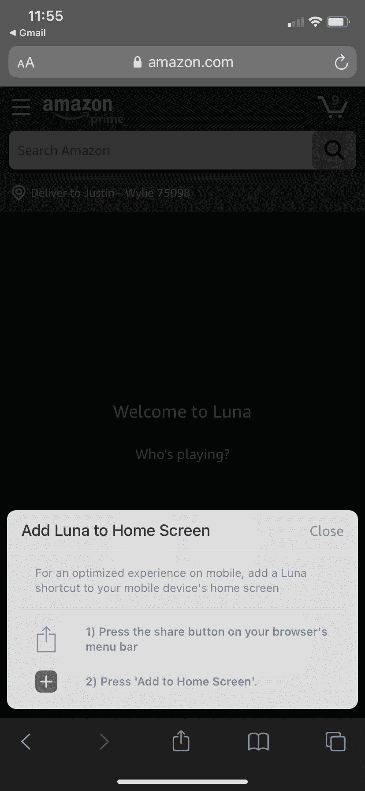

# 为什么渐进式网络应用会拯救开放的网络

> 原文：<https://javascript.plainenglish.io/progressive-web-apps-will-save-the-open-web-a292094bc101?source=collection_archive---------1----------------------->

## 没有足够的人知道[**Progressive Web app**](https://web.dev/tags/progressive-web-apps/)(PWAs)的力量

每当我向朋友(包括开发人员朋友)提出这个概念时，他们往往不明白 PWA 的好处是什么，也不明白为什么任何用户会使用 PWA 而不是他们熟悉和喜欢(或者讨厌)的传统网络浏览器。

关于 pwa 的困惑，我有很多答案，但我想尝试用一些实例来解释为什么我认为 pwa 会拯救开放的网络，即使我们看到有围墙的花园一天比一天高。

# 反竞争行为案例研究

你可能听说过史诗游戏和苹果在法庭上展开的“史诗”之战。如果没有，t1；dr is Epic Games 不再希望向苹果支付从购买 iOS 设备游戏货币的玩家那里获得的 30%的收益。Epic 在 iOS 上发布了一个游戏内支付系统，绕过了苹果的支付系统，很有可能，他们被禁止了。他们在安卓设备上也做了同样的事情，随后他们也被禁止在安卓上使用。Epic 以禁令为跳板，对谷歌和苹果提起反垄断诉讼。

这个案例研究不是关于你是否和 Epic 站在一起，和苹果站在一起，或者站在角落里捻弄你的拇指。这是一个反竞争行为及其对网络影响的例证。苹果是一个有围墙的花园。这是无可争议的。这是一个被标榜为方便、安全和可用性的事实。你的 iOS 设备或 iPad 不属于你，因为你不能在上面安装任何你想要的东西。您只能安装苹果公司说您可以安装的东西。

像这样有围墙的花园的保护性有一些道理。几十年来，苹果一直以其稳定性和无病毒著称。然而，这种稳定和安全是有代价的。当在应用程序中为您在手机或 iPad 上使用的软件付款时，您可能不会得到最好的交易。当然，应用程序会在原本收取的费用上附加一个百分比，以帮助抵消苹果提取的费用。那些不再受苹果支持的旧苹果设备呢？那些完好无损的 iPads 是在垃圾堆里还是在你的垃圾抽屉里？在一个开放的生态系统中，在一个开放的网络世界中，一个设备的年龄与它是否可以被使用，是否可以安装新的软件没有关系。

所以，如果你愿意，在史诗与苹果的战斗中站在哪一边，但重点不在于那一场特定的战斗。重点在于一个封闭的网络(毫无疑问，手机和平板电脑上的本地应用程序是新网络的一部分)给普通人带来的更广泛的问题。

# pwa 如何解决这个问题

渐进式网络应用，就其核心而言，只不过是网络应用。它们是通过传统的桌面浏览器或移动浏览器访问的应用程序。然而，PWAs 提供了比传统体验更多的东西。

PWAs 在你的手机或平板电脑的主屏幕上提供了一个位置。他们提供了一个生活在便利层中的机会，只需在主屏幕上简单点击一下，就可以获得一个应用程序。PWAs 还提供了一个机会，让为网络构建的应用程序出现在你的桌面和 MAC 的开始菜单或 dock 中。

web 应用程序可以像本地应用程序一样安装的提议令人兴奋，但这只是 PWAs 提供的潜力的皮毛。提供接近本机应用程序访问的 API 非常强大，可以创建与本机应用程序没有区别的体验。推送通知、文件系统访问、闪屏、离线支持等功能都可以通过 PWAs 获得，就像使用原生应用一样。如果只是为了打开另一个标签页的选项，网络应用程序可能会让人分心。有了 PWAs，你就可以专注了。有了像全屏原生应用程序一样打开的 web 应用程序，您可以专注于您想要做的事情。这有利于用户，但也有利于应用开发者，因为他们的用户不太可能很快离开。

pwa 提供的最大好处是它们的规避性质。除非苹果决定完全无视网络标准，否则他们无法阻止 PWAs 安装在用户的主屏幕上。苹果和谷歌不能对这些应用程序中的购物征收 30%的税。随着设备的老化，它们仍然可以通过从 App Store 和 Play Store 生态系统之外获得的新软件继续发挥作用。竞争可以恢复。

为了证明我的观点，我向您提供另一个小型案例研究:

**亚马逊 Luna**

亚马逊 Luna 是一项仍处于测试阶段的流媒体视频游戏服务。就像谷歌 Stadia 或 Nvidia GeForce Now 一样，Luna 为玩家提供了一个不错的游戏库，他们可以按月付费玩游戏。玩家不需要太担心他们设备的硬件性能，因为这些游戏从强大的远程机器直接传输到玩家的设备或计算机。

[**苹果拒绝允许**](https://www.theverge.com/2020/9/18/20912689/apple-cloud-gaming-streaming-xcloud-stadia-app-store-guidelines-rules) 流媒体游戏服务在 App Store 上线，除非提供商做出重大让步。因此，亚马逊 Luna 决定甚至不用担心必须提交给应用商店警察审查的原生 iOS 或 iPadOS 应用程序。相反，他们将服务构建为 PWA。

我在我的 iPhone 和 iPad 上安装了亚马逊 Luna PWA。点燃它的体验令人难以置信。感觉我是在推出传统的原生 app。然而，事实并非如此。它摆脱了 app store 法规的束缚。

Luna 甚至不是第一个竞争者，我预计会有很多公司提供 PWA 体验，这样他们作为公司，可以在他们的产品中有更多的灵活性，用户可以有更多的选择。自 9 月份以来，Nvidia GeForce Now 已经可以选择将他们的服务作为 PWA 安装在移动设备上。

流媒体游戏服务面临不适用于流媒体视频服务的规则，因此它们最终可能会成为 PWA 广泛采用的领导者。pwa 并不新鲜，许多大公司，包括谷歌(考虑到他们对 Epic 的禁令，这很奇怪)，星巴克，Pinterest 和 Twitter 都支持 pwa。

# 不利之处

PWAs 提供了一个全新的(也是非常古老的)机会世界，但这并不是说它们是完美的。pwa 有很大的权力。API 每个月都会变得更好，这意味着开发者可以越来越多地访问你的设备。

这意味着安全的责任从应用商店的审查者转移到了用户自己身上。这似乎是正确的权衡，但是随着 pwa 越来越受欢迎，肯定会有恶意的参与者，并且肯定会有用户成为这些参与者的受害者。

但是网络是一个主权和选择的地方。其中一部分是责任。如果人们从来没有机会学习如何保护自己，他们将永远感激别人。也许，艾滋病毒为人们提供了重新控制和真正学会如何保护自己的机会。

# 结论

我对未来的 PWAs 提议感到兴奋。包括移动应用在内的网络应该是开放的。应该是有竞争力的。尽管有 Facebooks、谷歌和苹果，网络可以保持开放，而 PWAs 将发挥作用。

*这篇文章首先出现在我的网站***上，所以一定要看看我在那里写的其他文章。**