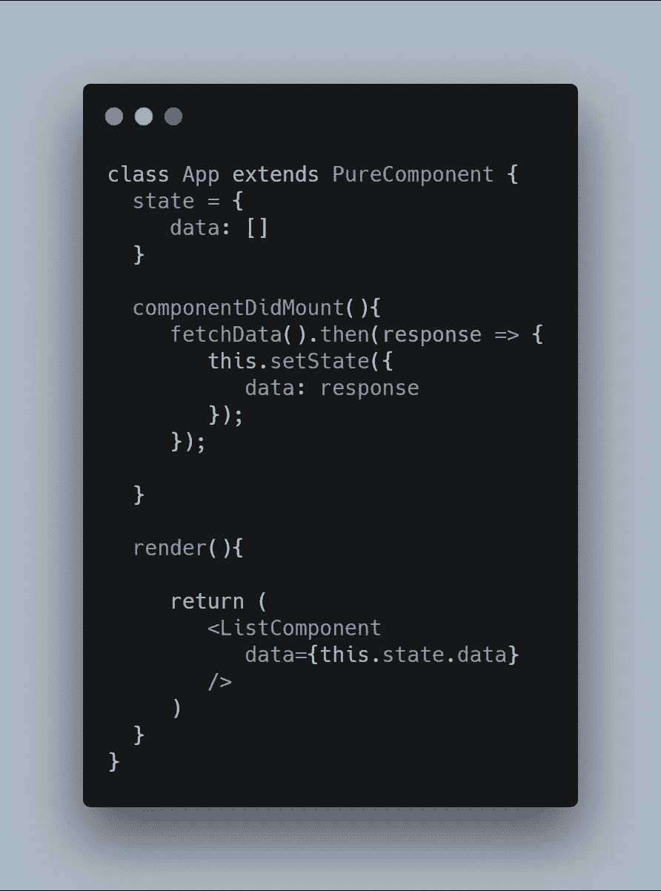
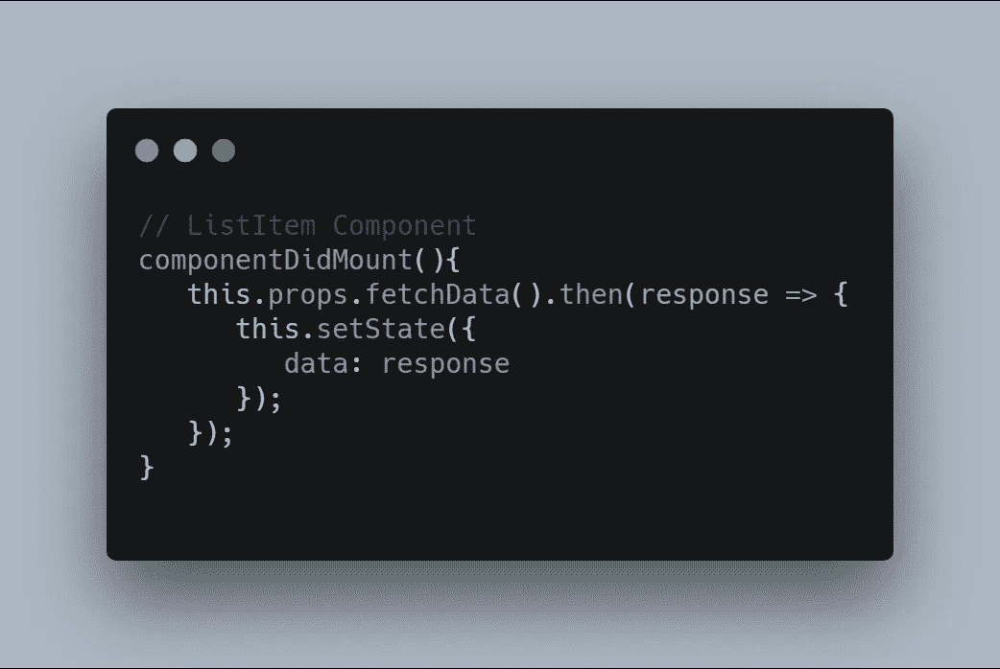

# React 中基于承诺的道具

> 原文：<https://javascript.plainenglish.io/promise-based-prop-in-react-78a77440f4fc?source=collection_archive---------0----------------------->

在 React 中，数据通过 props 在组件之间移动。这可以直接使用，也可以使用第三方库，如 Redux 或 Context API。但是，如果您试图将数据直接发送到子组件，则应该在父组件的状态变量中设置该数据，如下面的示例代码所示。

Sending data via props using state variable

## 那么这种方法有什么问题呢？

假设您正在创建一个通用组件来列出项目。该数据来自端点，而父组件对来自端点的所有数据不感兴趣。但是，您必须将所有数据保持在 App 组件的状态，以便通过 props 将其传递给 list 组件。这将产生无用的状态变量，可能导致状态变量膨胀。

## 发送基于承诺的道具

为了克服我上面提到的问题，我使用了一个基于承诺的道具。

Promise-based prop in ListItem component

*   定义一个具有 promise 返回类型的适当函数来获取 ListComponent (child)中的数据
*   调用 ListComponent 生命周期中 componentDidMount 函数
*   现在，您可以在应用程序组件中获取数据，并使用 response 解析 ListComponent 的 promise 函数。

如果这有点令人困惑，请查看我在 codesandbox 中创建的示例

Promise-based prop example

## 我得到了什么？

*   父组件中减少的状态变量
*   我只是在子组件中使用 componentDidMount 事件来获取数据

如果你喜欢我的文章，你可以鼓掌支持我，关注我。
我也在 [*linkedin*](http://www.linkedin.com/in/muratcatal) *上，欢迎所有邀请。*