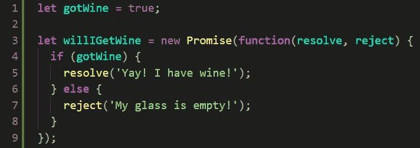

# JavaScript 中的承诺

> 原文：<https://javascript.plainenglish.io/promises-in-javascript-93390014bf79?source=collection_archive---------9----------------------->

# 什么是承诺？

在 JavaScript 中，就像在生活中一样，承诺是你希望在未来得到的东西，但不是现在。在 JavaScript 中，这个“某物”是带有附加值的本地对象类型。承诺处理异步时间内发生的事情。

# 真实世界的例子

为了理解承诺，我们先用一个真实世界的例子。假设你的伴侣去了商店，由于你辛苦工作了一整天，他或她答应给你买一瓶好酒。当你的伴侣在商店时，承诺是未解决的/待定的:直到他回来你才知道承诺的状态。从那里，总共有三种可能的结果专门关于这个承诺:1)你的伴侣成功地带着酒回来，并且解决/履行了承诺，2)你的伴侣忘记了酒，导致承诺被拒绝，以及 3)你的伴侣通过虫洞开车到另一个维度，并且酒的承诺永远是未解决的/未决的。与真实世界的承诺类似，JavaScript 承诺有 3 种状态:待定、已解决和已拒绝。

*   **未解决或待定** —承诺在尚未准备好时处于待定状态，可能是在等待结果值可用。
*   **已解决或已履行** —如果结果值可用，则承诺已解决。
*   **拒绝** —如果出现错误，承诺将被拒绝。

为了达到“已解决”或“已拒绝”状态，承诺必须经过“待定”状态。

States of a Promise in JavaScript

# 承诺创造

JavaScript 中的承诺是使用构造函数创建的。构造函数接受回调函数作为参数，回调函数又接受两个参数:resolve 和 reject，这两个参数又接受一个参数，这个参数可以是字符串、数字、布尔值、数组或对象。Resolve()和 reject()是 promise 固有的静态方法，因此也可以在创建 promise 时立即调用。承诺还有其他静态方法:

*   all()-根据 NearForm(2019)，all“接受一组承诺并返回一个承诺，该承诺要么在 iterable 参数中的所有承诺都实现时实现，要么在其中一个承诺拒绝时拒绝。如果返回的承诺实现了，那么它将按照 array 参数中定义的顺序，用一个由已实现承诺的值组成的数组来实现。如果返回的承诺被拒绝，它将被拒绝，原因来自被拒绝的数组中的第一个承诺。这种方法可用于汇总多个承诺的结果。”
*   全部结算()
*   race()-根据 NearForm(2019)，race()，“接受一组承诺，并以与 Promise.all 相同的方式执行它们，不同之处在于，它返回一个承诺，只要*iterable 中的一个*承诺满足或拒绝，该承诺就会满足或拒绝，并带有该承诺的值或原因。”—对超时功能有用

Promise Constructor Function

Promise States

# 承诺消费

既然我们已经完成了承诺创造，我们需要谈谈承诺消费。通过对承诺调用以下方法之一来冲减承诺:

*   然后()
*   catch()
*   最后()

然后，该方法()接受两个参数:第一个参数是解析承诺时调用的函数，第二个参数是拒绝承诺时调用的函数。如果您想区分成功和失败，可以使用 catch()方法将拒绝处理程序附加到承诺中。finally()方法可以随意使用，它通常执行一般的清理操作，比如使加载指示器停止运行。

# 承诺链

为了使用上述方法，他们必须遵守诺言。附加承诺也可以链接到原始承诺，如下例所示，其中承诺 shareWine 链接到原始 willIGetWine 承诺。随后，另一个 then 方法和 catch 方法被链接起来，以处理第二个承诺的实现和拒绝。

Chaining Promises & Promise Methods

# 承诺用途

链接承诺允许您避免众所周知的“回调地狱”,这是处理多个异步操作的更神秘的方法。可以使用 promises，而不是下面看到的嵌套回调函数的噩梦，每个回调函数都可以用. then()语句替换。

Callback Hell

# 常见错误

*   嵌套承诺—使用 all()
*   破碎的承诺链
*   在承诺链中混合同步和异步代码
*   漏接
*   忘记兑现承诺
*   允诺的同步代码
*   混合承诺和异步/等待
*   返回承诺的异步函数
*   将回调定义为异步函数

# 结论

承诺是有用的结构，它不仅允许您避免代码中不必要的异步过程的复杂性，而且使您的代码更加易读。

# **简明英语团队的一份说明**

你知道我们有四份出版物和一个 YouTube 频道吗？你可以在我们的主页 [**plainenglish.io**](https://plainenglish.io/) 上找到所有这些——关注我们的出版物并 [**订阅我们的 YouTube 频道**](https://www.youtube.com/channel/UCtipWUghju290NWcn8jhyAw) **来表达你的爱吧！**

# 参考

 [## Javascript 承诺——权威指南

### JavaScript 的单线程、基于事件循环的并发模型使用所谓的…

www.nearform.com](https://www.nearform.com/blog/javascript-promises-the-definitive-guide/)  [## 用 JavaScript promises 改进异步编程

### 如果您以前编写过一些异步 JavaScript 代码，那么您已经对使用回调和…

blog.logrocket.com](https://blog.logrocket.com/improve-async-programming-with-javascript-promises-1652ac8d036d/)  [## 利用承诺

### 是表示异步操作最终完成或失败的对象。既然大多数人都是…

developer.mozilla.org](https://developer.mozilla.org/en-US/docs/Web/JavaScript/Guide/Using_promises)  [## 承诺

### Promise 对象表示异步操作的最终完成(或失败),及其结果…

developer.mozilla.org](https://developer.mozilla.org/en-US/docs/Web/JavaScript/Reference/Global_Objects/Promise)  [## 在 Javascript 代码中使用承诺的 6 种方式

### 在创建这个之前，我没有想到会有这么多不同的方法来创建一个承诺。我想这是…

blog.bitsrc.io](https://blog.bitsrc.io/6-ways-to-implement-a-promise-in-javascript-9238aec9c17b)  [## 承诺

### 想象一下，你是一名顶级歌手，粉丝们日夜询问你即将推出的单曲。为了得到一些解脱，你答应…

javascript.info](https://javascript.info/promise-basics)  [## JavaScript 承诺的权威指南

### 总结:在本教程中，您将了解 JavaScript 承诺，它们是什么，以及如何有效地使用它们。在…

www.javascripttutorial.net](https://www.javascripttutorial.net/es6/javascript-promises/)  [## 让我们谈谈 JavaScript 的承诺

### 什么是承诺，为什么我们要使用它们？

blog.vanila.io](https://blog.vanila.io/lets-talk-about-javascript-promises-be6cbd44a2da)