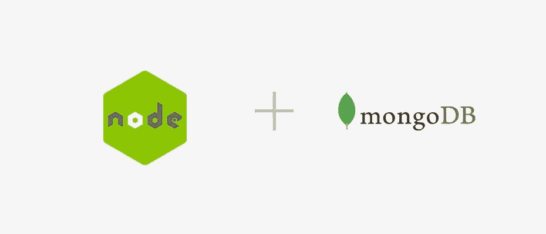

# 连接 MongoDb — NodeJs 的正确方式

> 原文：<https://javascript.plainenglish.io/proper-way-to-connect-mongodb-nodejs-db2eabf83f99?source=collection_archive---------7----------------------->



嘿伙计们！我想问你一个问题。一个应用的主要是什么？如你所想，什么都有可能。实际上，应用程序的目标定义了这一点。因此我会问你一个更具体的问题。如果一个应用程序是为了执行繁重的 CRUD 操作而构建的，那么它的主要功能是什么？

在这种情况下，数据库是该应用程序的主要部分。我让你明白了，对吗？大多数应用程序、微服务、cronjobs 等。在它们的生命周期中进行 CRUD 操作。我在伊斯坦布尔做全栈软件工程师，写过大量的 CRUD 操作。最后，我在 NodeJs 中找到了连接 MongoDb 的合适方法(当然是用 Mongoose。).在我们深入研究这个问题之前，我们需要做几件事情。

# 我们需要什么？

正如标题所说，我们需要

*   NodeJs LTS — 10^
*   MongoDb
*   码头工人
*   Visual Studio 代码(带有可爱的 Lexcuim 黑色主题)

我想这些是目前的需要。让我们用它们来完成我们的使命。

# 准备开始

首先，我们需要安装 NodeJs。在另一个选项卡中打开此链接，下载 NodeJs 的 LTS 版本。

然后我们需要准备 MongoDb。因此我们需要在我们的机器上安装 Docker，因为这是管理 MongoDb 的简单方法。安装完成后，打开此链接下载 Docker 并运行下面的代码。

```
docker run -d  --name mongoDb  -p 27888:27017 mongo
```

如果你不想安装 Docker，我们可以简单地使用 MongoDb Atlas。打开此链接创建一个帐户。

# 好了，我们准备好出发了！

按照以下步骤创建一个环境

*   创建要工作的空文件夹

```
mkdir connect-mongo && cd connect-mongo
```

*   初始化一个 nodeJs 项目，`-y`将跳过这个表单。

```
npm init -y
```

*   创建 index.js

```
touch index.js
```

*   编辑 package.json，如图所示

```
{
  "name": "connect-mongo",
  "version": "0.0.0",
  "private": true,
  "scripts": {
    "start": "node index",
  },
  "dependencies": {},
  "devDependencies": {}
}
```

*   安装依赖项

```
npm install --save mongoose lodash
```

*   打开`index.js`，让我们定义依赖关系和我们的功能

```
const mongoose = require('mongoose');
const _ = require('lodash');const clients = {};
let connectionTimeout;module.exports.init = () => {};module.exports.closeConnections = () => {};module.exports.getClients = () => {};
```

*   好了，我们定义了函数，让我们填充它们。首先，我们需要创建一个连接实例。我们这样做是因为将来我们可能需要第二次或第三次连接到另一个 mongoDb 数据库。不要问为什么，你最终会遇到这个问题。

```
module.exports.init = () => {
		const mongoInstance = mongoose.createConnection('mongodb://...', {
        useNewUrlParser: true,
        keepAlive: true,
        autoReconnect: true,
        reconnectTries: 3,
        reconnectInterval: 5000,
    }); clients.mongoInstance = mongoInstance;
};
```

*   我们用 Mongoose 创建了我们的 mongoDb 连接，我将解释为什么我们传递这些选项。我们还将该连接保存在一个对象中，以便以后导入和使用。
*   `keepAlive: true`，如果你的应用会运行很长时间。如果您使用 mongoose^5.2.0，默认情况下是这样的
*   `autoReconnect: true`，如果连接中断，mongoose 会尝试连接而不是抛出错误。我们将手动处理这一功能。
*   `reconnectTries: number`，定义了猫鼬应该尝试连接多少次，
*   `reconnectInterval: number`(毫秒)，定义猫鼬需要多少毫秒建立连接。

一些事件将根据连接的状态被触发。最好是听他们采取行动。因为这个模块将管理整个连接流。我们需要知道任何中断或连接丢失。让我们看看这些事件是什么。

*   `connected`，连接成功后触发
*   `disconnected`，连接断开时触发
*   `reconnected`，重新连接成功后被解雇
*   `close`，由你关闭连接后触发

现在让我们添加一个事件监听器，我改变了下面的`init()`函数并添加了处理程序。在开发 NodeJs 应用程序时，我更喜欢 RO-RO(接收对象-返回对象)方法。因为它提高了代码的可读性。

```
function instanceEventListeners({ conn }) {
    conn.on('connected', () => {
        console.log('Database - Connection status: connected');
    }); conn.on('disconnected', () => {
        console.log('Database - Connection status: disconnected');
    }); conn.on('reconnected', () => {
        console.log('Database - Connection status: reconnected');
    }); conn.on('close', () => {
        console.log('Database - Connection status: close ');
    });
}module.exports.init = () => {
    const mongoInstance = mongoose.createConnection(config.DATABASE.HOST, {
        useNewUrlParser: true,
        keepAlive: true,
        autoReconnect: true,
        reconnectTries: 3,
        reconnectInterval: 5000,
    }); clients.mongoInstance = mongoInstance;
    instanceEventListeners({ conn: mongoInstance });
};
```

现在怎么办？正如我上面所说，我们将自己处理重新连接程序。按照下面的代码，我只是简单地添加了一个超时功能。就我而言，我可以忍受很少的连接中断。我的意思是，只要它在一定的时间内重新连接，失去连接是可以的吗？

让我们添加超时函数来看看它是如何工作的，

```
function throwTimeoutError() {
    connectionTimeout = setTimeout(() => {
        throw new DatabaseError();
    }, 16000); // (reconnectTries * reconnectInterval) + buffer
}function instanceEventListeners({ conn }) {
    conn.on('connected', () => {
        console.log('Database - Connection status: connected');
				clearTimeout(connectionTimeout);
    }); conn.on('disconnected', () => {
        console.log('Database - Connection status: disconnected');
				throwTimeoutError();
    }); conn.on('reconnected', () => {
        console.log('Database - Connection status: reconnected');
				clearTimeout(connectionTimeout);
    }); conn.on('close', () => {
        console.log('Database - Connection status: close ');
				clearTimeout(connectionTimeout);
    });
}module.exports.init = () => {
    const mongoInstance = mongoose.createConnection(config.DATABASE.HOST, {
        useNewUrlParser: true,
        keepAlive: true,
        autoReconnect: true,
        reconnectTries: 3,
        reconnectInterval: 5000,
    }); clients.mongoInstance = mongoInstance;
    instanceEventListeners({ conn: mongoInstance });
};
```

啊哈，我们成功了！我们现在有什么？我们来分解一下，

*   我们将 connectionTimeout 定义为 null，因为我们希望在断开连接的特定事件触发时开始超时，
*   当我们得到一个`disconnected`事件时，超时将开始，然后重新连接过程将根据我们定义的值尝试重新连接。这里的数学很简单，将重新连接间隔乘以重新连接尝试，然后用小缓冲区求和，找到完美的超时值。当猫鼬尝试连接时，会记录时间。如果连接再次建立，我们需要清除超时，因为我们不想在此之后抛出错误。顺便说一下，当 connectionTimeout 设置为 null 或 undefined 时，`clearTimeout`不会产生任何影响。

我们留了一些好吃的，让我们把它们装满。我想管理关闭连接的流程，如何管理打开的流程。因为如果您在 Kubernetes 中运行应用程序，优雅地关闭应用程序总是最佳实践。

```
module.exports.closeConnections = () => _.forOwn(clients, (conn) => conn.close());
```

*   `forOwn()`将循环对象键，而每一个连接我们只是简单地称之为`close()`

利用关系怎么样？让我们添加它，我们就完成了！

```
module.exports.getClients = () => clients;
```

使用功能块，您可以导入和使用您创建的连接。

# 最后

我们到达了终点，为自己创建了一个漂亮的 Mongoose 连接处理程序。这是我们找到的最适合我们微服务的方式。处理连接状态并了解发生了什么将会提高您的服务质量。

TL；DR；[链接](https://github.com/ErenYatkin/microservice-base/blob/master/loaders/database.js)

对于[全码结账这个链接](https://github.com/ErenYatkin/microservice-base/blob/master/loaders/database.js)，

对于[介绍码头工人结账这个环节](https://medium.com/faun/the-best-docker-introduction-8b518b6f0b05)，

对于[滚装进场检验环节](https://www.freecodecamp.org/news/elegant-patterns-in-modern-javascript-roro-be01e7669cbd/)，

下次见，保持冷静！

喜欢这篇文章吗？如果有，通过 [**订阅获取更多类似内容解码，我们的 YouTube 频道**](https://www.youtube.com/channel/UCtipWUghju290NWcn8jhyAw) **！**