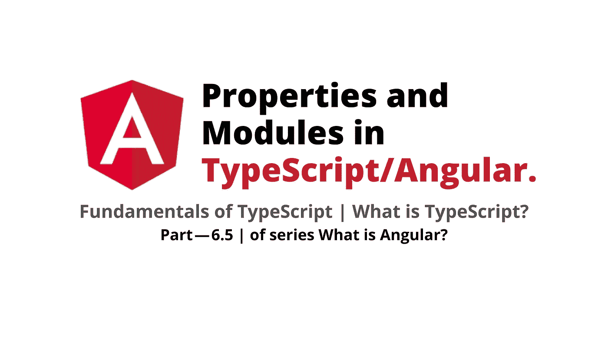
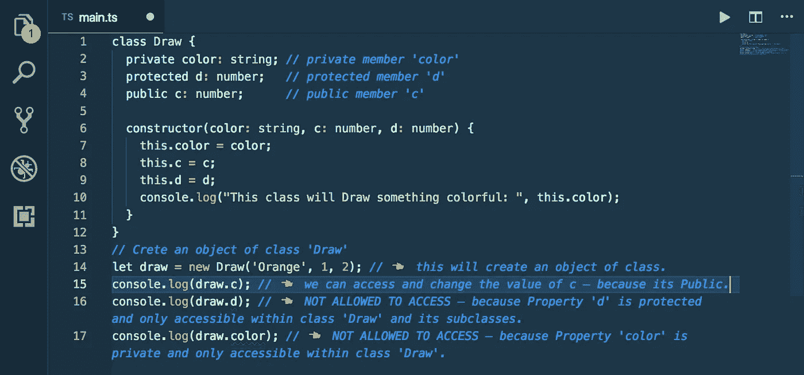
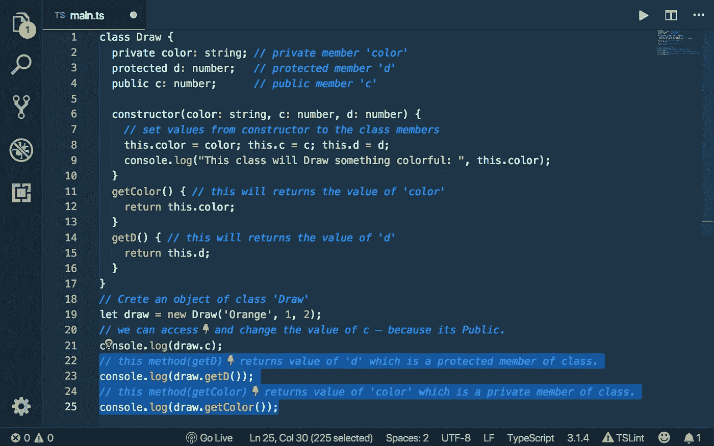
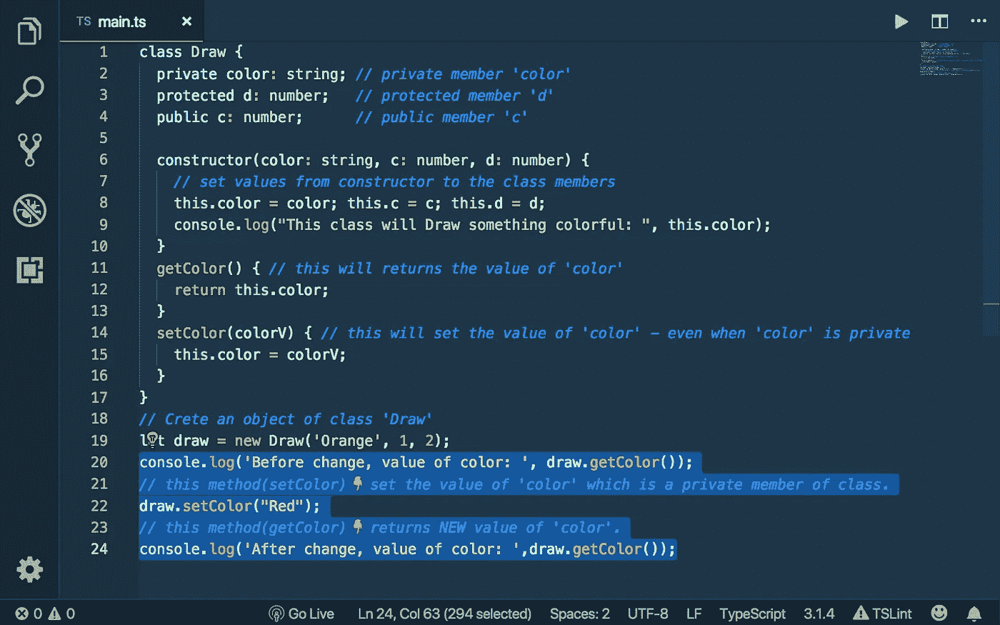
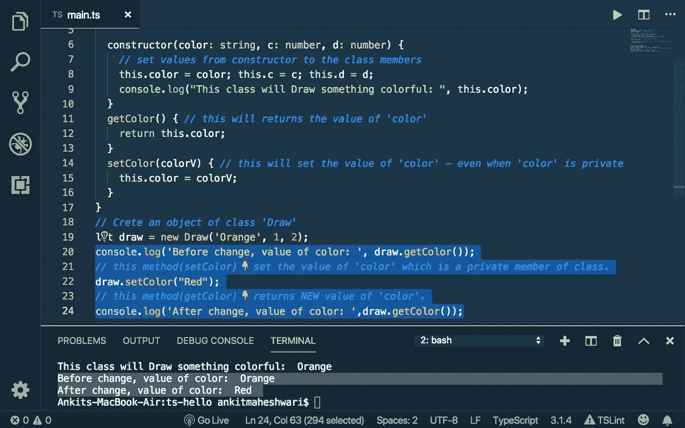
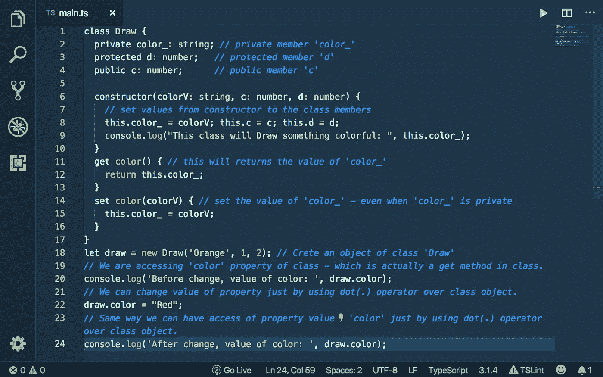
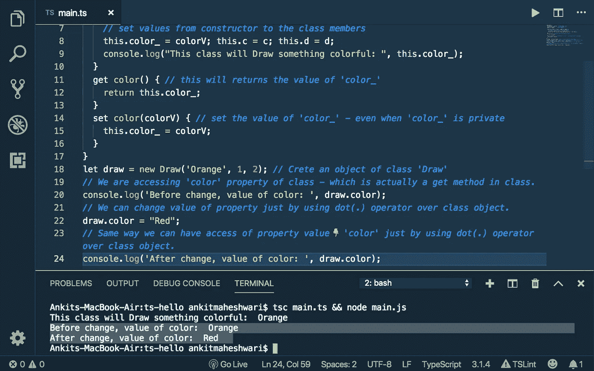
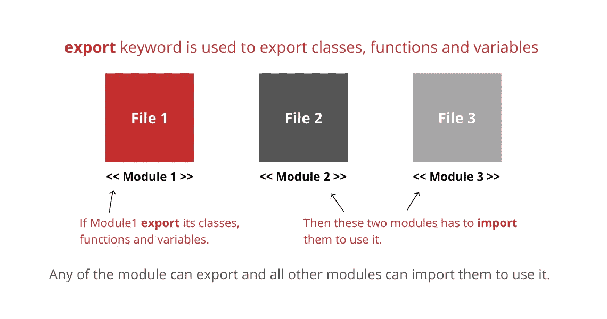
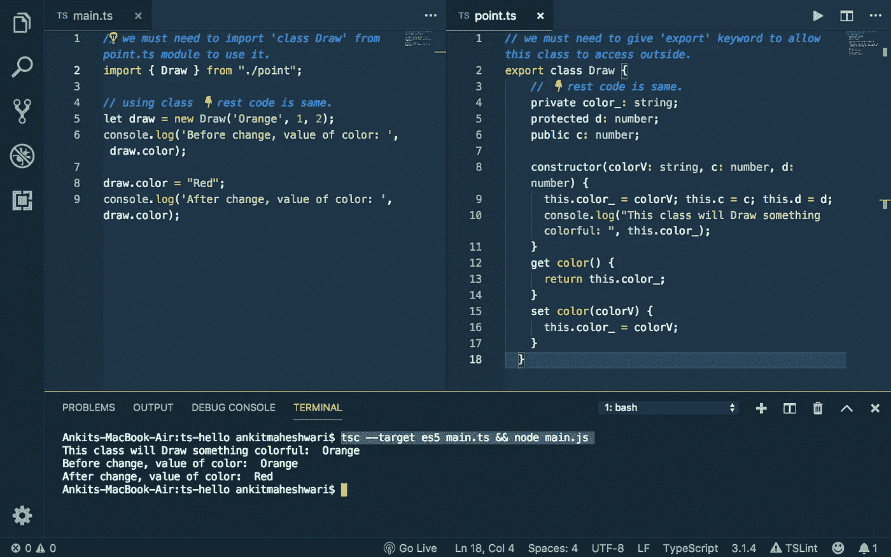

# TypeScript/Angular 中的属性和模块

> 原文：<https://javascript.plainenglish.io/properties-and-modules-in-typescript-angular-a86ee23f12aa?source=collection_archive---------3----------------------->

## 什么是 Angular(第 6.5 部分)/什么是 TypeScript？

工作原理… |如何开始…

> 如果*您还没有涉及到本系列的* [*部分— 6.4*](https://medium.com/@AnkitMaheshwariIn/constructors-and-access-modifiers-in-typescript-22a2d6188780) *，我推荐您查看这个链接→*[TypeScript](https://medium.com/@AnkitMaheshwariIn/constructors-and-access-modifiers-in-typescript-22a2d6188780)中的构造函数和访问修饰符



# 打字稿基础👇

1.  键入注释
2.  箭头功能
3.  接口
4.  班级
5.  构造器
6.  访问修饰符
7.  **属性**
8.  **模块**

# 6.5 属性

根据我们之前的学习和理解，我们不能使用类对象*访问类外部的`private`和`protected`成员，请看下面的*👇第 16 行和第 17 行有一个无效代码



`Try this code yourself to see the output!`

那么，如何接触到班外的`private`和`protected`成员呢？

```
**Properties** allow us to access private members outside of the class using get keyword and set keyword OR getter() and setter() methods. To understand how — look down the code below...👇
```

⭐️使用`getColor()`和`getD()`方法**我们可以访问** `**private**` **和** `**protected**` **类的成员**—*请看下面的*👇在第 23 和 25 行



`Try this code yourself to see the output!`

⭐️同样使用`setColor()`方法**我们可以改变中** `**private**` **成员**的值(**对** `**protected**` **成员同样适用)——*请看下面的*👇在第 22 行**

注意:`try this code yourself to see the output!`

*   我们已经从构造函数*初始化了`color`到`'Orange'`的值，请看下面的*👇在第 19 行
*   然后使用`draw.setColor("Red")`方法更新`color`的值— *见下面的*👇在第 22 行
*   现在，`draw.getColor()`将返回颜色的更新值`"Red"`—*请看下面的*👇在第 24 行



`Try this code yourself to see the output!`

```
Running the code... look down in terminal below👇 — the initial value of color (before change) and value after change.
```



`Try this code yourself to see the output!`

> 至此，我们创建了一个`get`和`set`方法来访问和修改类的私有和受保护成员。现在，让我们使用属性做同样的事情…

# ⭐️使用属性

通过替换`getter()`和`setter()`方法，修改代码以使用`Properties by using get keyword and set keyword`。

属性在类外看起来像一个字段，但在类内它是一个方法。——*往下看*👇*修改后的代码。*

*(注意:我们不能对类字段和属性名称使用相同的名称，这就是我们将* `*color_*` *声明为类字段，将* `*color*` *声明为类属性的原因。)*



`Try this code yourself to see the output!`

```
Running the code... Note*👇*
```

*   我们通过使用属性`color` — *来获取`color_`字段的值，请看下面👇在第 20 和 24 行。同时查看第 11 行*，它返回`color_`的值。
*   我们正在使用属性`color` — *更新`color_`字段中的值，请看下面👇在 22 号线。同时查看第 14 行*，它实际上是在设置`color_`的值。



`Try this code yourself to see the output!`

这是关于`Properties`的，接下来是`Modules`👇

# 6.5 模块

理解大型程序的场景——有数千行代码和数百个类，在这种情况下，在一个文件中管理所有内容变得非常困难`main.ts`

```
So, we must need to divide our large program into multiple files **— thus we use Modules** to divide our code for better readability, understandability and maintainability**.**
```



*   在 TypeScript 中，每个`.ts`文件都是一个模块——它的类中有`export`关键字。
*   为了创建一个模块，我们将`code of class Draw`从`main.ts`文件中移除并移入`point.ts`文件。看下面👇代码(在所附图片中)
*   我们必须给出`export`关键字来允许这个类`Draw`访问`point.ts`文件之外的内容。
*   然后我们首先需要在我们的`main.ts`文件中导入模块类`Draw`来使用它。
*   为了导入模块，我们使用`import`和`from`关键字。

# 如何导入模块？

```
import { Draw } from "./point";
```

👉在花括号内的`import`之后，我们可以给出多个由逗号分隔的类，在`from`关键字之后，我们将模块的`./`加名称放在引号中。`./`表示当前工作目录——因为文件`main.ts`和`point.ts`在同一个目录。

记住在你的命令中使用`--target es5`来去掉`error: Accessors are only available when targeting ECMAScript 5 and higher`。运行此代码的命令:

```
**tsc --target es5 main.ts && node main.js**
```

俯视👇实际代码和输出在终端下面。对代码的输出没有影响——我们只是使用模块来使我们的程序更简单。



Read comments and `Try this code yourself to see the output!`

> *之前要记住的事情👋👋*
> 
> ⭐️ `Declare properties by using get keyword and set keyword.` 属性在类外看起来像一个字段，但在内部它是类中的一个方法。
> 
> ⭐️ `**We use Modules** to divide large program into multiple files.`

这都是关于 TypeScript 的基础知识——下一部分再见👋👋

> 如果*您还没有涉及到本系列的* [*部分— 6.4*](https://medium.com/@AnkitMaheshwariIn/constructors-and-access-modifiers-in-typescript-22a2d6188780) *，我推荐您查看这个链接→*[TypeScript](https://medium.com/@AnkitMaheshwariIn/constructors-and-access-modifiers-in-typescript-22a2d6188780)中的构造函数和访问修饰符
> 
> 敬请期待第七集
> [https://medium.com/@AnkitMaheshwariIn](https://medium.com/@AnkitMaheshwariIn)

如果你不介意的话，给它一些掌声👏 👏既然有帮助，我会非常感谢:)帮助别人找到这篇文章，所以它可以帮助他们！

永远鼓掌…

