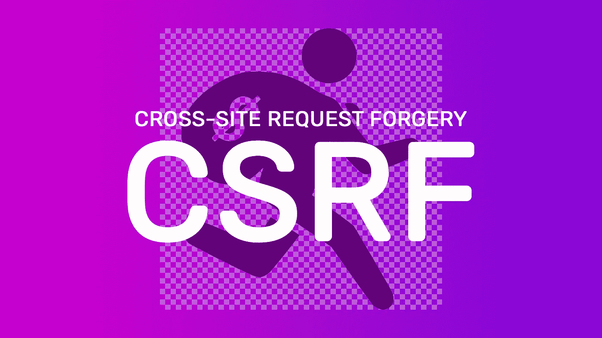
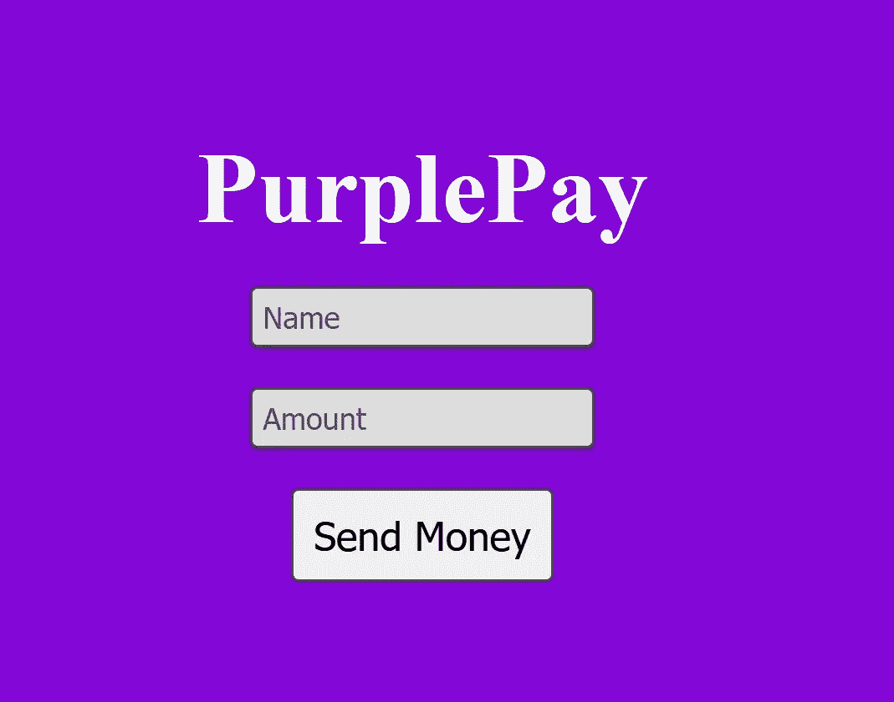
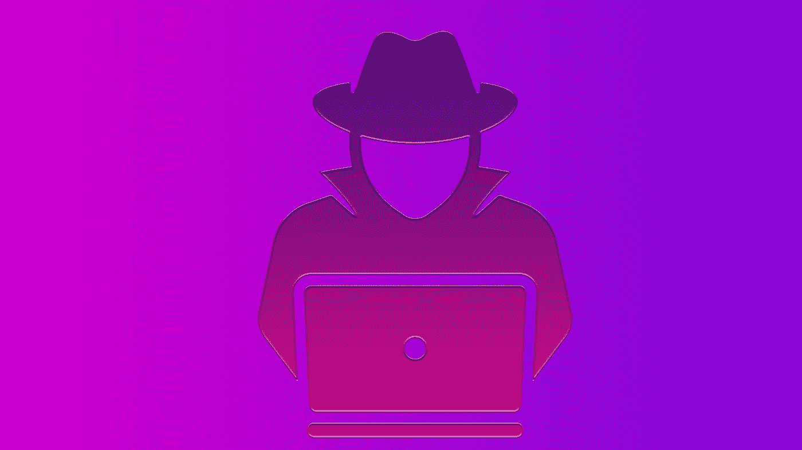
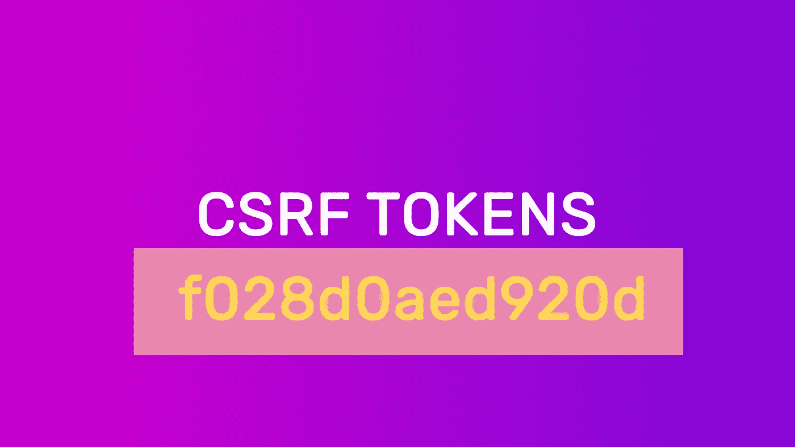

# 保护您的用户免受跨站点请求伪造(CSRF)

> 原文：<https://javascript.plainenglish.io/protect-your-users-from-cross-site-request-forgery-csrf-8b341b9beea2?source=collection_archive---------5----------------------->

## 类似“特洛伊木马”的攻击，可能会带来灾难性后果



黑客最有可能通过利用互联网协议的设计来成功危害用户帐户。在本文中，我将重点介绍 HTTP 的一个特性，它已经被证明也是一个缺点:cookies。

## **饼干可能是个负担，但它们非常有用**

是的，饼干超级有用。网站广泛利用 cookies 进行会话存储。一旦您登录到一个网站，服务器会发送一些会话 cookiess，您的 web 浏览器会在一段时间内记住这些 cookie。Cookies 极大地改善了用户体验。我的意思是，你能想象在一个网站上每个页面导航都要登录吗？

但是它们的有用性是以安全为代价的——它们使得一种最常见的 HTTP 攻击变得容易实现:跨站点请求伪造(CSRF)。让我们讨论一个假设的例子来说明 CSRF 袭击的危险。将使用一个名为 PurplePay 的虚拟支付处理器。

# CSRF 受害者示例:PurplePay



PurplePay 是一个简单的在线支付处理器，允许您向任何拥有 PurplePay 帐户的人汇款。在您登录 PurplePay 网站后，会显示上面的屏幕。这意味着当您登录时，PurplePay 会指示您的浏览器存储有关您成功认证尝试的会话 cookies。记住这一点，因为这对以后很重要。

PurplePay 的开发人员决定将上面显示的表单实现为一个接受姓名和金额(以美元为单位)的 **HTTP POST** 请求。如果我们放大表单提交并检查它的主体，它看起来会像这样:

```
POST [http://purplepay.com/send-money](http://purplepay.com/send-money){
    "name": "Bill Gates",
    "amount": 50
}
```

如前所述，浏览器将自动插入会话 cookie 和 POST 方法，PurplePay 将使用这些会话 cookie 来验证是哪个人发起了这个事务。这消除了未经授权的人执行交易的可能性。这似乎足够安全，对不对？

# 输入:CSRF·哈克



一名黑客偶然发现 PurplePay，并研究了`purplepay.com/send-money` POST 请求的消息格式。黑客意识到，除了会话 cookies，成功调用服务器上的`send-money`资源不需要其他任何东西。

由于 PurplePay 将会话 cookies 存储在用户的浏览器中，黑客意识到他可以创建一个钓鱼网站，该网站可以悄悄地向`purplepay.com/send-money.` 提交 POST 请求。

当页面加载时，`hacked.html` 页面会自动向`purplepay.com/send-money`发送 POST 请求。当浏览器准备发送 POST 请求时，它意识到已经有了一些用于 PurplePay 的 cookies，并决定自动将它们附加到请求中。

注意到什么不好的事情了吗？如果黑客能说服用户简单地加载那个网页，黑客就已经自动获得了用户 PurplePay 会话 cookies 的访问权。如果会话 cookies 仍然有效，那么黑客对`purplepay.com/send-money`的隐藏请求被认为是通过 PurplePay 认证的，黑客现在完全有能力将所有的钱从用户的账户中转出，而无需直接访问它！

这种强迫浏览器传递用来访问受限资源的存储 cookies 的方法被称为**跨站点请求伪造** (CSRF)。正如你现在所能想象的，如果不被发现和禁用，其规模和破坏可能是灾难性的。银行账户可能会被清空，信用卡可能会被盗，您可以在网上安全执行的任何其他操作都可能受到威胁。

# **保护自己免受 CSRF 的伤害**

幸运的是，通过一些被广泛接受的缓解措施，您可以继续使用 cookies 进行会话存储，而不用担心 CSRF 攻击。让我们来看看几个最流行的解决方案。

# (反)CSRF 代币



回想一下，CSRF 是可能的，因为服务器只检查会话 cookies 来验证请求。不幸的是，这被证明是不安全的，因为浏览器会自动传递它们。

一个简单而有效的解决方案是在服务器端生成一个加密令牌，在这里上下文命名为 **CSRF 令牌**。服务器会在需要表单提交(或任何其他 POST 请求交互)的页面上将令牌传递给客户机。**重要的是，服务器不要将这个令牌作为 cookie 传递，否则我们又回到了同样的情况。**

这样，每当客户端提交 POST 请求时，都必须提供 CSRF 令牌，通常包含在请求体中。服务器在会话 cookies 上验证 CSRF 令牌的真实性。

# **相同站点 cookie**


自从 CSRF 攻击出现以来，网络浏览器已经增加了安全机制，比如完全禁止跨源站点请求(CORS)。此外，服务器可以拒绝来自不同来源的请求。

同一个网站的 cookies 在对抗 CSRF 病毒攻击时也是以同样的方式工作的。当 cookies 被创建时，你可以限制它们只能是`SameSite`，这意味着如果一个请求是从一个单独的源发起的，浏览器将不会传递它们。这也可以提供一些针对 CSRF 攻击的安全性。

如果你想做更详细的阅读，维基百科有一个关于 CSRF 的很棒的条目:[https://en.wikipedia.org/wiki/Cross-site_request_forgery](https://en.wikipedia.org/wiki/Cross-site_request_forgery)