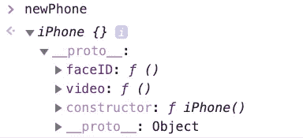

# JavaScript 中的 prototype 和 __proto__ 有什么区别？

> 原文：<https://javascript.plainenglish.io/proto-vs-prototype-in-js-140b9b9c8cd5?source=collection_archive---------1----------------------->

## 对这两个概念之间关系的解释。


# 所以你想知道，JavaScript 中所有的 __proto__ 和原型是怎么回事？

它们不是完全一样的吗？让我们找出答案。

## 原型的解释

苹果公司最近发布了新的 iPhone，iPhone 11。那部手机有某些特质——例如，Face ID 和 4K 的视频。生产的每一部 iPhone 11 都必须具有完全相同的功能。

现在，我们假设有一个构造函数，每次调用它都会产生一个新的 iPhone 11。为了正确地制造 iPhone 11，需要一个原型 T1——参考 iPhone 11 的模型。这个原型或模型确保了*每一部* iPhone 都有 Face ID，每一部 iPhone 都可以拍摄 4K 视频。因此，iPhone 构造者必须知道并能够访问它必须构建的原型。这是构造器的*原型*属性。

```
function iPhone() {}; // constructor// a method for recognizing faces
iPhone.prototype.faceID = function() { ... };// a method for taking 4k video
iPhone.prototype.video = function() { ... };let newPhone = new iPhone(); // an iPhone 11
```

到目前为止一切顺利，对吧？接下来我们进入 __proto__ 吧。

## __proto__ 与原型的关系

我现在制作了一个新的 iPhone 11，并将其保存在一个名为 newPhone 的变量中。newPhone 的内容如下所示:



The contents of a new iPhone instance.

所以看起来这款新的 iPhone 11 带有 FaceID 和视频！事实上，您可以执行 newPhone.faceID()或 newPhone.video()并看到这些方法工作正常。但是，为什么这些特性存储在一个名为 __proto__ 的对象中，而不直接存储为 newPhone 的属性呢？

__proto__ 是每个类*实例*中的一个对象，它指向创建它的原型。给你，新电话。__proto__ 是对 iPhone.prototype 的引用，因此也包含完全相同的内容。通过拥有与 iPhone.prototype 相同的 __proto__ 属性，newPhone 实际上是在说，“看，既然我是 iPhone 11，我就拥有与其他任何 iPhone 11 完全相同的功能！我有 Face ID，4K 的视频，你能说出来的。”

实际上，prototype 和 __proto__ 之间唯一真正的区别是前者是类构造函数的属性，而后者是类实例的属性。换句话说，虽然 iPhone.prototype 提供了构建 iPhone 的蓝图，但 newPhone。__proto__ 证实了 iPhone 确实是根据那个特定的蓝图制造的。但是对于这两个对象中的属性和方法，它们是完全一样的。

最后，您可能想知道最后一行中 __proto__: Object 的含义。那是因为新电话。__proto__ 实际上是一个 JavaScript 对象，JavaScript 对象也是根据特定的“蓝图”构建的。在这个例子中，newPhone。__proto__。__proto__ 指的是 Object.prototype，它是所有 JavaScript 对象所基于的原型或蓝图。也就这样了！