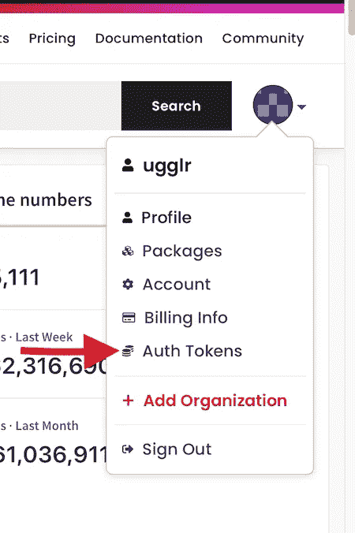
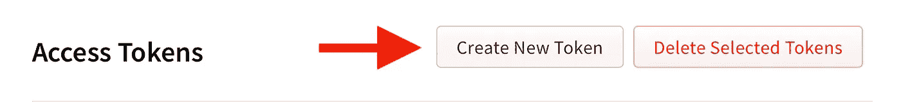
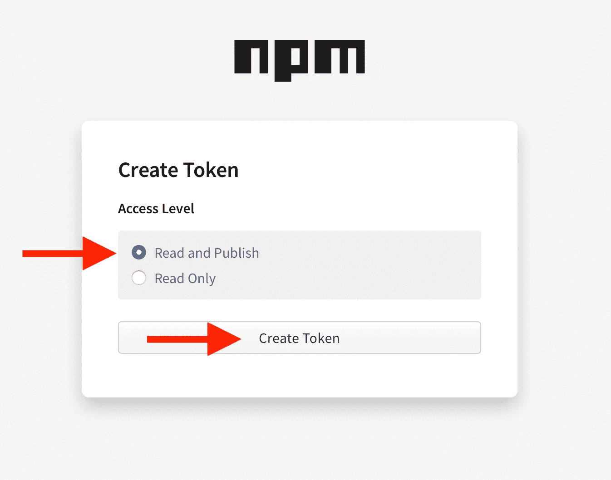
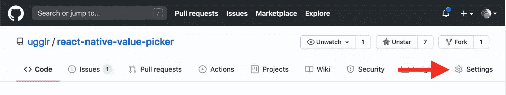
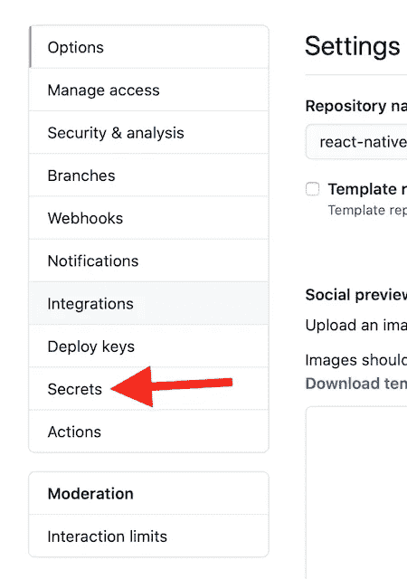
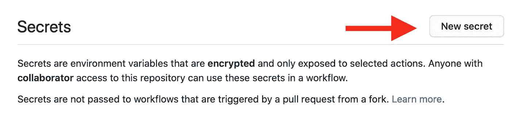
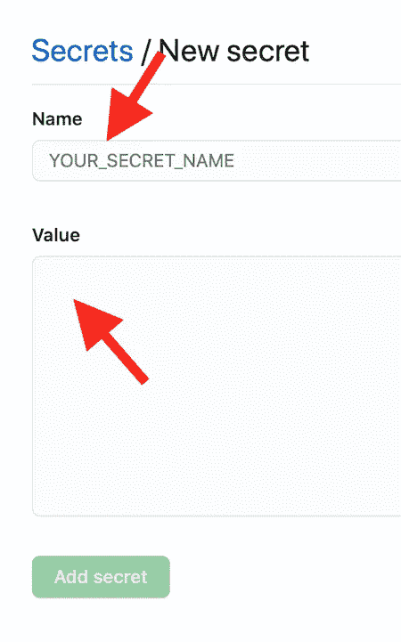
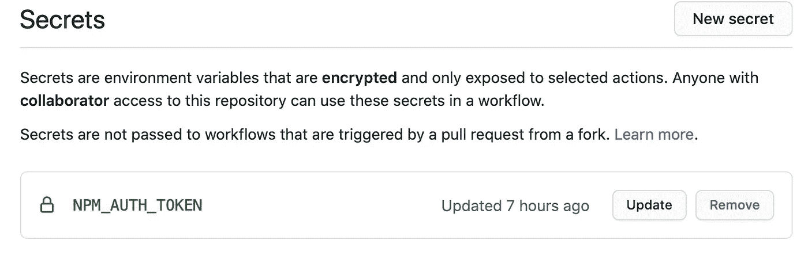
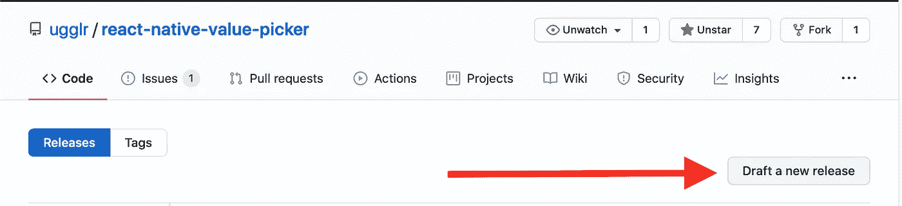
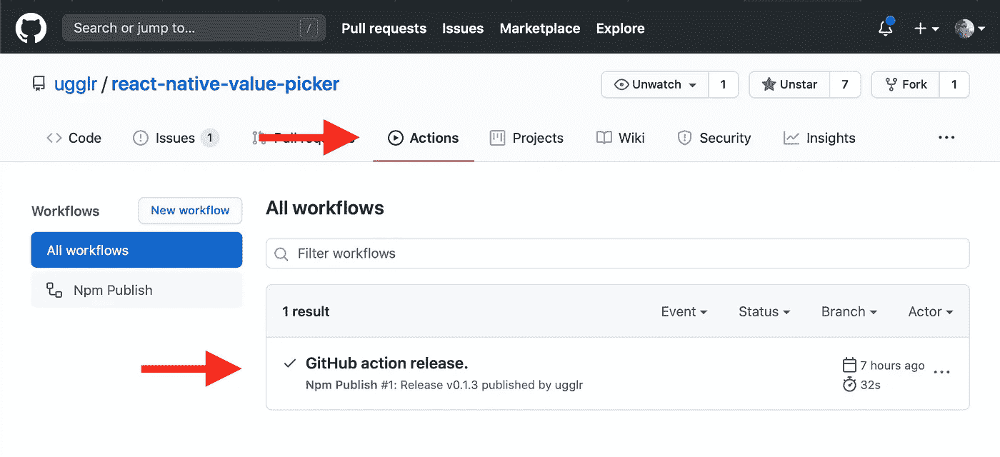

# 使用 GitHub 操作发布/更新 NPM 软件包

> 原文：<https://javascript.plainenglish.io/publish-update-npm-packages-with-github-actions-e4d786ffd62a?source=collection_archive---------2----------------------->


曾经有一个 NPM 软件包从来没有得到更新，即使你不时作出改变。我愿意。是时候让我的生活稍微简单一点了，用 Github 动作自动化发布/更新步骤。

自从 GitHub Actions 发布以来，我认识的几个人一直在称赞它们有多好，所以为了尝试学习一点，并解决我的一个问题，我想我可以尝试一下🤓

哦，这是官方的 GitHub 动作文档:[【GH 动作文档】](https://docs.github.com/en/actions/configuring-and-managing-workflows/configuring-a-workflow)

# 目标

在开始配置之前，知道您想要做什么是很重要的(或者..做任何事，真的！).对我来说，这将是非常简单，但非常有用的东西。

**这是我的起点，也是我想达到的目标:**

1.  我有一个开源包，发布到 NPM
    →[NPM:react-native-value-picker](https://www.npmjs.com/package/react-native-value-picker)
    →[Github:ugglr/react-native-value-picker](https://github.com/ugglr/react-native-value-picker)
2.  **当**我在 Github 上发布一个新版本时，我想更新/重新发布这个包到 NPM，所以我的更新开始生效。

要手动执行此操作，我们需要通过 NPM CLI 登录并发布/重新发布，如下所示:

```
# Authenticating with npm
$ npm login# Publish the package
$ npm publish
```

我知道，我知道，每次我想推出一个包的更新时，做这两个步骤的工作量并不大，但我们在这里也学到了一些东西🚀

在 GitHub Actions 之前，为了自动化这个任务，我需要一个第三方 CI/CD 解决方案，而且它是免费的。

让我们从配置开始吧。

# 准备我们的回购

我们希望在 GitHub 动作中运行的执行链或作业被称为**工作流**。

所以 GitHub 会往里面看**。github/workflows** 用于工作流/执行链，所以让我们做一个**。github** 文件夹，如果对库有特殊的配置，比如代码所有者，通常会使用这个文件夹。此外，我们需要在我们的**中创建一个文件夹。github** 文件夹名为**工作流**。

TLDR:当所有的工作完成后，你将会有一个根。github/workflows *文件夹。*

像大多数 CI/CD 解决方案**一样，GitHub 动作工作流**是使用**配置的。yml** 文件，我们需要将该文件放入我们上面创建的工作流文件夹中。我把我的 yml 文件**命名为 npm-publish.yml** ，这里有一个做得很差的文件夹树来使它更清楚。

```
--> root
   |--> .github
      |--> workflows
         |--> npm-publish.yml // contains our workflow.
   |--> rest of app
```

# 配置我们的工作流程

因此，在我们的“npm-publish.yml”中，我们可以配置我们的工作流。我会先把完成的东西贴上来，然后我会一步一步地看它是做什么的。

```
name: Npm Publishon:
 release:
 types: [published]jobs:
  build:
   runs-on: ubuntu-latest
    steps:
      — uses: actions/checkout@v2
      — uses: actions/setup-node@v1
        with:
          node-version: 12
          registry-url: [https://registry.npmjs.org/](https://registry.npmjs.org/)
      — run: yarn install
      — run: npm publish — access public
        env:
         NODE_AUTH_TOKEN: ${{secrets.NPM_AUTH_TOKEN}}
```

**我们来分解一下**

```
name: Npm Publish
```

给工作流起一个名字，在最上面我们给包含的工作流起一个对我们有意义的名字，你可以随意命名:)

```
on:
 release:
 types: [published]
```

**“on”-关键字**告诉 GitHub 工作流应该何时运行，在这种情况下，我指定当有新的发布时我希望它运行，更具体地说，当发布类型是 **published** 时我希望它运行。这一点很重要，也是必需的，因为发布也可能是**更新**或**删除**。这确保了我们只在**发布发布**上运行。

```
jobs:
  build:
    runs-on: ubuntu-latest.
```

**“作业”-关键字**告诉我们的 CI 我们想要执行的不同作业/任务。

在这种情况下，我想在最新版本的 Ubuntu 上构建项目，所以它被指定为 **ubuntu-latest** 。

此外，我们需要定义我们工作中的步骤:

```
steps:
  — uses: actions/checkout@v2
  — uses: actions/setup-node@v1
   with:
     node-version: 12
     registry-url: [https://registry.npmjs.org/](https://registry.npmjs.org/)
  — run: yarn install
  — run: npm publish — access public
```

在我们的工作中，我们现在正在定义步骤，我们已经定义了虚拟机的操作系统，因此我们处于在我们的计算机上本地运行项目的相同阶段。

好吧，说白了，当我们运行这样一个项目时，我们在当地做什么？

通常，在我们的终端中会是这样的:

a)克隆我们的项目

```
$ git clone git:repo-address
```

**b)安装所有软件包/依赖项**

```
$ yarn install
```

c)执行发布步骤

```
$ npm login
$ npm Publish
```

在本地，我们已经用节点、纱线和其他需要安装的东西建立了开发环境。但是因为我们本质上是在运行 Ubuntu 的 Githubs 服务器上创建一台新的计算机，所以我们需要更加具体，说明我们需要什么工具来运行这些步骤，这就是我们在配置文件中所做的:

**克隆回购。**

```
- uses: actions/checkout@v2
```

**在一个已知的工作版本上安装节点，指定我们想要使用的包注册表。**

```
— uses: actions/setup-node@v1
  with:
    node-version: 12
    registry-url: [https://registry.npmjs.org/](https://registry.npmjs.org/)
```

**安装依赖关系**

```
- run: yarn install
```

**发布到 NPM**

```
- run: npm publish — access public
```

**此外，由于没有人坐在那里看着脚本通过输入用户名和密码来验证我们，我们需要向我们的节点环境传递一个预验证的令牌**

```
env:
  NODE_AUTH_TOKEN: ${{secrets.NPM_AUTH_TOKEN}}
```

🎉这就是我们新的 Github 动作工作流程配置全部完成🎉

坚持住！你可能会说，NPM 认证令牌是怎么回事？

接下来让我们进行配置。

# 配置身份验证令牌

如前所述，我们需要一个预认证的令牌来传递到我们的节点环境中。这是我们向 NPM 认证的方式，设置起来并不复杂。

**永远不要把你的令牌放入配置文件，它应该是私有的**

注意:如果你有兴趣跟随，我想你在 npmjs.org 有一个账户。

前往你的 npm 账户，在快速账户菜单中点击**认证令牌**



在**身份验证令牌**页面中，您需要创建一个新令牌。



然后，系统会提示您是否要授予令牌**读取和发布**或仅授予**读取**的权限，出于此目的，我们需要拥有发布权限，因此**读取和发布它是**。



创建令牌后，复制它，并确保您可以暂时保留它，直到我们将它添加到我们的存储库机密中。

# 将 NPM 令牌添加到我们的存储库中

去你的 GitHub 库，那里有你的包，然后去设置页面。



**进入设置页面，进入秘密子页面。**



**点击创建新密码**



在这里，您需要将令牌的名称与我们在操作配置文件中所写的相匹配。



在我们的例子中，我们将我们的秘密变量引用命名为**NPM _ 身份验证 _ 令牌**，然后你需要将从 NPM 那里得到的令牌粘贴到值字段中。

当一切顺利完成后，我们会把它加进去。



🚀这就是我们配置所需的全部内容，提交它，合并到 master 中，让我们尝试一下，看看它是否有效。⛹️‍♀️

# 测试它

因此，为了测试我们新创建的工作流，我们需要发布一个新的版本(published ),因为这是我们配置的触发版本。



您为发布选择什么标签并不重要，但是要确保预发布复选框是**而不是**选中的。还有，如果你有以前的包，**记得在 package.json** 里撞版本，NPM 要求我们在发布新的改动时更新版本。

当发布完成后，让我们前往我们的库的 action 选项卡，看看我们是否有东西在运行！



🎉开始了— **麦克风掉落**🎤

**如果你想访问我一直在做的回购，这里就有:**[【Github】ugglr/react-native-value-picker](https://github.com/ugglr/react-native-value-picker/actions)👈

**包可以通过 NPM 获得:**[【NPM】react-native-value-picker](https://www.npmjs.com/package/react-native-value-picker)👈

感谢阅读！