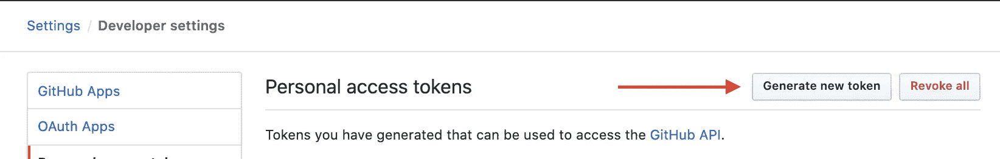
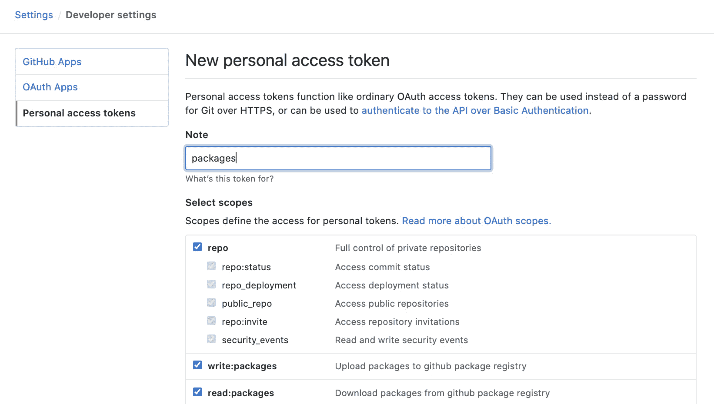

# 使用 GitHub 包发布私有 npm 包

> 原文：<https://javascript.plainenglish.io/publishing-private-npm-packages-using-github-packages-415993cd2da8?source=collection_archive---------0----------------------->


Photo by [Pixabay](https://www.pexels.com/@pixabay?utm_content=attributionCopyText&utm_medium=referral&utm_source=pexels) from [Pexels](https://www.pexels.com/photo/business-cargo-cargo-container-city-262353/?utm_content=attributionCopyText&utm_medium=referral&utm_source=pexels)

在本文中，我将介绍如何使用 GitHub 包来发布您的 npm 包。如果您不熟悉 GitHub 包，它允许您将 npm、gem 或 NuGet 包发布到它们的注册表中，这里仅举几个例子。

## 首先，你需要一个访问令牌…

你需要生成一个个人访问令牌。这个令牌将允许您使用 GitHub 的 API 进行身份验证，并发布您的包。要创建一个，您必须前往*设置/开发者设置/个人访问令牌*。在这里你必须点击*生成新的令牌*。



在新的个人访问令牌屏幕中，您必须选择 *repo* 、 *write:packages、*和 *read:packages* 的范围。确保添加注释，以便您知道该令牌的用途，并点击底部的*生成令牌*按钮。



*重要提示*:请务必将此令牌保存在安全的地方，因为您稍后会需要此令牌。成功生成令牌后，您需要在存储库中创建一个秘密。为此，请访问您在 GitHub 上的存储库，然后进入*设置/秘密、*并点击*新秘密*。

对于名称，在 value 字段中输入`NPM_AUTH_TOKEN`和，然后粘贴您生成的令牌的值。

## 更新您的 package.json

现在，您需要对存储库上的 package.json 进行一些更改，以便可以发布您的库。首先，您必须更改您的包的名称，将您的用户名或您的组织的名称作为作用域，后跟包的名称。例如，如果你的用户名是 *your_username* 并且你的项目名是 *your_project_name* ，你将最终把包的名称改为如下。

```
"name": "@your_username/your_project_name"
```

接下来，您必须指定您要将软件包发布到哪个注册表。您必须添加此条目，并用您的用户名或组织名称替换*您的用户名*。

```
"publishConfig": {
  "registry": "https://npm.pkg.github.com/your_username"
}
```

最后，如果您的项目在 monorepo 中，您将必须添加这个条目，这样您就可以在同一个存储库中发布多个包。

```
"repository": {
  "type": "git",
  "url": "ssh://git@github.com:your_username/your_project_name.git",
  "directory": "@your_username/your_project_name"
}
```

## 包访问

到目前为止，默认情况下 GitHub 包从您的存储库中继承访问权限。鉴于此，只要您的存储库是私有的，您的包也将是私有的。如果您在 package.json 中保留 private:true 属性，就会出现问题。您可以删除该属性，因为它不允许您用它发布您的包。

## 现在…npmrc

下一步将是创建一个名为. npmrc 的文件。

```
registry=https://npm.pkg.github.com/@your_username
registry=https://registry.npmjs.org
```

从您的工作站发布您的包首先，您需要登录到您工作站上的 GitHub 包注册表。为此，您可以运行以下 npm 命令。

```
npm login —registry=https://npm.pkg.github.com —scope=@your_username
```

一旦您运行这个命令，它将要求您输入用户名、密码和电子邮件。确保使用您之前生成的访问令牌作为密码。经过身份验证后，转到项目的 dist 文件夹并运行 npm publish。

```
cd dist
npm publish
```

## 安装您的软件包

要使用您的软件包，您必须添加相同的。将您添加到发布库项目的 npmrc 文件添加到您的消费项目。除此之外，您还需要运行如下所示的 npm 安装命令。

```
npm install @your_username/your_project_name@version
```

在这一点上，你应该都准备好了！尽情享受吧！

## 需要记住的事情

生活中没有什么是免费的。虽然 GitHub 软件包的价格相当慷慨，但一定要留意这一点，并在必要时设定支出限额。

## 简单英语的 JavaScript

喜欢这篇文章吗？如果有，通过 [**订阅我们的 YouTube 频道**](https://www.youtube.com/channel/UCtipWUghju290NWcn8jhyAw) **获取更多类似内容！**