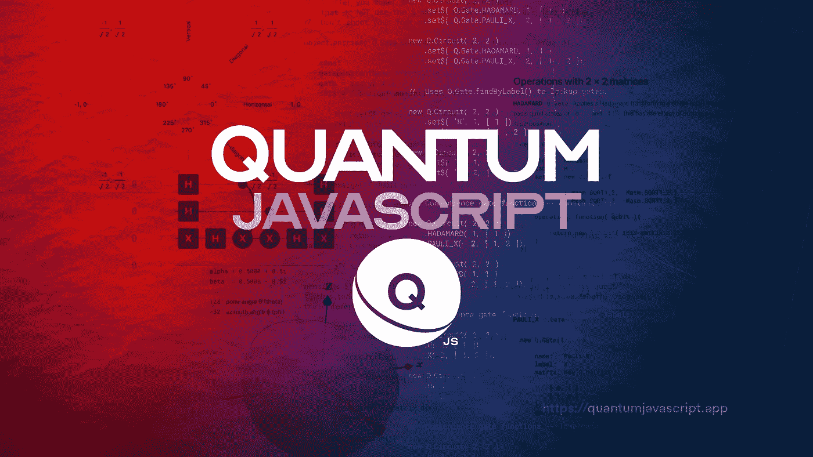
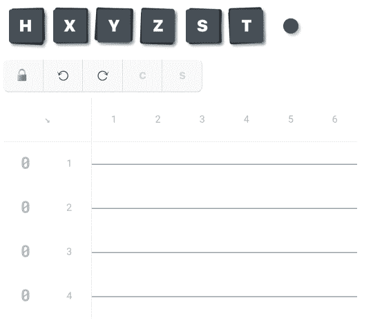

# 量子 JavaScript

> 原文：<https://javascript.plainenglish.io/quantum-javascript-d1effb84a619?source=collection_archive---------3----------------------->

## 我是如何让任何一个有网络浏览器的人都能使用量子计算的。



[Image by author](http://stewartsmith.io).

***Q*** *是一个量子电路模拟器，拖放电路编辑器，以及可以在您的 Web 浏览器中运行的强大 JavaScript 库。现在就去*[*https://quantum JavaScript . app*](https://quantumjavascript.app)试试吧

我对量子计算一无所知，但它听起来很奇怪——关于“是”和“不是”同时存在；甚至在多个宇宙中。多年来，我在量子视频讲座上无所事事地吃零食，但这些流行科学的碎片是教育上的馅饼。与此同时，像李奥纳特·苏士侃这样的圣贤的实质性的、营养丰富的讲座，虽然令人深感宽慰，但最终却不适用于我的日常经典生活。我偶然发现了一些更容易理解的东西； [Andrew Helwer 的《计算机科学家的量子计算》它是量子的，但是是我可以代谢的味道。](https://quantumjavascript.app/resources.html#Andrew_Helwer%E2%80%99s_%E2%80%9CQuantum_computing_for_computer_scientists%E2%80%9D_lecture_for_Microsoft_Research_(2018))

我不得不看了很多遍，才能真正理解安德鲁(和他联系的作者们)描述的数学框架。我意识到我可以在网络浏览器中自己重建这种逻辑——从而使它与广大观众即时互动和共享。一天晚上，我画了一些小的代码元素作为基础。简而言之，我正在模拟单个[量子位](https://quantumjavascript.app/Q-Qubit.html)的操作，并渴望将量子位状态想象成[布洛赫球体](https://quantumjavascript.app/Q-Qubit.html#Bloch_sphere)。准备到此为止，我发布了[这条推文](https://twitter.com/stew_rtsmith/status/1123415441915957250):阿达玛量子门[的矩阵表示](https://quantumjavascript.app/Q-Gate.html#.HADAMARD)；量子计算的通量电容器。

## 生日快乐，Q

这条没有上下文的推文充当了我的新量子 JavaScript 激情项目的神秘诞生公告，名为 **Q.js** (发音为 *Queue-Jay-Ess，*，通常被进一步截短为单个字母 **Q** )。所以今天——2020 年 4 月 30 日——标志着 Q 的一周年纪念日。生日快乐，q。在过去的 12 个月里，我一直在探索一个我一直想研究的课题。建造一个量子电路模拟器迫使我行使这种好奇心。

在过去的一年里，我自学了一些量子计算的基础知识，这并不完全引人注目。(年龄比我小一半的大学生一个学期就能做到。)但我确实为取得了力量的壮举而自豪；在白天工作和为人父母的同时，在晚上和周末打下了 Q 的每一块砖。我不仅学习了数学，还编写了库和网站代码，设计了界面，编写了概念入门，编写了 API 文档，等等。我戴了所有的帽子。一年过去了，我仍然将这些视为 q 的“早期阶段”。在我看来，这个问题还远未完全解决，但它已经有了一个坚实的开端。今天这是值得庆祝的。

在这个过程中，我也结交了新朋友。原来我不是唯一一个在业余时间建造量子电路模拟器取乐的[疯狂]人。我也不是唯一一个为网络建立它的人。(敬请关注未来的公告和合作。)

## 网络驱动的

因为 Q 运行在 Web 上，所以不需要安装也不需要配置。只要访问该网站，您就已经开始运行了。拖放式电路编辑器使创建量子电路变得轻而易举——甚至在您的移动设备上。在桌面上，你还可以[打开浏览器的 JavaScript 控制台](https://quantumjavascript.app/#Open_your_JavaScript_console)进一步深入研究。亲自尝试一下:

[](https://quantumjavascript.app/playground.html) [## ⟩游乐场

### 在此键入、粘贴或编辑电路。然后点击“应用”以生成交互式电路图和其他输出…

quantumjavascript.app](https://quantumjavascript.app/playground.html) 

## 免费和开源

q 是免费使用的，我们的代码是开源的，我们的 API 有大量的文档。还是量子新手？API 文档的每一页都包括基本量子概念的简单解释，让你快速上手。这使得 Q 成为教室和在家自学者的理想选择。在 https://github.com/stewdio/q.js加入我们在 GitHub 上的项目，在社交媒体上放一个链接到 Q 的网站[https://quantum JavaScript . app](https://quantumjavascript.app/)，标签为 [#Qjs](https://twitter.com/search?q=%23Qjs) 。让我们让量子计算变得可行。

[](https://github.com/stewdio/q.js) [## stewdio/q.js

### q 是一个量子电路模拟器，拖放电路编辑器，和强大的 JavaScript 库，运行在这里…

github.com](https://github.com/stewdio/q.js) 

# 拖放式

q 的拖放电路编辑器使创建量子电路变得轻而易举，甚至在你的移动设备上。从 gates 调色板中抓取量子门图块，并将其拖动到电路板上。点击门控图标选择或取消选择，或点击标题单元格一次切换选择多个门控。犯了错误？只需点击撤销按钮。担心在触摸屏上滚动时会出现意外编辑？轻按“锁定”按钮，将您的门保持在原位。

现在这是我们的第一个量子电路例子——一个简单的[贝尔态](https://en.wikipedia.org/wiki/Bell_state)。



# JavaScript 灵活性

量子代码是什么样子的？让我们重新创建上面显示的[铃状态](https://en.wikipedia.org/wiki/Bell_state)，但是使用**三种独立的电路创作风格**来展示 Q 的灵活性。对于这三个例子中的每一个，我们将创建一个电路，在 2 个时刻使用 2 个量子位寄存器。我们将在寄存器 1 的时刻 1 放置一个 [Hadamard](https://quantumjavascript.app/Q-Gate.html#.HADAMARD) 门。然后，我们将在时刻 2 放置一个[受控非](https://quantumjavascript.app/Q-Gate.html#.PAULI_X)门，其控制元件在寄存器 1 上，其目标元件在寄存器 2 上。无论您喜欢哪种代码风格，结果都是这样的:


## 1.文本作为输入

q 的 [text-as-input](https://quantumjavascript.app/#text-as-input) 功能直接将你的文本转换成一个功能量子电路。就像创建一个纯文本电路图一样键入您的操作(在没有操作发生的地方使用“I”代表[标识门](https://quantumjavascript.app/Q-Gate.html#.IDENTITY)，并将您的文本块用[反斜杠](https://en.wikipedia.org/wiki/Grave_accent)括起来——而不是引号。(注意，使用反勾号时，调用函数调用不需要括号。)将这个文本块与上面更形象的表示进行比较。

```
[Q](https://quantumjavascript.app/Q.html)`
    H  X#0
    I  X#1
`
```

## 2.受 Python 启发

从基于 Python 的 quantum suites 来到 Q 的人们可能会发现这个语法更熟悉。这里，`[Q](https://quantumjavascript.app/Q.html)`函数需要两个参数:要使用的量子位寄存器的数量和电路运行的时间长度。从那里，我们可以使用一种叫做[“流畅界面”的方法链接](https://en.wikipedia.org/wiki/Fluent_interface)来挂起任意数量的量子门操作。每个门都可以通过调用与门的单字符`[label](https://quantumjavascript.app/Q-Gate.html#this.label)`属性同名的电路方法来设置。(例如，将[哈达玛](https://quantumjavascript.app/Q-Gate.html#.HADAMARD)作为`h`、[泡利 X](https://quantumjavascript.app/Q-Gate.html#.PAULI_X) 作为`x`等。)这些函数需要两个参数:一个矩索引，一个量子位寄存器索引或量子位寄存器索引数组。

```
[Q](https://quantumjavascript.app/Q.html)( 2, 2 )
    .h( 1, 1 )
    .x( 2, [ 1, 2 ])
```

## 3.冗长以清晰明了

在幕后，Q 正在做更详细的声明，你也可以自由地这样做。(以及[这些美元符号是关于什么的？](https://quantumjavascript.app/contributing.html#Destructive_vs_non-destructive_methods))

```
new [Q](https://quantumjavascript.app/Q.html).[Circuit](https://quantumjavascript.app/Q-Circuit.html)( 2, 2 )
    .[set$](https://quantumjavascript.app/Q-Circuit.html#.prototype.set$)( [Q](https://quantumjavascript.app/Q.html).[Gate](https://quantumjavascript.app/Q-Gate.html).[HADAMARD](https://quantumjavascript.app/Q-Gate.html#.HADAMARD), 1, 1 )
    .[set$](https://quantumjavascript.app/Q-Circuit.html#.prototype.set$)( [Q](https://quantumjavascript.app/Q.html).[Gate](https://quantumjavascript.app/Q-Gate.html).[PAULI_X](https://quantumjavascript.app/Q-Gate.html#.PAULI_X), 2, [ 1, 2 ])
```

## 更多变化

有很多方法可以用 q 来构建量子电路。你觉得什么合适？要了解更多关于 [Q 的文本语法](https://quantumjavascript.app/#text-as-input)和其他便利小窍门，请参见[“编写量子电路”。](https://quantumjavascript.app/Q-Circuit.html#Writing_quantum_circuits)

# 清晰易读的输出

无论您使用 Q 的拖放式电路编辑器界面、[文本语法](https://quantumjavascript.app/#text-as-input)、 [Python 语法](https://quantumjavascript.app/#python-inspired)，还是更喜欢自己键入每个 [set$](https://quantumjavascript.app/Q-Circuit.html#.prototype.set$) 命令，Q 都能让检查和评估您的电路变得容易。

决定给电路取什么名字有时会很困难，所以为了好玩，我们让 Q 为我们选择一个随机的名字。然后，我们将为我们的电路生成一个[结果概率报告](https://quantumjavascript.app/Q-Circuit.html#.prototype.report$)。(即。当我们实际执行这个量子程序时，结果是什么？)只需将以下两个命令添加到上述三个示例中的任何一个:

```
.[setName$](https://quantumjavascript.app/Q-Circuit.html#.prototype.setName$)( [Q](https://quantumjavascript.app/Q.html).[getRandomName$](https://quantumjavascript.app/Q.html#.getRandomName$) )
.[evaluate$](https://quantumjavascript.app/Q-Circuit.html#.prototype.evaluate$)()
```

这种组合将产生如下结果:

```
Beginning evaluation for “Blue Wolverine” m1    m2   
        ┌───┐╭─────╮
r1  |0⟩─┤ H ├┤ X#0 │
        └───┘╰──┬──╯
             ╭──┴──╮
r2  |0⟩───○──┤ X#1 │
             ╰─────╯██████████░░░░░░░░░░  50%   1 of 2
████████████████████ 100%   2 of 2 Evaluation completed for “Blue Wolverine”
with these results:1  |00⟩  ██████████░░░░░░░░░░  50% chance
2  |01⟩  ░░░░░░░░░░░░░░░░░░░░   0% chance
3  |10⟩  ░░░░░░░░░░░░░░░░░░░░   0% chance
4  |11⟩  ██████████░░░░░░░░░░  50% chance 
```

# 前方的路

是 Q 成长的时候了——我需要你们的投入。但也是 2020 年了。我们正处于[新冠肺炎](https://en.wikipedia.org/wiki/Coronavirus_disease_2019)全球疫情的中心。你需要一个激情项目来转移你对当前事件的注意力吗？你喜欢 JavaScript、CSS 和免费网络吗？把复杂的主题分解成简单的、一口大小的文本块和极简图表怎么样？你是平面设计师还是文案？你对量子计算感到兴奋吗？[加入我们在 GitHub 上的 Q.js 项目](https://github.com/stewdio/q.js)，[创建或解决一些问题](https://github.com/stewdio/q.js/issues)，帮助我们使 quantum 可访问。

[](https://quantumjavascript.app/contributing.html?source=medium-20200430) [## ⟩对此有贡献

### 是时候让 Q 成长了。但现在也是 2020 年——我们正处于新冠肺炎全球疫情的中心。你需要…

quantumjavascript.app](https://quantumjavascript.app/contributing.html?source=medium-20200430) 

如果你觉得这很有趣，可以看看我的个人网站，了解更多关于代码、艺术和好奇心的不幸遭遇:[*http://Stewart Smith . io*](http://stewartsmith.io)

[](http://stewartsmith.io) [## 斯图尔特·史密斯

### 斯图尔特是一位住在纽约布鲁克林的富有创造力的学者。

stewartsmith.io](http://stewartsmith.io) 

## **说白了**

通过 [**订阅我们的 YouTube 频道**](https://www.youtube.com/channel/UCtipWUghju290NWcn8jhyAw) **来表达爱意吧！**