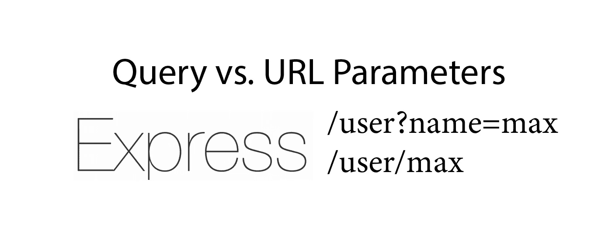

# Express.js 中的查询与 URL 参数

> 原文：<https://javascript.plainenglish.io/query-strings-url-parameters-d1a35b9a694f?source=collection_archive---------2----------------------->

## 区别以及何时使用



一个常见的问题是，对于一个 API，您应该使用查询参数还是 URL 参数，以及这两者之间的区别在哪里，这完全独立于 Express.js 框架。

这里是所有的答案和代码示例，您需要了解它们的区别和应用，并使用它们构建您的下一个 Express.js API。

# 基本语法

我们先来看看两者是如何架构的。

查询参数:`domain.com/path?key=value`

URL 参数:`domain.com/path/value`

在这两种情况下，路径都是可选的，当然，我们也可以接受参数为 root-URL ( `domain.com/`)。

真实例子:

查询参数:`domain.com/products?search=tomato`

URL 参数:`domain.com/products/tomato`

在这两种情况下， *tomato* 是我们发送给 web 服务器的值。

# 区别——以及何时使用什么

简而言之，我们可以对两者做同样的事情——技术上没有区别，所以我们可以对查询参数或 URL 参数(也称为路由参数)使用相同的 API。正如您马上会看到的，您可以用两者传递多个数据。所以最终，还是取决于你。然而，至于其他几乎所有的事情，都有标准。遵循它们是有意义的——首先，你知道标准本身，可以更好地理解别人的代码。其次，遵循这些标准，你可以编写自己的代码，让别人理解。

这是标准:

我们使用 URL / Path 参数来访问服务器上的资源。例如，可以通过 ID 或标签找到的用户。实际的例子是互联网上具有以下 URL 语法的平台:`domain.com/<username>`。有时候前面还有一个@标志。

我们可以用一个 URL 参数简单而优雅地实现这一点:

```
app.get(“/:username”, (req, res) => {
  res.send(req.params.username)
})
```

我们现在在斜杠后面输入的所有内容都可以被 Express.js 处理——例如在数据库查询中。对于现实世界的平台，这些通常是像`twitter.com/louispetrik`这样的 URL。

URL 参数较短，但可读性较差，因此不太适合将多个参数放在一行中。

特别是对于搜索引擎优化，我们希望保持我们的网址苗条。并且应该在搜索引擎中显示的页面是例如用户页面或者产品和类别页面。而不是代表猫粮价格排序列表的页面(没有人会谷歌这样的东西)。

所以，URL 参数 So 应该用来输出一个“整体的”、静态的资源。

一个的优点是另一个的缺点。查询参数更长，可读性更强，因为它们表示 URL 中的键。这使得它更容易，例如在开发过程中，它们应该被用来链接到不应该在搜索引擎中排名的页面，通常在一个 URL 中有几个查询参数，例如对于结果页面，对于产品。例如，我们需要一个关键字和一个排序。

## 总结一下:

*   **URL 参数**用于指向静态资源的干净的、小的、搜索引擎友好的 URL
*   **查询参数**更长、可读性更强的网址，后面跟着动态内容，与搜索引擎无关。


Query Parameter in the Amazon Product Search

# Express.js 中的 URL 参数

请求 URL 参数并不难。我们通过`:param_name`来识别它们，然后可以将它们作为 request-object 的一个元素输出。

```
// localhost/max => output: maxapp.get(“/:username”, (req, res) => {
  res.send(req.params.username)
})
```

我们也可以在一行中有几个参数。

```
// localhost/max/23 => output: max 23app.get(“/user/:name/:age”, (req, res) => {
  res.send(req.params.name + “ “ + req.params.age)
})
```

# Express.js 中的查询参数

查询参数的工作方式几乎相同。但是与 URL 参数相反，我们没有定义我们所期望的。所有接收到的参数都可以在`req.query`对象中获得。

```
// localhost/user?name=max => output: maxapp.get(“/user”, (req, res) => {
  res.send(req.query.name)
})
```

新参数总是用问号标记。

我们也可以在 URL 中传递多个参数。重要的是，我们用 and 符号将它们分开。但是我们不需要另一个问号。

```
// localhost/user?name=max&age=23 output: max 23app.get(“/user”, (req, res) => {
  res.send(req.query.name + “ “ + req.query.age)
})
```

感谢您的阅读！

[**加入我的简讯保持联系**](http://eepurl.com/hacY0v)