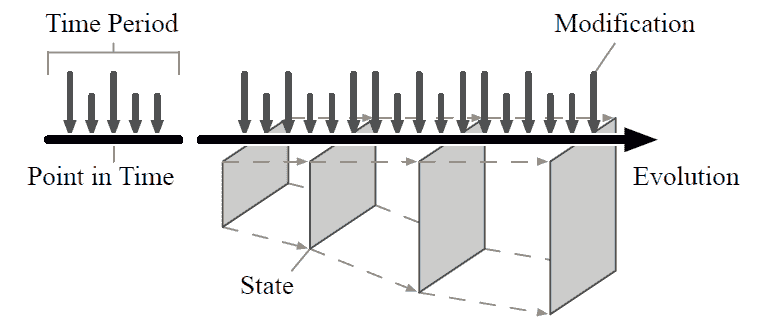
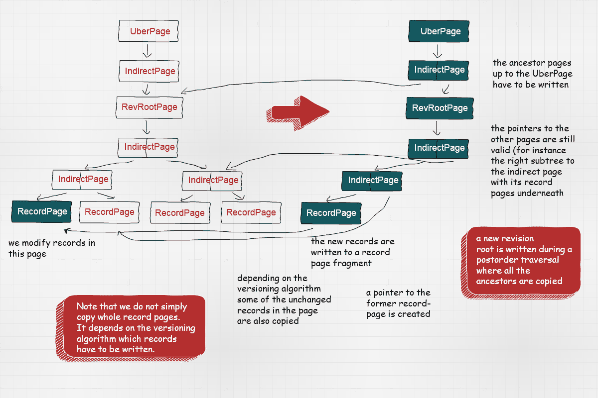
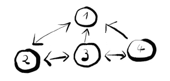

# 如何查询 JSON 数据库的完整历史

> 原文：<https://javascript.plainenglish.io/query-the-full-history-of-your-json-database-6585ac8fed9b?source=collection_archive---------6----------------------->

Evolution of states through modifications and commits in SirixDB

**有助于进化，只积累数据库系统称为** [**SirixDB**](https://github.com/sirixdb/sirix) **和以** [**为基础的前端**](https://github.com/sirixdb/sirix)

# 介绍

首先，您可能不需要数据库系统来处理小的 JSON 文件，范围从几兆字节。

但是，如果您必须管理和查询千兆字节的数据，您应该使用数据库系统。

然而，通常数据库系统并不是为保存数据的完整历史而设计的。通常，系统会在更改过程中覆盖数据或短时间保留数据。后者通常由于事务而发生，事务当前读取稍微过时的数据。因此，垃圾收集器必须等到所有读取事务完成。然后，它能够删除旧数据。

相反， [SirixDB](https://sirix.io) 生成了一个巨大的持久树，在提交期间是持久的。它只追加数据。每个修订都被索引，而修订共享未改变的页面片段。可以把它想象成 Git，但是是在子文件级别。持久树在函数式语言中也很常见，比如 Haskell 和 Closure。下图描述了在后序遍历中序列化页面的事务提交:

Two revisions — second commit

通常，将这些持久的内存结构映射到持久的设备会增加写入放大，因为必须适应完整的叶到根路径。然而，我们在主文档存储中使用了键控 trie。因此，不会像 B 树那样发生结构变化。此外，我们开发了一种新的滑动快照算法来对数据页面进行版本化，并存储可变大小的页面片段。因此，只有少数更改的记录被写入新的页面片段。重构内存中的页面包括从随机位置并行读取页面片段的滑动窗口。

由于对快速、随机、细粒度读取的要求，字节可寻址 NVM 等现代硬件对于良好的性能至关重要。

SirixDB 以二进制格式存储 JSON 数据，而每个事务都绑定到一个特定的修订版。目前，一个资源上的 N 个只读事务可以与一个资源上的一个读写事务共存(表示 JSON 数据)。

编码如下，只是我们最近还引入了一个从父节点指向最后一个子节点的指针。

# 查询您的数据

该系统使用并扩展了 XQuery 3.0 处理器来处理 XML 和 JSON 数据。

我们能够通过以下方式从特定目录导入 JSON 文件:

它将创建一个名为`mycol.jn`的数据库和几个资源。

我们还可以在数据库(mycol.jn)的几个资源中存储一组 JSON 字符串:

注意，当 JSON-strings 出现时，我们必须用`true()`和`false()`替换`true`和`false`，用`jn:null()`替换`null`。

然后，我们可以通过以下方式查询数据库集合:

或者，如果我们想打开数据库中的特定资源，我们可以使用:

此外，我们可以更新资源。假设我们有下面的小 JSON 文件:

我们可以插入一个 JSON 对象:

我们用`=>`操作符取消对对象字段名的引用。它甚至可以深入数组，找到字段名的值。

更新操作将用字段名和添加的值创建一个新的版本。例如

将选择数组中第一个对象的值的字段名`tada`。

我们隐式查询修订版 2。如果我们改为查询修订版 1，我们仍然会检索旧的 JSON 对象。

请注意，我们将 one 指定为函数的第三个参数。输出是:

除了向第三个参数提供数值，我们还可以通过时间戳打开特定的修订(这里:检查特定资源在 2018 年 4 月的情况):

使用 open-revisions 函数，我们能够加载两个时间点之间资源的所有修订:

以下查询将把一个对象作为第二项插入到由`=>foo`取消引用的数组值中:

使用

我们得到输出:

同样，我们可以用以下内容替换 JSON 值

或者删除一个值:

如果您通过 REST-API 提交查询，您首先必须获得授权。因此，Git 中的修订版也存储作者姓名和 UUID。

要获得提交特定修订的作者姓名:

要获得 UUID 奖:

您还可以投影字段:

这将输出:

# 时间旅行功能

此外，我们可以使用一系列时间旅行查询。以下函数检索不同版本的 JSON 项目:

用于选择未来或未来自我的 json-item 的函数。第一个参数是上下文项。第二个参数表示当前项是否应该包含在结果中。

用于选择过去或过去或自我的 json 项的功能。第一个参数是上下文项。第二个参数表示当前项是否应该包含在结果中。

用于在所有修订中选择 json-item 的功能。

用于在第一次修订中选择 json-item 的功能。

用于选择最后/最近版本中的 json-item 的功能。

用于选择先前版本中的 json-item 的功能。

用于在下一版本中选择 json-item 的功能。

要在所有修订版本中获取某个物件，请执行以下操作:

# 差异

我们当然也能够检索差异:

该函数比较名为`myresource2`的资源的版本 1 和版本 3。

输出格式是 JSON 字符串:

例如，我们的也使用这种格式，我们目前基于 **Svelte** 开发这种格式。

它表示 SirixDB 比较了修订版 1 和 3。此外，不同的 diff 类型是`insert, delete, update and replace`(后者未示出)。`insertPositionNodeKey`是上下文节点，在这里插入发生，`insertPosition`表示它是作为第一个孩子、作为右兄弟还是左兄弟插入的。

我们还可以区分一个子树并指定两个附加参数。将要进行比较的`root node`和`depth`:

这也比较了`mydocs.col`数据库中`myresource2`资源的版本 1 和版本 3。然而，这一次，差异从节点开始，由它唯一的 nodeKey 7453 表示。此外，区分应该跳过比 2 级更深的后代。

为了得到某个特定项的`nodeKey`，我们可以使用:

# 结论

SirixDB 提供了查询数据完整历史的强大方法。

我们省略了索引结构的创建，但是您也可以使用 XQuery 创建二级索引结构，这也是自动版本化的。

考虑下面的文档(带有两个修订版的序列化 SirixDB 资源):

我们可以创建内容和结构(CAS)索引，如下所示:

为了回答这个问题

此外，我们没有提到 FLOWR 表达式，它是 XQuery 的基石。一个简单的隐式连接示例: