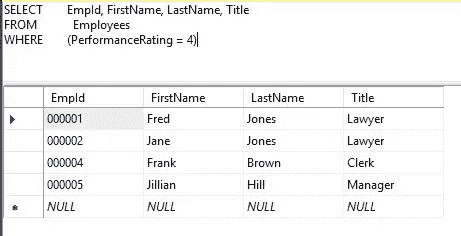

# 使用 Async/Await 在 Node.js 中查询 SQL Server

> 原文：<https://javascript.plainenglish.io/querying-sql-server-in-node-js-using-async-await-5cb68acf2144?source=collection_archive---------1----------------------->

## 使用数据库

## 一种更简洁的数据库查询方式


Photo by [Joshua Sortino](https://unsplash.com/@sortino?utm_source=unsplash&utm_medium=referral&utm_content=creditCopyText) on [Unsplash](https://unsplash.com/s/photos/data-storage?utm_source=unsplash&utm_medium=referral&utm_content=creditCopyText)

因为数据库操作(CRUD、创建、读取、更新、删除)需要时间来执行，所以它们需要 JavaScript 的异步功能。这可以通过回调、承诺或异步/等待来完成。

在本文中，我们将重点关注使用 **async/await** 来查询(CRUD 中的 R)SQL Server 数据库。

> Async/await 是一种处理承诺的特殊语法。

## 假设

在本文中，我将假设您已经可以访问 SQL Server 数据库，其中至少有一个您想要查询的表，或者可以构建我们将使用的表(脚本如下。)

如果需要，

*   *SQL Server****Express****和* ***开发者*** *版本免费！并且可以在这里下载*[](https://www.microsoft.com/en-us/sql-server/sql-server-downloads)**。**
*   **SQL Server Management Studio、****SSMS****，也是免费的！并且可以在这里下载*[](https://docs.microsoft.com/en-us/sql/ssms/download-sql-server-management-studio-ssms?view=sql-server-ver15)**。***

**我将使用 Visual Studio 代码( **VSCode** )来编写这段代码**

*   **VSCode 免费！并且可以在这里下载[。](https://code.visualstudio.com/download)**

**您还需要安装 node.js。**

*   **Node.js 可以在这里[下载。](https://nodejs.org/en/download/)**

***为了使本文简明扼要，我将不讨论如何安装和配置这些项目。这正是这篇文章所需要的。***

# **设置**

## **我的 SQL Server 安装程序**

**在您的 SQL Server 实例上，我们将构建**公司**数据库和**雇员**表。**

1.  **使用 SSMS 或下面的脚本在您的实例上创建数据库 **Company** 。**

```
**USE [master]
GO

/****** Object:  Database [Company]    Script Date: 4/20/2020 7:48:00 AM ******/
CREATE DATABASE [Company]**
```

**2.使用以下脚本创建**雇员**表。**

```
**USE [Company]
GO
SET ANSI_NULLS ON
GOSET QUOTED_IDENTIFIER ON
GOCREATE TABLE [dbo].[Employees](
 [EmpId] [char](6) NOT NULL,
 [FirstName] [varchar](50) NULL,
 [LastName] [varchar](50) NULL,
 [Title] [varchar](50) NULL,
 [HireDate] [datetime] NULL,
 [PerformanceRating] [int] NULL,
 [Phone] [char](10) NULL,
 [Manager] [char](6) NULL,
 CONSTRAINT [PK_Employees] PRIMARY KEY CLUSTERED 
(
 [EmpId] ASC
)WITH (PAD_INDEX = OFF, STATISTICS_NORECOMPUTE = OFF, IGNORE_DUP_KEY = OFF, ALLOW_ROW_LOCKS = ON, ALLOW_PAGE_LOCKS = ON) ON [PRIMARY]
) ON [PRIMARY]
GOALTER TABLE [dbo].[Employees] ADD  CONSTRAINT [DF_Employees_PerformanceRating]  DEFAULT ((0)) FOR [PerformanceRating]
GO**
```

**3.您可以随意在表中输入任何数据，或者运行下面的脚本。**

```
**USE [Company]
GO
INSERT [dbo].[Employees] ([EmpId], [FirstName], [LastName], [Title], [HireDate], [PerformanceRating], [Phone], [Manager]) VALUES (N'000001', N'Fred', N'Jones', N'Lawyer', CAST(N'2019-01-01T00:00:00.000' AS DateTime), 4, N'8045551212', N'000005')
GO
INSERT [dbo].[Employees] ([EmpId], [FirstName], [LastName], [Title], [HireDate], [PerformanceRating], [Phone], [Manager]) VALUES (N'000002', N'Jane', N'Jones', N'Lawyer', CAST(N'2018-02-01T00:00:00.000' AS DateTime), 4, N'4567653434', N'000005')
GO
INSERT [dbo].[Employees] ([EmpId], [FirstName], [LastName], [Title], [HireDate], [PerformanceRating], [Phone], [Manager]) VALUES (N'000003', N'Jill', N'Hans', N'Paralegal', CAST(N'2018-03-01T00:00:00.000' AS DateTime), 3, N'4546667777', N'000006')
GO
INSERT [dbo].[Employees] ([EmpId], [FirstName], [LastName], [Title], [HireDate], [PerformanceRating], [Phone], [Manager]) VALUES (N'000004', N'Frank', N'Brown', N'Clerk', CAST(N'2019-02-01T00:00:00.000' AS DateTime), 4, NULL, N'000006')
GO
INSERT [dbo].[Employees] ([EmpId], [FirstName], [LastName], [Title], [HireDate], [PerformanceRating], [Phone], [Manager]) VALUES (N'000005', N'Jillian', N'Hill', N'Manager', CAST(N'2019-01-01T00:00:00.000' AS DateTime), 4, N'8886667777', NULL)
GO
INSERT [dbo].[Employees] ([EmpId], [FirstName], [LastName], [Title], [HireDate], [PerformanceRating], [Phone], [Manager]) VALUES (N'000006', N'Billy', N'Smith', N'Manager', CAST(N'2019-02-01T00:00:00.000' AS DateTime), 3, NULL, NULL)
GO**
```

**雇员表应该如下所示。**

****

**SQL Server Instance, Database and Table**

# **我们的目标**

***我们的目标是检索绩效评分为 4 的员工的 EmpId、FirstName、LastName 和 Title。***

****SQL 查询****

**我们将使用 SQL Server Management Studio (SSMS)中显示的以下 SQL Select 查询。)**

****

**The SQL Query**

# **我们开始吧**

***我会假设你已经设置好运行 node.js。如果没有，* [*这里有一个很好的教程，可以帮助你使用 VSCode 进行设置。*](https://code.visualstudio.com/docs/nodejs/nodejs-tutorial)**

1.  **创建一个您希望工作的**文件夹****
2.  **打开 **VSCode** ，从**文件**菜单打开该文件夹。**
3.  **进入**终端菜单**并选择**新终端。****

**4.要创建默认的 **package.json** 并将 **index.js** 设置为默认的启动文件，请在终端窗口中键入以下内容。**

```
**npm init -y**
```

**5.为了使用 SQL Server，我们需要安装 mssql 驱动程序。这些将存储在 node_modules 文件夹中。在终端窗口类型中，**

```
**npm install mssql**
```

# **我们的准则和结果**

**由于我们的 package.json 使用 *index.js* 作为主文件，**创建一个名为 index.js** 的文件。**

**首先，我们将*导入 mssql 驱动程序*，并设置连接到 SQL Server 实例和数据库所需的配置。我的配置如下。根据您的环境进行调整。将它放在 index.js 的顶部**

```
**const sql = require('mssql');const config = { 
        user: 'your user', 
        password: 'your password', 
        server: 'LENOVOLAPTOPW10\\MSSQLSERVER01', 
        database: 'Company',
port: 1433 };** 
```

## **关于异步/等待**

*   **函数前的单词 **async** 表示函数总是返回一个承诺。**
*   ****await** 关键字在异步函数中只对**起作用，并让 JavaScript 一直等到承诺被解析并返回结果。****

**接下来让我们创建我们的异步函数。它现在是空的。我们将把期望的性能作为参数传递给这个函数。**

**把它放在你的配置代码下面。**

```
**async function queryDb (queryParm) {
   // We will connect to SQL Server
   // Query the database
   // Return an Array of data}**
```

**如前所述，一个异步函数，在本例中为 queryDb，将返回一个承诺。因此我们可以使用**。然后**()一旦承诺被下定决心，就用结果去工作。**

**在异步函数下面键入以下内容。稍后我们将添加一个. catch()。**

```
**queryDb(rating)
.then(result=>{
   // Work with the result here

})**
```

**函数调用 **queryDb(rating)** 将调用*异步函数***query db(query parm)**，传递一个 PerformanceRating，rating。承诺一旦解决，结果就会返回。我们可以用**。然后**()接受结果并处理它。**

**接下来，在异步函数之上，让我们建立几个变量。**

```
**let employees=[];
let rating=4;**
```

****雇员**数组将存储查询返回的记录。变量**评级**是我们正在寻找的绩效评级。**

## **目前为止的代码**

**至此，您的代码应该如下所示:**

```
**const sql = require('mssql');
const config = { 
        user: 'your user', 
        password: 'your password', 
        server: 'LENOVOLAPTOPW10\\MSSQLSERVER01', 
        database: 'Company',
port: 1433 };let employees=[];
let rating=4;async function queryDb (queryParm) {

 }queryDb(rating)
.then(result=>{});**
```

## **建立连接和查询**

**我们现在准备好了，**

*   **建立一个连接池。**
*   **使用池请求运行查询。**
*   **处理返回的数据。**

**下面是完整的代码。**

*   **代码已添加到异步函数 queryDB()中。**
*   **答。catch()已添加到 queryDB()调用中**

**运行完代码后，我们将讨论它。**

```
**const sql = require('mssql');
const config = { 
        user: 'your user', 
        password: 'your password', 
        server: 'LENOVOLAPTOPW10\\MSSQLSERVER01', 
        database: 'Company',
port: 1433 };let employees=[];
let rating=4;async function queryDb (queryParm) {

        let pool = **await** sql.connect(config);
        let data = **await** pool.request()
            .input('pr', sql.Int, queryParm)
            .query("Select FirstName,LastName, Title from Employees   where PerformanceRating=@pr"); // Store each record in an array
           for (let i=0;i<**data**.**rowsAffected**;i++){
                employees.push(**data**.**recordset**[i]);
           } pool.close;
     sql.close; return employees;}// async function invocation
queryDb(rating)
 .then(result=>{result.forEach(item=>{
            console.log(item);
        });})
 .catch(err=>{
     pool.close;
     sql.close;
     console.log(err)
 })**
```

## **运行代码**

**使用 **F5** 或 **CTRL+F5** 运行代码。你应该得到一个对象数组。**

****维奥拉！数据****

```
**{ FirstName: 'Fred', LastName: 'Jones', Title: 'Lawyer' }
{ FirstName: 'Jane', LastName: 'Jones', Title: 'Lawyer' }
{ FirstName: 'Frank', LastName: 'Brown', Title: 'Clerk' }
{ FirstName: 'Jillian', LastName: 'Hill', Title: 'Manager' }**
```

## **说明**

****开始使用****

*   **我们导入了 SQL Server 驱动程序。**
*   **建立了连接到实例和数据库所需的配置。**
*   **我们调用了异步函数 queryDB，传递了等级 4。**

****异步查询数据库函数内部****

*   **我们建立了一个**连接池**，向其传递建立连接所需的**配置**信息。我们在执行查询之前等待连接。**
*   **我们创建了一个事务**请求**，将评级存储在名为“pr”的输入参数中，并指定查询 SQL。我们一直等待，直到请求将记录返回给变量**数据**。**
*   **然后，我们访问**数据**变量的**行和**记录集**以将每个记录集对象推入一个数组。****
*   **最后，我们关闭了连接并将数组 employees 返回给 queryDB 调用，解析了承诺。**

****在 queryDB 调用内部****

*   **我们用**。然后**()访问 async queryDB 函数返回的数据。这是一个数组，存储在的**结果**参数中。然后()。**
*   **然后我们输出数组的内容。当然，这就是我们可能想要对数据做更多事情的地方。**

## **就是这样！**

# **结论**

**我们学习了如何查询 SQL Server 数据库，并了解了一些关于 async/await 的知识。**

**正如我们所看到的，使用 async/await 为我们提供了一种非常干净的处理异步操作的方式，在我们的例子中是数据库事务。**

**我们能做得更多吗？当然可以。**

*****我鼓励你对这个例子进行实验和扩展*****

## **感谢您花时间阅读和编写代码！**

**如果你有任何问题或疑问，请回复。我的目标是你的成功。**

**想看就看，加入 Medium 帮我继续写作。**

**[](https://bobtomlin-70659.medium.com/membership) [## 通过我的推荐链接加入灵媒——重力井(罗伯·汤姆林)

### 作为一个媒体会员，你的会员费的一部分会给你阅读的作家，你可以完全接触到每一个故事…

bobtomlin-70659.medium.com](https://bobtomlin-70659.medium.com/membership) 

## 额外资源

*   [异步/等待](https://javascript.info/async-await)
*   [承诺](https://developer.mozilla.org/en-US/docs/Web/JavaScript/Reference/Global_Objects/Promise)
*   [履行承诺](https://developer.mozilla.org/en-US/docs/Web/JavaScript/Guide/Using_promises)**