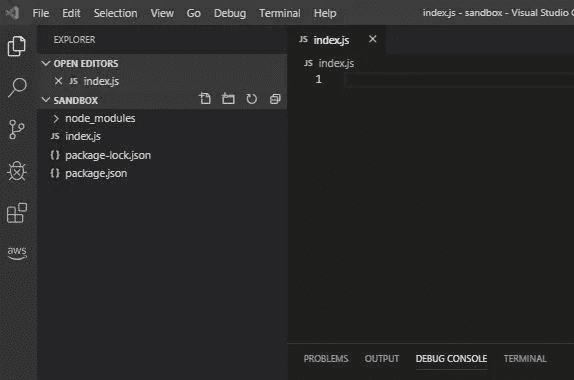
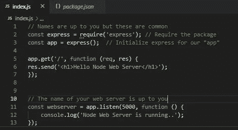
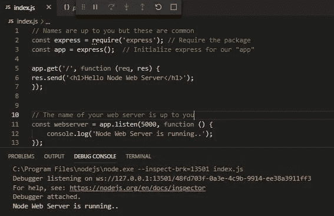
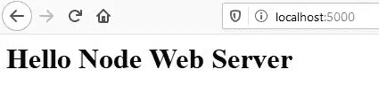
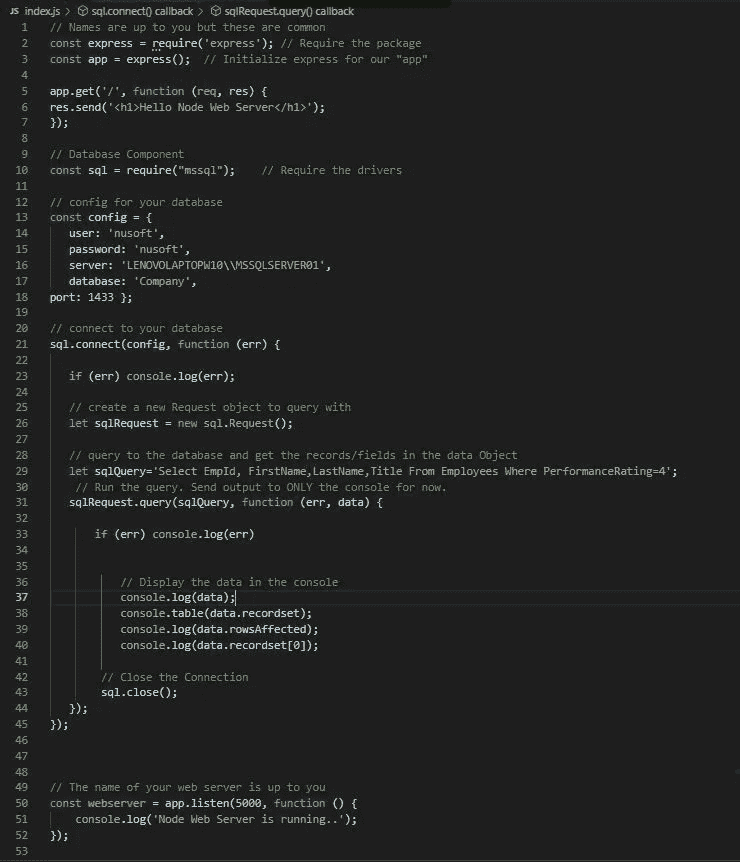
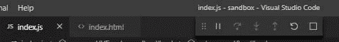
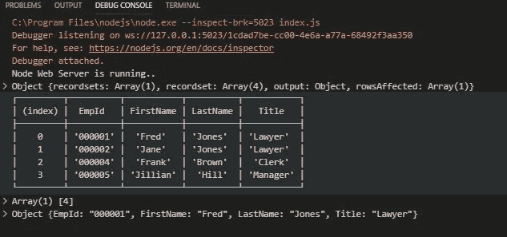

# 使用 Node.js 查询 SQL Server

> 原文：<https://javascript.plainenglish.io/querying-sql-server-with-node-js-4197361c0fb1?source=collection_archive---------0----------------------->

## 添加节点 Web 服务器

Photo by fabio on [Unsplash](https://unsplash.com)

## 我们正在做什么

我们把我在[之前的文章](https://link.medium.com/w1Y4GMvCh1)中所做的工作提升了一个档次。在那篇文章中，我们用 node.js 查询了一个 SQL Server 数据库

N 现在我们想添加一个节点 web 服务器，这样我们可以将数据发送到节点 Web 服务器，在数据库查询中使用它，并将结果返回到网页。

这将是一个“基本原则”练习(你以后会明白的。)

## **我们想要完成的目标**

*   创建一个节点 Web 服务器。
*   发布网页上的数据，以便在我们的 SQL Server 数据库查询中使用。
*   将结果发送回网页。

> 全圈(基本全栈。)一旦你能做到这一点。你可以做任何事。
> 
> 它开始让 Vue、React 和 Angular 之类的东西变得更有意义。

## 我们将使用什么

除了现有的节点包和模块，我们只需要新的。

*   express——一个流行的 web 框架
*   主体解析器——帮助从网页中获取表单数据。

除此之外，我们将尽可能保持简单(普通)的 JavaScript(基本原则)。

为什么要用普通的 JavaScript 呢？因为从“基本原则”看事情是如何完成的，这不仅让我们对其他模块、框架和库(React、Vue 等)更加欣赏。)但也可能让我们意识到，“嘿，我真的不需要那些。”

我们可能最终想要 React 或 Vue 的能力，但如果我们不需要，为什么要背负这个重量呢？

没有必要先阅读[之前的文章](https://link.medium.com/w1Y4GMvCh1)，因为我将检查我们需要的核心内容，但这可能是有益的。

> 如果没有别的，你可能想看看我的数据库设置。你可以完全不同，但我有免费下载一些有用工具的链接，如果你没有 SQL Server 的话。

## 我们开始吧

我假设你已经安装了 node.js，如果没有，可以在这里下载。

我们将从设置 node.js Web 服务器并测试它开始。然后像前面一样添加类似的代码来连接和查询我们的 SQL Server 数据库。

我们将使用 node.js 、[、 **Express** 、](https://expressjs.com/)的**极简 Web 服务器框架。它作为 **npm 包**安装。**

正如许多事情一样，总有更多的东西需要学习，所以当我让你输入一个命令时，一定要多读一些关于这个命令及其选项的内容。

## **准备就绪**

1.  对于项目，创建一个目录/文件夹。
2.  打开 Visual Studio 代码(VSCode)并打开文件夹。
3.  打开一个新的终端窗口，输入
    `npm init`
    接受默认设置来创建你的 [**package.json**](https://docs.npmjs.com/files/package.json) 。

4.在 VSCode 中创建一个文件，并将其保存为 index.js。如果查看 package.json 文件，您会发现可以在哪里更改默认的“main”文件。

Basic starting point

5.在终端窗口中键入
`start npm` 这将启动 node.js 服务器。

## 网络服务器

在终端窗口中键入
、`npm install express`

这将安装 Web 框架。

**我们准备好摇滚了！**

Web 服务器的核心是**请求**express 包并将其分配给持有者(变量或常量。)所有对 Web 服务器的引用都将通过此持有者。

我们必须启动 web 服务器，并让它监听 HTTP 端口，我将选择 5000。8080 很常见，只是可用的东西。

我们希望 Web 服务器至少能够响应 HTTP get 方法。这将允许使用“踢轮胎”，并确保它的工作。MDN 上的 HTTP 方法[中有更多内容。我们将使用 GET 和 POST。](https://developer.mozilla.org/en-US/docs/Web/HTTP/Methods)

*   GET 用于从资源中检索。
*   POST 用于提交给资源。

输入下面的代码，我们来讨论一下。

## Web 服务器示例

The core set up.

*   我们**需要**express 包，按照惯例将引用存储在 *express* 中，但是根据需要命名。
*   **初始化**express 的一个实例，按照惯例将引用存储在 *app* 中，但是根据需要命名。
*   在第 11 行，我们存储了一个引用，指向我们的 web 服务器将要监听的位置。端口 5000。
*   在第 5 行中，我们通过使用 **app.get** 来使用 web 服务器的 HTTP GET with out 实例。默认情况下，这将从根目录('/')获取数据。回调函数非常重要，因为它包含了**请求** ( **req** )和**响应** ( **res** )对象。名称 req 和 res 是约定俗成的。

## 请求和响应

*   **请求**将来自我们浏览器的 url。更多信息可在[这里](https://developer.mozilla.org/en-US/docs/Web/API/Request)找到。
*   **响应**是对请求的响应。更多可以在这里找到[。](https://developer.mozilla.org/en-US/docs/Web/API/Response)

> 简而言之，我们的浏览器将发出请求，我们将发回响应。

***旁注*** *:我其实更喜欢上面第 5 行和第 11 行的 ES6 语法。我的意思是，我更喜欢箭头函数。例如，在第 5 行中，我通常不写* ***app.get('/')，function(res，resp)*** *{…而是写* ***app.get('/')，(res，resp)= > {…*** *，而不是第 11 行中的* ***app.listen(5000，function()***

***踢轮胎***

1.  *在 VSCode 中，在“调试”菜单中按 F5(启动调试的缩写。)您的控制台应该如下所示。*

**

*Look for the console message. The top has controls for stopping/refreshing, etc.*

*2.在浏览器中输入 LocalHost:5000，然后按回车键。您应该看到以下内容。*

**

*Yay!*

> *您的浏览器发出了一个 GET 请求，我们使用 **res.send** 发回了一个响应。*

## *节点 SQL Server 连接*

*(如果之前已完成，则为可选。)在终端窗口中，键入
`npm install mssql`这将安装 SQL Server 驱动程序。*

## *数据库示例*

*这是与我的前一篇文章完全相同的*起始代码*，所以我不会详细讨论它。然而，它在**应用程序**对象中的位置很重要。*

*有几件事情需要注意，在我们的初始测试之后**将会与之前有所不同，***

*   *我们员工的绩效评级将通过网页发送(张贴。)*
*   *使用 Response 将查询的结果输出到网页。*

## *数据库连接/查询示例*

*在下面输入代码。*

> *值得注意的是，我们有一个 Web 服务器和一个数据库连接和查询。**但它们并不相互作用。还没！***

**

*Disconnected Web Server and Database Connection*

*通过停止并启动 web 服务器或刷新来运行它*

**

*Refesh/Stop and other options*

*您将看到 web 服务器正在运行，并且有来自查询的数据的控制台输出。但是我们没有从 web 服务器获得任何东西，也没有向网页发送任何东西。*

**

*Our web server note and Database Query Output*

## *HTML*

*当用户访问我们的网站时，我们需要提供一个页面。该页面将允许他们发送可在数据库查询中使用的参数(PerformanceRating)。*

> *注意:我不会关心我们网页的样式。这将是简单而中肯的。*
> 
> *我们也保存了根目录中的所有内容。最佳实践？不会吧！但是我们追求功能性。清理工作可以稍后进行。*

1.  *创建以下网页，命名为**index.html**和**Employees.html**。*

*   *index.html 将是我们的主要来源页面。*
*   *Employees.html 将是我们结果的终点。*

**

*Simple startup page, index.html*

*注意*