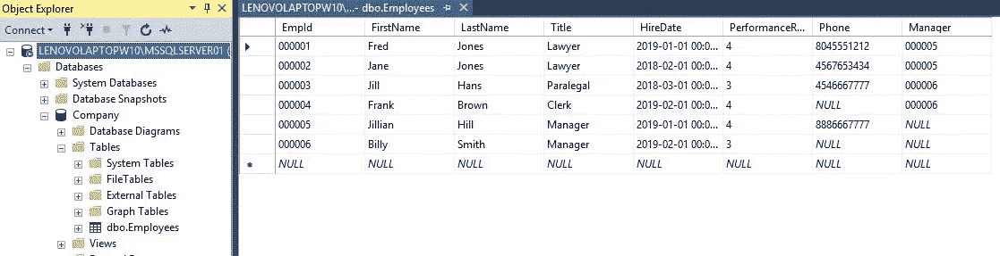

# 使用 Node.js 查询 SQL Server

> 原文：<https://javascript.plainenglish.io/querying-sql-server-with-node-js-f5567dea5fa4?source=collection_archive---------0----------------------->

## 连接、查询、显示和关闭

Photo by Tobias Fischer on [Unsplash](https://unsplash.com/)

> JavaScript 在 node.js 中运行时，是一种用于与数据库交互的强大语言。

我在这个领域的典型用例是拥有一个 [AWS Lambda 函数](https://aws.amazon.com/lambda/)，运行 [node.js](https://nodejs.org/en/) ，作为我的前端和后端数据库之间的中间件组件，执行一个或多个 [CRUD](https://en.wikipedia.org/wiki/Create,_read,_update_and_delete) 操作。

在我们开始创建中间件组件之前，我们需要有一个工作的基础。

> 在本文中，我们将讨论连接到一个 [Microsoft SQL Server 数据库](https://www.microsoft.com/en-us/sql-server/sql-server-downloads)，从一个表中请求数据(查询)，然后关闭连接的最低要求。

一旦我们有了基本的方法，在以后的文章中，我们可以专注于巩固它，扩展它，并创建一个完整的 CRUD 组件。

**为什么不给我看一整套 CRUD 操作**？因为我喜欢从简单的东西开始，然后从那里开始。

## 假设

我假设您已经可以访问 SQL Server 数据库，其中至少有一个您想要查询的表。如果没有，

*   *SQL Server Express 和 Developer Editions 是免费的！并且可以在这里* *下载* [*。*](https://www.microsoft.com/en-us/sql-server/sql-server-downloads)
*   *SQL Server Management Studio 也是免费的！并且可以在这里下载***。**

*我将直接编写 node.js 代码，因此将假设您可以访问 Visual Studio 代码(VSCode)或 Visual Studio。如果没有，*

*   *VSCode 免费！并且可以在这里下载[。](https://code.visualstudio.com/download)*
*   *Visual Studio 社区版是免费的！并且可以在这里下载[。](https://visualstudio.microsoft.com/downloads/)*

*并安装 node.js。如果没有，*

*   *Nodejs 可以在这里下载[。](https://nodejs.org/en/download/)*

*为了使本文简明扼要，我将不讨论如何安装和配置这些项目。这正是这篇文章所需要的。*

# *设置*

## ***我的 SQL Server 安装***

*我的 SQL Server 实例和数据库(公司)带有一个表(雇员。)*

**

*SQL Server Instance, Database and Table*

> *我们的目标是检索绩效评分为 4 的员工的 EmpId、FirstName、LastName 和 Title。*

***SQL 查询***

*如在 SQL Server Management Studio (SSMS)中编写和测试的。)*

**

*The SQL Query*

# *我们开始吧*

*为 node.js 安装 SQL Server 驱动程序( *mssql* )*

**我假设你已经设置好运行 node.js 了。如果没有，这里有一个很好的使用 VSCode 的教程。**

1.  *创建一个您希望在其中工作的文件夹*
2.  *打开 VSCode，从“文件”菜单中打开该文件夹。*
3.  *进入**终端菜单**并选择**新终端。***

**

*Opens PowerShell*

*4.在终端窗口中，键入 *npm init* 并接受默认值以创建 package.json 文件。*

*5.**重要的一步**。键入 *npm install mssql* 来安装驱动程序。这将建立一个 ***node_modules*** 文件夹，您可能想要浏览它。*

**

*We are ready to roll!*

# *代码和结果*

*由于我们的 package.json 使用 *index.js* 作为主文件，**创建一个名为 index.js** 的文件。(根据需要随意命名文件并修改您的 package.json。)*

*完整的代码和结果如下。查看这段代码，阅读下面的信息，然后将其输入到 index.js 中。*

**

## *说明*

*首先，我们访问了 SQl Server 的数据库驱动程序，第 3 行。*

*接下来，第 6–11 行，我们设置了所需的配置，告诉我们的代码如何找到我们的**数据库实例**、访问它所需的**凭证**以及我们想要访问的**数据库**。*

*下一步，第 14 行，建立连接。如果我们想先测试连接，我们可以跳过第 19–31 行，直接停止。如果你有困难，我建议你这样做。如果您输入了查询代码，只需将其注释掉。*

*为了创建查询，我们创建一个**请求**对象。我们为请求对象的查询方法指定所需的参数。*

*我们做的最后一件事是**关闭**连接。如果要执行更多操作，请保持打开状态。*

## *维奥拉。数据*

*返回的数据实际上是一个相对复杂的对象。为了更详细地处理这个问题，你需要解析它。*

*注意第 29 行(刚刚添加的)和原始数据对象的输出。*

**

*Raw data.*

# *结论*

*为了巩固我们的步骤，我们安装了驱动程序，指定了要连接的内容以及我们希望如何连接。打开连接，查询并关闭连接。*

*我们能做得更多吗？还能更结实吗？哦，是的！*

*在以后的文章中，我们不仅会执行额外的 CRUD 操作，还会将这些操作放入 AWS Lambda 函数中，使用 [AWS JavaScript SDK](https://docs.aws.amazon.com/sdk-for-javascript/v2/developer-guide/welcome.html) 连接前端，最终得到一个全栈应用程序。*

*我们刚刚触及了许多权力的表面。*

***感谢您花时间阅读和编写代码。***

*问题或疑问对任何提到的项目，发送一个问题。我的目标是你的成功。*

## *补充项目*

*   *[Object.assign()](https://link.medium.com/X9rvWUZlo1)*
*   *[JavaScript 类](https://link.medium.com/USs9sPFoyZ)*
*   *[比较 JavaScript 中的对象](https://link.medium.com/bdr1puAKS0)*

*你也可以享受，*

* [## 使用 Async/Await 在 Node.js 中查询 SQL Server

### 一种更简洁的数据库查询方式

medium.com](https://medium.com/javascript-in-plain-english/querying-sql-server-in-node-js-using-async-await-5cb68acf2144)*