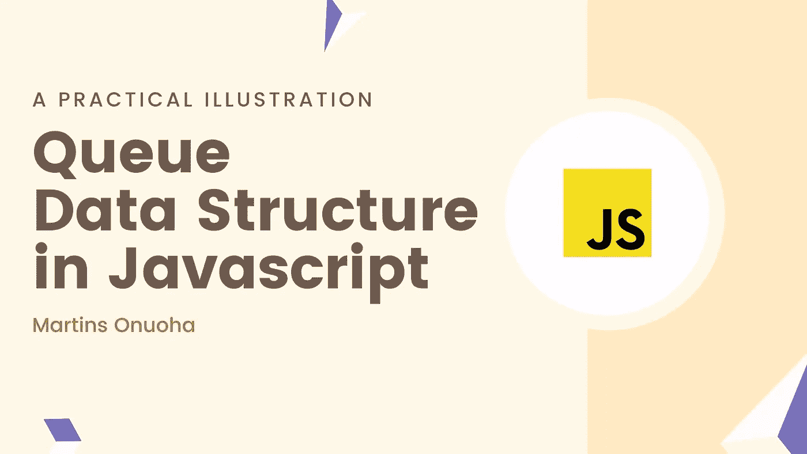
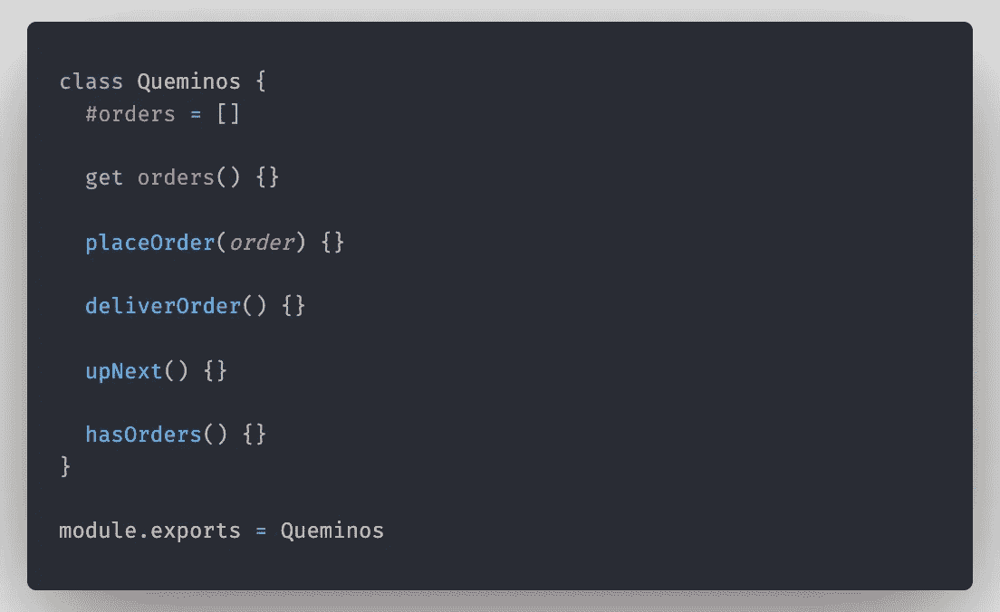
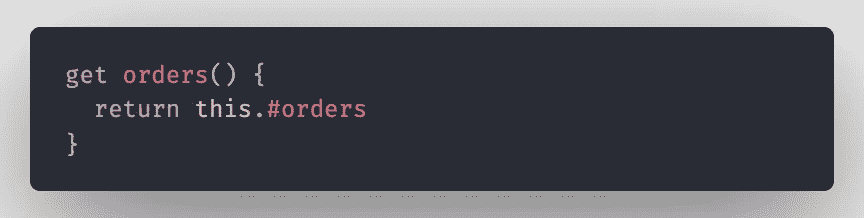
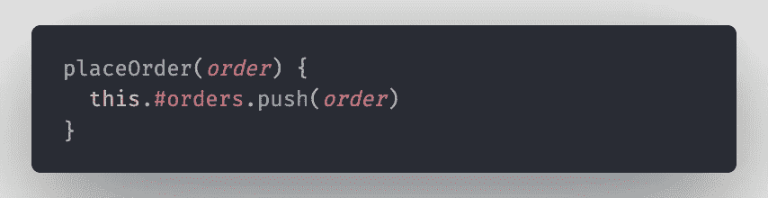
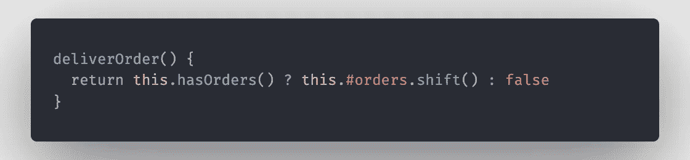
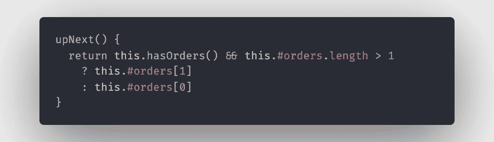
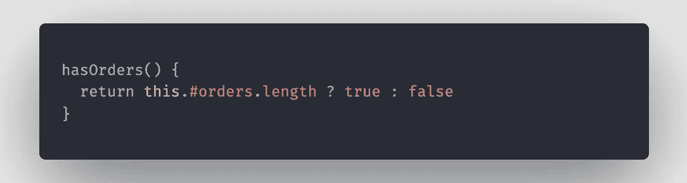
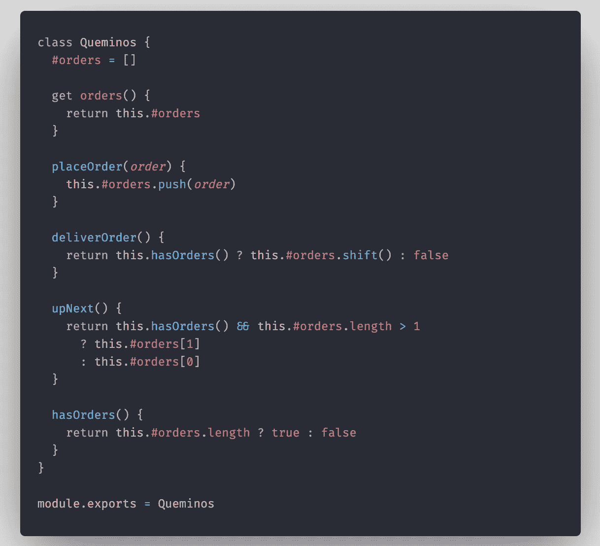
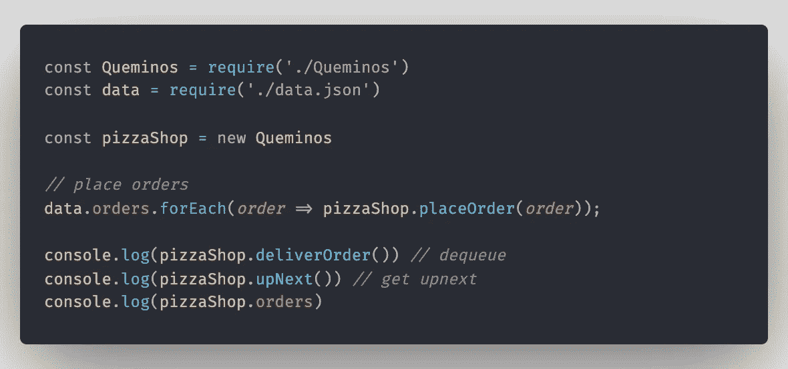

# JavaScript 中的队列数据结构

> 原文：<https://javascript.plainenglish.io/queue-data-structure-in-javascript-ea6601e41201?source=collection_archive---------12----------------------->

## 一个实际的例子。



> [以黑暗模式](https://devjavu.space/post/queue-data-structure-in-javascript/)阅读本文，轻松复制粘贴代码示例，在 [Devjavu](https://devjavu.space/) 上发现更多这样的内容。

[](https://devjavu.space/post/queue-data-structure-in-javascript/) [## JavaScript | Devjavu 中的队列数据结构

### 数据结构。计算中的数据结构是一种“结构”(和关系的排列…

devjavu.space](https://devjavu.space/post/queue-data-structure-in-javascript/) 

# 数据结构？

对，数据结构。计算中的**数据结构**是数据值的“结构”(事物的各部分或元素之间的排列和关系)，它概述了这些值之间存在的关系，以及可应用于所有或部分这些值的函数或操作。

## 好吧，那么什么是队列？

嗯，队列是一种**类型**的数据结构，它以线性/顺序(一组相关的事件、运动或以特定顺序相互跟随的项目)的形式保存数据集合，其中通过在序列的一端添加实体和从序列的另一端删除实体来进行修改。

> 其中通过在序列的一端添加实体并从序列的另一端移除实体来进行修改。

如果你有基本的计算机科学或会计知识，这可能听起来很熟悉。这是先进先出的概念。

计算和系统理论中的 FIFO 是一种组织数据结构操作的方法——通常，特别是数据缓冲区——其中进入的**第一项** **是最先被删除的。**

# 酷，那么这在哪里适用呢？

## 实际例子

到目前为止，我们只讨论了理论上的定义。让我们以一家比萨饼店作为实际例子。Que-minos 是这家店的名字——他们做比萨饼。理想情况下，他们按照“先来先服务”的原则(先进先出)顺序接收和交付订单。每个顾客走进去，走向柜台，下订单，然后坐下来等待，一旦第一个订单完成，比萨饼就被送到了，下一个订单就被处理了。


It was the best name I could come up with, really.

对于 JavaScript，几乎显而易见的是，队列必须使用数组对象来实现(数组是 JavaScript 最强大的数据结构——当然有争议)。

我们将实现一个 **Queminos** 类来表示我们的队列结构。这个类有一些重要的方法来:

*   **place order**(**enqueue**):该方法向订单列表中添加一个新订单。也称为入队—将(等待处理的数据项)添加到队列中。
*   **deliverOrder** ( **出列)**:该方法完成后将订单交付给客户。它执行出列功能，因为它在结算后从队列中删除一个元素。
*   **upNext** :该方法返回当前订单交付后应该关注的下一个客户(理想情况下，该订单应该在索引 1 处)。
*   **hasOrders** :这是一个 helper 方法，允许 Queminos 确定是否有可用的订单。
*   orders :这将是一个 getter 方法，这个方法将帮助我们看到所有可用的订单。

## 文件夹结构

我们将有一个简单的文件夹结构，一个文件保存我们的 Queminos 类，另一个文件导入和使用该类，还有一个文件保存订单数据。

```
.
|-- Queminos.js
|-- app.js
`-- data.json
```

## 奎米诺斯级



这里我们使用类声明来创建 **Queminos** 类。然后，我们声明一个私有类属性“orders ”,并将值设置为一个空数组。这将保存 Queminos 收到的所有订单。

> 在 ES2019 中，私有类字段是使用哈希`#`前缀定义的:这是必需的，这样一个类的某些字段/属性在该类之外(例如，从该类的一个实例)是不可变的或不可访问的。这是围绕 OOP 中[封装](https://en.wikipedia.org/wiki/Encapsulation_(computer_programming))的思想设计的。

好了，让我们实现每个方法:

由于我们不能在类外访问/改变“orders”属性(因为它是私有的)，我们将实现一个返回私有“orders”属性的 [getter](https://developer.mozilla.org/en-US/docs/Web/JavaScript/Reference/Functions/get) 方法“orders”。



placeOrder 方法接受单个参数“Order ”,并将其添加到订单数组中。这基本上是我们的**入队**方法。



作为**出列**方法实现的 deliverOrder 方法删除 orders 数组中的第一个元素(还记得 FIFO 吗？).首先，我们使用 hasOrders 方法来检查队列中是否存在订单，然后再尝试删除任何订单。

[](https://medium.com/javascript-in-plain-english/understanding-and-applying-array-methods-in-javascript-df7873ad611) [## 理解和应用 JavaScript 中的数组方法

### 赋值函数、访问函数和迭代器组。

medium.com](https://medium.com/javascript-in-plain-english/understanding-and-applying-array-methods-in-javascript-df7873ad611) 

下面是 JavaScript 中数组方法的实际例子列表。

前面提到的 upNext 方法返回队列中要处理的下一个订单。首先，我们需要检查是否有订单，然后检查当前订单后面是否有订单。



最后，hasOrder 方法只是检查#orders 数组中是否有订单。



我们的 Queminos 类现在应该是这样的:



注意，我们正在导出 Queminos 类，这样我们就可以在这个文件之外使用它。

## 数据

我们的 JSON 数据非常简单。这是一个对象格式的接收订单列表。如果你愿意，你可以把它变得更简单，使用字符串。


我们将把我们的类导入 app.js 文件以及我们的 JSON 数据。从这里我们可以测试我们的排队系统。



这就是 JavaScript 中队列的实际实现。

## 用简单的英语写的便条

你知道我们有四份出版物和一个 YouTube 频道吗？你可以在我们的主页 [**plainenglish.io**](https://plainenglish.io/) 找到所有这些内容——关注我们的出版物并 [**订阅我们的 YouTube 频道**](https://www.youtube.com/channel/UCtipWUghju290NWcn8jhyAw) **来表达你的爱吧！**

这是源代码的链接。

[](https://github.com/MartinsOnuoha/js-queue-example) [## MartinsOnuoha/js-queue-example

### Javascript 中队列数据结构的基本示例-MartinsOnuoha/js-Queue-example

github.com](https://github.com/MartinsOnuoha/js-queue-example) 

干杯。☕️