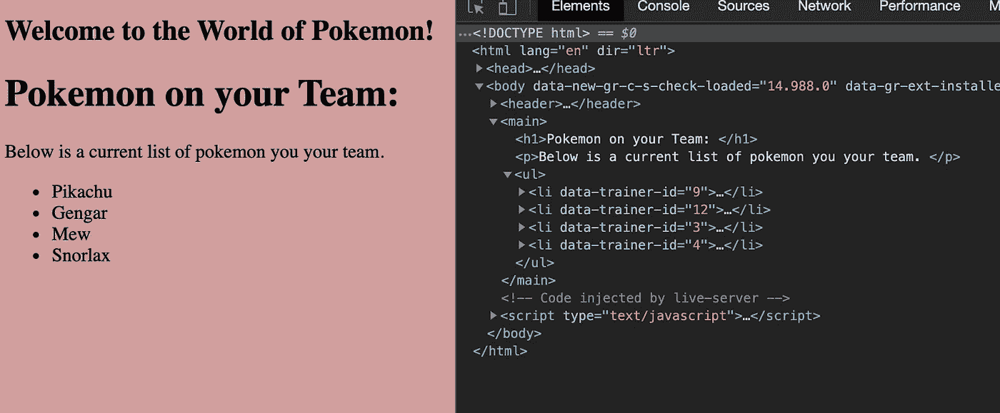
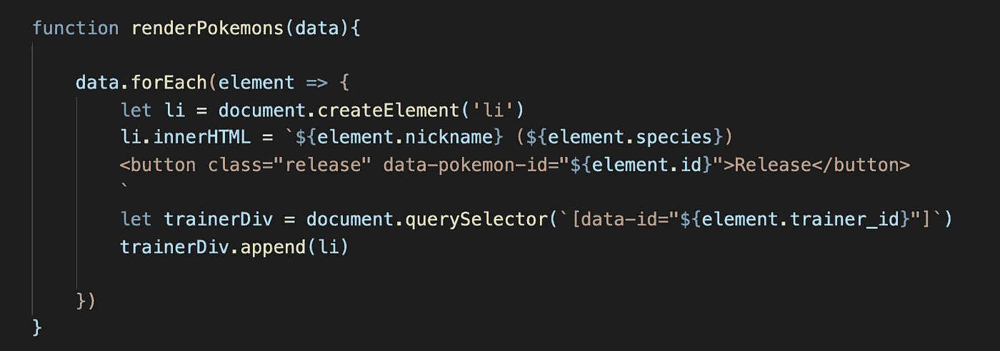
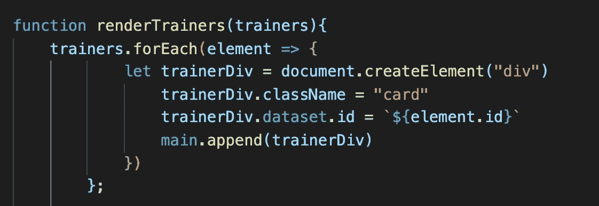
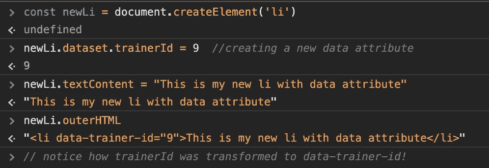
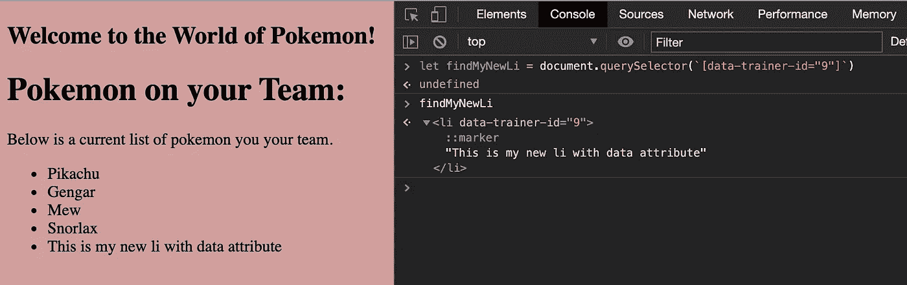
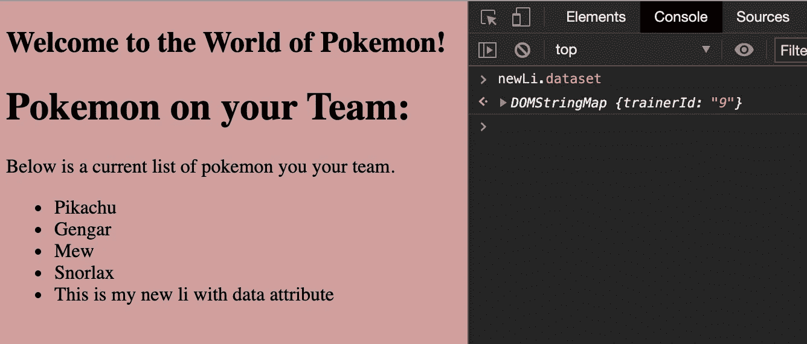
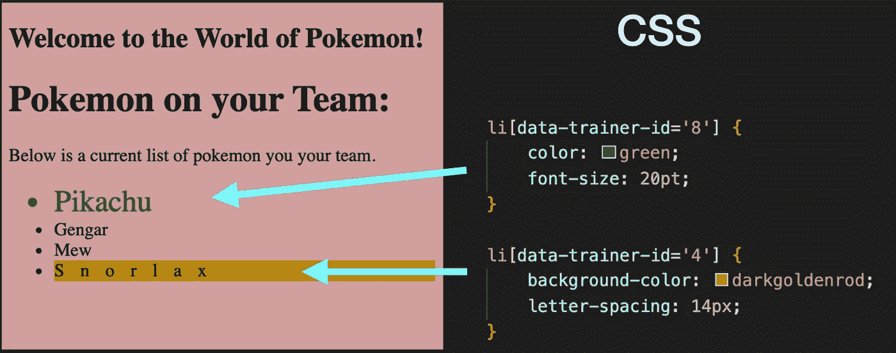

# 如何在 JavaScript，CSS + HTML 中使用数据属性

> 原文：<https://javascript.plainenglish.io/quick-guide-to-using-data-attributes-f1f2c3161d5f?source=collection_archive---------1----------------------->

## 在 DOM 上存储附加信息的聪明方法

Photo by Franki Chamaki via Upsplash

这篇文章是在 JavaScript 中使用数据属性的简短快速的指南——当我开始自己的 JavaScript 之旅时，我希望我知道更多。

## 什么是数据属性？

数据属性实际上是 HTML 属性，允许您为 HTML 元素创建和分配定制的数据点。它们可以通过 HMTL、CSS 和 JavaScript 访问，这使它们成为存储可能不太适合`class`列表或`id`的信息的强大选择。毕竟，我们应该致力于保留`class`和`id`属性用于样式化目的，否则，事情会很快变得非常混乱。

## HTML 中的数据属性

识别 HTML 中的数据属性非常容易，只需在 HTML 元素标签中查找任何带有`data-something`的内容。在这种情况下，`something`可以是您想要的任何东西，尽管最好的做法是将其命名为表达式，以便您和使用您代码的其他程序员可以很容易地分辨出该数据属性中存储的是什么类型的信息。要在 HTML 中创建一个数据属性，只需以`data-`开始属性，并选择一个对您有意义的名称。您需要使用赋值操作符`=`，将数据属性值设置为`string`。如果您的数据属性需要两个或更多的单词，只需在每个单词之间添加一个破折号。例如，如果我想创建一个名为“trainer id”的数据属性，我会在所需的 HTML 元素中将它写成`data-trainer-id`。

在下面的代码中，我们可以看到这个硬编码到 HTML 中的例子。我决定给无序列表中的不同`li`添加数据属性，这样我就可以关联每个口袋妖怪的训练师 id。通过这样做，我可以很容易地检索关于什么口袋妖怪属于什么训练者的信息，并根据需要快速应用 JavaScript 或 CSS 更改。

Screenshot of Chrome devTools showing the data attributes associated with each li element

数据属性不会出现在您的浏览器中，因此不必担心我们的用户是否会看到它。

## 用 JavaScript 创建数据集

虽然您可以在 HTML 中硬编码数据属性，但最好是在 JavaScript 中创建它们，以便值保持动态。下面是作为`button`元素的一部分创建的数据属性的屏幕截图。

快速分析以上代码中发生的情况，了解更多上下文:

*   函数`renderPokemon()`接受一个`data`参数，在本例中是一个对象数组。
*   该函数然后应用`.forEach()`方法迭代`data`数组中的每个对象。
*   在每次迭代中，我们都要创建一个`li`元素，用该元素的`nickname`和`species`属性填充它，同时创建一个`button`，它的数据属性指向该元素的`id`。在这种情况下，数据属性被称为`data-pokemon-id`。

**Phew***好，回到数据属性…

在这种情况下，我们仍然为数据属性硬编码 HTML 代码，但是动态地应用该属性的值。在我们的 JavaScript 文件中这样做可以让我们对数据属性有更多的控制、通用性和可用性。但是，我们可以做得更好……

## 在 JavaScript 中使用数据属性

我们实际上可以在 JavaScript 中使用点符号来创建和分配数据属性，只需要稍微改变一下语法。当使用 JavaScript 时，我们现在使用`dataset`代替`data-`，当创建一个包含多个单词的数据属性时，我们切换到 camel case`thisIsCamelCase`。

在上面的代码中，我们保持了简单，并为`trainerDiv`元素分配了`id`的数据属性。这是通过使用点符号`.dataset`来完成的，后跟属性的期望名称。如果我们想用点符号来创建或分配一个包含多个单词的数据属性，比如“培训师 id”，那么它应该是这样的:`trainerDiv.dataset.trainerId`。HTML 中的结果看起来就像我们的第一个例子，我们将数据属性硬编码到元素标签中。

Screenshot shows the creation of a new element, newLi, and a new data attribute called “trainer id”

一旦我的`newLi`被添加到 DOM 中，我就可以使用传统的 DOM 遍历技术来搜索该节点，比如`.querySelector()` …

Used .querySElector to find the data attribute we just set.

或者，如果我们已经有了元素，我们可以再次使用点符号来检查它的数据属性！

The console returns the [DOMStringMap](https://developer.mozilla.org/en-US/docs/Web/API/DOMStringMap) object where data attributes are stored in JavaScript.

不用担心上面截图中的`DOMStringMap`，那只是用于 HTML.dataset 属性的界面(也就是我们从`DOMStringMap`中得到`.dataset`)。

## CSS 中的数据属性

最后，由于数据属性只是普通的 HTML 属性，我们也可以在 CSS 中使用这些数据属性。例如，我们可以将具有`data-trainer-id = "8"`和`data-trainer-id = "12"`的`li`元素作为目标，根据教练的 id 应用风格变化。

CSS targeting data attributes of specific values for style changes.

## 结论

TLDR；数据属性是存储不适合/不应该出现在 HTML 元素的`id`或`class`属性中的额外数据的好方法。可以使用以下语法在 HTML 或 JavaScript 中创建和分配数据属性:

*   HTML: `data-some-name = "value"`(使用破折号)
*   JavaScript: `element.dataset.someName = "value"`(使用。数据集和骆驼箱)

数据属性可以通过点符号或使用 DOM 遍历技术来访问，如`.querySelector()`:

*   `element.dataset`
*   `element.querySelector('[data-some-name = "value"]')`和`value`是您正在寻找的实际值(例如，9，“蓬松度”等。)

CSS 也可以使用数据属性来应用样式更改。