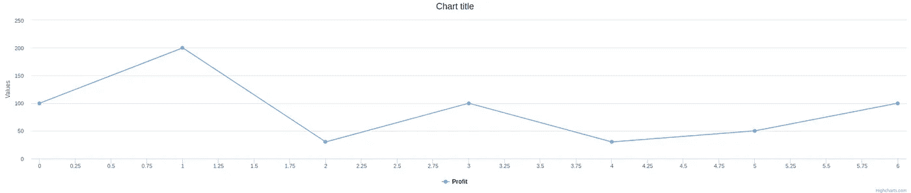
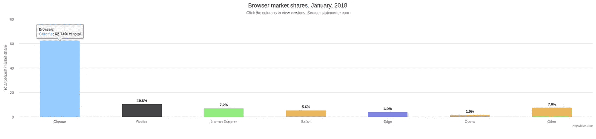
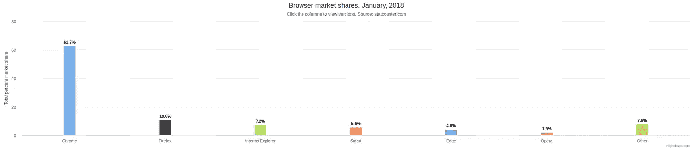

# 如何在 React with Highcharts 中创建数据可视化

> 原文：<https://javascript.plainenglish.io/quick-integration-of-highcharts-with-react-9f796a396093?source=collection_archive---------3----------------------->

Highcharts 是一个用 JavaScript 编写的图表和数据可视化库。该库目前支持线条、样条、面积、面积样条、柱形图、条形图、饼图、散点图、角规、面积范围、面积样条范围、柱形图、气泡图、盒图、误差线、漏斗图、瀑布图和极坐标图类型。


Photo by Carlos Muza on Unsplash

当我在工作中接触到 Highcharts 库时，我惊讶于它有这么多的特性，以及从数据源到 UI 元素的数据流的简单性。在这篇文章中，我们将介绍用 React 建立库的过程，并且我们将有一些例子。我希望你喜欢这个快速教程。

## 1.设置

好了，让我们开始，让我们快速概述一下如何使用 Highcharts 和 React。这不是一个 React 教程，我假设你已经有了一个 React 应用程序，你需要两个包，一个叫做`highcharts`，另一个叫做`highcharts-react-official`。我们可以使用`*npm*`命令安装它们:

```
npm i highcharts highcharts-react-official
```

## 2.在 React 应用程序中导入

现在，既然我们已经安装了包，我们需要将它们导入到`App.js`中，使用`Highcharts`组件，并将*道具*传递给它:

Highcharts with empty options

由于我们传递了空对象 prop `options`，将会看到只有标题的空图表。


Just the title

## 3.一个简单的实物期权的例子

我们将添加简单的*选项*与***`*series*`*对象。系列选项的对象是一个对象数组，其中可能包含要可视化的名称和数据。****

***Highcharts with options***

***我们将这些选项作为道具传递到这里，现在我们的图表在 React 应用程序中工作:***

******

## ***4.更高级的例子***

***在这个例子中，我们将创建具有许多特性的柱形图，比如数据标签、标题、边框宽度和工具提示。***

***Bar chart component***

******

***Bar chart visualization***

***我们看到许多选项，其中许多是不言自明的，但是，我们的图表几乎没有变化的是:***

```
***...
plotOptions: {
  series: {
    borderWidth: 0,
    dataLabels: {
      enabled: true,
      format: '{point.y:.1f}%'
    },
  }
},
tooltip: {
  headerFormat: '<span style="font-size:11px">{series.name}</span><br>',
  pointFormat: '<span style="color:{point.color}">{point.name}</span>: <b>{point.y:.2f}%</b> of total<br/>'
},
...***
```

***`plotOptions`有`series`属性，指定`0`的边框宽度和百分比`format: ‘{point.y:.1f}%’`的数据标签。***

***`tooltip`有两个属性，一个是`headerFormat`，是`{series.name}`的`span`；另一个是`pointFormat`，是*工具提示`{point.name}`中的*及其百分比值`{point.y:.2f}%`。***

**让我们尝试添加`pointPadding: 0.2,`来调整条的宽度:**

```
**...
plotOptions: {
  series: {
    pointPadding: 0.2,
    borderWidth: 0,
    dataLabels: {
      enabled: true,
      format: '{point.y:.1f}%'
    },
  }
},
...**
```

****

**Bar-charts with a smaller width**

## **4.饼图**

**Highcharts 非常灵活，使我们能够用一条线的变化做出完全不同的图表，**

```
**...
chart: {
  type: 'pie' {" instead of column in previous example"}
},
...**
```

**如上所述，有许多类型的图表，这个库的健壮性使我们只担心数据，所有的 UI 都被处理，比如说，使用 JavaScript API 模块来处理我们想要查看的数据的所有属性。**

****

**Pie chart**

**最后，这是一个超级快速的教程，下一次将覆盖很多类型的图表，以及如何通过导航选项`objects`来充分利用这个**库**。**

**[领英简介](https://www.linkedin.com/in/hafid-menasria-9327b1a6/)**

**保重。**