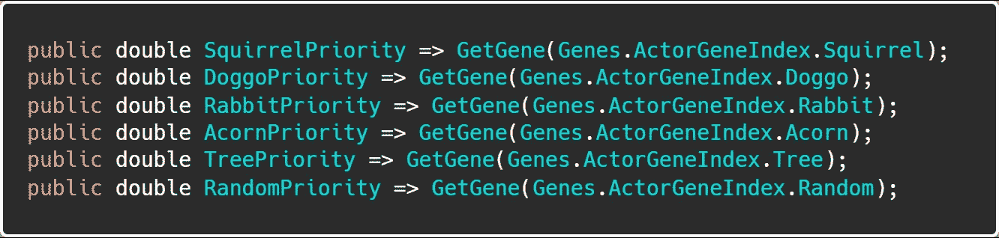
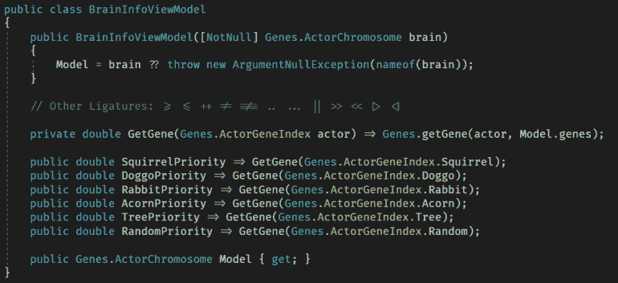
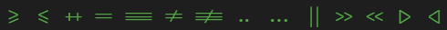
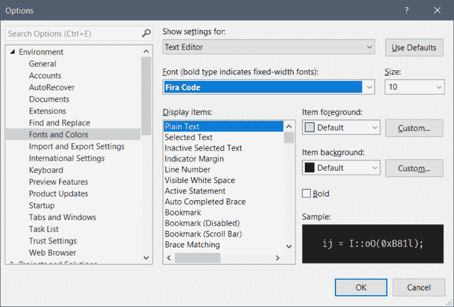

# 快速提示:编辑器中的现代箭头

> 原文：<https://javascript.plainenglish.io/quick-tip-modern-arrows-in-your-editor-365db6fd4254?source=collection_archive---------6----------------------->

让我给你看一个我周末学到的新把戏。JavaScript、TypeScript、C#等语言为它们的操作符提供了类似的语法。通过使用字体连字，您可以用单倍行距、面向程序员的现代格式来表示这些语言特性。

因为一张图片至少值 42 个字，所以看一下下面的代码:

注意到箭头函数使用了`=>`操作符吗？现在看看这在我的开发环境(Visual Studio 2019)中是如何呈现的:

看看箭头功能现在是如何以箭头的形式出现的？这一点点额外的天赋是*更令人高兴的*，加强了这些现代运营商的使用。

然而，这不仅仅局限于箭头函数。看看其他这些操作符:

我特别喜欢的是等式陈述是如何呈现的。特别是在 JavaScript 中，这有助于您快速发现`==`和`===`之间的差异，这可能是发现 bug 和遗漏 bug 之间的差异。

那么，如何开始呢？

首先，通过从其 [GitHub 库](https://github.com/tonsky/FiraCode/tree/master/distr/ttf)下载并安装字体来安装 Fira 代码字体。只安装常规版本应该没问题，但是如果你愿意，你也可以安装其他版本。

接下来，打开你最喜欢的编辑器的字体对话框，把你的字体改成 Fira 代码。

最后，关闭编辑器并重新启动它。这将确保启用我上面描述的连字。这可能不是所有开发环境都需要的，但在 Visual Studio 中是需要的。

就是这样！你应该可以走了。

希望这种现代的语言特征能让你和我一样开心。就我个人而言，更好的修饰让我觉得自己更棒、更有能力。

让我知道你是怎么想的，或者你使用了什么技巧来保持你所选择的编辑器的出色和高效。

*原载于 2019 年 11 月 13 日*[*https://killalldefects.com*](https://killalldefects.com/2019/11/12/quick-tip-modern-arrows-in-your-editor/)*。*