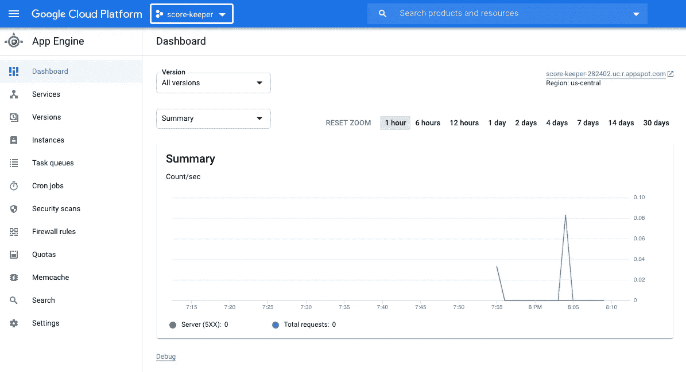
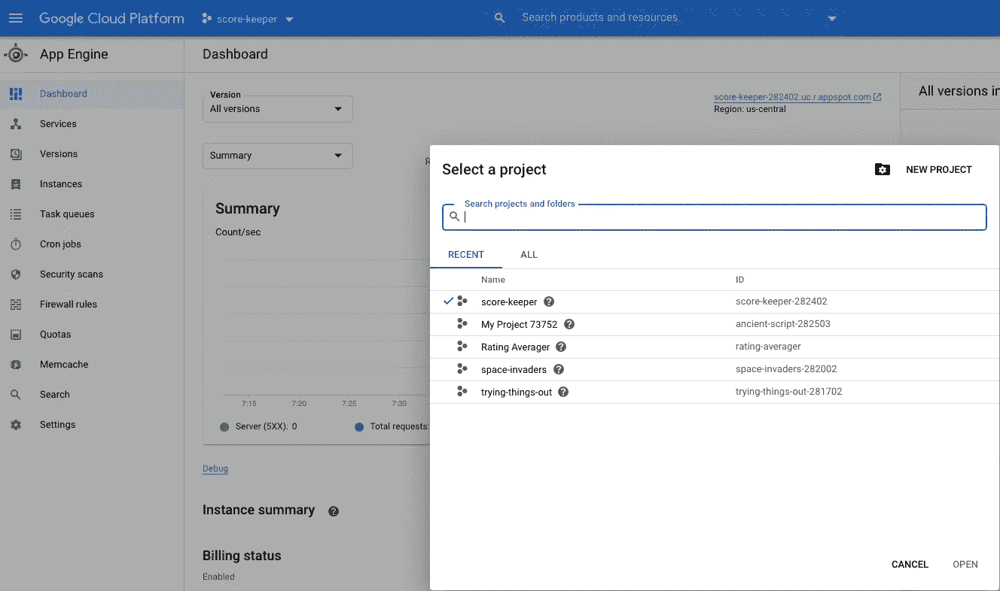
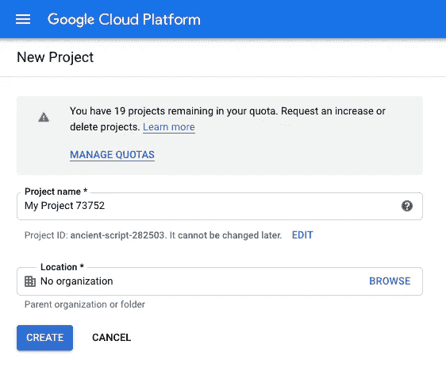
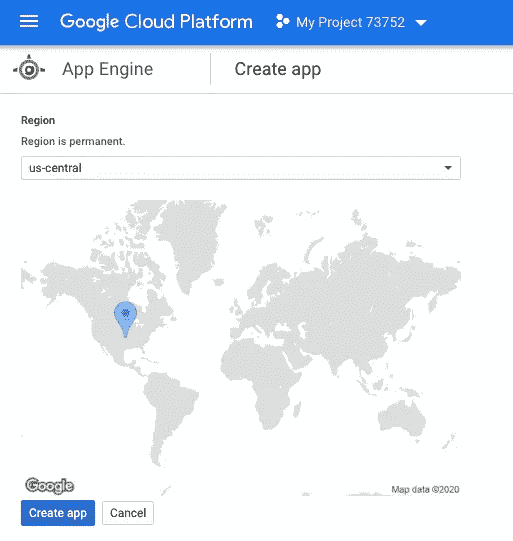
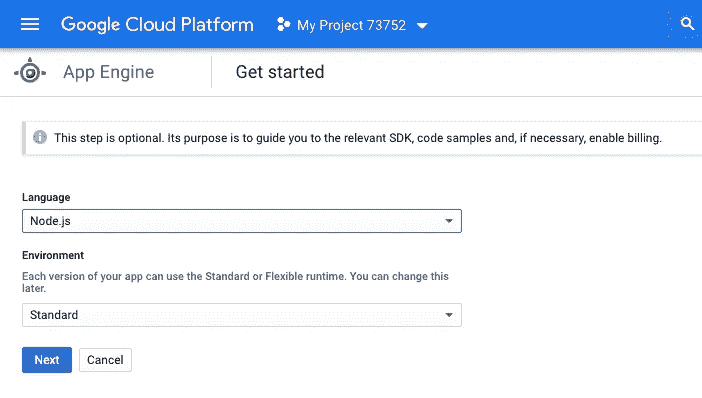
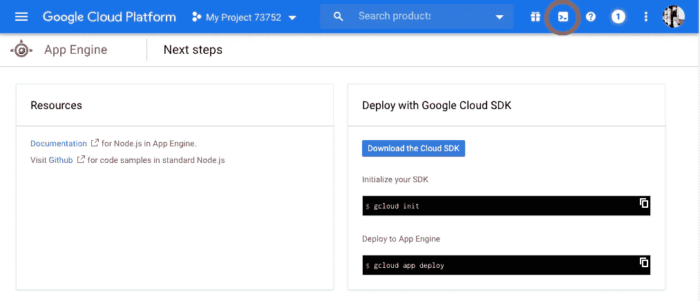
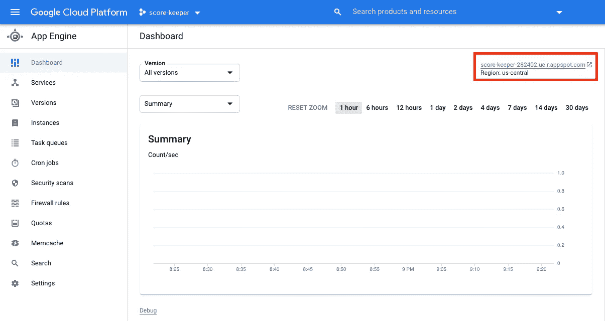

# 在谷歌应用引擎上部署 React 应用的 5 步指南

> 原文：<https://javascript.plainenglish.io/quickly-deploy-your-react-app-on-googles-app-engine-6bb97480cc9c?source=collection_archive---------0----------------------->

## 这是一个快速指南，通过五个高级步骤让你的应用从本地走向全球！


A photo of your React app being hosted on the Google Cloud

注意:本指南假设您已经知道如何创建自己的 React 应用程序，已经在 GitHub repo 上有了它的源代码，已经设置了您的 GCP 帐户，并且足够了解遍历文件夹和删除文件的命令行。

假设你已经创建了你的 React 应用程序，将它的源代码保存在 GitHub 库中，并设置了你的 GCP 帐户，这是我们在互联网上成功部署和托管我们的辛勤工作所需的五个步骤:

1.  在 GCP 创建我们的应用程序
2.  从我们的 GitHub 库克隆我们的应用程序
3.  为部署构建我们的应用
4.  删除其他所有内容
5.  添加一个 app.yaml 到根目录下**部署！**

# 1.在应用引擎上创建我们的应用

转到[谷歌的应用引擎控制台](https://console.cloud.google.com/appengine)并创建一个新项目:



**Click on the top dropdown and a window will pop up.**



**Click on NEW PROJECT at the top right**



**Give it a name and click CREATE**


**Click on Create**



**Select any region you’d like**



**Select Node.js on the Language dropdown, and leave the Environment as Standard**

# 2.从 GitHub 克隆我们应用的源代码

点击右上角附近的图标打开云壳



**Click on this symbol to Activate the Cloud Shell**

一旦你的外壳打开，是时候把我们的应用程序的源代码放到云中了。

```
git clone <https://github.com/github-username/repo-name.git>
```

# 3.为部署构建我们的应用

为此，只需进入应用程序的根文件夹(即“src”文件夹)，

```
cd <your github project folder>
cd <your app's root directory>
```

并键入以下命令:

```
npm i
npm run build
```

这将在我们的根目录下创建一个名为“build”的文件夹。

# 4.删除除构建文件夹之外的所有内容

去掉所有其他的东西，**，除了构建文件夹的**。

```
rm <file-to-remove>
rm -r <remove-recursively-like-directories-inside-directories>
```

# 5.添加 app.yaml 并部署！

在我们的“build”文件夹所在的同一个文件夹中，创建一个名为 app.yaml 的新文件。这就是应用程序引擎运行我们的应用程序所需的全部内容。

```
touch app.yaml
vim app.yaml
```

并在其内容中添加以下内容:

```
runtime: nodejs12
handlers:
# Serve all static files with url ending with a file extension
- url: /(.*\..+)$
  static_files: build/\1
  upload: build/(.*\..+)$
# Catch all handler to index.html
- url: /.*
  static_files: build/index.html
  upload: build/index.html
```

如果您从未使用过 vim 或者只是忘记了:

```
i (to insert text)
(ctr+v to paste above code)
(esc key to exit insert mode)
:wq! (to save and exit file)
```

现在**部署！**

```
gcloud app deploy
```

当出现提示时，只需键入“y”即可继续部署过程。部署完成后，您应该能够访问 App Engine 仪表盘，在那里您可以看到您的应用程序的分析。在仪表盘的右上方，您会看到一个指向您的应用程序的链接。耶！



这个题目到此为止。感谢您的阅读。

## 进一步阅读

[](https://aws.plainenglish.io/how-to-take-a-code-first-approach-to-building-cloud-native-apps-with-klotho-485ac803b450) [## 如何使用 Klotho 采用代码优先的方法构建云原生应用

### 为云开发应用程序很困难，因为学习曲线很陡，再加上你必须放弃…

aws .平原英语. io](https://aws.plainenglish.io/how-to-take-a-code-first-approach-to-building-cloud-native-apps-with-klotho-485ac803b450) [](https://bit.cloud/blog/deploying-a-composable-react-app-to-netlify-l7rlluzs) [## 将可组合的 React 应用程序部署到 Netlify

### 在这篇博文中，我们将学习如何使用 Bit 来构建和部署一个可组合的 React 应用程序到 Netlify。在位…

比特云](https://bit.cloud/blog/deploying-a-composable-react-app-to-netlify-l7rlluzs) [](/5-tips-to-scale-up-your-react-apps-8fb68319062e) [## 扩展 React 应用的 5 个技巧

### 1.将 Bit 用于可组合设计 2。设计令牌 3。网络请求的定制钩子 4。客户端与服务器状态 5。一个…

javascript.plainenglish.io](/5-tips-to-scale-up-your-react-apps-8fb68319062e) 

*更内容于* [***普通英语***](https://plainenglish.io/) *。报名参加我们的* [***免费周报***](http://newsletter.plainenglish.io/) *。在*[***Twitter***](https://twitter.com/inPlainEngHQ)[***LinkedIn***](https://www.linkedin.com/company/inplainenglish/)*[***YouTube***](https://www.youtube.com/channel/UCtipWUghju290NWcn8jhyAw)*以及*[**T42 不和**](https://discord.gg/GtDtUAvyhW) *上跟随我们。对增长黑客感兴趣？查看* [***电路***](https://circuit.ooo/) *。**