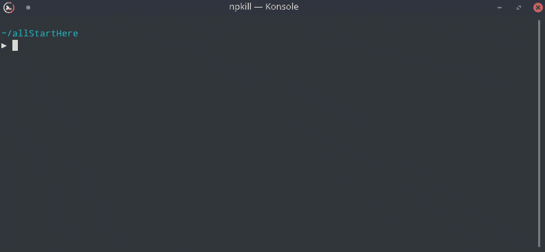

# 快速删除系统中的所有 node_modules 文件夹以释放磁盘空间

> 原文：<https://javascript.plainenglish.io/quickly-remove-all-node-modules-folders-from-your-system-to-free-up-the-disk-space-efe9fe99e234?source=collection_archive---------1----------------------->

## 因为您可以随时从 package.json 创建 node_modules 文件夹



Npkill

每当我们使用 React、Angular、Nodejs 或任何其他库或框架时，我们总是需要创建一个占用大量空间的 node_modules 文件夹，并且一旦我们的工作完成，我们也不会费心删除 node_modules 文件夹。因此，我们最终在不同的项目文件夹中创建了许多 node_modules 文件夹，这占用了我们文件系统上的大量硬盘空间。

今天我们将看到一个非常有用的命令`npkill`,它扫描我们的文件系统，并允许我们在几秒钟内通过单击删除 node_modules 文件夹。

**安装:**

你实际上，不需要安装软件包来使用它。

你只需要运行它

```
npx npkill
```

`*npx*` *允许在不安装软件包的情况下运行 npm 命令。*

然而，如果你真的需要安装`npkill`包，你可以使用

```
npm install npkill -g
```

然后你可以从任何目录运行`npkill`来删除 node_modules 文件夹。

列表显示后，您可以使用箭头键导航，并通过按空格键删除特定的 node_modules 目录。

要退出列表，按键盘上的`q` 键或`Control + C`

**默认情况下，** `**npkill**` **会从当前目录及其子目录中列出 node_modules 文件夹。**

**所以如果你想从你的系统中删除所有的 node_modules，你需要从你的主目录或者根目录执行** `**npkill**` **命令。**

**速度:**

您可能认为使用`npkill`删除单个 node_modules 文件夹会花费很多时间，但事实并非如此。其实很快。几秒钟后，该文件夹将被删除。所以试一试吧。

**别忘了直接在你的收件箱** [**这里**](https://yogeshchavan.dev) **订阅我的每周简讯，里面有惊人的技巧、诀窍和文章。**