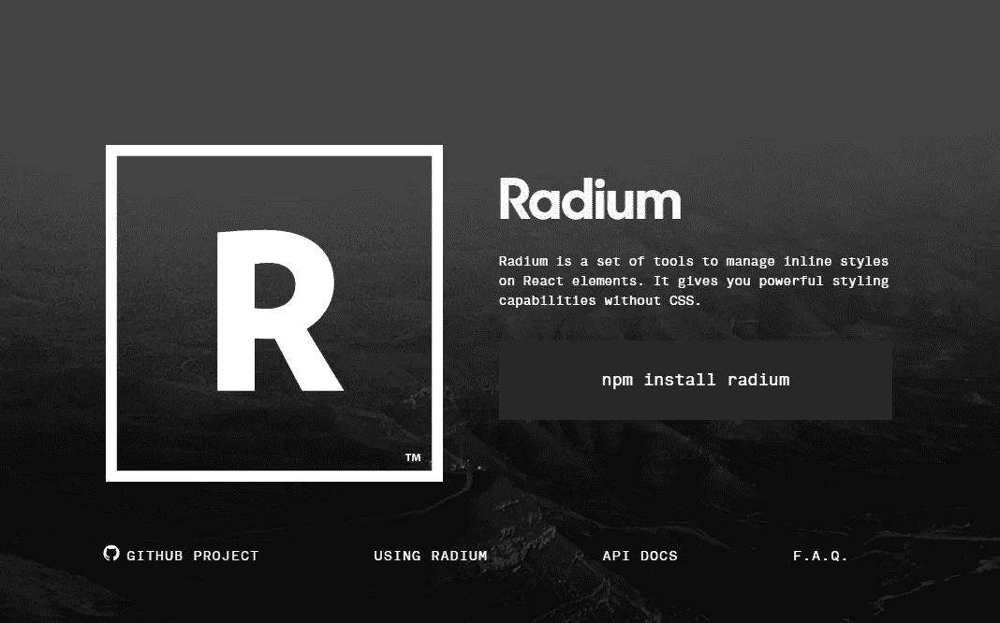

# radium:React 组件样式工具链

> 原文：<https://javascript.plainenglish.io/radium-a-toolchain-for-react-component-styling-e9cc57024072?source=collection_archive---------3----------------------->

## Radium 是一套管理 React 元素内联样式的工具。它在没有 CSS 的情况下为您提供了强大的样式功能。



# 安装

```
yarn add radium
# or
npm install --save radium
```

# 使用

```
<Button kind="primary">Radium Button</Button>import Radium from 'radium';
import React from 'react';
import color from 'color';

class Button extends React.Component {
  static propTypes = {
    kind: PropTypes.oneOf(['primary', 'warning']).isRequired
  };

  render() {
    // Radium extends the style attribute to accept an array. It will merge
    // the styles in order. We use this feature here to apply the primary
    // or warning styles depending on the value of the `kind` prop. Since its
    // all just JavaScript, you can use whatever logic you want to decide which
    // styles are applied (props, state, context, etc).
    return (
      <button style={[styles.base, styles[this.props.kind]]}>
        {this.props.children}
      </button>
    );
  }
}

Button = Radium(Button);

// You can create your style objects dynamically or share them for
// every instance of the component.
var styles = {
  base: {
    color: '#fff',

    // Adding interactive state couldn't be easier! Add a special key to your
    // style object (:hover, :focus, :active, or @media) with the additional rules.
    ':hover': {
      background: color('#0074d9')
        .lighten(0.2)
        .hexString()
    }
  },

  primary: {
    background: '#0074D9'
  },

  warning: {
    background: '#FF4136'
  }
};
```

# 特征

*   普通内联样式在概念上的简单扩展
*   支持`:hover`、`:focus`和`:active`的浏览器状态样式
*   媒体查询
*   自动供应商前缀
*   关键帧动画助手
*   ES6 类和`createClass`支持

# 文件（documents 的简写）

*   [概述](https://github.com/FormidableLabs/radium/tree/master/docs/guides)
*   [API 文件](https://github.com/FormidableLabs/radium/tree/master/docs/api)
*   [常见问题解答](https://github.com/FormidableLabs/radium/tree/master/docs/faq)

# 开源代码库

[](https://github.com/FormidableLabs/radium) [## 可怕的实验室/镭

### 用于 React 组件样式工具链。通过在…上创建帐户，为可成形的实验室/镭的开发做出贡献

github.com](https://github.com/FormidableLabs/radium)