# 做出反应。使用样式组件的 7 个技巧

> 原文：<https://javascript.plainenglish.io/react-7-tricks-to-work-with-styled-components-20eb155934b1?source=collection_archive---------0----------------------->

## 改进样式化组件使用的有用提示

Photo by [Element5 Digital](https://unsplash.com/@element5digital?utm_source=medium&utm_medium=referral) on [Unsplash](https://unsplash.com?utm_source=medium&utm_medium=referral)

最近我一直在做一个在**风格的组件**上实现的项目，我发现在一篇小文章中收集我一直在“发现”的与它们一起工作的所有技巧是很有趣的。

对于那些听起来不像他们的人来说，**样式组件**允许我们将应用程序的样式定义翻译成组件，而不是处理 CSS 样式表。因此，它们提供了一种新的方法来处理我们的应用程序的体系结构，我觉得使用这种方法很舒服，所以如果您还没有这样做，我鼓励您尝试一下。在这篇文章的最后，我会给你留下一个链接列表，如果你想更深入地了解这个库，你可以去那里。

所以，不自娱自乐，来看看那些小把戏吧！

# 1.上下文 API 的使用

样式化组件提供的优势之一是可以为我们的应用程序定义一个主题，这样，使用 **React Context API，**我们定义的所有组件都可以访问我们定义的变量。

要做到这一点，我们必须用标签`ThemeProvider`包装所有那些我们希望接收主题变量的组件，就像我们处理为应用程序定义的其他上下文一样。

例如，如果我们的主题由以下在`theme.js`文件中定义的变量组成:

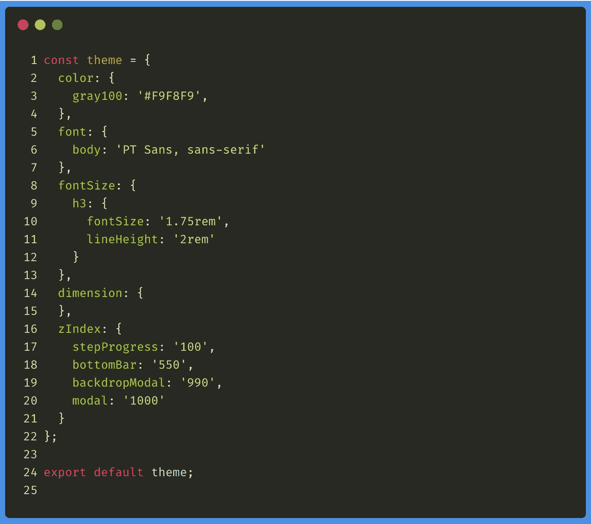

我们可以这样写:

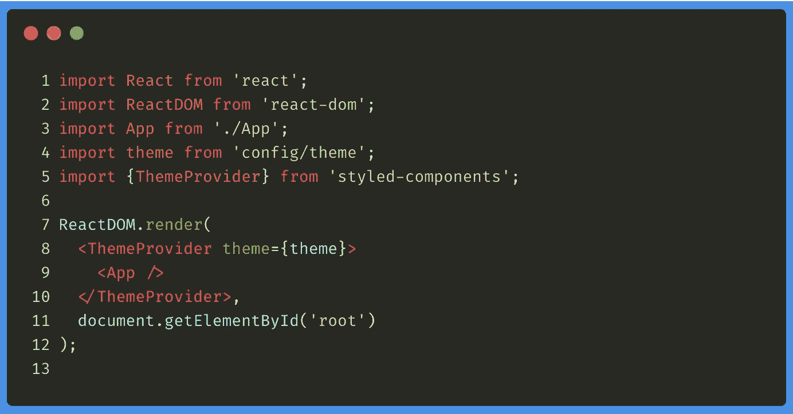

这样我们在`App`组件中使用的任何**样式的组件**都可以通过访问`props`变量的`theme`属性来访问`theme.js`中定义的变量:

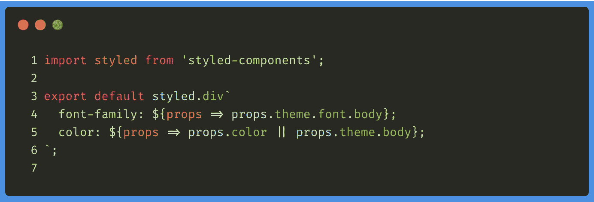

# 2.更改样式化的组件类型

这是一个典型的看起来很傻的把戏，直到有一天你因为某种原因需要它。

基本上，我们可以修改标签来呈现一个**样式的组件**，而无需向我们的应用程序添加额外的代码。

假设我们定义了以下样式组件:

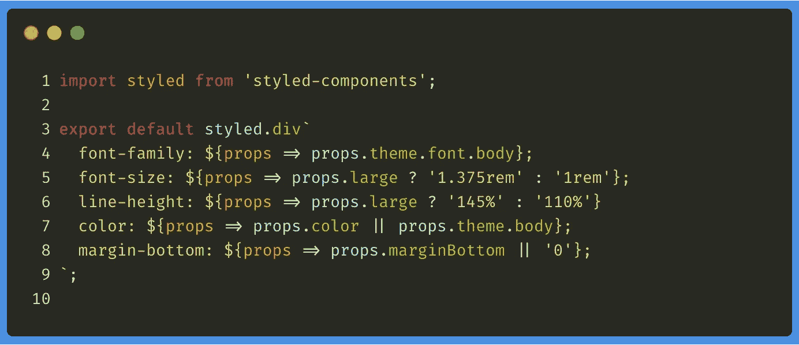

当我们在应用程序中使用它时，我们将在 DOM 中看到的是一个 DIV 标签，因为我们将其定义为`styled.div`。但是，可以使用样式化组件上的`as`属性来修改这个标签，例如:

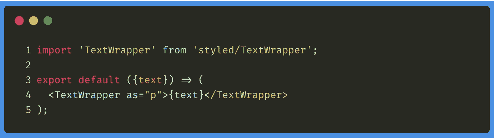

在这种情况下，我们在 DOM 中得到的将是包装在一个`
`标签中的文本。

# 3.样式化组件中的引用元素

当然，有了**样式的组件**，我们可以使用类似于我们在 CSS 或 Sass 中习惯的语法来引用其他 DOM 元素。

例如，如果我们想要定义一个子元素宽度为 50%的 DIV，我们可以编写以下代码:

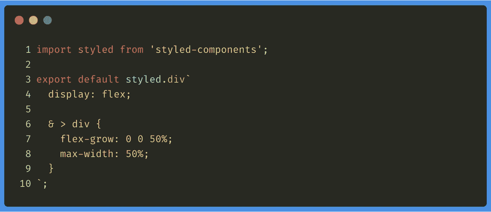

这也有助于我们使用伪选择器`::before`和`::after`:

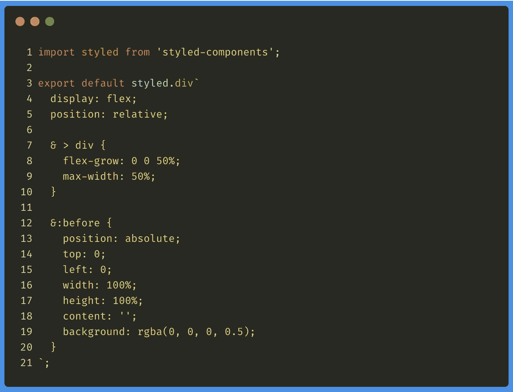

因此，除了样式化组件假设了一种新的组织应用程序的思维方式，我们没有必要学习一种特殊的语法来使用它们，因为我们的 CSS 知识会帮助我们。

# 4.参考其他样式组件

另一个非常有用的技巧是允许我们在另一个组件中引用一个样式化的组件。例如，这种技巧的一个典型用例是有一个由文本和图标组成的按钮，在悬停时该按钮必须改变。

我们可以通过以下方式实现这一点:

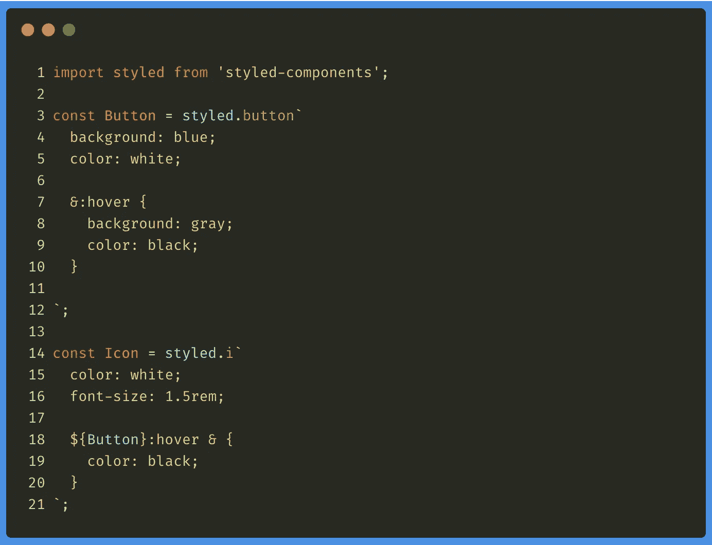

正如你所看到的，在样式化的组件`Icon`中，我们使用语法`${Button}`来引用`Button`组件。这是可能的，因为样式化的组件为通过`styled`表达式创建的每个组件分配了特定的类。所以以后我们可以用它们来参考。

当然，这只有在我们引用一个样式化的组件时才有效，而不是在我们用它来引用任何其他类型的组件时。

# 5.扩展样式组件

为了不使我们的**样式组件**过载，另一个非常有用的技巧是能够扩展我们定义的样式组件，例如，我们定义如下:

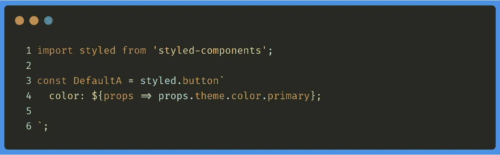

我们随后可以执行以下操作:

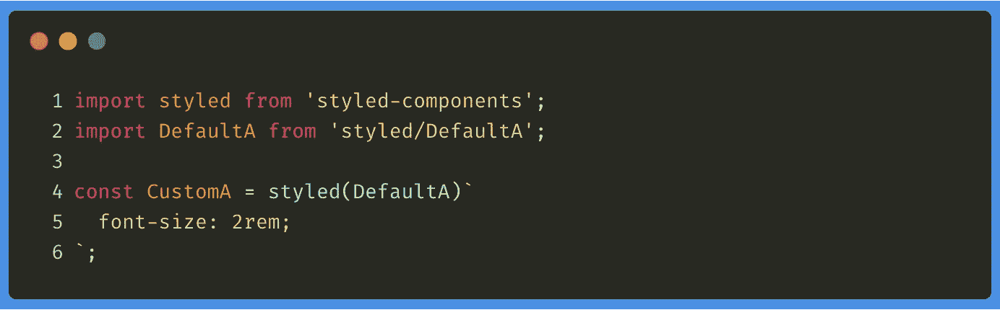

所以当我们使用`<CustomA>`时，我们得到的将是具有样式`color`(来自`DefaultA`组件)和`font-size`(来自`<CustomA>`本身)的组件。

当然，我们也可以覆盖样式:

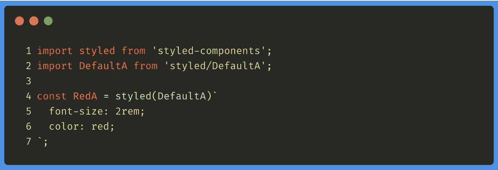

# 6.定义动态属性

另一件允许我们制作风格化组件的事情是，利用`tagged templates`的力量动态定义 CSS 属性。

例如，我们可以定义一个按钮，根据它接收到的`type`属性的值，该按钮被涂上不同的颜色:

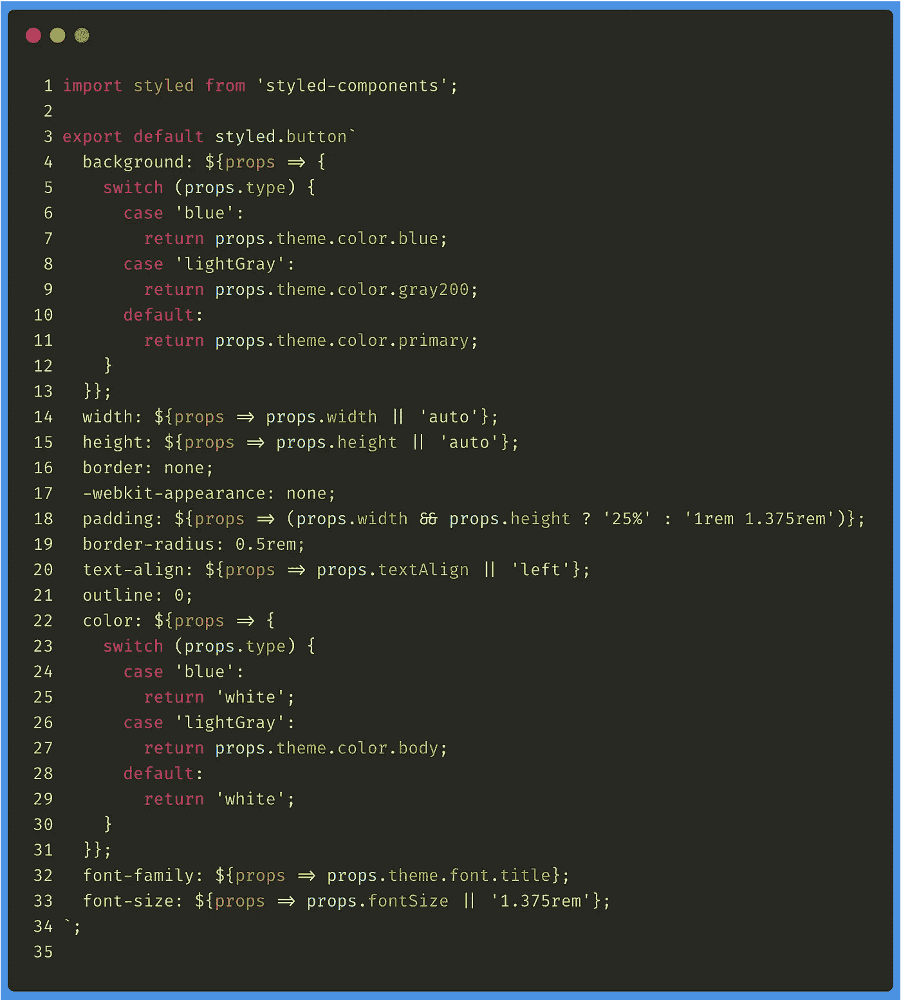

这对于通过仅修改 UI 元素的某些方面来封装 UI 元素非常有用。

如果你想阅读更多关于**标记模板的内容**，我留下了几个月前我写的一篇文章的链接:

 [## Javascript:反斜线如何工作(``)

### 探索 JavaScript 中反斜线的主要用途

medium.com](https://medium.com/better-programming/javascript-how-backticks-work-de269e0fb8ba) 

# 7.传递属性

最后，重要的是要记住，在定义属性时，也可以使用`attrs`将属性传递给我们的样式化组件。

例如，如果我们已经将 Bootstrap 集成到我们的应用程序中，我们可以用`type`属性定义一个按钮(就像我们在前面的例子中所做的那样),但是这次根据该属性的值绘制适当的类:

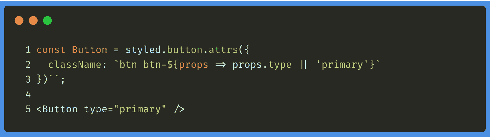

# 最后的想法

正如您所看到的，样式化的组件为我们提供了一种处理应用程序样式的不同方式，有利于它的“组件化”和重用。

为了加深理解，我推荐两篇非常有趣的文章，其中介绍了一些将它们集成到我们的应用程序中的推荐方法:

 [## 风格化组件的本质

### 学习用 JS 设计 React 应用程序的替代方法。

blog.elpassion.com](https://blog.elpassion.com/styled-components-nitty-gritty-2d74b8690ef8)  [## 在样式组件中思考

### 基于组件的架构+ CSS

itnext.io](https://itnext.io/thinking-in-styled-components-e230ea37c52c) 

# 你想看更多这样的文章吗？

如果你喜欢这篇文章，我鼓励你订阅我每周日发送的时事通讯，里面有类似的出版物和更多的推荐内容:👇👇👇

 [## 拿铁和代码

### 这是一份最新的时事通讯，代码是 recibirás cada domingo。在她的房间里:…

eepurl.us20.list-manage.com](https://eepurl.us20.list-manage.com/subscribe?u=c14cad2102bcf33bf216cc69e&id=2790da9378)