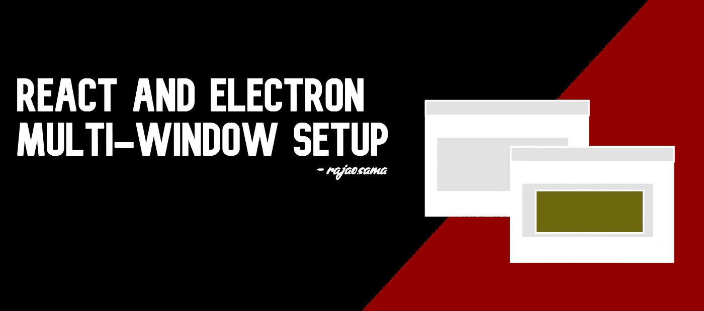
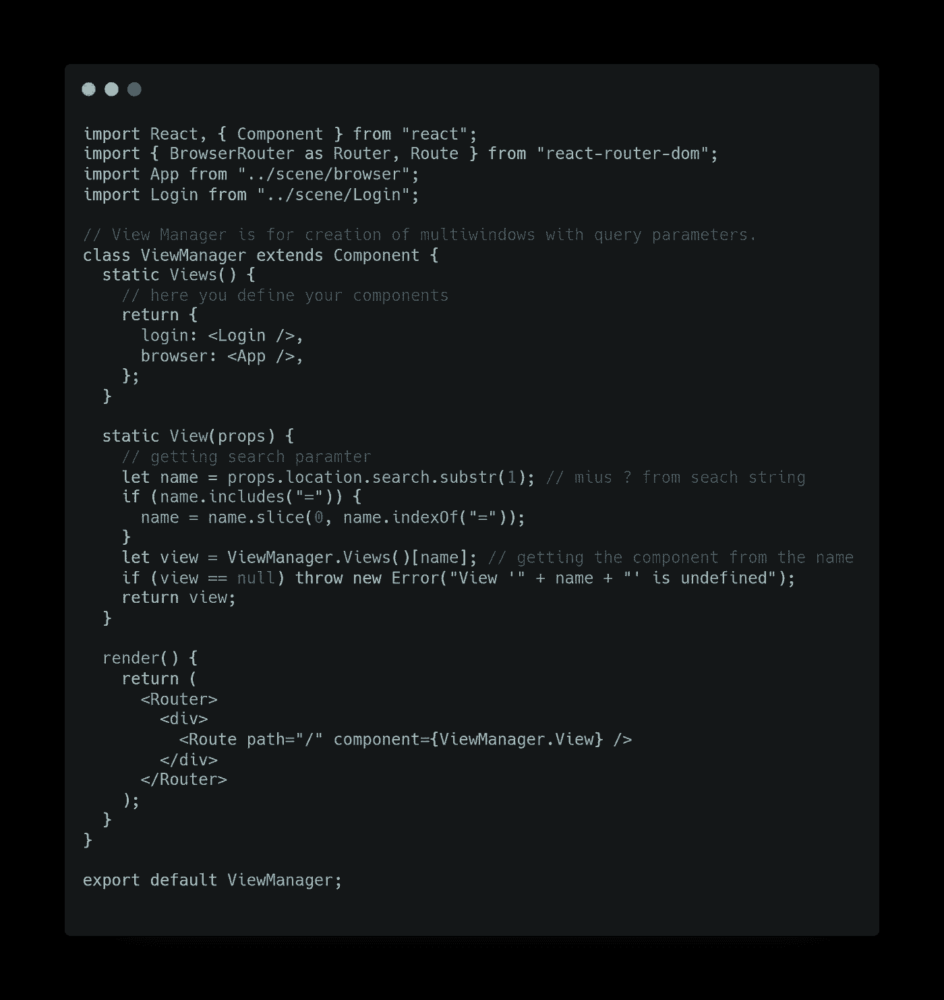
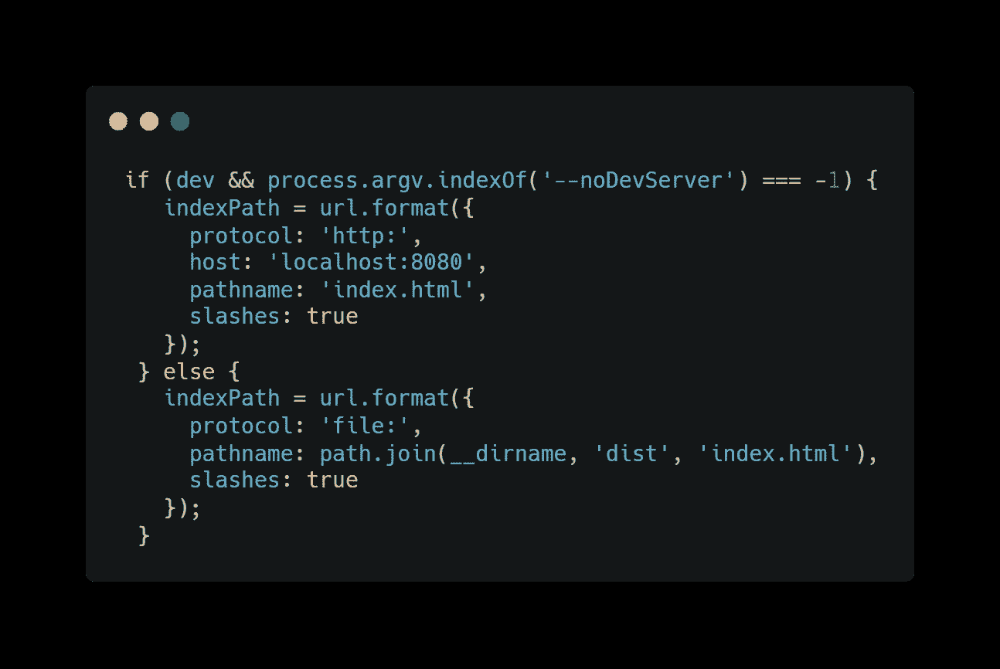
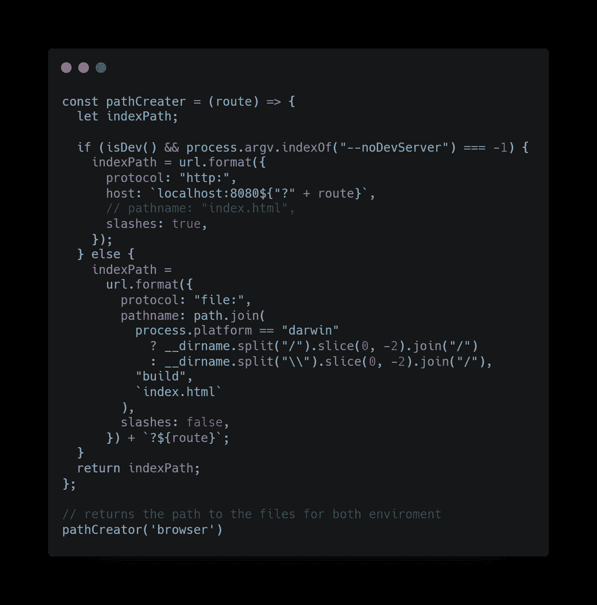
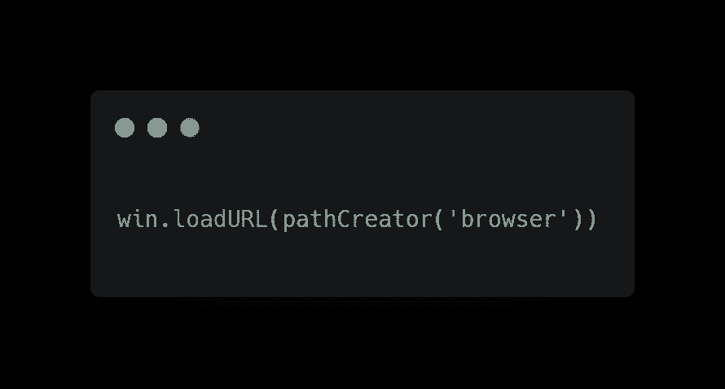

# 反应和电子多窗口装置💻

> 原文：<https://javascript.plainenglish.io/react-and-electron-multi-window-setup-f1750a1500e7?source=collection_archive---------6----------------------->

开始使用 Electron 和 React 并不容易，这就是为什么大多数人使用一些 Starter 或样板 repo，这是完全没问题的。但是使用 React+electronic，这些样板文件中的大多数都缺少使用 React 设置多窗口路由的配置。

我将讨论如何为基于 web pack 的电子和 React 样板文件配置路由。我将使用[基本电子样板](https://github.com/pbarbiero/basic-electron-react-boilerplate)。

在这个 repo 中发生的事情是，无论何时你打开一个新窗口，都会打开同一个 react 实例，或者如果你想称之为同一个 React 页面。我将帮助您设置一个路由器，这样您就可以轻松地处理多个窗口上的多个屏幕。

让我们在 src 文件夹中创建一个组件，将其命名为 ViewManager，并将其粘贴到其中。

这样做的目的是，你基本上是在一个名为 View 的函数中定义一个对象中的所有组件。所以不是浏览器加载网址 [https://localhost:8000/](https://localhost:8000/) 而是加载 [https://localhost:8000/](https://localhost:8000/) ？browser，其中“browser”将指示一个组件，并通过调用 ViewManager。视图，它将根据搜索到的键返回一个组件。

main.js 内部

我们需要将它转换成一个函数，并将我们的自定义参数作为一个搜索参数发送，您可以通过下面的步骤来实现这一点。

我们基本上只是把我们的组件作为一个查询参数，它会创建一个路径，而在制作一个窗口，你应该使用这样的东西

就这样，✨.如果给定一个唯一的路径名，这将加载一个单独的 react 组件。