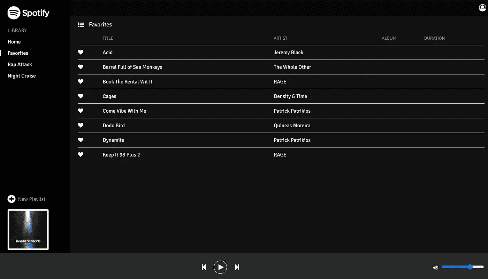
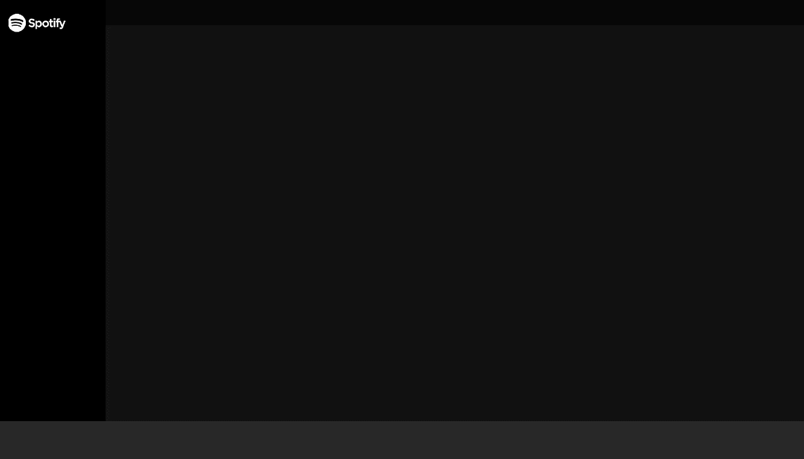

# 用 React Hooks、Context 和网络音频 API 构建一个受 Spotify 启发的音乐播放器

> 原文：<https://javascript.plainenglish.io/react-audio-player-build-a-spotify-inspired-music-player-with-react-hooks-context-the-web-3802be26d5cc?source=collection_archive---------3----------------------->



## Spotify 似乎是当今自切片面包以来最酷的东西，是随时随地听音乐的事实上的方式。

前几天在使用 Spotify 桌面播放器时，我想，看看在 React 中实现它的一些用户界面有多难，这可能是一件好事。几个小时后，压力比我想象的要小得多，我能够想出一些非常好的东西。

因此，这篇文章(以及随后的文章)将面向那些希望提高反应技能的人，并使用其更新的功能来实现我认为是一个基本音乐播放器的优雅实现。

我们的音频播放器将利用现成的网络音频 API，并将包括以下功能:

*   创建和移除播放列表
*   查看和更新播放列表
*   播放、暂停、快进、倒带等。
*   调节音量
*   喜爱的歌曲

我强烈建议先通读教程，然后查看我为这篇文章上传到 YouTube 上的附带视频(*，你可以在文章的最后找到**)。*

*另外，如果你喜欢这篇文章，可以看看我在[上传文件的文章，点击这里](https://dzuz14.medium.com/simple-file-uploading-with-react-hooks-fe89c225db57)。*

# *设计布局*

*通过剖析本文开头的图片，我想出了一个简单的图表来突出创建我们的音乐播放器所需的基本构件。*

**

*我们将使用的四个组件命名为:*

*   *顶部栏*
*   *补充报道*
*   *内容*
*   *播放栏*

***但是在我们开始实现它们之前**，我们还需要一个入口点来导入这些组件。为了简单起见，让我们创建一个名为 MusicPlayer 的组件作为入口点，然后直接进入我们的前两个布局组件。*

```
*/** @jsx jsx */
import React from 'react'
import { css, jsx } from '@emotion/core'const MusicPlayer = () => (
  <div>
    {/* ...Content Here */}
  </div>
)export default MusicPlayer*
```

# *内容和侧边栏组件*

*根据上一节中的图表，内容和侧边栏应该并排放置，侧边栏组件放在左侧。默认情况下，flex 容器中的项目是并排放置的，我们将在 MusicPlayer 中使用 flexbox 来实现这个功能。*

```
*/** @jsx jsx */
import React from 'react'
import { css, jsx } from '@emotion/core'const MusicPlayer = () => (
  <div css={CSS}>
    {/* ...Content Here */}
  </div>
)const CSS = css`
  height: 100%;
  width: 100%;
  display: flex;
  position: relative;
  color: white;
`
export default MusicPlayer*
```

*有了这种风格，我们应该有信心，当我们以后将所有东西拼凑在一起时，内容和侧边栏将会并排放置。*

## *内容*

*内容部分目前对我们来说并不重要。现在，让我们给它一些非常基本的造型。*

## *补充报道*

*边栏将是我们大部分播放列表的功能所在。让我们将它创建为一个无序列表，将其设置为 200 像素的固定宽度，并添加一个徽标。*

# *顶部栏*

*Topbar 不会在这个系列中提供任何功能，但是拥有它确实会创造一个更好的整体视觉效果。我们可以给它指定一个高度和背景颜色，然后暂时保持原样。*

# *播放栏*

*Playbar 是我们将在本系列的后面花费大量时间的地方。但是对于它当前的需求，我们只需要把它放在屏幕的底部，让它看起来像个零件。*

# *测试布局*

*完成四个布局组件后，是时候将它们导入到我们的入口组件中，看看是否一切正常。*

*如果我们打开浏览器，一切都按照我们的计划进行，那么我们应该会看到我们的布局按预期工作！*

**

# *接下来*

*那么，我们该何去何从呢？在本系列的第二部分中，我们将开始在侧边栏组件中工作，并开始实现播放列表工作所需的一些状态。当涉及到状态时，我们将使用“本地优先”策略，并且将推迟使用上下文，直到功能认为有必要。*

*如约而至，视频在此！第二部分的文章将很快发布，敬请关注！*