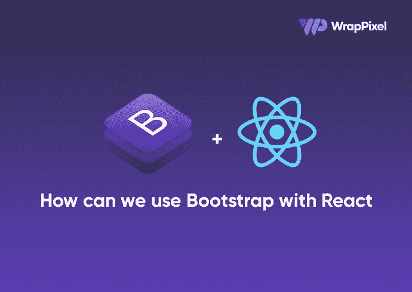

# 如何添加 Bootstrap 来进行反应

> 原文：<https://javascript.plainenglish.io/react-bootstrap-tutorial-how-to-add-bootstrap-to-react-8203884f7b2e?source=collection_archive---------9----------------------->



在本文中，我们将看到 React Bootstrap 的一些最佳实践。在 React 中集成本机 bootstrap 并不像看起来那么简单，因为在将它集成到 React 项目中之前，您需要找到一种方法来移除 Bootstrap 的 jQuery 依赖性。所以让我们从 Reactjs 引导教程开始。

**先决条件**

*   熟悉 HTML、CSS 和 JavaScript。
*   Vs 代码或安装在开发机器上的任何代码编辑器。
*   React 的基础知识

# 如何在 React 中使用 Bootstrap

我们将从设置一个新的 React 应用程序开始。我们将使用 Create React App 来设置我们的应用程序。如果您的本地计算机上没有安装此软件，请打开您的终端，键入以下内容:

```
npm install -g create-react-app
```

标志会将它全局安装到你的本地机器上。

在安装了`create react app`之后，我们现在可以通过`create-react-app`跟随者按照应用程序的名称搭建一个新的 React 项目:

```
mkdir reactbootstrap && cd reactbootstrap
create-react-app bootstrap4
```

安装完成后，我们必须进入我们的项目工作目录，然后运行`npm start`。这个命令将在端口 3000 上运行我们的应用程序。

```
cd bootstrap4
npm start
```

既然我们已经启动并运行了 bootstrap，现在我们可以将 bootstrap 设置到我们的应用程序中。

# 安装 React 引导程序

我们需要将 react 引导程序安装到我们的应用程序中。这个包让我们可以访问所有的本地引导组件。要安装它，请打开您的终端并运行以下命令(确保您的终端在项目工作目录下打开):

```
npm install react-bootstrap bootstrap --save
```

为了让我们的应用程序平稳运行，我们仍然安装了本地引导程序。安装后，我们需要将引导 CSS 文件导入到我们的根 Js 文件中。为此，在`src/index.js`文件中添加以下内容:

```
import "bootstrap/dist/css/bootstrap.css";
```

为了提高应用程序的速度，React 允许您只导入要在应用程序中使用的组件，而不是导入整个引导包。

如果您喜欢 sass，您可以将其导入到您的`index.js`文件中:

```
@import "~bootstrap/scss/bootstrap";
```

要使用任何引导组件，我们需要将其导入到我们的`App.js`文件中

在我们导入组件之前，删除`App.css`文件中的所有代码以避免任何形式的冲突。

让我们看看如何使用我们的一些引导组件。

# 添加 Bootstrap 以进行反应

要使用 navbar 组件，我们需要先导入它，然后在应用程序中使用它。将您的`App.js`文件修改为:

```
import React from "react";
import logo from "./logo.svg";
import "./App.css";
import Container from "react-bootstrap/Container";
import Navbar from "react-bootstrap/Navbar";
import Nav from "react-bootstrap/Nav";
function App() {
  return (<div className="App">
    <Navbar expand="lg" variant="light" bg="info">
      <Container>
        <Navbar.Brand href="#">Navbar</Navbar.Brand>
        <Nav className="mr-auto">
          <Nav.Link href="#home">Home</Nav.Link>
          <Nav.Link href="#features">Features</Nav.Link>
          <Nav.Link href="#pricing">Pricing</Nav.Link>
        </Nav>;
      </Container>
    </Navbar>;
  </div>);
}
export default App;
```

这样做会给我们这个:


请注意我们在使用组件之前导入组件的方式。

# 导入引导反应

我们将导入 Bootstrap 超大屏幕组件，然后在我们的组件中使用它。在大屏幕上，我们将在它上面添加一个按钮。为此，我们还需要导入按钮组件

```
//Jumbotron
import Jumbotron from "react-bootstrap/Jumbotron";
import Button from "react-bootstrap/Button";
```

然后像这样在模板中添加组件:

```
<Jumbotron>
      <h1>Hello, I'm Sunil!</h1>
      <p>
        This is a simple hero unit, a simple jumbotron-style component for
        calling extra attention to featured content or information.
      </p>
      <p>
        <Button variant="info">Learn more</Button>
      </p>
    </Jumbotron>
```


# 导入行和列以作出反应

这是 bootstrap 中最重要的特性之一。当您想在应用程序中开始使用布局时，In 就派上了用场。要使用它，我们必须导入它，然后在我们的应用程序中使用它:

```
// rows and columns
import Col from "react-bootstrap/Col";
import Row from "react-bootstrap/Row";
```

然后你在我们的模板里:

```
<Container>
      <Row>
        <Col>
          <p>
            Lorem ipsum dolor sit amet consectetur adipisicing elit. Cumque
            saepe sint voluptatum?
          </p>
        </Col>
        <Col>
          <p>
            Lorem ipsum dolor sit amet, consectetur adipisicing elit.
            Voluptates, voluptas. Enim, fuga!
          </p>
        </Col>
        <Col>
          <p>
            Lorem ipsum dolor, sit amet consectetur adipisicing elit. Architecto
            atque hic corrupti.
          </p>
        </Col>
      </Row>
    </Container>
```


# 将引导卡导入反应器

像这样将它导入到模板中:

```
import Card from "react-bootstrap/Card";
```

然后在组件中使用它:

```
<Container>
          <Row>
            <Col>
              <Card style={{ width: "18rem" }}>
                <Card.Body>
                  <Card.Title>Card Title</Card.Title>
                  <Card.Subtitle className="mb-2 text-muted">
                    Card Subtitle
                  </Card.Subtitle>
                  <Card.Text>
                    Some quick example text to build on the card title and make up
                    the bulk of the card's content.
                  </Card.Text>
                  <Card.Link href="#">Card Link</Card.Link>
                  <Card.Link href="#">Another Link</Card.Link>
                </Card.Body>
              </Card>;
            </Col>
          </Row>
        </Container>
```


我们可以将所有这些组件放在我们的应用程序中，构建一个简单的 web 界面:

```
import React from "react";
    import logo from "./logo.svg";
    import "./App.css";
    import Container from "react-bootstrap/Container";
    import Navbar from "react-bootstrap/Navbar";
    import Nav from "react-bootstrap/Nav";
    //Jumbotron
    import Jumbotron from "react-bootstrap/Jumbotron";
    import Button from "react-bootstrap/Button";
    // rows and columns
    import Col from "react-bootstrap/Col";
    import Row from "react-bootstrap/Row";
    //cards
    import Card from "react-bootstrap/Card";
    function App() {
      return (<div className="App">
        <Navbar expand="lg" variant="light" bg="info">
          <Container>
            <Navbar.Brand href="#">Navbar</Navbar.Brand>
            <Nav className="mr-auto">
              <Nav.Link href="#home">Home</Nav.Link>
              <Nav.Link href="#features">Features</Nav.Link>
              <Nav.Link href="#pricing">Pricing</Nav.Link>
            </Nav>
          </Container>
        </Navbar>
        <Jumbotron>
          <h1>Hello, I'm Sunil!</h1>
          <p>
            This is a simple hero unit, a simple jumbotron-style component for
            calling extra attention to featured content or information.
          </p>
          <p>
            <Button variant="info">Learn more</Button>
          </p>
        </Jumbotron>
        <Container>
          <Row>
            <Col>
              <p>
                Lorem ipsum dolor sit amet consectetur adipisicing elit. Cumque
                saepe sint voluptatum?
              </p>
            </Col>
            <Col>
              <p>
                Lorem ipsum dolor sit amet, consectetur adipisicing elit.
                Voluptates, voluptas. Enim, fuga!
              </p>
            </Col>
            <Col>
              <p>
                Lorem ipsum dolor, sit amet consectetur adipisicing elit. Architecto
                atque hic corrupti.
              </p>
            </Col>
          </Row>
        </Container>
        <Container>
          <Row>
            <Col>
              <Card style={{ width: "18rem" }}>
                <Card.Body>
                  <Card.Title>Card Title</Card.Title>
                  <Card.Subtitle className="mb-2 text-muted">
                    Card Subtitle
                  </Card.Subtitle>
                  <Card.Text>
                    Some quick example text to build on the card title and make up
                    the bulk of the card's content.
                  </Card.Text>
                  <Card.Link href="#">Card Link</Card.Link>
                  <Card.Link href="#">Another Link</Card.Link>
                </Card.Body>
              </Card>;
            </Col>
          </Row>
        </Container>
      </div>);
    }
    export default App;
```


设置完成后，您可以继续探索应用程序中的所有 Bootstrap 4 组件。

# React 引导模板

从头开始构建一切是一项耗时的任务。如果你正在寻找一个解决方案，它可以帮助你节省大量的时间，也可以帮助你用令人惊叹的界面打动你的老板或你的用户，你会发现一些现成的使用 WrapPixel 的 [react 引导模板](https://www.wrappixel.com/templates/category/reactstrap-templates/)。他们还有令人惊叹的 [react 仪表盘](https://www.wrappixel.com/templates/category/react-templates/)，可以帮助你轻松构建 react 项目的管理面板。去看看他们。