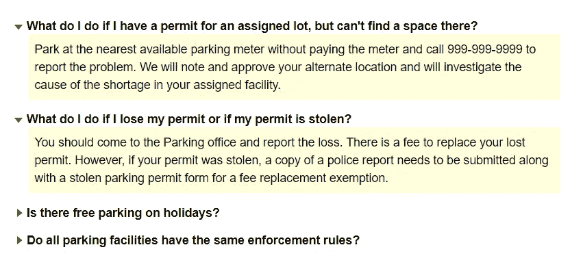

# React:构建可访问的 FAQ 组件

> 原文：<https://javascript.plainenglish.io/react-building-an-accessible-faq-component-bac135116532?source=collection_archive---------0----------------------->

每个企业都需要在其网站上有一个常见问题(或 FAQ)部分。FAQ，或者一般来说，帮助部分，可以根据产品需求和设计指南来设计，尽管就设计模式而言，有一些模式比其他模式更普遍。一些流行的模式是:

*   将用户带到相应帮助页面的链接列表，
*   一个简单的问题和答案列表，
*   一组可折叠的部分/手风琴，这是我们在这篇文章中要实现的模式。

在本帖中，我们将在 React 中从头开始构建一个基本的可访问 FAQ 组件，并看看我们如何避免一些明显的错误。

看看这张常见问题的图片，并思考实现它所需的语义结构。



screenshot of the faq example on [https://www.w3.org/TR/wai-aria-practices/examples/disclosure/disclosure-faq.html](https://www.w3.org/TR/wai-aria-practices/examples/disclosure/disclosure-faq.html)

你怎么想呢?

纯粹就实施而言:

*   这可以使用`div` s 来实现。
*   这可以使用有序或无序列表来实现。
*   这可以使用`button`和段落或跨度来实现。
    以此类推……

尽管在语义上，它是某种列表，其中每个 FAQ 都是一个列表项。每个 FAQ 都是可折叠的，这意味着点击问题会切换相应的答案。
对于我们当前的目的，基于一些研究，一个[定义/描述列表](https://developer.mozilla.org/en-US/docs/Web/HTML/Element/dl)似乎很适合 FAQ，其中问题是术语，答案是定义/描述。

这是基本标记的样子:

```
<dl>
 <dt>
  // Question 1 here
 </dt>
 <dd>
  // Answer 1 here
 </dd>
 <dt>
 // Question 2 here
 </dt>
 <dd>
 // Answer 2 here
 </dd>
</dl>
```

我们将要使用的可访问性模式是[公开模式](https://www.w3.org/TR/wai-aria-practices/#disclosure)。
功能也类似于[手风琴样式](https://www.w3.org/TR/wai-aria-practices/#accordion)。

让我们做一些观察:

1.  问题需要是可点击的，这意味着语义上问题内容在`button`中是有意义的。因为我们使用`dt`作为包装器，所以我们将在其中使用一个`button`来包装问题内容。
2.  答案需要是可折叠的，但是即使当答案被折叠时，我们也需要有效的 HTML 和语义，所以`dd`本身永远不会被隐藏(否则定义列表的语义结构将被破坏)，我们将把答案包装在`div`或`p`中，并在需要时将其折叠。
3.  屏幕阅读器用户需要理解问题按钮和答案之间的关系，所以我们可以在问题`button`上利用`aria-controls`来暗示它控制相应的答案。答案需要有一个 IDREF(或简称为 id ),我们将把它传递给`button`的`aria-controls`。
4.  我们还需要在`button`上使用`aria-expanded`来指示由`button`控制的内容当前是否可见。
5.  由于我们使用的是`aria-controls`，我们需要确保折叠后的答案不会从 DOM 中移除，否则`aria-controls`中的 IDREF 将会无效，所以我们将简单地使用`display:none`来隐藏内容，这将在视觉上隐藏内容，同时对屏幕阅读器用户也是如此。(还要注意，隐藏内容的其他方式，例如`opacity: 0`、`height: 0` 等只会在视觉上隐藏内容，但是该“隐藏”内容中的交互元素仍然是可聚焦的，并且该内容对于屏幕阅读器用户仍然是可见的)

为什么我们需要同时使用`aria-expanded`和`aria-controls`？

来自[https://www . w3 . org/WAI/PF/aria-1.1/States _ and _ properties # aria-expanded](https://www.w3.org/WAI/PF/aria-1.1/states_and_properties#aria-expanded)

> 如果具有`aria-expanded`属性的元素控制不属于该元素的另一个分组容器的扩展，那么作者**应该使用`[aria-controls](https://www.w3.org/WAI/PF/aria-1.1/states_and_properties#aria-controls)`属性来引用该容器。**

因此，根据这些观察，让我们看看我们的标记应该是什么样子:

```
<dl>
 <dt>
  <button aria-expanded="true" aria-controls="a1">Question 1</button>
 </dt>
 <dd>
  <p id="a1"> Answer 1 here </p>
 </dd>
 <dt>
  <button aria-expanded="true" aria-controls="a2">Question 2</button>
 </dt>
 <dd>
  <p id="a2"> Answer 1 here </p>
 </dd>
</dl>
```

让我们开始在 React 中构建它。

对于我们想要为 FAQ 组件公开的 api，有多个选项，我们可以传入一组问题/答案，或者我们可以通过使用 render props 模式创建内部组件来允许该组件的用户有更大的灵活性，但是，在这种情况下，我们将从一个复合组件开始，其他功能稍后可以在此基础上构建。

*注意:关于使用什么模式以及如何实现它的讨论超出了本文的范围，可以在别处找到。*[*Kent c . Dodds*](https://medium.com/u/db72389e89d8?source=post_page-----bac135116532--------------------------------)*在 React 组件模式上有一些真实的内容。*

这就是我们的 FAQ 组件的使用方式

```
<FAQ>
 <FAQ.Item>
  <FAQ.Question> Question 1</FAQ.Question>
  <FAQ.Answer> Answer 1</FAQ.Answer>
 </FAQ.Item>
 <FAQ.Item>
  <FAQ.Question> Question 2 </FAQ.Question>
  <FAQ.Answer> Answer 2</FAQ.Answer>
 </FAQ.Item>
</FAQ>
```

FAQ 组件将负责功能性和可访问性方面所需的其他一切。

有两种方法可以实现展开/折叠状态。

*   每个 FAQ 项可以单独处理状态，或者
*   父 FAQ 组件可以管理状态。

我们将让父 FAQ 组件管理状态，因为它可以决定当一个问题被单击时要做什么，这在我们希望构建一个功能时非常有用，我们希望一次只展开一个答案，并且当我们展开另一个答案时，前一个应该折叠。

由于 FAQ 组件负责管理状态，我们也将从 FAQ 组件获得切换功能。

# 问题组件

让我们构建问题组件。我们知道问题的标记应该是这样的:

```
<dt>
 <button aria-controls="*answerId*" aria-expanded="*true/false*" onclick="*toggle*"> Question text </button>
</dt>
```

基于上面的标记，我们可以决定问题组件的 api，它需要

*   它控制的答案的 id，必须来自 props。
*   当前的展开/折叠状态，这也应该来自 props，如果我们将它作为问题组件的内部状态，我们将不得不通过父组件将该状态传递给答案组件，因此在这种情况下直接从父组件获取它是很方便的。(这也意味着问题组件是受控组件)
*   切换功能也应该来自道具。
*   内容是作为道具传入的。孩子们，有一些注意事项，例如，我们的问题组件的用户应该确保他们没有传入无效的 HTML，因为内容将在`button`中呈现。我们还可以让 api 更严格一点，只允许它们在一个名为 *label* 或 *text 的属性中将文本作为字符串传递。*

基于此，下面是我们的问题组件的样子

```
function Question({ children, isOpen, answerId, onToggle }) {
 return (
  <dt>
   <button
    className="FAQ__question"
    aria-expanded={isOpen}
    aria-controls={answerId}
    onClick={onToggle}
   >
    {children}
   </button>
  </dt>
 );
}
```

# 答案组件

答案部分相当简单。它只需要知道它是折叠的还是展开的，并基于此改变应用的类，这样它就可以隐藏/显示自己。

```
function Answer({ children, id, isOpen }) {
 const mergedClassname = classNames("FAQ__answer", {
  "FAQ__answer--hidden: !isOpen
 }); return (
  <dd>
   <p className={mergedClassname} id={id}>
    {children}
   </p>
  </dd>
 );
}
```

# 项目组件

Item 组件只是问题/答案对的包装器，因此它可以将 FAQ 组件传递的属性转发/转换到问题和答案组件(在复合组件中，我们还可以使用上下文传递这些属性，而不是通过 Item 组件显式传递它们)。

项目组件不应该呈现任何额外的标记，因为`dt`和`dd`已经分别在问题和答案组件中被处理，并且在项目组件中呈现的任何其他标记将破坏语义。

```
function Item({ children, isOpen, onToggle }) {
 return React.Children.map(children, (child, index) => {
  return React.cloneElement(child, {
   isOpen: isOpen,
   onToggle: onToggle
  });
 });
}
```

# 常见问题组件

FAQ 组件负责管理状态，并将 isOpen 和 toggle 功能传递给每个 Item 组件。

```
function FAQ({ children }) {
 const [open, setIsOpen] = useState([]);
 const isOpen = index => {
  return open.includes(index) ? true : false;
 };

 const onToggle = index => {
  if (open.includes(index)) {
   setIsOpen(open.filter(item => item !== index));
  } else {
   setIsOpen([...open, index]);
  }
 }; return (
  <dl>
   {React.Children.map(children, (child, index) => {
     return React.cloneElement(child, {
      isOpen: isOpen(index),
      onToggle: () => onToggle(index)
     });
    }
   )}
  </dl>
 );
}
```

搞定了。

我们已经实现了 FAQ 组件的基本版本。

看看[这个 codesandbox 例子](https://codesandbox.io/s/react-faq-component-4s7o3)的更完美的实现。

另外，请注意，我们没有从父组件传入 answerId，这意味着我们需要在使用组件时显式地传入它，如下所示:

```
<FAQ>
 <FAQ.Item>
  <FAQ.Question answerId="a1"> Question 1 </FAQ.Question>
  <FAQ.Answer id="a1"> Answer 1</FAQ.Answer>
 </FAQ.Item>
 <FAQ.Item>
  <FAQ.Question answerId="a2"> Question 2 </FAQ.Question>
  <FAQ.Answer id="a2"> Answer 2</FAQ.Answer>
 </FAQ.Item>
</FAQ>
```

或者像这样:

```
<FAQ>
 <FAQ.Item answerId="a1">
  <FAQ.Question> Question 1</FAQ.Question>
  <FAQ.Answer> Answer 1</FAQ.Answer>
 </FAQ.Item>
 <FAQ.Item answerId="a2">
  <FAQ.Question> Question 2 </FAQ.Question>
  <FAQ.Answer> Answer 2</FAQ.Answer>
 </FAQ.Item>
</FAQ>
```

在这种情况下，项目组件可以将 answerId 传递给问题和答案组件。

# 参考资料:

 [## 常见问题答案的示例显示(显示/隐藏)

### 下面的例子演示了如何使用 disclosure 设计模式来创建一组常见问题…

www.w3.org](https://www.w3.org/TR/wai-aria-practices/examples/disclosure/disclosure-faq.html)