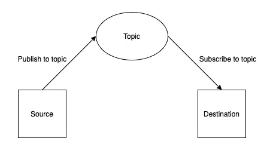

# React —使用 PubSubJS 的组件通信

> 原文：<https://javascript.plainenglish.io/react-component-communication-using-pubsubjs-1bec85388b1e?source=collection_archive---------3----------------------->

在之前位于[这里](https://medium.com/@bugz.app.developer/easy-tutorial-on-react-callbacks-fad6a51cc8f1)的帖子中，我已经讨论了关于使用回调的子- >父通信。

在这一篇中，我想讨论一些更非传统的东西——不相关组件之间的**通信。**


Photo by [Yuxiang Zhang](https://unsplash.com/@noah0220?utm_source=unsplash&utm_medium=referral&utm_content=creditCopyText) on [Unsplash](https://unsplash.com/s/photos/arrows?utm_source=unsplash&utm_medium=referral&utm_content=creditCopyText)

# 介绍 pub subjects

PubSubJS 是一个用 JavaScript 编写的基于[主题的](http://en.wikipedia.org/wiki/Publish%E2%80%93subscribe_pattern#Message_filtering) [发布/订阅](http://en.wikipedia.org/wiki/Publish/subscribe)库。

更多信息请点击此处—[https://www.npmjs.com/package/pubsub-js](https://www.npmjs.com/package/pubsub-js)

# 装置

使用下面的命令包含库

```
npm i pubsub-js
```

# 高级图表

这是一个简单的概念。

发布者发布主题。

订阅者订阅一个主题，并读取与该主题相关的数据。

这是 Apache Kafka 等系统中的普遍模式。



# 源组件

在源组件中添加以下代码

```
**import** PubSub **from 'pubsub-js'**;const pushToTopic = () => {
    PubSub.publish(**'MY_TOPIC'**, 'random data');
}
```

上面的代码定义了一个函数，它将一个**‘随机数据’**字符串发布到一个主题名**‘MY _ TOPIC’中。**

你可以在一个 useEffect 钩子或者一个按钮点击时调用这个函数。

# 目标组件

将以下代码添加到目标组件中

```
**import** PubSub **from 'pubsub-js'**;**const** mySubscriber = (msg, data) => {

    **switch** (msg) {
        **case 'MY_TOPIC'**:
             console.log(data);
             break;
        **default**:
            **break**;
    }
};*useEffect*(() => {
    PubSub.subscribe(**'MY_TOPIC'**, mySubscriber);
});
```

这里发生了几件事

*   我们在 useEffect 挂钩中添加了 subscribe 方法
*   我们提供了一个函数 **mySubscriber，**，它接受主题和输入数据。

# 摘要

把它连接在一起，下面的事情正在发生

*   源组件将数据发布到主题
*   目标订阅主题，接收可用的数据，并在提供的函数中执行进一步的处理。

这个例子设计得非常简单，但是我希望它展示了使用 PubSubJS 来创建即时反应的组件的可能性，即使它们是不相关的，即不属于同一个父对象。

请让我知道这是否有帮助。