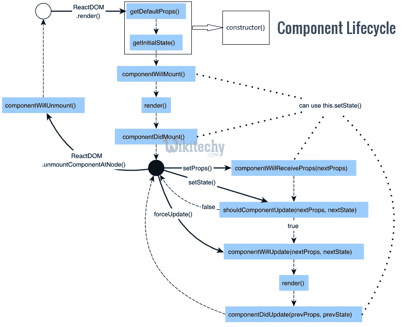

# 快速简单的组件生命周期反应方法指南

> 原文：<https://javascript.plainenglish.io/react-component-lifecycle-570e8dc75137?source=collection_archive---------0----------------------->

本周，我如约带着另一篇文章回来了。这篇文章只是关于 React 组件生命周期方法。所以让我们开始吧。



Lifecycle methods of React Components src: [wikitechy](http://wikitechy.com)

**生命周期方法**:

1.  **componentWillMount** 在渲染之前在服务器端和客户端执行。
2.  **componentidmount**仅在客户端第一次渲染后执行。这是 AJAX 请求和 DOM 或状态更新应该发生的地方。
3.  在调用另一个渲染之前，一旦更新了属性，就会调用 componentWillReceiveProps 。
4.  **shouldcomponentdupdate**应该返回一个真或假的值。这将决定是否更新组件。默认情况下，该值设置为 true。如果您确定组件在状态或属性更新后不需要呈现，您可以返回一个 false 值。
5.  **componentWillUpdate** 在渲染之前被调用。
6.  **componentiddupdate**在渲染后立即被调用。
7.  从 dom 中卸载组件后，调用 **componentWillUnmount** 。我们正在卸载 main.js 中的组件。

**例如:**

```
//App.jsx
import React from 'react';class App extends React.Component {
   constructor(props) {
      super(props);

      this.state = {
         data: 0
      }
      this.setNewNumber = this.setNewNumber.bind(this)
   };
   setNewNumber() {
      this.setState({data: this.state.data + 1})
   }
   render() {
      return (
         <div>
            <button onClick = {this.setNewNumber}>INCREMENT</button>
            <Content myNumber = {this.state.data}></Content>
         </div>
      );
   }
}
class Content extends React.Component {
   componentWillMount() {
      console.log('Component WILL MOUNT!')
   }
   componentDidMount() {
      console.log('Component DID MOUNT!')
   }
   componentWillReceiveProps(newProps) {    
      console.log('Component WILL RECIEVE PROPS!')
   }
   shouldComponentUpdate(newProps, newState) {
      return true;
   }
   componentWillUpdate(nextProps, nextState) {
      console.log('Component WILL UPDATE!');
   }
   componentDidUpdate(prevProps, prevState) {
      console.log('Component DID UPDATE!')
   }
   componentWillUnmount() {
      console.log('Component WILL UNMOUNT!')
   }
   render() {
      return (
         <div>
            <h3>{this.props.myNumber}</h3>
         </div>
      );
   }
}
export default App;
```

> 现在让我们为应用程序创建一个主组件，它将包含我们刚刚创建的组件。

```
//main.js
import React from 'react';
import ReactDOM from 'react-dom';
import App from './App.jsx';

ReactDOM.render(<App/>, document.getElementById('app'));

setTimeout(() => {
   ReactDOM.unmountComponentAtNode(document.getElementById('app'));}, 10000)
```

## 进一步阅读

[](https://bit.cloud/blog/-extracting-and-reusing-pre-existing-components-using-bit-add-l28qlxpz) [## 使用位添加提取和重用预先存在的组件

### 最后，您完成了为应用程序中的输入创建一个奇妙的输入字段的任务。你对……很满意

比特云](https://bit.cloud/blog/-extracting-and-reusing-pre-existing-components-using-bit-add-l28qlxpz) 

*更多内容请看*[***plain English . io***](https://plainenglish.io/)*。报名参加我们的* [***免费周报***](http://newsletter.plainenglish.io/) *。关注我们关于*[***Twitter***](https://twitter.com/inPlainEngHQ)[***LinkedIn***](https://www.linkedin.com/company/inplainenglish/)*[***YouTube***](https://www.youtube.com/channel/UCtipWUghju290NWcn8jhyAw)***，以及****[***不和***](https://discord.gg/GtDtUAvyhW) *对成长黑客感兴趣？检查* [***电路***](https://circuit.ooo/) ***。*****