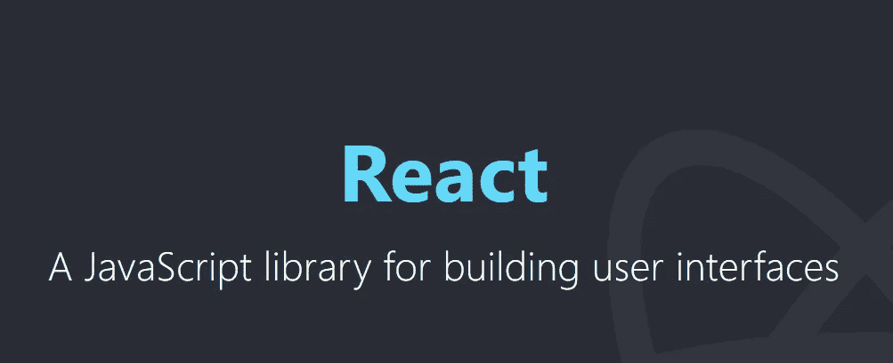

# React 中组件和道具的初学者指南

> 原文：<https://javascript.plainenglish.io/react-components-and-props-explained-for-non-devs-d801399ed429?source=collection_archive---------7----------------------->

## 在不到 5 分钟的时间内理解概念



Image via reactjs.org

我没有开发背景，所以对我来说，在还是 JavaScript 初学者的时候开始学习 React 就像把刚切下的大蒜放在开放的伤口上一样令人愉快。我是少数几个真正喜欢大蒜的人之一。

最开始最大的挫败是，我就是搞不懂到底什么是地狱道具。为什么我们要用这么一个讨厌的术语，我们能不能就叫他们……*不管他们是什么*？

因此，在这篇文章中，我将尽可能用最简单的方式来解释 props，给那些无法理解这个概念的初学者。我还将阐明什么是元素和组件，因为这在开始时也很烦人。

# React 中的元素与组件

React 基于 JavaScript，使用 JSX (JavaScript XML)而不是 HTML。JSX 允许你在。js 文件，并将这些 HTML 标记转换成 React 元素。

例如，HTML 中的普通`<h1> Title </h1>`在 JSX 看起来会是这样:

```
// This is a React element, not a componentconst title = <h1> Title </h1>;
```

一个 **React 元素**是**最小的积木**，更多的元素放在一起形成一个组件。所以是*元素>成分*。

一个元素基本上就是你想在屏幕上看到的东西。在 HTML 中，只要将元素写入您的。html 文件并点击保存。这是因为您正在向 DOM 添加节点。

在 React 中，您需要做同样的事情，但是您不会影响实际的 DOM。相反，您使用的是 ReactDOM，它是一个**虚拟 DOM** 。虚拟 DOM 是实际 DOM 的“副本”,它保存用户所做的更新。

所以如果你想给 ReactDOM 添加一些东西，你需要使用一个特定的方法，叫做 **render()** 。

假设您想从上面呈现标题元素。您可以按如下方式调用该方法:

```
ReactDOM.render(element, document.getElementById('id'));
```

第一个参数是元素，所以需要呈现什么。第二个参数是容器，即它应该在 DOM 中呈现的位置。

移动到组件。一个 **React 组件**是一个 **JS 函数**，它也返回我们想要看到的标记(元素)，但是通过经典的函数语法。

```
function Component() {
  return <h1>This is the Heading</h1>;
}
```

当组件被创建为 JS 函数时，它被称为**功能组件**。

React 组件的呈现方式与元素相同，使用 ReactDOM 的 render()方法。然而，我们不像在 JS 中那样调用函数名，而是调用 React 组件。

所以我们不写:

```
ReactDOM.render(Component(), document.getElementById('id'));
```

相反，我们写道:

```
ReactDOM.render(<Component />, document.getElementById('id'));
```

因此，React 元素使用常规的 HTML 标记，而在 React 组件中，函数名给出了标记的名称。

所有 React 组件必须以大写字母开头。

# 什么是道具，谁使用它们，是元素还是组件？

当你想把一些属性传递给一个 HTML 元素时，你可以这样做:

```
// The text "Title attribute" will be displayed as tooltip by the browser<p title="Title attribute"> Title </p>
```

在 JS 函数中，当您想要将参数作为输入传递时，可以使用以下语法:

```
function fctName(parameter) {
  return parameter;
}
```

当我们调用这个函数时，我们作为参数传递的**值**被称为**参数**。所以形参的值是一个实参。在函数内部，参数的行为类似于局部变量。

在 React 中，**道具**是*属性*，它们充当 React 组件的**参数**或输入，与传递给常规 JS 函数的参数充当参数的方式相同。

```
// React component with propsfunction Welcome(props) {
  return <h1>Hello, {props.name}</h1>;
}
```

当我们呈现这个组件时，我们可以为*名称属性*传递一个特定的*值*。该值将作为参数传递，就像我们将属性传递给 HTML 元素一样:

```
const el = <Welcome name="Saki" />;ReactDOM.render(el, document.getElementById('id'));
```

代码看起来是这样的:

```
function Welcome(props) {  
   return <h1>Hello, {props.name}</h1>;
}const el = <Welcome name="Saki" />;ReactDOM.render(el, document.getElementById('id'));
```

**props 是一个对象**，所以在上面的代码中，当您传递 props 时，您实际上是在传递{name: "value"}。

就好像你有一条额外的线来定义这个对象，就像这样:

```
const props = { name: “Saki” }
```

要访问这个名字，现在很明显你需要写 **props.name** 。

我希望这有所帮助！

如果你喜欢这个，你可能也会喜欢:

[](https://medium.com/front-end-weekly/learn-the-basics-of-react-gatsbyjs-css-modules-in-one-weekend-ce63b1f5a276) [## 在一个周末学习 React、GatsbyJS 和 CSS 模块的基础知识

### 通过使用 JAM stack 建立一个作品集网站来加速你的前端学习。

medium.com](https://medium.com/front-end-weekly/learn-the-basics-of-react-gatsbyjs-css-modules-in-one-weekend-ce63b1f5a276)