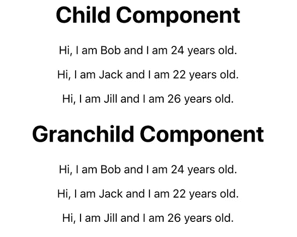

# React 上下文 API(第 1 部分)——将状态传递给子组件变得更加容易

> 原文：<https://javascript.plainenglish.io/react-context-api-part-1-passing-state-to-child-components-made-easy-5152001e1988?source=collection_archive---------0----------------------->

## 所以，你听说过 React 的上下文 API，但是因为 Redux 的复杂性而不敢接近它。好吧，我的朋友，这是一个简单的教程，让你开始感受背景之美。


Photo by [Oskar Yildiz](https://unsplash.com/@oskaryil?utm_source=unsplash&utm_medium=referral&utm_content=creditCopyText) on [Unsplash](https://unsplash.com/?utm_source=unsplash&utm_medium=referral&utm_content=creditCopyText)

# 什么是语境？

React 的上下文 API 旨在使向组件传递数据变得更加容易。这可以通过一种叫做支柱钻孔的方法来完成。这里是肯特·c·多兹写的一篇关于支柱钻井的非常好的文章。支柱钻孔仍然是一种好方法，但是，对于较大的应用来说，它不是很实用。

许多人也求助于一个叫做 [Redux](https://redux.js.org/) 的工具。Redux 很棒，它的实现和你使用上下文的方式非常相似。不幸的是，学习曲线非常陡峭，对于大多数应用程序来说，Redux 简直是大材小用。

那么，回到*什么是语境？*上下文允许状态数据通过*提供者*在组件树中从父节点传递到子节点。每个子组件可以有一个*消费者*，该消费者将从父组件订阅状态变化。太棒了。功能子组件可以订阅父组件的状态。

# 为什么语境有用？

上下文允许数据在组件树中作为*全局*数据共享。这使得代码可读性更好。无论子组件位于组件树中的哪个位置，子组件都直接订阅顶层组件状态。

还记得道具钻吗？嗯，随着组件树变得越来越大，顶层状态必须钻透的层变得相当复杂。通常很难找到组件树中包含 bug 的地方。对于上下文，每个子组件只是订阅顶层状态。在这种情况下，通过层转发道具不会成为问题。

# 简单教程

*已经有例子了吗？不要担心。接下来就是了！*

**创建上下文。**让我们创建一个 Context.js 文件。它将为我们创造提供者和消费者。

```
import { createContext } from "react"const { Provider, Consumer } = createContext()export { Provider, Consumer }
```

首先，我们需要从 react 导入 *createContext* 。这将允许我们创建上下文对象。然后，我们将创建*提供者*和*消费者*。这很重要。提供者将向消费者提供(没有双关的意思……嗯，有点)状态。每个消费者将订阅来自提供商的更新。

**父。**接下来，我们将创建*父*组件。该组件将包含提供者和状态。

```
import React, { Component } from "react"
import { Provider } from "./Context"
import Child from "./Child"
class Parent extends Component {
  state = {
    people: [
      { id: 0, name: "Bob", age: 24 },
      { id: 1, name: "Jack", age: 22 },
      { id: 2, name: "Jill", age: 26 },
    ],
  } render() {
    return (
      <Provider value={this.state}>
        <Child />
      </Provider>
    )
  }
}export default Parent
```

*状态*声明为*人*。人们有三个项目。然后，*提供者*上下文对象被包装在一个*子*组件周围。注意提供商。

```
<Provider value={this.state}>
  <Child />
</Provider>
```

在提供者组件中，值被设置为`{this.state}`。在*子*组件中，有一个*消费者*将订阅由提供者提供的值。在这种情况下，值就是状态。**注意:提供者总是要包装消费者。如果有消费者的组件没有提供者，它将不起作用。**

**孩子。**接下来，我们将创建*子组件*。

```
import React from "react"
import { Consumer } from "./Context"
import Grandchild from "./GrandChild"function Child() {
  return (
    <Consumer>
      {context => (
        <div>
          <h1>Child Component</h1>
          {context.people.map(person => {
            return (
              <p key={person.id}>
                Hi, I am {person.name} and I am {person.age}
                years old.
              </p>
            )
          })} <GrandChild />
        </div>
      )}
    </Consumer>
  )
}export default Child
```

好吧，发生了不少事。我们来分解一下。首先，导入*消费者*上下文对象。接下来，整个组件由消费者上下文对象包装。

```
<Consumer>
  {context => (
    <div>
      <h1>Child Component</h1>
      {context.people.map(person => {
        return (
          <p key={person.id}>
            Hi, I am {person.name} and I am {person.age} years old.
          </p>
        )
      })} <GrandChild />
    </div>
  )}
</Consumer>
```

消费者内部是`{context => ( ... )}`。还记得供应商的`value=this.state`吗？消费者的背景与价值直接相关。这是因为它已经订阅了它。让我们仔细看看消费者是如何使用上下文的。**注意:“上下文”是一个任意的名称。可能是数据，狗，等等。**

```
{
  context.people.map(person => {
    return (
      <p key={person.id}>
        Hi, I am {person.name} and I am {person.age} years old.
      </p>
    )
  })
}
```

因为*上下文*是通过消费者传递的，并且*上下文*订阅了父节点的状态，所以我们可以访问*人*！要获取内容，我们所要做的就是执行 **context.people** 这里所发生的是子组件通过 people 中的每一项进行映射。然后它会显示一个句子，使用每个*人*项的姓名和年龄。

让我绕个小弯，希望能帮你解决一些头疼的问题。让我们再来看看提供者。

```
<Provider value={state: this.state}>
  <Child />
</Provider>
```

注意到什么不同了吗？不再是 T3，而是现在的 T4。你绝对能做到。事实上，在本系列的第 2 部分中，我们将会这样做。如果您想从提供者向消费者传递多个值(比如状态和函数)，那么消费者调用该项的方式是不同的。

如果提供者以上述方式传递状态，子组件看起来会是这样。

```
{
  context.state.people.map(person => {    return (
      <p key={person.id}>
        Hi, I am {person.name} and I am {person.age} years old.
      </p>
    )
  })
}
```

注意，现在要使用来自提供者的值，我们必须说`context.state.people`。我花了很长时间才明白。但是，希望这有所帮助！

好了，我们来看看 ***孙儿*** 组件。

```
import React from "react"
import { Consumer } from "./Context"function GrandChild() {
  return (
    <Consumer>
      {context => (
        <div>
          <h1>Grandchild Component</h1>
          {context.people.map(person => {
            return (
              <p key={person.id}>
                Hi, I am {person.name} and I am {person.age} years old                                                           </p> 
            )
          })}
        </div>
      )}
    </Consumer>
  )
}export default GrandChild
```

**孙儿。**嗯……看着眼熟。就功能而言，它与*子组件*非常相似。整个组件仍然包裹着*消费者*。这允许来自*父*的状态被传递下去。

```
<Provider value={this.state}>
  <Child />
</Provider>
```

还记得这个吗？这是在父组件中。提供者包装 ***子*** 。内子是 ***孙儿*** 。这意味着孙子可以订阅提供者给定的值。这就是它能够访问状态的原因。

*但是，如果我不想嵌套它们呢？如果我只想让两个组件独立访问父状态呢？没问题。查看下面的代码。*

```
<Provider value={this.state}>
  <ComponentOne />
  <ComponentTwo />
</Provider>
```

然后，只需用消费者包装每个组件中的内容，就万事俱备了。

好了，我们终于可以运行我们的应用程序了。这是它看起来的样子。



子组件是从上下文提供者接收状态的第一个组件。然后，它继续将状态传递给孙代。如您所见，即使包装在子组件中的孙组件也可以访问父状态。

# 结论

因此，我们已经了解了如何通过一个简单的应用程序使用 React 的上下文 API。父节点的状态通过提供者传递给子节点。消费者在子组件中被用来*订阅*提供者中传递的值。没那么糟吧？查看 [***第 2 部分***](https://medium.com/@valdezalex31/react-context-api-part-2-updating-state-through-a-consumer-7be723b54d7b) ，我将向您展示如何用一个消费者更新父消费者的状态。

# 资源

*   [我的知识库](https://github.com/arevaldez/simple-context-app)
*   肯特·c·多兹的支柱钻探
*   [上下文文档](https://reactjs.org/docs/context.html)

*原载于*[*https://techflip.netlify.com*](https://techflip.netlify.com/react-context-api-passing-state-to-child-components-made-easy/)*。*