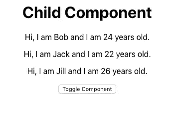
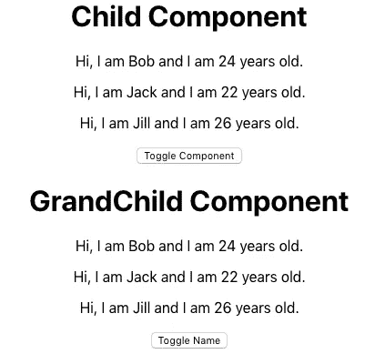
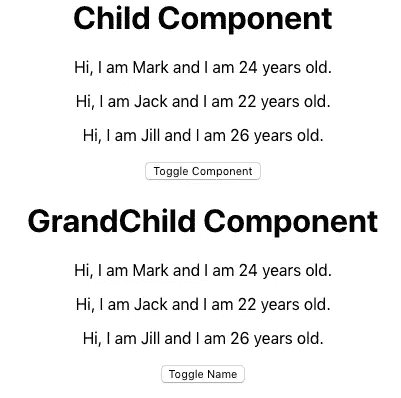

# React 上下文 API(第 2 部分)——通过消费者更新状态

> 原文：<https://javascript.plainenglish.io/react-context-api-part-2-updating-state-through-a-consumer-7be723b54d7b?source=collection_archive---------0----------------------->

嗨，欢迎回到 React 上下文 API 系列的第 2 部分。在第一部分中，我们讨论了如何利用 React 的上下文 API 将状态值传递给子组件。现在，在第 2 部分中，我们将看看如何通过消费者更新状态？


Photo by [Émile Perron](https://unsplash.com/@emilep?utm_source=unsplash&utm_medium=referral&utm_content=creditCopyText) on [Unsplash](https://unsplash.com/?utm_source=unsplash&utm_medium=referral&utm_content=creditCopyText)

这个项目的回购可以在这里找到[。](https://github.com/arevaldez/Context-Tutorial-Pt2)

如果你想了解更多的背景知识，我强烈建议阅读我的第一篇文章。我会多解释一些为什么上下文也是有用的。

# 你会做什么

让我们看看你会做什么。看看下面的图片。



Child Component

这看起来眼熟吗？这是第一部分中的同一个子组件！*但是等等……有按钮？为什么，是的。是的有。让我们看看它能做什么！*



Toggled GrandChild Component

太棒了。我们现在能够切换孙组件。我们稍后会看到如何做到这一点。*但是等等……还有* ***另一个*** *按钮。*为什么，是的。是的有。你能猜出这个按钮是干什么的吗？



Toggled Name

如果你猜它触发了一个名字，你就猜对了。它在 ***Bob*** 和 ***Mark*** 之间切换每个组件的名字。你猜怎么着？这都是*通过上下文*完成的！让我们来看看如何。

# 辅导的

**创建上下文**。首先，让我们再次创建一个 Context.js 文件，它将创建我们需要的提供者和消费者。

Context.js

从 react 导入*创建上下文*。这让我们可以创建上下文对象。然后，创建*提供者*和*消费者*。

```
const { Provider, Consumer } = createContext()
```

简单提醒一下。这一步**很重要**。通过创建提供者和消费者，我们可以在保存状态的父组件之外订阅状态更改。

**父**。好了，我们已经创建了上下文对象。我们创造了提供者和消费者。让我们创建保存状态的*父*组件。

Parent.js

好吧，这里发生了很多事。我们先来看看状态项。

```
state = { toggleGrandChild: false, toggleName: false, people: [ { id: 0, name: “Bob”, age: 24 }, { id: 1, name: “Jack”, age: 22 }, { id: 2, name: “Jill”, age: 26 }, ],}
```

第一项是`toggleGrandChild`。这让我们知道孙组件是否被切换。该值以 false 开头。这是改变状态的函数。

```
toggleComponent = () => { this.setState({ toggleGrandChild: !this.state.toggleGrandChild, })}
```

`toggleComponent`使`toggleGrandChild`的状态变为与其电流值相反的状态。因此，如果其当前值为假并且调用了`toggleComponent`，则该值将变为真。该函数将用于切换孙子组件。

接下来，我们有`toggleName`状态值。你猜对了。它用于切换名称。`toggleName`亦始于假的价值。让我们看看它的相应功能。

```
switchNameHandler = newName => { this.setState({ toggleName: !this.state.toggleName, people: [ { id: 0, name: newName, age: 24 }, { id: 1, name: “Jack”, age: 22 }, { id: 2, name: “Jill”, age: 26 }, ], })}
```

A `newName`正在传入`switchNameHandler`。这个处理程序负责更改第一个人的名字。首先，切换`toggleName`值。接下来，它将新名称插入到第一个人对象的名称值中。请注意，其他名称保持不变。这是为了表明其他人的对象将保持不变。不过，从技术上来说，您正在用相同的初始值更新对象。

最后，我们有人民的对象。人们拥有每个人的目标。`Bob`是以后打开的名称。

```
people: [ { id: 0, name: "Bob", age: 24 }, { id: 1, name: "Jack", age: 22 }, { id: 2, name: "Jill", age: 26 },]
```

**提供方**。让我们进入提供商。请记住，提供者将包装包含消费者的组件。

```
<Provider value={{ state: this.state, toggleComponent: this.toggleComponent, switchNameHandler: e => this.switchNameHandler(e) }}> <Child /></Provider>
```

在这种情况下，包装的组件是子组件。子组件中还包含孙子组件。稍后会有更多相关信息。

让我们看看提供商内部的`value`。

```
value={{ state: this.state, toggleComponent: this.toggleComponent, switchNameHandler: e => this.switchNameHandler(e)}}
```

这看起来很熟悉。然而，它与教程的第一部分有点不同。第一部分的原始提供者值如下所示。

```
value={this.state}
```

*那么，为什么这个不同呢？*我们在第一部分谈了一点，但是让我们再看一遍。如果我们想将一个函数传递给我们的上下文消费者，我们必须传递包含所需函数的变量。这就是为什么我们有像`switchNameHandler: e => this.switchNameHandler(e)`这样的项目。让我们看看 Child 组件，看看我们是如何利用它的。

**子组件**

Child.js

请注意，整个组件再次被消费者上下文对象包装起来。消费者内部是`{context => (...)}`。这将消费者中的项目连接到提供方的`value= ...`项目。这是因为消费者已经订阅了提供者中的值。**注意:“上下文”是任意的名称，可以是任何名称。它不必是“上下文”。**

让我们看看消费者。

```
<Consumer> {context => ( <div> <h1>Child Component</h1> {context.state.people.map(person => { return ( <p key={person.id}> Hi, I am {person.name} and I am          {person.age} years old. </p> ) })} <button onClick={() => context.toggleComponent()}> Toggle Component </button> {context.state.toggleGrandChild ? <GrandChild /> : null} </div> )}</Consumer>
```

首先，我们映射包含在父组件状态中的 people 对象。*我们如何接触人们？*简单。我们用`context.state.people`。还记得我们在父组件值中设置的`state: this.state`吗？这就是为什么我们能接触到`context.state`。如果我们写了`context.state.toggleGrandChild`，那么我们就可以访问`toggleGrandChild`状态值。

回到通过 people 对象进行映射。我们像第一部分一样映射对象并返回`Hi, I am {person.name} and I am {person.age} years old.`，但是，现在它下面有一个按钮。让我们来看看。

```
<button onClick={() => context.toggleComponent()}>Toggle Component</button>
```

你能猜到这是干什么的吗？它调用父组件中的函数`toggleComponent`。还记得这个函数是做什么的吗？

```
toggleComponent = () => { this.setState({ toggleGrandChild: !this.state.toggleGrandChild, })}
```

它切换`toggleGrandChild`的状态值。让我们看看按钮下面一点。

```
context.state.toggleGrandChild ? <GrandChild /> : null
```

如果这对你来说很陌生，不要担心。这只是一种写 if else 语句的奇特的速记方式。很容易写成这样。

```
if context.state.toggleGrandChild === true { <GrandChild />} else { null}
```

简写符号只是节省了一些空间，但是标准的 if else 语句也能很好地工作。

那么，这部分在做什么？它从父组件状态中获取`toggleGrandChild`的值。如果值为 true，那么它将呈现孙组件。如果该值为 false，则不会呈现任何内容。

当你按下按钮时，它将调用父组件中的`toggleComponent`函数。这是因为您在父组件的提供者的 value 部分传递了`toggleComponent: this.toggleComponent`。这个函数是做什么的？哦，对了。它改变`toggleGrandChild`的值。哇！太神奇了。您刚刚从子组件中更改了状态。恭喜你，我的朋友。

**孙组件**。好了，我们到了最后阶段。我们已经学习了如何通过子组件更新状态。但是，我们只是切换了一个值 true 或 false。那不是非常有趣或令人兴奋的。让我们继续更新一个字符串值。首先，我们将查看孙子组件。

GrandChild.js

这个组件中也有很多内容。乍一看，它与子组件非常相似。它通过 people 对象映射并打印相同的`Hi, I am {person.name} and I am {person.age} years old.`。还有一个按钮。但是，按钮似乎在做不同的事情？让我们来看看。

```
<button onClick={ context.state.toggleName ? e => context.switchNameHandler("Bob") : e => 

     context.switchNameHandler("Mark") }> Toggle Name</button>
```

现在，我们不是仅仅调用一个函数来切换真或假，而是实际上将一个值传递给一个函数。让我们回头看看在父组件的提供者中作为值传递的`switchNameHandler`。

```
value={{ state: this.state, toggleComponent: this.toggleComponent, switchNameHandler: e => this.switchNameHandler(e)}}
```

因此，我们将值`switchNameHandler`赋给`e => this.switchNameHandler(e)`。这让我们可以在上下文消费者中使用`context.switchNameHandler({value})`。目前，我们正在传递一个名字。让我们再来看看`switchNameHandler`函数。

```
switchNameHandler = newName => { this.setState({ toggleName: !this.state.toggleName, people: [ { id: 0, name: newName, age: 24 }, { id: 1, name: "Jack", age: 22 }, { id: 2, name: "Jill", age: 26 }, ], })}
```

首先，我们将 toggleName 的值切换为 true 或 false。接下来，我们再次为每个 people 对象分配 id、姓名和年龄。但是，这一次，对于第一个人对象，我们传入值`newName`。这是从函数传递的值。让我们跳回调用该函数的孙儿组件。

```
onClick={ context.state.toggleName ? e => context.switchNameHandler(“Bob”) : e => context.switchNameHandler(“Mark”)}
```

记住，这只是一个花哨的 if else 语句。很容易写成这样。

```
if context.state.toggleName === true { e => context.switchNameHandler("Bob")} else { e => context.switchNameHandler("Mark")}
```

这将根据父组件中的状态检查`toggleName`的值。如果为真，那么它将把`Bob`传递给`switchNameHandler`函数。然后，这将第一个人对象的名称更新为`Bob`。然后，它会将`toggleName`更新为 false。注意，如果您按下`Toggle Component`按钮，它仍然会切换孙组件。但是，它不会改变`toggleName`的状态值。因此，无论孙组件是否可见，该名称都将保留。

# 结论

因此，我们已经了解了如何使用 React 的上下文 API，不仅从子组件读取父组件的状态，还从子组件更新父组件的状态。子组件中的使用者订阅从父组件中的提供者传递的值。现在，您可以利用上下文来读取和更新状态。去做些伟大的事情吧！

*原载于*[*https://techflip.netlify.com*](https://techflip.netlify.com/react-context-api-part-2/)*。*