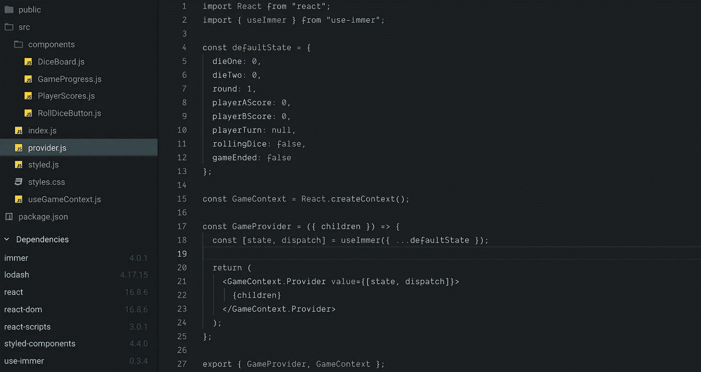

# 用 useContext 挂钩反应上下文模式

> 原文：<https://javascript.plainenglish.io/react-context-patterns-with-usecontext-hook-62085b90c7eb?source=collection_archive---------0----------------------->



React [Context](https://reactjs.org/docs/context.html) API 提供了一种便捷的方式来实现全局状态，而无需向应用添加任何其他依赖。它不是 Redux、MobX 或其他类似库的直接替代。相反，上下文提供了一种架构应用程序状态管理的替代方法。

## 为什么选择语境？

如果你的应用程序中只有几个全局状态，可能不值得立即使用 Redux。例如，应用程序需要全局共享用户授权状态。该状态可能有额外的用户信息，如用户偏好。但除此之外，它没有任何其他全局状态。因此，不添加 Redux，使用 React Context 是一个很好的替代方案。

我能想到的另一种情况是 app 使用 GraphQL 的时候。像 Apollo 或 Relay 这样的库已经处理了来自远程数据的状态突变。上下文可以用来处理任何其他状态，比如 UI 主题、语言偏好或来自其他 REST APIs 的数据。上下文远没有覆盖另一个状态管理库那样固执己见和灵活。

关于“*为什么不 redux”，*看看丹·阿布拉莫夫的“[你可能不需要 Redux](https://medium.com/@dan_abramov/you-might-not-need-redux-be46360cf367) ”。Redux 或 Context，没有一个选择自动优于另一个。这都是关于取舍的。

## 如何利用上下文？

所以你已经考虑了权衡利弊。你想给上下文一个机会。如何实现？

当我第一次在 Hooks 之前研究上下文 API 时，我发现必须将`Context.Consumer`放在多个组件上相当麻烦。它也无助于减少道具演练或简化状态更改。随着[钩子和](https://reactjs.org/docs/hooks-reference.html#usecontext) `[useContext](https://reactjs.org/docs/hooks-reference.html#usecontext)`的发布，现在使用上下文 API 看起来更有吸引力了。

在这个探索练习中，我决定用影响所有组件的全局状态来构建一个游戏。让我们玩骰子吧！

演示游戏

我们将看到使用上下文和钩子实现这个演示游戏的 3 种方法。

模式 A 和 B 松散地遵循外观模式。两者都创建了一个简单的接口来与更复杂的对象(状态)进行交互。模式 C 类似 Redux，有一个缩减器和调度器。

我提到这一点是为了防止你像我一样，发现对设计模式至少有一个模糊的心智模型是有用的。

在所有 3 个实施中，高级架构都有两个主要部分:

1.  一个 **Provider** 高阶组件(演示中的 *provider.js)。这个 HOC 必须包装所有想要使用全局上下文状态的组件。*
2.  一个**定制钩子**(在演示中*使用 GameContext.js)，通过它 UI 组件可以读取和改变上下文。*

这就是我们获利所需的一切💰💰💰！

所有示例中的应用程序架构都是相同的。位于所有 UI 组件之上的提供者:

```
function App() {
  return (
    <div className="App">
      <GameProvider>
        <GameProgress />
        <DiceBoard />
        <RollDiceButton />
        <PlayerScores />
      </GameProvider>
    </div>
  );
}
```

这种扁平的结构很好地说明了每一个片段是如何消费上下文的。把它们几个嵌套在一起，然后把道具传下去，也是一样的道理。无论哪种方式，都不会改变我们用钩子实现上下文的方式。

最后，让我们看看 3 个模式的实现细节。

**模式 A——基础知识**

**1:*provider . js***

模式 A 的 provider.js

在提供者组件中，首先创建上下文:

```
const GameContext = React.createContext();
```

然后创建一个返回`Context.Provider`的提供者组件:

```
const GameProvider = ({ children }) => {
  const [state, dispatch] = useImmer({ ...defaultState });

 return (
    <GameContext.Provider value={[state, dispatch]}>
      {children}
    </GameContext.Provider>
  );
};
```

什么是`useImmer`？这是 Immer 的[钩子实现，我选择的不可变状态 util 库。它类似于`useState`，但是返回当前状态和一个更新函数。](https://github.com/immerjs/use-immer)

如果你熟悉 Immer，可以把它想象成一个返回`produce`函数(`produce(currentState, producer:(draftState) => void): nextState`)的定制钩子。

或者，如果不使用 Immer，第二行可以简单地是:

```
const [state, setState] = useState({...defaultState});
```

你不需要采用`useImmer`或者你可以使用你自己选择的不可变 util 库。模式的其余部分仍然可以实现，如下所示。唯一的区别是在自定义钩子中改变状态的函数(下面会详细介绍)。

`defaultState`也是可选的。但是我相信清楚地描述`state`是一个好习惯，即使默认值是空的或者一开始就没有定义。这使得代码更容易推理。

同样值得注意的是，我选择将 updater 函数命名为`dispatch`，以便在所有示例中保持一致。我本可以把它留在这里。🤷

最后，导出提供者和上下文:

```
export { GameProvider, GameContext };
```

`GameProvider`是包装特设，前面解释过。`GameContext`由自定义钩子 *useGameContext.js* 使用。

这就是提供者组件！

***2:use game context . js***

接下来，我们创建一个自定义钩子，这是操作的主体。

将 GameContext.js 用于模式 A

自定义钩子只是另一个函数。为了让 React 将其视为一个钩子并允许该函数调用其他钩子，名称需要以 **use** 开头。(更多关于 React 文档中的[定制钩子的信息](https://reactjs.org/docs/hooks-custom.html)。)

因此，出于我们的目的，我们将这个函数命名为`useGameContext`。它调用`useContext`钩子，该钩子接收我们从 *provider.js* 导出的`GameContext`。

```
const [state, dispatch] = useContext(GameContext);
```

现在，我们可以读取`state`并使用`dispatch`来更新我们的上下文。

这个定制钩子的其余部分包括两个处理状态变化的函数。例如，触发掷骰子和确定下一轮的功能。

```
function initRoll(currentPlayer) {
    const nextTurn = decideTurn(currentPlayer);
    dispatch(draft => {
      draft.rollingDice = true;
      draft.playerTurn = nextTurn;
      if (nextTurn === "A") {
        draft.round++;
      }
      if (draft.round === 12 && nextTurn === "B") {
        draft.gameEnded = true;
      }
    });
}
```

上面要注意的重点是`dispatch`函数调用。如果你不熟悉 Immer 标准，这可能看起来很奇怪。实际上，它很可能是任何其他变量名。这里的`dispatch`是一个 Immer updater 函数，它接受一个 Immer producer 函数。我不会在这里进入这个 API 的细节，更多见[关于生产](https://immerjs.github.io/immer/docs/produce)的 Immer API 文档。

简而言之，您传入状态，并像普通 JS 对象一样改变它的任何部分。然后 Immer 负责返回一个新对象。(真的，很牛逼。)

在非 Immer 实现中，该函数可能类似于:

```
function initRoll(currentPlayer) {
    const nextTurn = decideTurn(currentPlayer);
    const newState = {...state};
    newState.rollingDice = true;
    ......
}
```

你明白了。

最后，`useGameContext`返回状态以及您想要公开的更新函数:

```
const useGameContext = () => {......omitted here.....return {
    ...state,
    initRoll,
    updateDice
  };
};
```

**3:** 💰💰💰

现在，从状态中读取，例如，显示玩家的分数。我们可以从`useGameContext`钩子中读取我们想要的状态，就像这样:

```
const PlayerScores = () => {
  const { playerAScore, playerBScore } = useGameContext();return (
    <ScoreContainer>
      <PlayerContainer>
        <h4>Player A</h4>
        <div>Score: {playerAScore}</div>
      </PlayerContainer>
      <PlayerContainer>
        <h4>Player B</h4>
        <div>Score: {playerBScore}</div>
      </PlayerContainer>
    </ScoreContainer>
  );
};
```

为了触发状态更新，比如掷骰子，我们从钩子中获得状态和函数的一部分:

```
const RollDiceButton = () => {
  const { playerTurn, gameEnded, initRoll } = useGameContext();function handleClick() {
    initRoll(playerTurn);
  }
  return (
    <Button onClick={handleClick} disabled={gameEnded}>
      Roll the Dice
    </Button>
  );
};
```

💥我们已经用钩子实现了上下文！

**图案 B — A 分离**

模式 A 包含了利用钩子时使用上下文的所有部分。然而，用一个单一的**上下文。处理状态*和更新状态*的提供者**，它有可能导致性能问题。

避免这种情况的方法是创建两个上下文，一个为`state`做准备，另一个为`dispatch`做准备。值得注意的是，过早的性能调整仅仅是过早的。过度架构从来都不是好事。(有关优化上下文值的更多信息，请参见肯·多兹的[这篇](https://kentcdodds.com/blog/how-to-optimize-your-context-value)。)

当我们浏览代码时，您可以自己判断是否需要这种复杂程度。幸运的是，模式 A 的重构不需要那么多工作。大部分代码将非常相似，甚至组件的消耗也是如此。

**1:*provider . js***

模式 B 的 provider.js

在提供者组件中，我们创建了两个上下文，而不是一个:

```
const StateContext = React.createContext();
const DispatchContext = React.createContext();
```

`StateContext`是为国家对象。`DispatchContext`是针对变异状态。

然后创建返回两个而不是一个提供者的`GameProvider`特设。`StateContext.Provider`取单值`state`。`DispatchContext.Provider`将`dispatch`更新器函数作为值。

```
const GameProvider = ({ children }) => {
  const [state, dispatch] = useImmer({ ...defaultState });return (
    <StateContext.Provider value={state}>
      <DispatchContext.Provider value={dispatch}>
        {children}
      </DispatchContext.Provider>
    </StateContext.Provider>
  );
};
```

最后，导出提供者和两个上下文:

```
export { GameProvider, StateContext, DispatchContext };
```

`StateContext`和`DispatchContext`都将被自定义钩子 *useGameContext.js* 使用。如您所见，与模式 a 的差异很小。

***2:use game context . js***

将 GameContext.js 用于模式 B

在 *useGameContext.js* 这里，我们可以通过拆分模式 a 中的`useGameContext`钩子来创建两个独立的钩子。

一个`useGameStateContext`吊钩，用于收回`StateContext`并返回`state`；

```
function useGameStateContext() {
  const state = useContext(StateContext);if (state === undefined) {
    throw new Error("Ut oh, where is my state?");
  }return state;
};
```

一个`useGameDispatchContext`钩子，接受`DispatchContext`并返回更新函数`initRoll`和`updateDice`。实际上是模式 A 的复制和粘贴:

```
function useGameDispatchContext() {
  const dispatch = useContext(DispatchContext);if(dispatch === undefined) {
    throw new Error("Ut oh, where is my dispatch?");
  }function initRoll(currentPlayer) {
    const nextTurn = decideTurn(currentPlayer);
    dispatch(draft => {
      draft.rollingDice = true;
      draft.playerTurn = nextTurn;
      if (nextTurn === "A") {
        draft.round++;
      }
      if (draft.round === 12 && nextTurn === "B") {
        draft.gameEnded = true;
      }
    });
  }function updateDice({ dieOne, dieTwo }) {
    ...omitted...
  }return { initRoll, updateDice };
};
```

最后，我们可以选择导出并单独使用这两个钩子，或者创建另一个钩子来返回这两个钩子:

```
const useGameContext = () => {
  return [useGameStateContext(), useGameDispatchContext()]
}
```

通过只导出这个`useGameContext`,我们可以将上下文限制在一个交互点上。那是专家。缺点是我们确实增加了另一层间接性。

**3:** 💰💰💰

为了与上下文交互，我们仍然调用`useGameContext`,只有一个非常小的变化——解构一个函数数组而不是一个对象。例如，在同一个`RollDiceButton`组件中，我们得到的状态和更新函数如下:

```
const RollDiceButton = () => {
  const [state, dispatch] = useGameContext();
  const { playerTurn, gameEnded } = state;
  const { initRoll } = dispatch;function handleClick() {
    ...omitted...
  };
}
```

💥从模式 A 简单重构，我们已经用钩子优化了上下文！

**模式 C — Redux-Lite**

另一个实现选项是通过使用`[useReducer](https://reactjs.org/docs/hooks-reference.html#usereducer)` [钩子](https://reactjs.org/docs/hooks-reference.html#usereducer)来设计一些非常类似于 Redux 的 reducer +动作模式的东西，这是`useState`的替代方案。

如果你不仅对 Redux 感到舒服，而且还是它的粉丝，这是一个不错的选择。Ken Dodds 有另一篇关于上下文的很棒的文章，重点是[如何有效地使用这个方法](https://kentcdodds.com/blog/how-to-use-react-context-effectively)。我建议读一读，因为我抄袭了很多！

与 A 和 B 相比，模式 C 的状态管理更加集中，但是增加了更多的样板文件和复杂性，这是选择 Redux 的一个折衷。

要注意的关键区别是，A 和 B 中的状态操作是在自定义钩子`useGameContext`中管理的。在 C 模式中，钩子只是简单的返回函数。状态管理将位于提供者组件中。

**1:*provider . js***

模式 C 的 provider.js

在这个例子中，为了便于说明，我创建了两个上下文，就像模式 B 一样:

```
const StateContext = React.createContext();
const DispatchContext = React.createContext();
```

接下来，我们创建`reducer`函数。这里也使用 Immer `produce`来处理不变性:

```
const ACTION_TYPES = {
  initRoll: "INIT_ROLL",
  updateDice: "UPDATE_DICE_AND_SCORE"
};const reducer = (state, action) =>
  produce(state, draft => {
    switch (action.type) {
      case ACTION_TYPES.initRoll: {
        const nextTurn = decideTurn(action.payload);
        draft.rollingDice = true;
        draft.playerTurn = nextTurn;
        if (nextTurn === "A") {
          draft.round++;
        }
        if (state.round === 12 && nextTurn === "B") {
          draft.gameEnded = true;
        }
        return draft;
      }
      case ACTION_TYPES.updateDice: {
        ...omitted...
      }
      default: {
        throw new Error(`Unhandled action type: ${action.type}`);
      }
    }
});
```

`ACTION_TYPES`对象定义了将改变状态的两个动作。就是我们到目前为止一直在看的那两个函数，`initRoll`和`updateDice`。我选择不添加动作创建者。我不认为复杂是必要的。但是，嘿，如果你喜欢动作创作者，那就去吧！👍

最后，我们创建了返回两个上下文的`GameProvider`组件。这就是我们使用`useReducer`钩子的地方:

```
const GameProvider = ({ children }) => {
  const initState = {
    ...defaultState
  };const [state, dispatch] = useReducer(reducer, initState);return (
    <StateContext.Provider value={state}>
      <DispatchContext.Provider value={dispatch}>
        {children}
      </DispatchContext.Provider>
    </StateContext.Provider>
  );
};
```

我们将`reducer`函数传递给`useReducer`钩子，并用`initState`初始化它。`dispatch`功能被赋值给`DispatchContext`。而`StateContext`取`state`作为值。与模式 b 中的设置相同。

而且……我们已经与提供商断绝关系了！

***2:usegamecontext . js***

将 GameContext.js 用于模式 C

与 B 和 C 相比，在这种情况下，自定义钩子要简单得多。两个上下文钩子`useGameStateContext`和`useGameDispatchContext`只需要返回从两个上下文接收到的`state`和`dispatch`。

与模式 B 一样，我们也可以创建另一个返回两者的钩子。然后只从消费组件调用`useGameContext`。但是对于这个模式的例子，我把这个额外的层去掉了。

**3:** 💰💰💰

现在，为了与我们一直在关注的`RollDiceButton`组件中的上下文进行交互，我们将通过分别调用`useGameStateContext`和`useGameDispatchContext`来获取状态片段和更新函数:

```
const RollDiceButton = () => {
  const { playerTurn, gameEnded } = useGameStateContext();
  const dispatch = useGameDispatchContext();function handleClick() {
    dispatch({
      type: ACTION_TYPES.initRoll,
      payload: playerTurn
    });
  }...omitted...}
```

对于`handleClick`函数，我们不会触发类似`initRoll`的函数，而是按类型调度一个动作并传递有效载荷，这是一种常见的 Redux 调度实践。

如果不进一步合并到一个单独的`useGameContext`钩子，每个消费组件都需要清楚地识别要导入和使用哪个上下文钩子。这增加了一点精神负担。但是我发现故意调用`useGameStateContext`和`useGameDispatchContext`让意图更加清晰。我其实更喜欢。

💥我们在 Redux 模式中使用带钩子的上下文(没有 Redux)！

**总结**

我们看了三种不同的方式来使用定制钩子的上下文。总的来说，它们都遵循相同的两个步骤:

步骤 1:用`React.creatContext()`创建一个提供者特设

步骤 2:创建一个 React 自定义钩子，从上下文返回状态和状态更新函数。

然后，应用程序的其余部分可以使用自定义挂钩与上下文进行交互。

**以下是 3 个示例代码沙箱的链接:**

A.[https://codesandbox.io/embed/chicago-dice-game-a-4djy5](https://codesandbox.io/embed/chicago-dice-game-a-4djy5)

B.https://codesandbox.io/embed/chicago-dice-game-b-iecy1

C.【https://codesandbox.io/embed/chicago-dice-game-c-7kpit 

**下面是 Github 对所有三个例子的回购:**

[https://github.com/cherihung/react-provider-patterns](https://github.com/cherihung/react-provider-patterns)