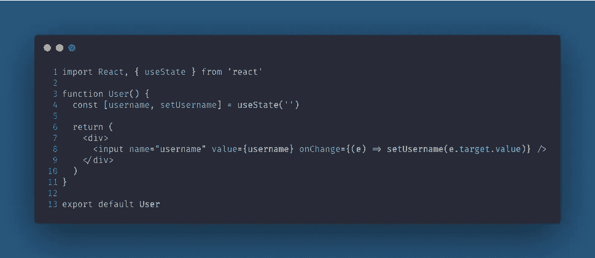
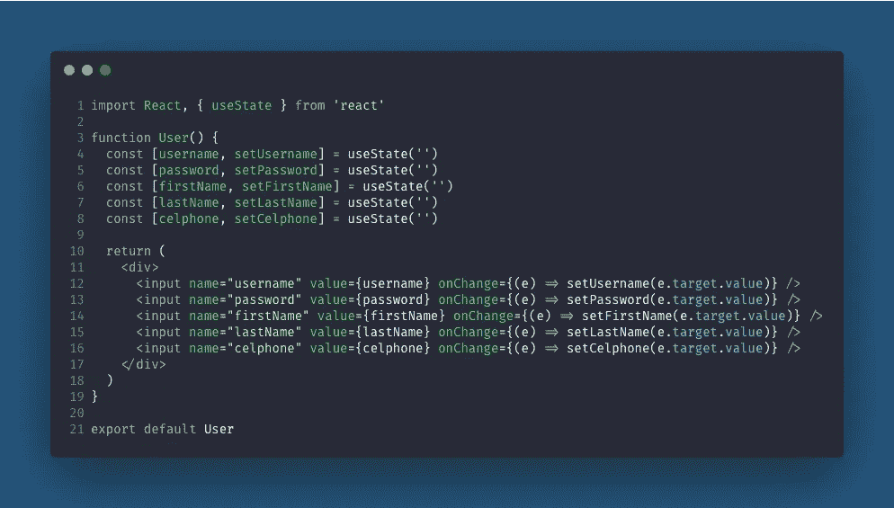
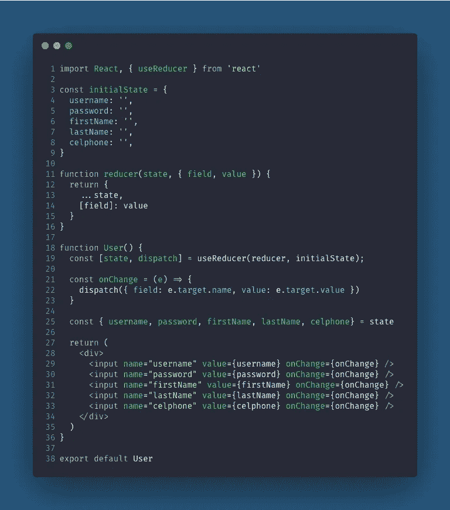

# 用钩子反应控制窗体

> 原文：<https://javascript.plainenglish.io/react-controlled-forms-with-hooks-538762aab935?source=collection_archive---------1----------------------->

嘿大家好！我在这里写我的第一篇关于 medium 的文章，讨论用 React 钩子控制表单。

## 我看到许多程序员在从基于类的组件转向钩子时心存疑虑，在大多数情况下，更多的是知道如何为正确的任务选择正确的钩子。

但是在我们更多地讨论带有钩子的受控窗体之前，让我们更多地了解一下受控窗体如何与基于类的组件一起工作。

Example of a controlled input with class based component

在上面的例子中，我们有一个基于类的组件用户，它只有一个输入和一个状态，但如果我们需要添加一个有许多字段的表单，只需添加一个名称等于状态名称，获取状态值，设置 onChange 函数并完成，所有输入都由状态控制。

但是当我们考虑钩子时，有一种不同的方法来管理状态，顺便说一下，这是一种非常简单的方法，叫做 useState 钩子，让我们看看如何使用 useState 钩子来编写相同的组件。

Example of a controlled input with useState hook

这个解决方案看起来比基于类的组件解决方案更好，也更漂亮，但是当你需要一个更大的表单时，问题就出现了，正如你在下面看到的。

Example of multiple controlled inputs with useState hook

这看起来不再那么美好了，这是我看到许多程序员对解决这个问题的更好的方法有很多怀疑的地方，大部分是因为他们不知道所有的钩子和所有的可能性。

因此，让我们使用官方文档中的定义来讨论一下 useReducer 钩子。

> `[useState](https://reactjs.org/docs/hooks-reference.html#usestate)`的替代物。接受类型为`(state, action) => newState`的缩减器，并返回与`dispatch`方法配对的当前状态。(如果你熟悉 Redux，你已经知道这是如何工作的。)
> 
> 当你有复杂的状态逻辑，包括多个子值，或者下一个状态依赖于前一个状态时，`useReducer`通常比`useState`更好。`useReducer`还允许您优化触发深度更新的组件的性能，因为[您可以向下传递](https://reactjs.org/docs/hooks-faq.html#how-to-avoid-passing-callbacks-down) `[dispatch](https://reactjs.org/docs/hooks-faq.html#how-to-avoid-passing-callbacks-down)` [而不是回调](https://reactjs.org/docs/hooks-faq.html#how-to-avoid-passing-callbacks-down)。

文档告诉我们在处理复杂状态逻辑时使用这个 useReducer 钩子，这里很多人不考虑用它来处理简单的受控表单，但是 Reducer 只不过是一个接收状态并返回新状态的函数，我们的输入更改正是这样，一个当用户在键盘上键入某个键时接收实际状态并返回新状态的函数。

记住这一点，让我们看看如何使用 useReducer 钩子来解决我们的“多输入的受控表单”问题。

首先，我们需要创建初始状态，然后我们将创建一个 reducer，它将返回带有新信息的状态。

之后，我们将 reducer 和 initialState 发送给 useReducer 挂钩，该挂钩将返回一个 State 方法来获取状态，并返回一个 dispatch 方法来更改该状态。

Example of multiple controlled inputs with useReducer hook

就是这样，我们有和以前一样的基于类的组件的行为，但是使用钩子更加灵活，更容易提取逻辑，与更大的团队一起工作等等。

这就是所有的人，我希望这有助于澄清一些关于使用钩子控制表单的疑问，并带来新的见解，让我们可以更有创造性地使用钩子来解决我们在日常工作中遇到的许多问题。