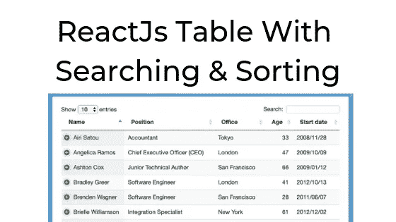

# 在 React 中过滤表中数据的聪明方法

> 原文：<https://javascript.plainenglish.io/react-filtering-data-in-a-table-little-more-smartly-b0f6e401b5f1?source=collection_archive---------3----------------------->

# TL；博士(查看是做什么的)

> 点按表格标题，看看会发生什么

> 如果您观察到某些值没有被排列
> 
> 举个例子，
> 
> 点击**学生页**标题，0 值不被过滤(停留在底部)
> 
> **学生邮编**的“不适用”值
> 
> 你在正确的轨道上

# 观看动作并玩它

*奖励:我们将学习如何在每个标题*旁边向下&向上&画箭头

# 一.它的作用

*   它能够**而不是**过滤某些值

> **例如，0** 代表**学生人数**或**不适用**代表**学生人数**
> 
> **用例:**很多情况下，0 和 N/A 是作为错误的占位符，空值；没有太大的意义。没有人希望在他们的数据图表顶部看到没有意义的数据(如果按降序排列)

*   上下箭头告诉用户数据当前是按降序还是升序排序

> **例如**默认不排序数据，不需要箭头。当用户点击表格标题对数据进行排序时，会出现箭头
> 
> 2.它是**而不是**简单地将数据按升序或降序排序的布尔值。

> 只要对 if 语句做一行修改，就可以将这个逻辑用于任何其他表过滤

# 二。它是如何工作的(初始状态)

1.  大多数情况下，为了正确排序数据，您可能需要维护两种状态( **originalData，sortedData)**

*   原始数据是事实的来源
*   **sortedData** 用于向用户展示数据

2.除了过滤，我还画了一个箭头来显示当前的过滤模式(升序，降序)。排序有三种情况(**未排序**(默认)、**降序排序**、**升序排序**)

*   我用一个数字来表示这三种情况
*   **未排序:** 0
*   **降序排序:** 1
*   **升序排序:** -1

3.通过点击某个标题，用户通过点击标题的关键字过滤数据。例如， **sortType** 代表数据的排序关键字

Initial state for sort functinonality

# 三。它是如何工作的(过滤逻辑)

*   我用做了一个叫做**的函数，它就像一个嵌套的开关(开关里面的开关)；有 2 个 **if 语句****
*   **第一条 if 语句:**通过检查 **sortToggle** 来检查之前是否排序过
*   **第二个 if 语句:*重要*** 现在您可以为**智能排序添加任何附加逻辑—** 您不想在排序中排序的属性

> 例如，在这种情况下，我不想对“N/A”和 0 的值进行排序，
> 
> `*if (a[key] == null || a[key] == 0 || a[key] == "N/A") return 1;*`
> 
> `*if (b[key] == null || b[key] == 0 || b[key] == "N/A") return -1;*`

*   最后，我使用这个`sortType`函数作为原始数据的排序逻辑

> `*const sortedData = originalData.sort(compareBy(sortType));*`

# 四。结论

通过向使用该功能的每个组件添加 GUID 或任何唯一标识，当前的过滤功能可以容易地扩展到多个组件

*   **例如，**如果有两个不同的数据列表，其中的对象具有相同的键(例如名字)，那么您可以给组件 A & B 唯一的标识符，例如**compA**&**compB**
*   然后，简单地组合唯一标识符和排序类型(例如，**compa first name**&**compbfirst name**)
*   你只需给每个组件**唯一的标识符**就可以让它具有可伸缩性

> 感谢您的阅读！— GP LEE