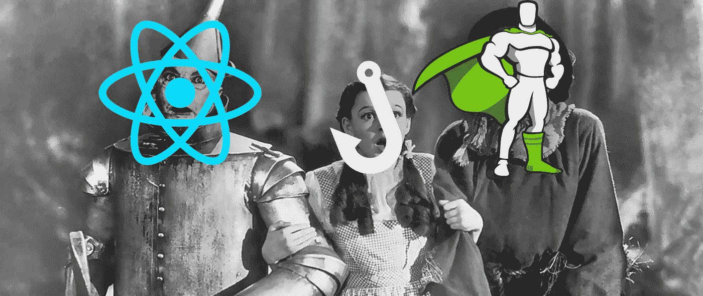
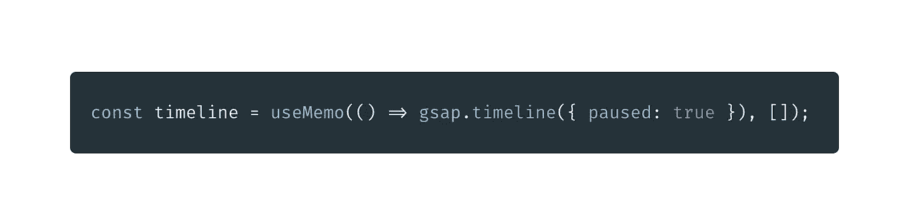

# 反应函数，GSAP 时间线和挂钩。我的天啊。

> 原文：<https://javascript.plainenglish.io/react-functions-gsap-timelines-and-hooks-oh-my-ec7620b6bdc6?source=collection_archive---------3----------------------->

## 对一个老故事的经典复述

我喜欢反应钩。代码更干净了，开发人员也更开心了，但是在很长一段时间里，我实际上无法让 GSAP 时间线与它们一起工作，所以我默认使用“动画组件”，因为我喜欢称它们为替我做脏活。基本上，我做了一个基于类的组件，只包含我正在制作的东西，但是通过阅读文档的能力和一点批判性思维，我偶然发现了一些革命性的东西(就我而言)。

# 钩子的简要说明

Hook (1991)

钩子是操纵数据的一种方式，就像基于类的组件让你操纵数据一样。有几个你已经知道了，像 useState(它取代了 setState)，useEffect(它基本上是一个生命周期中所有的方法)和 useMemo (memoize 一个只有在某些事情改变时才应该改变的值)。

很简单，对吧？不对。这些是由外星人编写的复杂函数，作为前端开发人员执行我们的命令。现在你在问自己:“Alek，这些废话是什么，这些填充文本将如何使我成为一名更好的程序员？”。我正要说呢，别担心。

# 先决条件

要继续，你需要知道几件事。如果传递一个空的依赖数组，useEffect 钩子基本上就像 componentDidMount 一样。如果数组有值，它是 componentDidUpdate。或者你可以同时做这两件事，没关系，它处理道具/状态的变化。UseRef 创建对 DOM 元素的引用。UseState 是非常简单明了的，它允许你在功能组件中使用状态。

# GSAP 和时间表

除非你生活在岩石下，否则你会在网上用 GSAP 制作动画。它有一个伟大而简单的 API 和动画，但在一个功能组件中使用它可能会很棘手。为什么？因为没有常数。每次函数重新渲染时，值都会被重置，这将使所有动画无效，并将它们重置回原点。

让我们试着编写一些永远不会成功的代码:

the code

the result (literally that’s it, nothing else works)

那么，为什么什么都没发生呢？理论上这应该行得通，但事实并非如此。常量实际上不是常量，每当组件重新呈现时，它们都会被重新初始化。当它或它的父级的状态改变时，就会发生这种情况。这就是 React，我们对此又爱又恨。我们如何解决这个问题？好吧，我们需要在记忆中保留最初的 GSAP 时间线，这样才能工作。每当组件重新呈现时，时间线应该保持其原始值。

# 解决方案

幸运的是，这非常简单。我们有一个钩子可以做到这一点。这是经常被忽视的使用备忘录挂钩。useMemo 挂钩返回一个计算值，该值仅在依赖数组中的内容发生变化时才发生变化。如果你在依赖数组中什么都不传入，它基本上创建了一个类的静态属性——它永远不会改变！所以我们需要做的是设置时间线，使用 GSAP 时间线的记忆值。

It’s that simple.

这是怎么回事，为什么会起作用？因为我们使用了 useMemo 钩子并传入了一个空的依赖数组，所以时间轴值在组件的整个生命周期中保持不变。它永远不会改变，因为依赖数组没有任何东西可以迫使它改变。如果我们没有用 useMemo 钩子传递它，它将在每次组件重新呈现时用一个空的时间线重新初始化。

# 结果呢

# 社交——跟踪我

我是一名全栈开发者。我举重(不是现在，因为整个 COVID 的事情)。我看动漫。我写 JavaScript，我没有斯德哥尔摩综合症。

🔗[网站](https://alekangelov.com)

🔒[领英](https://www.linkedin.com/in/alekangelov/)

🦜 [推特](https://twitter.com/39strife)