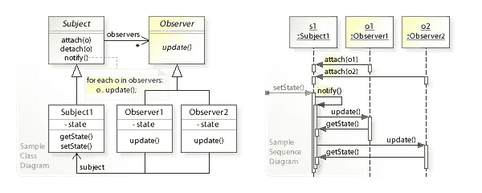
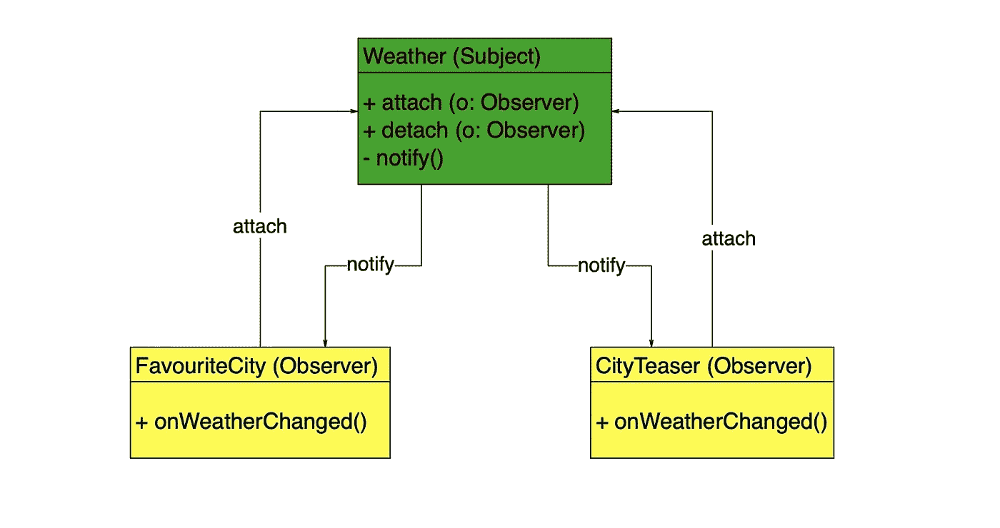
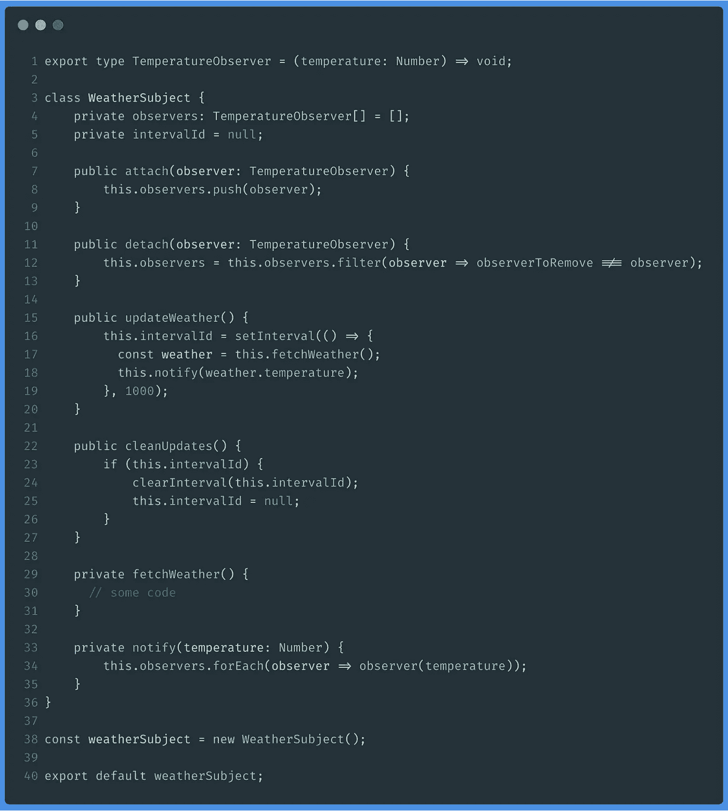
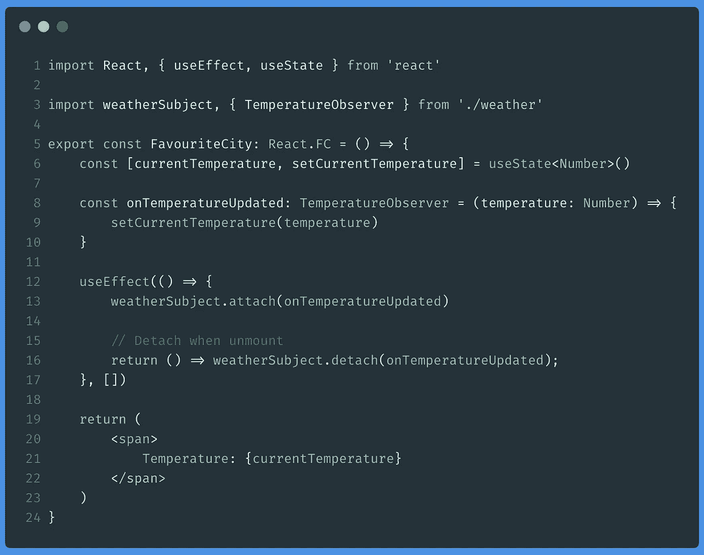
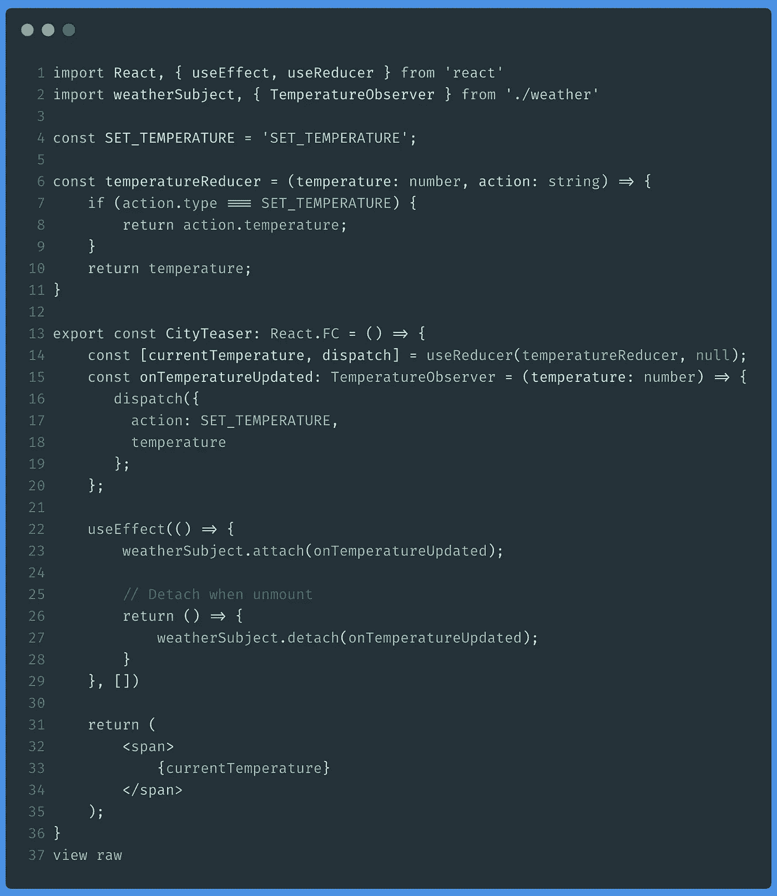

# 反应钩子和“观察者”模式

> 原文：<https://javascript.plainenglish.io/react-hooks-and-the-observer-pattern-1e4274f0e5f5?source=collection_archive---------0----------------------->

## 使用 React 钩子时如何集成“观察者”模式

Photo by [JR Korpa](https://unsplash.com/@korpa?utm_source=medium&utm_medium=referral) on [Unsplash](https://unsplash.com?utm_source=medium&utm_medium=referral)

[**React 钩子**](https://reactjs.org/docs/hooks-intro.html) 的到来导致我们用 React 设计和编写应用程序的方式发生了许多变化:

*   他们允许将内部状态添加到功能组件中，因此这些组件已经开始取代“经典”组件；
*   他们鼓励使用声明式编程风格，因为它的功能性质；
*   并且简化了我们在整个应用程序中重用逻辑的方式，使用*类组件*有些复杂。

本文围绕着最后一点:我们可以使用钩子来实现一些最著名的设计模式，这样我们就可以**构建更易于维护和扩展的应用程序。**

让我们看看如何！

# 介绍

如果您在阅读本文时不知道什么是设计模式，我将尝试对其进行简要总结，尽管我建议您访问以下链接来加深对应用程序开发中这一重要概念的理解:

*   [头脑优先设计模式(一个大脑友好的指南)](https://amzn.to/3192Wii)
*   [设计模式:可重用面向对象软件的元素(Addison Wesley professional computing 系列)](https://amzn.to/2N5aLSC)
*   我的文章“[PHP 中的设计模式](https://medium.com/@ger86/patrones-de-diseño-en-php-2e486de337d7)”(虽然它是为用 PHP 开发的应用程序而写的，但是通过我使用的例子，它可以让你了解这个概念)。

> 设计模式是应用程序设计中给定上下文中常见问题的通用且可重用的解决方案。

也就是说，**设计模式**为在考虑应用程序的架构时反复出现的某些问题提供解决方案，从而避免必须不断地重新发明轮子。

它的强大之处在于，它的使用和应用不依赖于我们正在开发的语言，而是通过类图抽象出解决方案，我们可以在任何*软件*应用中实现它们。

设计模式的另一个优势是**它们在与其他开发人员**交流时提供了一种通用语言，因为他们每个人都定义了一个特定的名称来引用它以及参与所提议的解决方案的元素。这使得无论开发的应用程序类型或使用的语言如何，都可以使用同一个“字典”来引用某些概念。通过这种方式，代码是“自文档化”的，允许将来参与维护的人快速识别实现的解决方案。

# 反应钩子和“观察者”模式

> 在模式“Observer”中，一个名为“subject”的对象维护一个名为“Observer”的依赖项列表，并自动通知它们状态的任何变化，通常调用它的一个方法。

由于这种模式，我们可以拥有更多解耦的应用程序(因为观察者不需要连接到主题*和可维护性，因为每个观察者都是独立于其他观察者的，所以其中一个观察者的功能变化并不意味着其他观察者的修改。*

它的类和序列的 UML 方案如下:

By Vanderjoe — Own work, CC BY-SA 4.0, [https://commons.wikimedia.org/w/index.php?curid=61809260](https://commons.wikimedia.org/w/index.php?curid=61809260)

现在，假设我们想在 React 中开发一个应用程序，用户可以在应用程序的不同位置可视化一个城市的天气，例如，在侧栏中显示他们最喜欢的城市和城市列表。

因此，我们有两个组件:

*   `FavouriteCity`，在我们的应用程序的侧边栏中显示一个城市的温度。
*   `CityTeaser`，显示一列城市的温度。

**城市中的气候状态被集中**并且两个组件都接收到它，这很方便，也就是说，使它们不必请求它(这最终会导致重复代码)。我们如何集中一个城市的气候状态，以便每次发生变化时两个组件都得到更新？感谢格局*观察者*:

根据图表:

*   `Weather`充当城市天气集中的*观察者*模式的`Subject`。
*   `FavouriteCity`和`CityTeaser`充当观察者，通过它们的`onWeatherChanged`方法接收来自天气类的天气更新。这些*观察者*可以通过“subject”的 attach 方法请求被通知(`notify`方法)。

清楚了这一点，我们将首先实现`Weather`类的代码。为了能够定义新的类型和接口，以及能够键入每个方法的参数，我将使用 **Typescript** 作为一种语言，尽管如果你愿意，你可以毫无问题地用 Javascript 编写自己的版本。

# 天气等级

根据图表，`WeatherSubject`类必须有以下方法:

*   `attach`，以便*观察者*可以注册并在温度更新时接收通知。
*   `detach`，当*观察者*不再希望接收更多的状态通知时，允许其取消订阅(同时防止*内存泄漏*由于在内存中保存对不再使用的对象的引用而导致的)。
*   `notify`，一种每次天气更新都会通知注册的“观察员”的方法。

*   在第 1 行中，我们定义了可以订阅`Weather`类的*观察者*的类型。在我们的例子中，它将是一个回调函数，接收获得的温度作为参数。
*   在第 7 行和第 11 行，我们定义了`attach`和`detach`方法的主体，这样*观察者*可以订阅和取消订阅状态更新。
*   在第 15 行，我们定义了`updateWeather`方法，它每 1 秒获取一次天气，并通过`notify`方法通知“观察者”。
*   在第 33 行上，`notify`方法遍历*观察器*的数组，并用接收到的温度调用它们。

# FavoriteCityComponent

我们的`FavouriteCity`组件将充当“观察者”,以便:

*   挂载时，必须通过`attach`方法在`Weather`类中订阅*观察者*。
*   卸载时，您必须通过`dettach`方法从`Weather`类中*取消对*的描述，从而防止它在不再被使用时被调用。

这就是**反应钩**开始动作的地方。我们将创建一个使用两个挂钩的功能组件:

*   `[useState](https://reactjs.org/docs/hooks-reference.html#usestate)`存储当前温度。此外，这个钩子将为我们提供一个更新当前温度的函数，我们将在`WeatherSubject`中注册的*回调*中使用这个函数。
*   `[useEffect](https://reactjs.org/docs/hooks-effect.html)`订阅和退订`WeatherSubject`。

*   在第 6 行中，我们为`FavouriteCity`组件定义了一个状态，它将存储当前温度并允许我们使用`setCurrentTemperature`方法更新它。
*   在第 8 行，我们定义了将在`WeatherSubject`中注册的回调函数:该函数接收一个带有获得的温度的`Number`作为参数，并使用`setCurrentTemperature`方法更新`useState`钩子的状态。
*   在第 12 行，使用`useEffect`钩子，我们通过`attach`方法向`WeatherSubject`订阅一次(使用空数组`[]`作为钩子的第二个参数),当组件被反汇编时，我们使用`detach`方法取消订阅。
*   最后，在第 19 行，我们绘制了存储在`useState`状态挂钩中的温度。

# CityTeaser 组件

正如你在前面的组件中看到的， ***观察者*模式**允许我们将气候更新从`FavouriteCity`组件中分离出来。此外，由于`useState`钩子只用了 20 行代码，我们就解决了这个问题，因为*回调*提供了更新状态的功能。

为了让你看到`**useReducer**`钩子是如何与这个设计模式完美集成的，我将以这种方式实现`CityTeaser`组件:

在这种情况下，我们需要更多的代码:

*   在第 4 行和第 6 行中，我们定义了我们的`**reducer**`函数是什么:它将接收当前状态作为第一个参数，接收已经启动的动作作为第二个参数，该动作由具有 type 属性和 temperature 属性的对象表示，其温度值为要更新的值。
*   在第 14 行中，我们使用`useEffect`钩子来获取`dispatch`函数，然后我们定义`onTemperatureUpdated`函数来调度每次`WeatherSubject`通知我们时接收到的温度。
*   最后，和在`FavouriteCity`类中一样，我们使用`useEffect`钩子分别在组件组装和拆卸时进行订阅和取消订阅。

# 最终结论

**观察者模式**可能是应用程序开发中最普遍的模式之一，因为它提供了以下优势:

*   **组成应用程序的组件之间的低耦合**。
*   **信息和状态传输的单一意义**，即`Subject`负责监控应用程序某一部分的状态，并通知请求它的*观察者*。

由于有了 **React 钩子**，在我们的应用程序中实现它非常简单，正如我在本文中试图展示的那样。

我希望这篇文章已经帮助你发现了 React 钩子的另一种用法，因为它们已经存在了。

# 你想收到更多这样的文章吗？

如果你喜欢这篇文章，我鼓励你订阅我每周日发送的时事通讯，里面有类似的出版物和更多的推荐内容:👇👇👇

 [## 拿铁和代码

### 这是一份最新的时事通讯，代码是 recibirás cada domingo。——洛斯多斯乌尔蒂莫斯艺术博物馆……

eepurl.us20.list-manage.com](https://eepurl.us20.list-manage.com/subscribe?u=c14cad2102bcf33bf216cc69e&id=2790da9378)