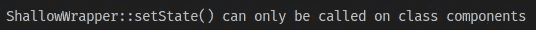

# React Hooks 破坏了我的测试，现在怎么办？—第一部分

> 原文：<https://javascript.plainenglish.io/react-hooks-broke-my-tests-now-what-part-1-a5a7783e777e?source=collection_archive---------7----------------------->

## 向功能组件和钩子迁移的生存指南

Photo by [Joshua Aragon](https://unsplash.com/@goshua13?utm_source=medium&utm_medium=referral) on [Unsplash](https://unsplash.com?utm_source=medium&utm_medium=referral)

*反应钩*挺棒的吧？
也许，由于大肆宣传，或者仅仅因为你想提高你的解决方案的可读性并保持最新，你决定迁移你所有的代码来使用*钩子*。
你花费数小时将类组件重构为功能组件，移除所有生命周期方法，最终，你开始到处使用钩子。最后，当一切按预期开始工作时，您决定运行您的测试。

Oh no no no!

突然你开始到处看到警告和失败的测试。现在怎么办？

现在你必须做出决定:

*   删除所有失败的测试，并适当地重写它们。
*   把它们敲出来，等待下一次失败。

最后一个不是你应该做的决定，但它可能是你做得最多的决定之一，因为你要处理一个截止日期，你的特性需要尽快交付。这样做肯定会在将来反过来伤害你，因为你只是在拖延你的问题，同时你会增加更多的问题。

通过本指南，我将向您展示，如果您之前的测试侧重于实现细节，那么在重构功能组件和钩子时，为计数器组件编写错误的测试会给您带来很多麻烦。

首先，我们先来了解一下测试实现细节是什么意思。

## 测试实现细节意味着什么？

实现细节是您的解决方案的用户不会使用或交互的东西。

让我们看看下面的代码:

Class Component Counter

这里我们有一个简单的计数器，你可以增加和减少，写为一个类组件。

现在让我们来看看各自的测试:

Class Component Unit Tests

## 重构到钩子

现在，让我们说我们已经决定重构那个计数器来使用钩子，因此把它变成一个功能组件。下面的代码是我们可能会得到的。

Functional Component Counter

所以，这比上面的例子简单多了。代码更小，可读性更好。

这是一个简单的重构，所以我们希望测试仍然可以通过，对吗？

没有，错误的类型在所有测试中都是一致的。

因此，让我们抛开这样一个事实:要使用钩子，我们需要功能组件，而要操作状态，我们需要类组件。
上面测试的第一个错误是关注直接操作状态。这应该不惜一切代价避免，因为它属于实现细节的范畴。
相反，我们应该像用户一样直接与组件交互。

如果你打算继续使用酶，那么在你的测试中尽量避免浅层渲染。
浅层渲染不会渲染子组件。这意味着，在我们的测试中，我们不会像用户那样与组件进行交互。

酶暴露了很多很多东西，让我们可以测试我们的成分。如果我们不小心，我们最终可能会不正确地测试我们的组件。

这是为了避免这些问题，并鼓励每个人以构建测试库的正确方式测试您的组件。

现在，让我们重写我们的测试来使用 react 测试库。

## 重写我们的测试

Unit Test using Testing Library

我们在这些测试中看到的第一件事是没有状态引用，它们更清楚我们打算测试什么，并且查询组件的方法更简单。

让我们回顾一下测试之间的区别:

1.  对于默认值，我们不是检查状态是否已设置，而是检查该值是否在 DOM 中。
2.  对于递增和递减，我们不是模拟状态变化并检查计数器的值是否变化，而是找到触发事件的按钮并单击它。然后，我们验证我们找到的前一个元素是否根据按下的按钮增加和减少了值。

值得一提的是，如果我们编写了这样的测试，在开始时，我们对钩子的重构不会有任何问题，因为它们没有实现细节。

## 结论

至此，我们结束了本指南的第一部分。我们对单元的概念可能需要调整，因为有些人不同意将呈现给 DOM 的测试称为单元测试(即使组件只是作为一个单元进行测试，并且每个外部依赖都可以被模仿以确保隔离)。尽管如此，理解这些测试产生的信心和价值是很重要的。关注用户与我们的组件交互的方式将使我们保持专注，并确保我们的测试只会在应该中断的时候中断。

本指南的下一部分将集中于测试从生命周期到 useEffect 钩子的变化，以及从 Redux 到 useContext 方法的迁移。希望你喜欢，并期待接下来的部分！